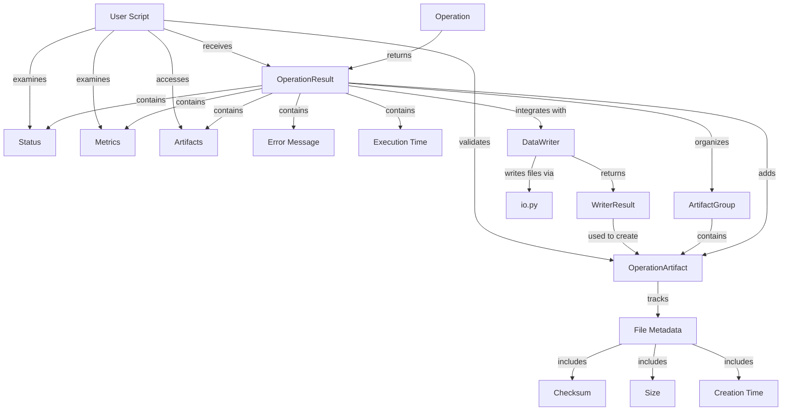
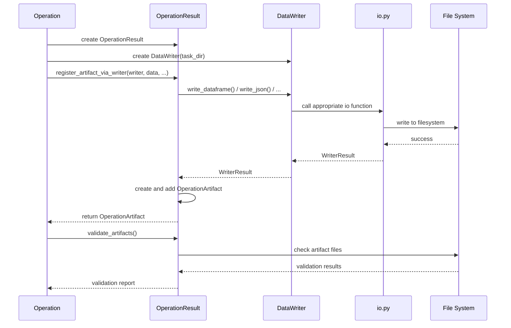

# PAMOLA.CORE Operation Result Module Documentation

## 1. Purpose and Overview

The PAMOLA.CORE Operation Result module (`op_result.py`) provides a comprehensive system for representing, managing, and validating the results of privacy-enhancing operations within the PAMOLA framework. It serves as the standardized result structure for all operations, enabling consistent handling of status codes, artifacts, metrics, and error conditions across the entire system.

The Operation Result module is a cornerstone of the PAMOLA.CORE operations framework, ensuring that operation outputs are properly organized, validated, and made available for downstream processing. By providing a unified result structure, it enables operations to return not just transformed data but also associated metrics, artifacts, and status information in a consistent format that can be easily interpreted by operation consumers.

## 2. Key Features

- **Standardized Result Structure**: Unified representation of operation outcomes with status, artifacts, and metrics
- **Artifact Management**: Registration, grouping, and validation of operation-produced files and outputs
- **Metadata Extraction**: Automatic tracking of file sizes, creation times, and checksums for artifacts
- **Artifact Validation**: Comprehensive validation of artifact existence, type, and integrity
- **Metrics Organization**: Hierarchical structure for storing operation metrics and statistics
- **Status Tracking**: Enumerated operation status codes for clear result interpretation
- **Error Reporting**: Structured error message handling within the result object
- **DataWriter Integration**: Seamless integration with DataWriter for standardized file operations
- **Artifact Grouping**: Support for logical grouping of related artifacts
- **Type Safety**: Comprehensive type annotations for IDE support and static analysis

## 3. Architecture

### Integration Architecture

The Operation Result is positioned as a pamola core component of the PAMOLA.CORE operations framework, serving as the standardized return type for all operations:

```
┌────────────────────────────────────────────────────────────────┐
│                      User-Level Scripts                        │
└─────────────────────────────────┬──────────────────────────────┘
                                  │
                                  ▼
┌────────────────────────────────────────────────────────────────┐
│                     Operations Framework                       │
│  ┌─────────────────┐ ┌────────────────┐ ┌───────────────────┐  │
│  │   BaseOperation │ │ OperationResult│ │  OperationRegistry│  │
│  └────────┬────────┘ └───────┬────────┘ └──────────┬────────┘  │
│           │                  │                     │           │
└───────────┼──────────────────┼─────────────────────┼───────────┘
            │                  │                     │
            ▼                  ▼                     ▼
┌───────────────────────────────────────────────────────────────┐
│                     Core Utility Modules                      │
│  ┌────────────┐  ┌────────────┐  ┌─────────────┐  ┌─────────┐ │
│  │DataWriter  │◄─┤DataReader  │  │Visualization│  │Progress │ │
│  └─────┬──────┘  └────────────┘  └─────────────┘  └─────────┘ │
│        │                                                      │
│        ▼                                                      │
│  ┌────────────────────────────────────────────────────────┐   │
│  │                       io.py                            │   │
│  └────────────────────────────────────────────────────────┘   │
└───────────────────────────────────────────────────────────────┘
```

### Component Architecture

The Operation Result module consists of several cooperating classes that provide the full functionality:

```
┌─────────────────────────────────────────────────────────────┐
│                  Operation Result Module                    │
│                                                             │
│  ┌───────────────────┐  ┌────────────────────────────────┐  │
│  │ OperationResult   │  │ OperationArtifact              │  │
│  │                   │  │                                │  │
│  │ ◆ status          │  │ ◆ artifact_type                │  │
│  │ ◆ artifacts       │  │ ◆ path                         │  │
│  │ ◆ metrics         │  │ ◆ description                  │  │
│  │ ◆ error_message   │  │ ◆ category                     │  │
│  │ ◆ execution_time  │  │ ◆ tags                         │  │
│  │ ◆ artifact_groups │  │ ◆ creation_time                │  │
│  │                   │  │ ◆ size                         │  │
│  └───────┬───────────┘  │ ◆ checksum                     │  │
│          │              └────────────────────────────────┘  │
│          │                                                  │
│          ▼                                                  │
│  ┌────────────────────┐  ┌─────────────────────────────┐    │
│  │ ArtifactGroup      │  │ OperationStatus (enum)      │    │
│  │                    │  │                             │    │
│  │ ◆ name             │  │ ◆ SUCCESS                   │    │
│  │ ◆ description      │  │ ◆ WARNING                   │    │
│  │ ◆ artifacts        │  │ ◆ ERROR                     │    │
│  │                    │  │ ◆ SKIPPED                   │    │
│  └────────────────────┘  │ ◆ PARTIAL_SUCCESS           │    │
│                          │ ◆ PENDING                   │    │
│                          └─────────────────────────────┘    │
│                                                             │
│  ┌────────────────────┐  ┌────────────────────────────┐     │
│  │ Error Classes      │  │ Helper Classes             │     │
│  │                    │  │                            │     │
│  │ ◆ OpsError         │  │ ◆ ValidationResult         │     │
│  │ ◆ ValidationError  │  │   (TypedDict)              │     │
│  │                    │  │                            │     │
│  └────────────────────┘  └────────────────────────────┘     │
└──────────────────────────────────────────────────────# PAMOLA.CORE Operation Result Module Documentation

## 1. Purpose and Overview

The PAMOLA.CORE Operation Result module (`op_result.py`) provides a comprehensive system for representing, managing, and validating the results of privacy-enhancing operations within the PAMOLA framework. It serves as the standardized result structure for all operations, enabling consistent handling of status codes, artifacts, metrics, and error conditions across the entire system.

The Operation Result module is a cornerstone of the PAMOLA.CORE operations framework, ensuring that operation outputs are properly organized, validated, and made available for downstream processing. By providing a unified result structure, it enables operations to return not just transformed data but also associated metrics, artifacts, and status information in a consistent format that can be easily interpreted by operation consumers.

## 2. Key Features

- **Standardized Result Structure**: Unified representation of operation outcomes with status, artifacts, and metrics
- **Artifact Management**: Registration, grouping, and validation of operation-produced files and outputs
- **Metadata Extraction**: Automatic tracking of file sizes, creation times, and checksums for artifacts
- **Artifact Validation**: Comprehensive validation of artifact existence, type, and integrity
- **Metrics Organization**: Hierarchical structure for storing operation metrics and statistics
- **Status Tracking**: Enumerated operation status codes for clear result interpretation
- **Error Reporting**: Structured error message handling within the result object
- **DataWriter Integration**: Seamless integration with DataWriter for standardized file operations
- **Artifact Grouping**: Support for logical grouping of related artifacts
- **Type Safety**: Comprehensive type annotations for IDE support and static analysis

## 3. Architecture

### Integration Architecture

The Operation Result is positioned as a pamola core component of the PAMOLA.CORE operations framework, serving as the standardized return type for all operations:

```
┌────────────────────────────────────────────────────────────────┐
│                      User-Level Scripts                        │
└─────────────────────────────────┬──────────────────────────────┘
                                  │
                                  ▼
┌────────────────────────────────────────────────────────────────┐
│                     Operations Framework                       │
│  ┌─────────────────┐ ┌────────────────┐ ┌───────────────────┐  │
│  │   BaseOperation │ │ OperationResult│ │  OperationRegistry│  │
│  └────────┬────────┘ └───────┬────────┘ └──────────┬────────┘  │
│           │                  │                     │           │
└───────────┼──────────────────┼─────────────────────┼───────────┘
            │                  │                     │
            ▼                  ▼                     ▼
┌───────────────────────────────────────────────────────────────┐
│                     Core Utility Modules                      │
│  ┌────────────┐  ┌────────────┐  ┌─────────────┐  ┌─────────┐ │
│  │DataWriter  │◄─┤DataReader  │  │Visualization│  │Progress │ │
│  └─────┬──────┘  └────────────┘  └─────────────┘  └─────────┘ │
│        │                                                       │
│        ▼                                                       │
│  ┌────────────────────────────────────────────────────────┐   │
│  │                       io.py                            │   │
│  └────────────────────────────────────────────────────────┘   │
└───────────────────────────────────────────────────────────────┘
```

### Component Architecture

The Operation Result module consists of several cooperating classes that provide the full functionality:

```
┌─────────────────────────────────────────────────────────────┐
│                  Operation Result Module                    │
│                                                             │
│  ┌───────────────────┐  ┌────────────────────────────────┐  │
│  │ OperationResult   │  │ OperationArtifact              │  │
│  │                   │  │                                │  │
│  │ ◆ status          │  │ ◆ artifact_type                │  │
│  │ ◆ artifacts       │  │ ◆ path                         │  │
│  │ ◆ metrics         │  │ ◆ description                  │  │
│  │ ◆ error_message   │  │ ◆ category                     │  │
│  │ ◆ execution_time  │  │ ◆ tags                         │  │
│  │ ◆ artifact_groups │  │ ◆ creation_time                │  │
│  │                   │  │ ◆ size                         │  │
│  └───────┬───────────┘  │ ◆ checksum                     │  │
│          │              └────────────────────────────────┘  │
│          │                                                  │
│          ▼                                                  │
│  ┌────────────────────┐  ┌─────────────────────────────┐   │
│  │ ArtifactGroup      │  │ OperationStatus (enum)      │   │
│  │                    │  │                             │   │
│  │ ◆ name             │  │ ◆ SUCCESS                   │   │
│  │ ◆ description      │  │ ◆ WARNING                   │   │
│  │ ◆ artifacts        │  │ ◆ ERROR                     │   │
│  │                    │  │ ◆ SKIPPED                   │   │
│  └────────────────────┘  │ ◆ PARTIAL_SUCCESS          │   │
│                          │ ◆ PENDING                   │   │
│                          └─────────────────────────────┘   │
│                                                            │
│  ┌────────────────────┐  ┌────────────────────────────┐   │
│  │ Error Classes      │  │ Helper Classes             │   │
│  │                    │  │                            │   │
│  │ ◆ OpsError         │  │ ◆ ValidationResult         │   │
│  │ ◆ ValidationError  │  │   (TypedDict)              │   │
│  │                    │  │                            │   │
│  └────────────────────┘  └────────────────────────────┘   │
└────────────────────────────────────────────────────────────┘
```

### Data Flow



## 4. Pamola Core API Reference

### OperationResult Class

|Method|Description|Key Parameters|Returns|Req-ID|
|---|---|---|---|---|
|`__init__`|Initialize an operation result|`status`: Status code<br>`artifacts`: List of artifacts<br>`metrics`: Dictionary of metrics<br>`error_message`: Error details<br>`execution_time`: Duration in seconds|N/A|REQ-OPS-005|
|`add_artifact`|Add an artifact to the result|`artifact_type`: Type of artifact<br>`path`: Path to the artifact<br>`description`: Description<br>`category`: Artifact category<br>`tags`: List of tags<br>`group`: Optional group name|`OperationArtifact`|REQ-OPS-005|
|`register_artifact_via_writer`|Register an artifact using DataWriter|`writer`: DataWriter instance<br>`obj`: Object to write<br>`subdir`: Target subdirectory<br>`name`: Base name for file<br>`artifact_type`: Type of artifact<br>`description`: Description<br>`category`: Artifact category<br>`tags`: List of tags<br>`group`: Optional group name|`OperationArtifact`|REQ-OPS-005|
|`add_artifact_group`|Add an artifact group|`name`: Group name<br>`description`: Group description|`ArtifactGroup`|-|
|`add_metric`|Add a metric to the result|`name`: Metric name<br>`value`: Metric value|None|-|
|`add_nested_metric`|Add a metric under a category|`category`: Metric category<br>`name`: Metric name<br>`value`: Metric value|None|-|
|`get_artifacts_by_type`|Get artifacts of specific type|`artifact_type`: Type to filter by|`List[OperationArtifact]`|-|
|`get_artifacts_by_tag`|Get artifacts with specific tag|`tag`: Tag to filter by|`List[OperationArtifact]`|-|
|`get_artifacts_by_category`|Get artifacts in specific category|`category`: Category to filter by|`List[OperationArtifact]`|-|
|`get_artifact_group`|Get an artifact group by name|`group_name`: Name of the group|`Optional[ArtifactGroup]`|-|
|`validate_artifacts`|Validate all artifacts|None|`Dict[str, Any]`|REQ-OPS-006|
|`to_reporter_details`|Create dictionary for reporter|None|`Dict[str, Any]`|REQ-OPS-005|

### OperationArtifact Class

|Method|Description|Key Parameters|Returns|Req-ID|
|---|---|---|---|---|
|`__init__`|Initialize an artifact|`artifact_type`: Type of artifact<br>`path`: Path to the artifact<br>`description`: Description<br>`category`: Artifact category<br>`tags`: List of tags|N/A|-|
|`_get_file_size`|Get size of artifact file|None|`Optional[int]`|-|
|`calculate_checksum`|Calculate file checksum|`algorithm`: Hash algorithm|`Optional[str]`|-|
|`exists`|Check if artifact file exists|None|`bool`|-|
|`validate`|Validate artifact integrity|None|`Dict[str, Any]`|REQ-OPS-006|
|`add_tag`|Add a tag to the artifact|`tag`: Tag to add|None|-|
|`to_dict`|Convert to dictionary|None|`Dict[str, Any]`|-|

### ArtifactGroup Class

|Method|Description|Key Parameters|Returns|Req-ID|
|---|---|---|---|---|
|`__init__`|Initialize an artifact group|`name`: Group name<br>`description`: Group description|N/A|-|
|`add_artifact`|Add an artifact to the group|`artifact`: OperationArtifact to add|None|-|
|`get_artifacts`|Get all artifacts in group|None|`List[OperationArtifact]`|-|
|`to_dict`|Convert to dictionary|None|`Dict[str, Any]`|-|

### OperationStatus Enum

|Value|Description|
|---|---|
|`SUCCESS`|Operation completed successfully|
|`WARNING`|Operation completed with some issues|
|`ERROR`|Operation failed|
|`SKIPPED`|Operation was skipped|
|`PARTIAL_SUCCESS`|Operation completed but with some parts failed|
|`PENDING`|Operation is still running or pending execution|

### Key Methods Details

#### register_artifact_via_writer Method

```python
def register_artifact_via_writer(self,
                                writer,  # DataWriter
                                obj,     # DataFrame, dict, etc.
                                subdir: str,
                                name: str,
                                artifact_type: str = None,
                                description: str = "",
                                category: str = "output",
                                tags: Optional[List[str]] = None,
                                group: Optional[str] = None) -> OperationArtifact:
    """
    Register an artifact using the DataWriter to write the file.
    
    This method delegates file writing to the DataWriter and then
    registers the resulting file as an operation artifact, providing
    a consistent interface for artifact generation.
    
    Parameters:
    -----------
    writer : DataWriter
        DataWriter instance to use for writing
    obj : Any
        Object to write (DataFrame, dict, etc.)
    subdir : str
        Subdirectory under task_dir to write to (e.g., "output", "dictionaries")
    name : str
        Base name for the artifact file (without extension)
    artifact_type : str, optional
        Type of artifact (e.g., "csv", "json"). If None, inferred from object type
    description : str, optional
        Description of the artifact
    category : str, optional
        Category of the artifact (e.g., "output", "metric", "visualization")
    tags : List[str], optional
        Tags for categorizing the artifact
    group : str, optional
        Name of the group to add this artifact to
            
    Returns:
    --------
    OperationArtifact
        The created artifact object
            
    Satisfies:
    ----------
    REQ-OPS-005: Uses DataWriter for consistent artifact generation.
    """
```

Behavior:

- Automatically determines the artifact type if not specified
- Chooses the appropriate DataWriter method based on object type
- Writes the object to the specified location using DataWriter
- Creates an OperationArtifact from the WriterResult
- Adds the artifact to the result's artifacts list
- Adds the artifact to the specified group if requested
- Returns the created OperationArtifact for further use

#### validate_artifacts Method

```python
def validate_artifacts(self) -> Dict[str, Any]:
    """
    Validate all artifacts in the result.

    Returns:
    --------
    Dict[str, Any]
        Validation results for all artifacts
            
    Satisfies:
    ----------
    REQ-OPS-006: Validates all artifacts exist and match expected formats.
    """
```

Behavior:

- Iterates through all registered artifacts
- Calls validate() on each artifact to check existence, type, and integrity
- Aggregates validation results into a comprehensive report
- Tracks invalid artifacts for easy identification
- Returns detailed validation information for all artifacts
- Provides summary statistics (all_valid, invalid_count)

## 5. Usage Examples

### Basic Operation Result Creation

```python
from pamola_core.utils.ops.op_result import OperationResult, OperationStatus, OperationArtifact
from pathlib import Path
import time

# Start timing
start_time = time.time()

# Perform some operation work (example)
# ...

# Create an operation result
result = OperationResult(
    status=OperationStatus.SUCCESS,
    error_message=None,
    execution_time=time.time() - start_time
)

# Add some metrics
result.add_metric("records_processed", 1500)
result.add_metric("processing_rate", 150.5)  # records per second

# Add nested metrics
result.add_nested_metric("quality", "precision", 0.95)
result.add_nested_metric("quality", "recall", 0.92)
result.add_nested_metric("quality", "f1_score", 0.93)

# Add simple artifacts
result.add_artifact(
    artifact_type="csv",
    path="/path/to/task_dir/output/transformed_data.csv",
    description="Transformed dataset with anonymized fields",
    category="output",
    tags=["data", "anonymized"]
)

result.add_artifact(
    artifact_type="json",
    path="/path/to/task_dir/operation_metrics.json",
    description="Detailed operation metrics and statistics",
    category="metrics",
    tags=["metrics", "stats"]
)

# Create an artifact group
group = result.add_artifact_group(
    name="visualizations",
    description="Data quality visualizations"
)

# Add artifacts to the group
viz_artifact = result.add_artifact(
    artifact_type="png",
    path="/path/to/task_dir/visualizations/distribution.png",
    description="Field value distribution",
    category="visualization",
    tags=["chart", "distribution"],
    group="visualizations"  # Add to group directly
)

# Print operation result details
print(f"Operation status: {result.status.value}")
print(f"Execution time: {result.execution_time:.2f} seconds")
print(f"Number of artifacts: {len(result.artifacts)}")
for artifact in result.artifacts:
    print(f"- {artifact.artifact_type}: {artifact.path} ({artifact.category})")
```

### Using DataWriter Integration

```python
from pamola_core.utils.ops.op_result import OperationResult, OperationStatus
from pamola_core.utils.ops.op_data_writer import DataWriter
import pandas as pd
import matplotlib.pyplot as plt
import time
from pathlib import Path

# Prepare task directory
task_dir = Path("/path/to/task_dir")
task_dir.mkdir(parents=True, exist_ok=True)

# Initialize DataWriter
writer = DataWriter(task_dir=task_dir)

# Initialize operation result
result = OperationResult(status=OperationStatus.SUCCESS)

# Sample DataFrame
df = pd.DataFrame({
    'id': range(1, 101),
    'value': [i * 0.5 for i in range(1, 101)],
    'category': ['A'] * 50 + ['B'] * 30 + ['C'] * 20
})

# Register DataFrame artifact via writer
df_artifact = result.register_artifact_via_writer(
    writer=writer,
    obj=df,
    subdir="output",
    name="processed_data",
    description="Processed data with categorization",
    tags=["data", "processed"]
)

# Create a visualization
plt.figure(figsize=(10, 6))
df.groupby('category').value.mean().plot(kind='bar')
plt.title("Average Values by Category")
plt.ylabel("Average Value")
plt.tight_layout()

# Register visualization artifact via writer
viz_artifact = result.register_artifact_via_writer(
    writer=writer,
    obj=plt.gcf(),
    subdir="visualizations",
    name="category_averages",
    artifact_type="png",
    description="Bar chart of average values by category",
    category="visualization",
    tags=["chart", "bar", "averages"]
)

# Prepare metrics
metrics = {
    "record_count": len(df),
    "categories": {
        "A": len(df[df.category == 'A']),
        "B": len(df[df.category == 'B']),
        "C": len(df[df.category == 'C'])
    },
    "statistics": {
        "min": df.value.min(),
        "max": df.value.max(),
        "mean": df.value.mean(),
        "median": df.value.median()
    }
}

# Register metrics via writer
metrics_artifact = result.register_artifact_via_writer(
    writer=writer,
    obj=metrics,
    subdir=None,  # Root directory
    name="operation_metrics",
    artifact_type="json",
    description="Operation metrics and statistics",
    category="metrics",
    tags=["metrics", "stats"]
)

# Validate all artifacts
validation_results = result.validate_artifacts()
print(f"All artifacts valid: {validation_results['all_valid']}")
if not validation_results['all_valid']:
    print(f"Invalid artifacts: {validation_results['invalid_artifacts']}")

# Generate reporter details
reporter_details = result.to_reporter_details()
print(f"Reporter details: {reporter_details}")
```

### Handling Operation Errors

```python
from pamola_core.utils.ops.op_result import OperationResult, OperationStatus
import time

def run_risky_operation():
    """Example operation that might fail."""
    start_time = time.time()
    
    try:
        # Attempt operation
        # ...
        
        # Simulate a failure
        if True:  # Change this condition for testing
            raise ValueError("Invalid input data: missing required fields")
        
        # If successful, return success result
        return OperationResult(
            status=OperationStatus.SUCCESS,
            execution_time=time.time() - start_time
        )
        
    except Exception as e:
        # On failure, return error result
        return OperationResult(
            status=OperationStatus.ERROR,
            error_message=str(e),
            execution_time=time.time() - start_time
        )

# Run the operation
result = run_risky_operation()

# Handle based on status
if result.status == OperationStatus.SUCCESS:
    print("Operation completed successfully")
    # Process results
    # ...
elif result.status == OperationStatus.ERROR:
    print(f"Operation failed: {result.error_message}")
    # Handle failure, retry, or log
    # ...
elif result.status == OperationStatus.WARNING:
    print(f"Operation completed with warnings")
    # Cautiously proceed
    # ...
```

### Working with Artifact Groups

```python
from pamola_core.utils.ops.op_result import OperationResult, OperationStatus
from pathlib import Path

# Create operation result
result = OperationResult(status=OperationStatus.SUCCESS)

# Create artifact groups
data_group = result.add_artifact_group(
    name="transformed_data",
    description="Transformed and filtered datasets"
)

viz_group = result.add_artifact_group(
    name="visualizations",
    description="Data quality and distribution visualizations"
)

metric_group = result.add_artifact_group(
    name="metrics",
    description="Operation metrics and statistics"
)

# Add artifacts to groups
result.add_artifact(
    artifact_type="csv",
    path=Path("/path/to/task_dir/output/main_data.csv"),
    description="Main transformed dataset",
    category="output",
    tags=["data", "transformed"],
    group="transformed_data"
)

result.add_artifact(
    artifact_type="csv",
    path=Path("/path/to/task_dir/output/subset_data.csv"),
    description="Filtered subset for analysis",
    category="output",
    tags=["data", "filtered"],
    group="transformed_data"
)

result.add_artifact(
    artifact_type="png",
    path=Path("/path/to/task_dir/visualizations/hist_main.png"),
    description="Value distribution for main dataset",
    category="visualization",
    tags=["chart", "histogram"],
    group="visualizations"
)

result.add_artifact(
    artifact_type="png",
    path=Path("/path/to/task_dir/visualizations/hist_subset.png"),
    description="Value distribution for subset",
    category="visualization",
    tags=["chart", "histogram"],
    group="visualizations"
)

# Accessing artifacts by group
data_artifacts = result.get_artifact_group("transformed_data").get_artifacts()
viz_artifacts = result.get_artifact_group("visualizations").get_artifacts()

# Print group contents
print("Data artifacts:")
for artifact in data_artifacts:
    print(f"- {artifact.path.name}: {artifact.description}")

print("\nVisualization artifacts:")
for artifact in viz_artifacts:
    print(f"- {artifact.path.name}: {artifact.description}")

# Accessing artifacts by properties
csv_artifacts = result.get_artifacts_by_type("csv")
histogram_artifacts = result.get_artifacts_by_tag("histogram")
output_artifacts = result.get_artifacts_by_category("output")

print(f"\nTotal CSV artifacts: {len(csv_artifacts)}")
print(f"Total histogram artifacts: {len(histogram_artifacts)}")
print(f"Total output artifacts: {len(output_artifacts)}")
```

### Validating Artifacts

```python
from pamola_core.utils.ops.op_result import OperationResult, OperationStatus
from pamola_core.utils.ops.op_data_writer import DataWriter
import pandas as pd
from pathlib import Path

# Create task directory
task_dir = Path("/path/to/task_dir")
task_dir.mkdir(parents=True, exist_ok=True)

# Initialize writer and result
writer = DataWriter(task_dir=task_dir)
result = OperationResult(status=OperationStatus.SUCCESS)

# Create some artifacts
df1 = pd.DataFrame({'a': [1, 2, 3], 'b': [4, 5, 6]})
df2 = pd.DataFrame({'x': [10, 20], 'y': [30, 40]})

# Register artifacts via writer
artifact1 = result.register_artifact_via_writer(
    writer=writer,
    obj=df1,
    subdir="output",
    name="data1",
    artifact_type="csv"
)

artifact2 = result.register_artifact_via_writer(
    writer=writer,
    obj=df2,
    subdir="output",
    name="data2",
    artifact_type="csv"
)

# Manually add a non-existent artifact (for validation testing)
result.add_artifact(
    artifact_type="json",
    path=task_dir / "does_not_exist.json",
    description="Non-existent file to test validation"
)

# Add an artifact with incorrect type
result.add_artifact(
    artifact_type="parquet",  # Wrong type
    path=artifact1.path,  # This is actually a CSV file
    description="File with incorrect type extension"
)

# Validate all artifacts
validation_results = result.validate_artifacts()

# Print validation results
print(f"All artifacts valid: {validation_results['all_valid']}")
print(f"Invalid artifacts count: {validation_results['invalid_count']}")

if validation_results['invalid_count'] > 0:
    print("Invalid artifacts:")
    for path in validation_results['invalid_artifacts']:
        print(f"- {path}")
        # Print specific validation issues
        issues = validation_results[path]
        for key, value in issues.items():
            print(f"  {key}: {value}")

# Validate a specific artifact
artifact1_validation = artifact1.validate()
print(f"\nArtifact 1 validation:")
for key, value in artifact1_validation.items():
    print(f"  {key}: {value}")
```

## 6. Limitations and Best Practices

### Current Limitations

1. **Filesystem Dependencies**: Artifact validation relies on filesystem operations, which may not be suitable for all environments (e.g., serverless).
    
2. **Memory Usage**: Large metrics dictionaries or numerous artifacts can consume significant memory if not managed carefully.
    
3. **Serialization**: The full OperationResult is not directly serializable to JSON due to Path objects and other non-serializable types.
    
4. **Artifact References**: The OperationArtifact contains file paths but not the content, meaning artifacts must be copied if operation results are persisted across systems.
    
5. **File I/O**: While the `register_artifact_via_writer` method integrates with DataWriter, other methods still perform direct filesystem operations.
    

### Best Practices

#### Result Creation and Status Handling

1. **Appropriate Status Codes**:
    
    ```python
    # Success with no issues
    result = OperationResult(status=OperationStatus.SUCCESS)
    
    # Completed but with some issues
    result = OperationResult(status=OperationStatus.WARNING)
    
    # Failed completely
    result = OperationResult(status=OperationStatus.ERROR)
    
    # Partial success (some steps completed)
    result = OperationResult(status=OperationStatus.PARTIAL_SUCCESS)
    ```
    
2. **Error Message Details**:
    
    ```python
    # Include specific error details
    result = OperationResult(
        status=OperationStatus.ERROR,
        error_message="Failed to process field 'email': invalid format at rows 152-156"
    )
    ```
    
3. **Execution Time Tracking**:
    
    ```python
    start_time = time.time()
    # Perform operation work...
    result = OperationResult(
        status=OperationStatus.SUCCESS,
        execution_time=time.time() - start_time
    )
    ```
    

#### Artifact Management

1. **Consistent Categorization**:
    
    ```python
    # Use consistent categories across all operations
    result.add_artifact(
        artifact_type="csv",
        path=output_path,
        category="output",  # Standard categories: output, metrics, visualization, dictionary
        description="Processed data"
    )
    ```
    
2. **Descriptive Tagging**:
    
    ```python
    # Use tags for cross-cutting concerns
    result.add_artifact(
        artifact_type="json",
        path=metrics_path,
        tags=["metrics", "quality", "v1"]  # Use structured tagging
    )
    ```
    
3. **Logical Grouping**:
    
    ```python
    # Group related artifacts
    result.add_artifact_group("visualizations", "Data distribution visualizations")
    
    # Add artifacts to the group
    result.add_artifact(
        artifact_type="png",
        path=hist_path,
        group="visualizations"
    )
    ```
    
4. **DataWriter Integration**:
    
    ```python
    # Always use register_artifact_via_writer when possible
    artifact = result.register_artifact_via_writer(
        writer=data_writer,
        obj=dataframe,
        subdir="output",
        name="processed_data"
    )
    ```
    

#### Metrics Organization

1. **Hierarchical Metrics**:
    
    ```python
    # Use add_nested_metric for structured metrics
    result.add_nested_metric("performance", "execution_seconds", 1.25)
    result.add_nested_metric("performance", "memory_mb", 256)
    result.add_nested_metric("performance", "rows_per_second", 10000)
    
    result.add_nested_metric("quality", "accuracy", 0.95)
    result.add_nested_metric("quality", "completeness", 0.98)
    ```
    
2. **Standard Metric Names**:
    
    ```python
    # Use consistent metric names across operations
    result.add_metric("rows_processed", 5000)
    result.add_metric("rows_filtered", 150)
    result.add_metric("execution_time_seconds", 2.5)
    ```
    
3. **Include Units**:
    
    ```python
    # Include units in metric names
    result.add_metric("file_size_bytes", 1024000)
    result.add_metric("processing_rate_rows_per_second", 5000)
    result.add_metric("memory_usage_mb", 256)
    ```
    

#### Validation and Reporting

1. **Proactive Validation**:
    
    ```python
    # Validate artifacts before returning the result
    validation_results = result.validate_artifacts()
    if not validation_results["all_valid"]:
        # Handle invalid artifacts
        logger.warning(f"Some artifacts are invalid: {validation_results['invalid_artifacts']}")
    ```
    
2. **Artifact Checksums**:
    
    ```python
    # Ensure checksums are calculated for important artifacts
    for artifact in result.artifacts:
        if artifact.checksum is None:
            artifact.calculate_checksum("sha256")
    ```
    
3. **Reporter Integration**:
    
    ```python
    # Generate reporter-friendly details
    reporter_details = result.to_reporter_details()
    
    # Add to operation reporter
    reporter.add_operation(
        "Anonymization Operation",
        status="success" if result.status == OperationStatus.SUCCESS else "error",
        details=reporter_details
    )
    ```
    

By following these guidelines, you can ensure optimal use of the Operation Result module within the PAMOLA.CORE framework, with proper handling of status codes, artifacts, and metrics.

## 7. Integration with DataWriter

The Operation Result module is closely integrated with the DataWriter module to provide a seamless pipeline for file generation and artifact registration. This integration is primarily implemented through the `register_artifact_via_writer` method, which delegates the file writing operation to DataWriter and then creates an OperationArtifact from the resulting WriterResult.

### Integration Flow



This integration ensures that:

1. **Consistent Directory Structure**: Files are always written to the correct locations according to the PAMOLA.CORE directory structure.
    
2. **Standardized File Naming**: Files follow the naming conventions defined by DataWriter.
    
3. **Security Features**: Encryption is handled consistently through DataWriter.
    
4. **Artifact Tracking**: All files written through DataWriter are properly registered as artifacts.
    
5. **Metadata Consistency**: File metadata (size, creation time, etc.) is consistently tracked.
    

By leveraging this integration, operations can focus on their pamola core transformation logic while delegating all file I/O concerns to the DataWriter, and then registering the results as part of the OperationResult.

## 8. Summary

The Operation Result module provides a comprehensive framework for representing and managing the results of privacy-enhancing operations within PAMOLA.CORE. By offering a standardized structure for status codes, artifacts, and metrics, it enables consistent handling of operation outputs throughout the system.

The integration with DataWriter ensures that file generation and artifact registration are handled in a unified manner, promoting consistency and reducing duplication of I/O code across operations. The validation capabilities provide a mechanism for ensuring that artifacts are properly generated and available for downstream processing.

By following the best practices outlined in this documentation, developers can ensure that their operations produce well-structured, properly documented, and easily consumable results that integrate seamlessly with the rest of the PAMOLA.CORE framework.─# PAMOLA.CORE Operation Result Module Documentation

## 1. Purpose and Overview

The PAMOLA.CORE Operation Result module (`op_result.py`) provides a comprehensive system for representing, managing, and validating the results of privacy-enhancing operations within the PAMOLA framework. It serves as the standardized result structure for all operations, enabling consistent handling of status codes, artifacts, metrics, and error conditions across the entire system.

The Operation Result module is a cornerstone of the PAMOLA.CORE operations framework, ensuring that operation outputs are properly organized, validated, and made available for downstream processing. By providing a unified result structure, it enables operations to return not just transformed data but also associated metrics, artifacts, and status information in a consistent format that can be easily interpreted by operation consumers.

## 2. Key Features

- **Standardized Result Structure**: Unified representation of operation outcomes with status, artifacts, and metrics
- **Artifact Management**: Registration, grouping, and validation of operation-produced files and outputs
- **Metadata Extraction**: Automatic tracking of file sizes, creation times, and checksums for artifacts
- **Artifact Validation**: Comprehensive validation of artifact existence, type, and integrity
- **Metrics Organization**: Hierarchical structure for storing operation metrics and statistics
- **Status Tracking**: Enumerated operation status codes for clear result interpretation
- **Error Reporting**: Structured error message handling within the result object
- **DataWriter Integration**: Seamless integration with DataWriter for standardized file operations
- **Artifact Grouping**: Support for logical grouping of related artifacts
- **Type Safety**: Comprehensive type annotations for IDE support and static analysis

## 3. Architecture

### Integration Architecture

The Operation Result is positioned as a pamola core component of the PAMOLA.CORE operations framework, serving as the standardized return type for all operations:

```
┌────────────────────────────────────────────────────────────────┐
│                      User-Level Scripts                        │
└─────────────────────────────────┬──────────────────────────────┘
                                  │
                                  ▼
┌────────────────────────────────────────────────────────────────┐
│                     Operations Framework                       │
│  ┌─────────────────┐ ┌────────────────┐ ┌───────────────────┐  │
│  │   BaseOperation │ │ OperationResult│ │  OperationRegistry│  │
│  └────────┬────────┘ └───────┬────────┘ └──────────┬────────┘  │
│           │                  │                     │           │
└───────────┼──────────────────┼─────────────────────┼───────────┘
            │                  │                     │
            ▼                  ▼                     ▼
┌───────────────────────────────────────────────────────────────┐
│                     Core Utility Modules                      │
│  ┌────────────┐  ┌────────────┐  ┌─────────────┐  ┌─────────┐ │
│  │DataWriter  │◄─┤DataReader  │  │Visualization│  │Progress │ │
│  └─────┬──────┘  └────────────┘  └─────────────┘  └─────────┘ │
│        │                                                       │
│        ▼                                                       │
│  ┌────────────────────────────────────────────────────────┐   │
│  │                       io.py                            │   │
│  └────────────────────────────────────────────────────────┘   │
└───────────────────────────────────────────────────────────────┘
```

### Component Architecture

The Operation Result module consists of several cooperating classes that provide the full functionality:

```
┌────────────────────────────────────────────────────────────┐
│                  Operation Result Module                   │
│                                                            │
│  ┌───────────────────┐  ┌────────────────────────────────┐ │
│  │ OperationResult   │  │ OperationArtifact              │ │
│  │                   │  │                                │ │
│  │ ◆ status          │  │ ◆ artifact_type                │ │
│  │ ◆ artifacts       │  │ ◆ path                         │ │
│  │ ◆ metrics         │  │ ◆ description                  │ │
│  │ ◆ error_message   │  │ ◆ category                     │ │
│  │ ◆ execution_time  │  │ ◆ tags                         │ │
│  │ ◆ artifact_groups │  │ ◆ creation_time                │ │
│  │                   │  │ ◆ size                         │ │
│  └───────┬───────────┘  │ ◆ checksum                     │ │
│          │              └────────────────────────────────┘ │
│          │                                                 │
│          ▼                                                 │
│  ┌────────────────────┐  ┌─────────────────────────────┐   │
│  │ ArtifactGroup      │  │ OperationStatus (enum)      │   │
│  │                    │  │                             │   │
│  │ ◆ name             │  │ ◆ SUCCESS                   │   │
│  │ ◆ description      │  │ ◆ WARNING                   │   │
│  │ ◆ artifacts        │  │ ◆ ERROR                     │   │
│  │                    │  │ ◆ SKIPPED                   │   │
│  └────────────────────┘  │ ◆ PARTIAL_SUCCESS           │   │
│                          │ ◆ PENDING                   │   │
│                          └─────────────────────────────┘   │
│                                                            │
│  ┌────────────────────┐  ┌────────────────────────────┐    │
│  │ Error Classes      │  │ Helper Classes             │    │
│  │                    │  │                            │    │
│  │ ◆ OpsError         │  │ ◆ ValidationResult         │    │
│  │ ◆ ValidationError  │  │   (TypedDict)              │    │
│  │                    │  │                            │    │
│  └────────────────────┘  └────────────────────────────┘    │
└────────────────────────────────────────────────────────────┘
```

### Data Flow


## 4. Pamola Core API Reference

### OperationResult Class

|Method|Description|Key Parameters|Returns|Req-ID|
|---|---|---|---|---|
|`__init__`|Initialize an operation result|`status`: Status code<br>`artifacts`: List of artifacts<br>`metrics`: Dictionary of metrics<br>`error_message`: Error details<br>`execution_time`: Duration in seconds|N/A|REQ-OPS-005|
|`add_artifact`|Add an artifact to the result|`artifact_type`: Type of artifact<br>`path`: Path to the artifact<br>`description`: Description<br>`category`: Artifact category<br>`tags`: List of tags<br>`group`: Optional group name|`OperationArtifact`|REQ-OPS-005|
|`register_artifact_via_writer`|Register an artifact using DataWriter|`writer`: DataWriter instance<br>`obj`: Object to write<br>`subdir`: Target subdirectory<br>`name`: Base name for file<br>`artifact_type`: Type of artifact<br>`description`: Description<br>`category`: Artifact category<br>`tags`: List of tags<br>`group`: Optional group name|`OperationArtifact`|REQ-OPS-005|
|`add_artifact_group`|Add an artifact group|`name`: Group name<br>`description`: Group description|`ArtifactGroup`|-|
|`add_metric`|Add a metric to the result|`name`: Metric name<br>`value`: Metric value|None|-|
|`add_nested_metric`|Add a metric under a category|`category`: Metric category<br>`name`: Metric name<br>`value`: Metric value|None|-|
|`get_artifacts_by_type`|Get artifacts of specific type|`artifact_type`: Type to filter by|`List[OperationArtifact]`|-|
|`get_artifacts_by_tag`|Get artifacts with specific tag|`tag`: Tag to filter by|`List[OperationArtifact]`|-|
|`get_artifacts_by_category`|Get artifacts in specific category|`category`: Category to filter by|`List[OperationArtifact]`|-|
|`get_artifact_group`|Get an artifact group by name|`group_name`: Name of the group|`Optional[ArtifactGroup]`|-|
|`validate_artifacts`|Validate all artifacts|None|`Dict[str, Any]`|REQ-OPS-006|
|`to_reporter_details`|Create dictionary for reporter|None|`Dict[str, Any]`|REQ-OPS-005|

### OperationArtifact Class

|Method|Description|Key Parameters|Returns|Req-ID|
|---|---|---|---|---|
|`__init__`|Initialize an artifact|`artifact_type`: Type of artifact<br>`path`: Path to the artifact<br>`description`: Description<br>`category`: Artifact category<br>`tags`: List of tags|N/A|-|
|`_get_file_size`|Get size of artifact file|None|`Optional[int]`|-|
|`calculate_checksum`|Calculate file checksum|`algorithm`: Hash algorithm|`Optional[str]`|-|
|`exists`|Check if artifact file exists|None|`bool`|-|
|`validate`|Validate artifact integrity|None|`Dict[str, Any]`|REQ-OPS-006|
|`add_tag`|Add a tag to the artifact|`tag`: Tag to add|None|-|
|`to_dict`|Convert to dictionary|None|`Dict[str, Any]`|-|

### ArtifactGroup Class

|Method|Description|Key Parameters|Returns|Req-ID|
|---|---|---|---|---|
|`__init__`|Initialize an artifact group|`name`: Group name<br>`description`: Group description|N/A|-|
|`add_artifact`|Add an artifact to the group|`artifact`: OperationArtifact to add|None|-|
|`get_artifacts`|Get all artifacts in group|None|`List[OperationArtifact]`|-|
|`to_dict`|Convert to dictionary|None|`Dict[str, Any]`|-|

### OperationStatus Enum

|Value|Description|
|---|---|
|`SUCCESS`|Operation completed successfully|
|`WARNING`|Operation completed with some issues|
|`ERROR`|Operation failed|
|`SKIPPED`|Operation was skipped|
|`PARTIAL_SUCCESS`|Operation completed but with some parts failed|
|`PENDING`|Operation is still running or pending execution|

### Key Methods Details

#### register_artifact_via_writer Method

```python
def register_artifact_via_writer(self,
                                writer,  # DataWriter
                                obj,     # DataFrame, dict, etc.
                                subdir: str,
                                name: str,
                                artifact_type: str = None,
                                description: str = "",
                                category: str = "output",
                                tags: Optional[List[str]] = None,
                                group: Optional[str] = None) -> OperationArtifact:
    """
    Register an artifact using the DataWriter to write the file.
    
    This method delegates file writing to the DataWriter and then
    registers the resulting file as an operation artifact, providing
    a consistent interface for artifact generation.
    
    Parameters:
    -----------
    writer : DataWriter
        DataWriter instance to use for writing
    obj : Any
        Object to write (DataFrame, dict, etc.)
    subdir : str
        Subdirectory under task_dir to write to (e.g., "output", "dictionaries")
    name : str
        Base name for the artifact file (without extension)
    artifact_type : str, optional
        Type of artifact (e.g., "csv", "json"). If None, inferred from object type
    description : str, optional
        Description of the artifact
    category : str, optional
        Category of the artifact (e.g., "output", "metric", "visualization")
    tags : List[str], optional
        Tags for categorizing the artifact
    group : str, optional
        Name of the group to add this artifact to
            
    Returns:
    --------
    OperationArtifact
        The created artifact object
            
    Satisfies:
    ----------
    REQ-OPS-005: Uses DataWriter for consistent artifact generation.
    """
```

Behavior:

- Automatically determines the artifact type if not specified
- Chooses the appropriate DataWriter method based on object type
- Writes the object to the specified location using DataWriter
- Creates an OperationArtifact from the WriterResult
- Adds the artifact to the result's artifacts list
- Adds the artifact to the specified group if requested
- Returns the created OperationArtifact for further use

#### validate_artifacts Method

```python
def validate_artifacts(self) -> Dict[str, Any]:
    """
    Validate all artifacts in the result.

    Returns:
    --------
    Dict[str, Any]
        Validation results for all artifacts
            
    Satisfies:
    ----------
    REQ-OPS-006: Validates all artifacts exist and match expected formats.
    """
```

Behavior:

- Iterates through all registered artifacts
- Calls validate() on each artifact to check existence, type, and integrity
- Aggregates validation results into a comprehensive report
- Tracks invalid artifacts for easy identification
- Returns detailed validation information for all artifacts
- Provides summary statistics (all_valid, invalid_count)

## 5. Usage Examples

### Basic Operation Result Creation

```python
from pamola_core.utils.ops.op_result import OperationResult, OperationStatus, OperationArtifact
from pathlib import Path
import time

# Start timing
start_time = time.time()

# Perform some operation work (example)
# ...

# Create an operation result
result = OperationResult(
    status=OperationStatus.SUCCESS,
    error_message=None,
    execution_time=time.time() - start_time
)

# Add some metrics
result.add_metric("records_processed", 1500)
result.add_metric("processing_rate", 150.5)  # records per second

# Add nested metrics
result.add_nested_metric("quality", "precision", 0.95)
result.add_nested_metric("quality", "recall", 0.92)
result.add_nested_metric("quality", "f1_score", 0.93)

# Add simple artifacts
result.add_artifact(
    artifact_type="csv",
    path="/path/to/task_dir/output/transformed_data.csv",
    description="Transformed dataset with anonymized fields",
    category="output",
    tags=["data", "anonymized"]
)

result.add_artifact(
    artifact_type="json",
    path="/path/to/task_dir/operation_metrics.json",
    description="Detailed operation metrics and statistics",
    category="metrics",
    tags=["metrics", "stats"]
)

# Create an artifact group
group = result.add_artifact_group(
    name="visualizations",
    description="Data quality visualizations"
)

# Add artifacts to the group
viz_artifact = result.add_artifact(
    artifact_type="png",
    path="/path/to/task_dir/visualizations/distribution.png",
    description="Field value distribution",
    category="visualization",
    tags=["chart", "distribution"],
    group="visualizations"  # Add to group directly
)

# Print operation result details
print(f"Operation status: {result.status.value}")
print(f"Execution time: {result.execution_time:.2f} seconds")
print(f"Number of artifacts: {len(result.artifacts)}")
for artifact in result.artifacts:
    print(f"- {artifact.artifact_type}: {artifact.path} ({artifact.category})")
```

### Using DataWriter Integration

```python
from pamola_core.utils.ops.op_result import OperationResult, OperationStatus
from pamola_core.utils.ops.op_data_writer import DataWriter
import pandas as pd
import matplotlib.pyplot as plt
import time
from pathlib import Path

# Prepare task directory
task_dir = Path("/path/to/task_dir")
task_dir.mkdir(parents=True, exist_ok=True)

# Initialize DataWriter
writer = DataWriter(task_dir=task_dir)

# Initialize operation result
result = OperationResult(status=OperationStatus.SUCCESS)

# Sample DataFrame
df = pd.DataFrame({
    'id': range(1, 101),
    'value': [i * 0.5 for i in range(1, 101)],
    'category': ['A'] * 50 + ['B'] * 30 + ['C'] * 20
})

# Register DataFrame artifact via writer
df_artifact = result.register_artifact_via_writer(
    writer=writer,
    obj=df,
    subdir="output",
    name="processed_data",
    description="Processed data with categorization",
    tags=["data", "processed"]
)

# Create a visualization
plt.figure(figsize=(10, 6))
df.groupby('category').value.mean().plot(kind='bar')
plt.title("Average Values by Category")
plt.ylabel("Average Value")
plt.tight_layout()

# Register visualization artifact via writer
viz_artifact = result.register_artifact_via_writer(
    writer=writer,
    obj=plt.gcf(),
    subdir="visualizations",
    name="category_averages",
    artifact_type="png",
    description="Bar chart of average values by category",
    category="visualization",
    tags=["chart", "bar", "averages"]
)

# Prepare metrics
metrics = {
    "record_count": len(df),
    "categories": {
        "A": len(df[df.category == 'A']),
        "B": len(df[df.category == 'B']),
        "C": len(df[df.category == 'C'])
    },
    "statistics": {
        "min": df.value.min(),
        "max": df.value.max(),
        "mean": df.value.mean(),
        "median": df.value.median()
    }
}

# Register metrics via writer
metrics_artifact = result.register_artifact_via_writer(
    writer=writer,
    obj=metrics,
    subdir=None,  # Root directory
    name="operation_metrics",
    artifact_type="json",
    description="Operation metrics and statistics",
    category="metrics",
    tags=["metrics", "stats"]
)

# Validate all artifacts
validation_results = result.validate_artifacts()
print(f"All artifacts valid: {validation_results['all_valid']}")
if not validation_results['all_valid']:
    print(f"Invalid artifacts: {validation_results['invalid_artifacts']}")

# Generate reporter details
reporter_details = result.to_reporter_details()
print(f"Reporter details: {reporter_details}")
```

### Handling Operation Errors

```python
from pamola_core.utils.ops.op_result import OperationResult, OperationStatus
import time

def run_risky_operation():
    """Example operation that might fail."""
    start_time = time.time()
    
    try:
        # Attempt operation
        # ...
        
        # Simulate a failure
        if True:  # Change this condition for testing
            raise ValueError("Invalid input data: missing required fields")
        
        # If successful, return success result
        return OperationResult(
            status=OperationStatus.SUCCESS,
            execution_time=time.time() - start_time
        )
        
    except Exception as e:
        # On failure, return error result
        return OperationResult(
            status=OperationStatus.ERROR,
            error_message=str(e),
            execution_time=time.time() - start_time
        )

# Run the operation
result = run_risky_operation()

# Handle based on status
if result.status == OperationStatus.SUCCESS:
    print("Operation completed successfully")
    # Process results
    # ...
elif result.status == OperationStatus.ERROR:
    print(f"Operation failed: {result.error_message}")
    # Handle failure, retry, or log
    # ...
elif result.status == OperationStatus.WARNING:
    print(f"Operation completed with warnings")
    # Cautiously proceed
    # ...
```

### Working with Artifact Groups

```python
from pamola_core.utils.ops.op_result import OperationResult, OperationStatus
from pathlib import Path

# Create operation result
result = OperationResult(status=OperationStatus.SUCCESS)

# Create artifact groups
data_group = result.add_artifact_group(
    name="transformed_data",
    description="Transformed and filtered datasets"
)

viz_group = result.add_artifact_group(
    name="visualizations",
    description="Data quality and distribution visualizations"
)

metric_group = result.add_artifact_group(
    name="metrics",
    description="Operation metrics and statistics"
)

# Add artifacts to groups
result.add_artifact(
    artifact_type="csv",
    path=Path("/path/to/task_dir/output/main_data.csv"),
    description="Main transformed dataset",
    category="output",
    tags=["data", "transformed"],
    group="transformed_data"
)

result.add_artifact(
    artifact_type="csv",
    path=Path("/path/to/task_dir/output/subset_data.csv"),
    description="Filtered subset for analysis",
    category="output",
    tags=["data", "filtered"],
    group="transformed_data"
)

result.add_artifact(
    artifact_type="png",
    path=Path("/path/to/task_dir/visualizations/hist_main.png"),
    description="Value distribution for main dataset",
    category="visualization",
    tags=["chart", "histogram"],
    group="visualizations"
)

result.add_artifact(
    artifact_type="png",
    path=Path("/path/to/task_dir/visualizations/hist_subset.png"),
    description="Value distribution for subset",
    category="visualization",
    tags=["chart", "histogram"],
    group="visualizations"
)

# Accessing artifacts by group
data_artifacts = result.get_artifact_group("transformed_data").get_artifacts()
viz_artifacts = result.get_artifact_group("visualizations").get_artifacts()

# Print group contents
print("Data artifacts:")
for artifact in data_artifacts:
    print(f"- {artifact.path.name}: {artifact.description}")

print("\nVisualization artifacts:")
for artifact in viz_artifacts:
    print(f"- {artifact.path.name}: {artifact.description}")

# Accessing artifacts by properties
csv_artifacts = result.get_artifacts_by_type("csv")
histogram_artifacts = result.get_artifacts_by_tag("histogram")
output_artifacts = result.get_artifacts_by_category("output")

print(f"\nTotal CSV artifacts: {len(csv_artifacts)}")
print(f"Total histogram artifacts: {len(histogram_artifacts)}")
print(f"Total output artifacts: {len(output_artifacts)}")
```

### Validating Artifacts

```python
from pamola_core.utils.ops.op_result import OperationResult, OperationStatus
from pamola_core.utils.ops.op_data_writer import DataWriter
import pandas as pd
from pathlib import Path

# Create task directory
task_dir = Path("/path/to/task_dir")
task_dir.mkdir(parents=True, exist_ok=True)

# Initialize writer and result
writer = DataWriter(task_dir=task_dir)
result = OperationResult(status=OperationStatus.SUCCESS)

# Create some artifacts
df1 = pd.DataFrame({'a': [1, 2, 3], 'b': [4, 5, 6]})
df2 = pd.DataFrame({'x': [10, 20], 'y': [30, 40]})

# Register artifacts via writer
artifact1 = result.register_artifact_via_writer(
    writer=writer,
    obj=df1,
    subdir="output",
    name="data1",
    artifact_type="csv"
)

artifact2 = result.register_artifact_via_writer(
    writer=writer,
    obj=df2,
    subdir="output",
    name="data2",
    artifact_type="csv"
)

# Manually add a non-existent artifact (for validation testing)
result.add_artifact(
    artifact_type="json",
    path=task_dir / "does_not_exist.json",
    description="Non-existent file to test validation"
)

# Add an artifact with incorrect type
result.add_artifact(
    artifact_type="parquet",  # Wrong type
    path=artifact1.path,  # This is actually a CSV file
    description="File with incorrect type extension"
)

# Validate all artifacts
validation_results = result.validate_artifacts()

# Print validation results
print(f"All artifacts valid: {validation_results['all_valid']}")
print(f"Invalid artifacts count: {validation_results['invalid_count']}")

if validation_results['invalid_count'] > 0:
    print("Invalid artifacts:")
    for path in validation_results['invalid_artifacts']:
        print(f"- {path}")
        # Print specific validation issues
        issues = validation_results[path]
        for key, value in issues.items():
            print(f"  {key}: {value}")

# Validate a specific artifact
artifact1_validation = artifact1.validate()
print(f"\nArtifact 1 validation:")
for key, value in artifact1_validation.items():
    print(f"  {key}: {value}")
```

## 6. Limitations and Best Practices

### Current Limitations

1. **Filesystem Dependencies**: Artifact validation relies on filesystem operations, which may not be suitable for all environments (e.g., serverless).
    
2. **Memory Usage**: Large metrics dictionaries or numerous artifacts can consume significant memory if not managed carefully.
    
3. **Serialization**: The full OperationResult is not directly serializable to JSON due to Path objects and other non-serializable types.
    
4. **Artifact References**: The OperationArtifact contains file paths but not the content, meaning artifacts must be copied if operation results are persisted across systems.
    
5. **File I/O**: While the `register_artifact_via_writer` method integrates with DataWriter, other methods still perform direct filesystem operations.
    

### Best Practices

#### Result Creation and Status Handling

1. **Appropriate Status Codes**:
    
    ```python
    # Success with no issues
    result = OperationResult(status=OperationStatus.SUCCESS)
    
    # Completed but with some issues
    result = OperationResult(status=OperationStatus.WARNING)
    
    # Failed completely
    result = OperationResult(status=OperationStatus.ERROR)
    
    # Partial success (some steps completed)
    result = OperationResult(status=OperationStatus.PARTIAL_SUCCESS)
    ```
    
2. **Error Message Details**:
    
    ```python
    # Include specific error details
    result = OperationResult(
        status=OperationStatus.ERROR,
        error_message="Failed to process field 'email': invalid format at rows 152-156"
    )
    ```
    
3. **Execution Time Tracking**:
    
    ```python
    start_time = time.time()
    # Perform operation work...
    result = OperationResult(
        status=OperationStatus.SUCCESS,
        execution_time=time.time() - start_time
    )
    ```
    

#### Artifact Management

1. **Consistent Categorization**:
    
    ```python
    # Use consistent categories across all operations
    result.add_artifact(
        artifact_type="csv",
        path=output_path,
        category="output",  # Standard categories: output, metrics, visualization, dictionary
        description="Processed data"
    )
    ```
    
2. **Descriptive Tagging**:
    
    ```python
    # Use tags for cross-cutting concerns
    result.add_artifact(
        artifact_type="json",
        path=metrics_path,
        tags=["metrics", "quality", "v1"]  # Use structured tagging
    )
    ```
    
3. **Logical Grouping**:
    
    ```python
    # Group related artifacts
    result.add_artifact_group("visualizations", "Data distribution visualizations")
    
    # Add artifacts to the group
    result.add_artifact(
        artifact_type="png",
        path=hist_path,
        group="visualizations"
    )
    ```
    
4. **DataWriter Integration**:
    
    ```python
    # Always use register_artifact_via_writer when possible
    artifact = result.register_artifact_via_writer(
        writer=data_writer,
        obj=dataframe,
        subdir="output",
        name="processed_data"
    )
    ```
    

#### Metrics Organization

1. **Hierarchical Metrics**:
    
    ```python
    # Use add_nested_metric for structured metrics
    result.add_nested_metric("performance", "execution_seconds", 1.25)
    result.add_nested_metric("performance", "memory_mb", 256)
    result.add_nested_metric("performance", "rows_per_second", 10000)
    
    result.add_nested_metric("quality", "accuracy", 0.95)
    result.add_nested_metric("quality", "completeness", 0.98)
    ```
    
2. **Standard Metric Names**:
    
    ```python
    # Use consistent metric names across operations
    result.add_metric("rows_processed", 5000)
    result.add_metric("rows_filtered", 150)
    result.add_metric("execution_time_seconds", 2.5)
    ```
    
3. **Include Units**:
    
    ```python
    # Include units in metric names
    result.add_metric("file_size_bytes", 1024000)
    result.add_metric("processing_rate_rows_per_second", 5000)
    result.add_metric("memory_usage_mb", 256)
    ```
    

#### Validation and Reporting

1. **Proactive Validation**:
    
    ```python
    # Validate artifacts before returning the result
    validation_results = result.validate_artifacts()
    if not validation_results["all_valid"]:
        # Handle invalid artifacts
        logger.warning(f"Some artifacts are invalid: {validation_results['invalid_artifacts']}")
    ```
    
2. **Artifact Checksums**:
    
    ```python
    # Ensure checksums are calculated for important artifacts
    for artifact in result.artifacts:
        if artifact.checksum is None:
            artifact.calculate_checksum("sha256")
    ```
    
3. **Reporter Integration**:
    
    ```python
    # Generate reporter-friendly details
    reporter_details = result.to_reporter_details()
    
    # Add to operation reporter
    reporter.add_operation(
        "Anonymization Operation",
        status="success" if result.status == OperationStatus.SUCCESS else "error",
        details=reporter_details
    )
    ```
    

By following these guidelines, you can ensure optimal use of the Operation Result module within the PAMOLA.CORE framework, with proper handling of status codes, artifacts, and metrics.

## 7. Integration with DataWriter

The Operation Result module is closely integrated with the DataWriter module to provide a seamless pipeline for file generation and artifact registration. This integration is primarily implemented through the `register_artifact_via_writer` method, which delegates the file writing operation to DataWriter and then creates an OperationArtifact from the resulting WriterResult.

### Integration Flow


This integration ensures that:

1. **Consistent Directory Structure**: Files are always written to the correct locations according to the PAMOLA.CORE directory structure.
    
2. **Standardized File Naming**: Files follow the naming conventions defined by DataWriter.
    
3. **Security Features**: Encryption is handled consistently through DataWriter.
    
4. **Artifact Tracking**: All files written through DataWriter are properly registered as artifacts.
    
5. **Metadata Consistency**: File metadata (size, creation time, etc.) is consistently tracked.
    

By leveraging this integration, operations can focus on their pamola core transformation logic while delegating all file I/O concerns to the DataWriter, and then registering the results as part of the OperationResult.

## 8. Summary

The Operation Result module provides a comprehensive framework for representing and managing the results of privacy-enhancing operations within PAMOLA.CORE. By offering a standardized structure for status codes, artifacts, and metrics, it enables consistent handling of operation outputs throughout the system.

The integration with DataWriter ensures that file generation and artifact registration are handled in a unified manner, promoting consistency and reducing duplication of I/O code across operations. The validation capabilities provide a mechanism for ensuring that artifacts are properly generated and available for downstream processing.

By following the best practices outlined in this documentation, developers can ensure that their operations produce well-structured, properly documented, and easily consumable results that integrate seamlessly with the rest of the PAMOLA.CORE framework.────┘
```

### Data Flow


## 4. Pamola Core API Reference

### OperationResult Class

| Method | Description | Key Parameters | Returns | Req-ID |
|--------|-------------|----------------|---------|--------|
| `__init__` | Initialize an operation result | `status`: Status code<br>`artifacts`: List of artifacts<br>`metrics`: Dictionary of metrics<br>`error_message`: Error details<br>`execution_time`: Duration in seconds | N/A | REQ-OPS-005 |
| `add_artifact` | Add an artifact to the result | `artifact_type`: Type of artifact<br>`path`: Path to the artifact<br>`description`: Description<br>`category`: Artifact category<br>`tags`: List of tags<br>`group`: Optional group name | `OperationArtifact` | REQ-OPS-005 |
| `register_artifact_via_writer` | Register an artifact using DataWriter | `writer`: DataWriter instance<br>`obj`: Object to write<br>`subdir`: Target subdirectory<br>`name`: Base name for file<br>`artifact_type`: Type of artifact<br>`description`: Description<br>`category`: Artifact category<br>`tags`: List of tags<br>`group`: Optional group name | `OperationArtifact` | REQ-OPS-005 |
| `add_artifact_group` | Add an artifact group | `name`: Group name<br>`description`: Group description | `ArtifactGroup` | - |
| `add_metric` | Add a metric to the result | `name`: Metric name<br>`value`: Metric value | None | - |
| `add_nested_metric` | Add a metric under a category | `category`: Metric category<br>`name`: Metric name<br>`value`: Metric value | None | - |
| `get_artifacts_by_type` | Get artifacts of specific type | `artifact_type`: Type to filter by | `List[OperationArtifact]` | - |
| `get_artifacts_by_tag` | Get artifacts with specific tag | `tag`: Tag to filter by | `List[OperationArtifact]` | - |
| `get_artifacts_by_category` | Get artifacts in specific category | `category`: Category to filter by | `List[OperationArtifact]` | - |
| `get_artifact_group` | Get an artifact group by name | `group_name`: Name of the group | `Optional[ArtifactGroup]` | - |
| `validate_artifacts` | Validate all artifacts | None | `Dict[str, Any]` | REQ-OPS-006 |
| `to_reporter_details` | Create dictionary for reporter | None | `Dict[str, Any]` | REQ-OPS-005 |

### OperationArtifact Class

| Method | Description | Key Parameters | Returns | Req-ID |
|--------|-------------|----------------|---------|--------|
| `__init__` | Initialize an artifact | `artifact_type`: Type of artifact<br>`path`: Path to the artifact<br>`description`: Description<br>`category`: Artifact category<br>`tags`: List of tags | N/A | - |
| `_get_file_size` | Get size of artifact file | None | `Optional[int]` | - |
| `calculate_checksum` | Calculate file checksum | `algorithm`: Hash algorithm | `Optional[str]` | - |
| `exists` | Check if artifact file exists | None | `bool` | - |
| `validate` | Validate artifact integrity | None | `Dict[str, Any]` | REQ-OPS-006 |
| `add_tag` | Add a tag to the artifact | `tag`: Tag to add | None | - |
| `to_dict` | Convert to dictionary | None | `Dict[str, Any]` | - |

### ArtifactGroup Class

| Method | Description | Key Parameters | Returns | Req-ID |
|--------|-------------|----------------|---------|--------|
| `__init__` | Initialize an artifact group | `name`: Group name<br>`description`: Group description | N/A | - |
| `add_artifact` | Add an artifact to the group | `artifact`: OperationArtifact to add | None | - |
| `get_artifacts` | Get all artifacts in group | None | `List[OperationArtifact]` | - |
| `to_dict` | Convert to dictionary | None | `Dict[str, Any]` | - |

### OperationStatus Enum

| Value | Description |
|-------|-------------|
| `SUCCESS` | Operation completed successfully |
| `WARNING` | Operation completed with some issues |
| `ERROR` | Operation failed |
| `SKIPPED` | Operation was skipped |
| `PARTIAL_SUCCESS` | Operation completed but with some parts failed |
| `PENDING` | Operation is still running or pending execution |

### Key Methods Details

#### register_artifact_via_writer Method

```python
def register_artifact_via_writer(self,
                                writer,  # DataWriter
                                obj,     # DataFrame, dict, etc.
                                subdir: str,
                                name: str,
                                artifact_type: str = None,
                                description: str = "",
                                category: str = "output",
                                tags: Optional[List[str]] = None,
                                group: Optional[str] = None) -> OperationArtifact:
    """
    Register an artifact using the DataWriter to write the file.
    
    This method delegates file writing to the DataWriter and then
    registers the resulting file as an operation artifact, providing
    a consistent interface for artifact generation.
    
    Parameters:
    -----------
    writer : DataWriter
        DataWriter instance to use for writing
    obj : Any
        Object to write (DataFrame, dict, etc.)
    subdir : str
        Subdirectory under task_dir to write to (e.g., "output", "dictionaries")
    name : str
        Base name for the artifact file (without extension)
    artifact_type : str, optional
        Type of artifact (e.g., "csv", "json"). If None, inferred from object type
    description : str, optional
        Description of the artifact
    category : str, optional
        Category of the artifact (e.g., "output", "metric", "visualization")
    tags : List[str], optional
        Tags for categorizing the artifact
    group : str, optional
        Name of the group to add this artifact to
            
    Returns:
    --------
    OperationArtifact
        The created artifact object
            
    Satisfies:
    ----------
    REQ-OPS-005: Uses DataWriter for consistent artifact generation.
    """
```

Behavior:
- Automatically determines the artifact type if not specified
- Chooses the appropriate DataWriter method based on object type
- Writes the object to the specified location using DataWriter
- Creates an OperationArtifact from the WriterResult
- Adds the artifact to the result's artifacts list
- Adds the artifact to the specified group if requested
- Returns the created OperationArtifact for further use

#### validate_artifacts Method

```python
def validate_artifacts(self) -> Dict[str, Any]:
    """
    Validate all artifacts in the result.

    Returns:
    --------
    Dict[str, Any]
        Validation results for all artifacts
            
    Satisfies:
    ----------
    REQ-OPS-006: Validates all artifacts exist and match expected formats.
    """
```

Behavior:
- Iterates through all registered artifacts
- Calls validate() on each artifact to check existence, type, and integrity
- Aggregates validation results into a comprehensive report
- Tracks invalid artifacts for easy identification
- Returns detailed validation information for all artifacts
- Provides summary statistics (all_valid, invalid_count)

## 5. Usage Examples

### Basic Operation Result Creation

```python
from pamola_core.utils.ops.op_result import OperationResult, OperationStatus, OperationArtifact
from pathlib import Path
import time

# Start timing
start_time = time.time()

# Perform some operation work (example)
# ...

# Create an operation result
result = OperationResult(
    status=OperationStatus.SUCCESS,
    error_message=None,
    execution_time=time.time() - start_time
)

# Add some metrics
result.add_metric("records_processed", 1500)
result.add_metric("processing_rate", 150.5)  # records per second

# Add nested metrics
result.add_nested_metric("quality", "precision", 0.95)
result.add_nested_metric("quality", "recall", 0.92)
result.add_nested_metric("quality", "f1_score", 0.93)

# Add simple artifacts
result.add_artifact(
    artifact_type="csv",
    path="/path/to/task_dir/output/transformed_data.csv",
    description="Transformed dataset with anonymized fields",
    category="output",
    tags=["data", "anonymized"]
)

result.add_artifact(
    artifact_type="json",
    path="/path/to/task_dir/operation_metrics.json",
    description="Detailed operation metrics and statistics",
    category="metrics",
    tags=["metrics", "stats"]
)

# Create an artifact group
group = result.add_artifact_group(
    name="visualizations",
    description="Data quality visualizations"
)

# Add artifacts to the group
viz_artifact = result.add_artifact(
    artifact_type="png",
    path="/path/to/task_dir/visualizations/distribution.png",
    description="Field value distribution",
    category="visualization",
    tags=["chart", "distribution"],
    group="visualizations"  # Add to group directly
)

# Print operation result details
print(f"Operation status: {result.status.value}")
print(f"Execution time: {result.execution_time:.2f} seconds")
print(f"Number of artifacts: {len(result.artifacts)}")
for artifact in result.artifacts:
    print(f"- {artifact.artifact_type}: {artifact.path} ({artifact.category})")
```

### Using DataWriter Integration

```python
from pamola_core.utils.ops.op_result import OperationResult, OperationStatus
from pamola_core.utils.ops.op_data_writer import DataWriter
import pandas as pd
import matplotlib.pyplot as plt
import time
from pathlib import Path

# Prepare task directory
task_dir = Path("/path/to/task_dir")
task_dir.mkdir(parents=True, exist_ok=True)

# Initialize DataWriter
writer = DataWriter(task_dir=task_dir)

# Initialize operation result
result = OperationResult(status=OperationStatus.SUCCESS)

# Sample DataFrame
df = pd.DataFrame({
    'id': range(1, 101),
    'value': [i * 0.5 for i in range(1, 101)],
    'category': ['A'] * 50 + ['B'] * 30 + ['C'] * 20
})

# Register DataFrame artifact via writer
df_artifact = result.register_artifact_via_writer(
    writer=writer,
    obj=df,
    subdir="output",
    name="processed_data",
    description="Processed data with categorization",
    tags=["data", "processed"]
)

# Create a visualization
plt.figure(figsize=(10, 6))
df.groupby('category').value.mean().plot(kind='bar')
plt.title("Average Values by Category")
plt.ylabel("Average Value")
plt.tight_layout()

# Register visualization artifact via writer
viz_artifact = result.register_artifact_via_writer(
    writer=writer,
    obj=plt.gcf(),
    subdir="visualizations",
    name="category_averages",
    artifact_type="png",
    description="Bar chart of average values by category",
    category="visualization",
    tags=["chart", "bar", "averages"]
)

# Prepare metrics
metrics = {
    "record_count": len(df),
    "categories": {
        "A": len(df[df.category == 'A']),
        "B": len(df[df.category == 'B']),
        "C": len(df[df.category == 'C'])
    },
    "statistics": {
        "min": df.value.min(),
        "max": df.value.max(),
        "mean": df.value.mean(),
        "median": df.value.median()
    }
}

# Register metrics via writer
metrics_artifact = result.register_artifact_via_writer(
    writer=writer,
    obj=metrics,
    subdir=None,  # Root directory
    name="operation_metrics",
    artifact_type="json",
    description="Operation metrics and statistics",
    category="metrics",
    tags=["metrics", "stats"]
)

# Validate all artifacts
validation_results = result.validate_artifacts()
print(f"All artifacts valid: {validation_results['all_valid']}")
if not validation_results['all_valid']:
    print(f"Invalid artifacts: {validation_results['invalid_artifacts']}")

# Generate reporter details
reporter_details = result.to_reporter_details()
print(f"Reporter details: {reporter_details}")
```

### Handling Operation Errors

```python
from pamola_core.utils.ops.op_result import OperationResult, OperationStatus
import time

def run_risky_operation():
    """Example operation that might fail."""
    start_time = time.time()
    
    try:
        # Attempt operation
        # ...
        
        # Simulate a failure
        if True:  # Change this condition for testing
            raise ValueError("Invalid input data: missing required fields")
        
        # If successful, return success result
        return OperationResult(
            status=OperationStatus.SUCCESS,
            execution_time=time.time() - start_time
        )
        
    except Exception as e:
        # On failure, return error result
        return OperationResult(
            status=OperationStatus.ERROR,
            error_message=str(e),
            execution_time=time.time() - start_time
        )

# Run the operation
result = run_risky_operation()

# Handle based on status
if result.status == OperationStatus.SUCCESS:
    print("Operation completed successfully")
    # Process results
    # ...
elif result.status == OperationStatus.ERROR:
    print(f"Operation failed: {result.error_message}")
    # Handle failure, retry, or log
    # ...
elif result.status == OperationStatus.WARNING:
    print(f"Operation completed with warnings")
    # Cautiously proceed
    # ...
```

### Working with Artifact Groups

```python
from pamola_core.utils.ops.op_result import OperationResult, OperationStatus
from pathlib import Path

# Create operation result
result = OperationResult(status=OperationStatus.SUCCESS)

# Create artifact groups
data_group = result.add_artifact_group(
    name="transformed_data",
    description="Transformed and filtered datasets"
)

viz_group = result.add_artifact_group(
    name="visualizations",
    description="Data quality and distribution visualizations"
)

metric_group = result.add_artifact_group(
    name="metrics",
    description="Operation metrics and statistics"
)

# Add artifacts to groups
result.add_artifact(
    artifact_type="csv",
    path=Path("/path/to/task_dir/output/main_data.csv"),
    description="Main transformed dataset",
    category="output",
    tags=["data", "transformed"],
    group="transformed_data"
)

result.add_artifact(
    artifact_type="csv",
    path=Path("/path/to/task_dir/output/subset_data.csv"),
    description="Filtered subset for analysis",
    category="output",
    tags=["data", "filtered"],
    group="transformed_data"
)

result.add_artifact(
    artifact_type="png",
    path=Path("/path/to/task_dir/visualizations/hist_main.png"),
    description="Value distribution for main dataset",
    category="visualization",
    tags=["chart", "histogram"],
    group="visualizations"
)

result.add_artifact(
    artifact_type="png",
    path=Path("/path/to/task_dir/visualizations/hist_subset.png"),
    description="Value distribution for subset",
    category="visualization",
    tags=["chart", "histogram"],
    group="visualizations"
)

# Accessing artifacts by group
data_artifacts = result.get_artifact_group("transformed_data").get_artifacts()
viz_artifacts = result.get_artifact_group("visualizations").get_artifacts()

# Print group contents
print("Data artifacts:")
for artifact in data_artifacts:
    print(f"- {artifact.path.name}: {artifact.description}")

print("\nVisualization artifacts:")
for artifact in viz_artifacts:
    print(f"- {artifact.path.name}: {artifact.description}")

# Accessing artifacts by properties
csv_artifacts = result.get_artifacts_by_type("csv")
histogram_artifacts = result.get_artifacts_by_tag("histogram")
output_artifacts = result.get_artifacts_by_category("output")

print(f"\nTotal CSV artifacts: {len(csv_artifacts)}")
print(f"Total histogram artifacts: {len(histogram_artifacts)}")
print(f"Total output artifacts: {len(output_artifacts)}")
```

### Validating Artifacts

```python
from pamola_core.utils.ops.op_result import OperationResult, OperationStatus
from pamola_core.utils.ops.op_data_writer import DataWriter
import pandas as pd
from pathlib import Path

# Create task directory
task_dir = Path("/path/to/task_dir")
task_dir.mkdir(parents=True, exist_ok=True)

# Initialize writer and result
writer = DataWriter(task_dir=task_dir)
result = OperationResult(status=OperationStatus.SUCCESS)

# Create some artifacts
df1 = pd.DataFrame({'a': [1, 2, 3], 'b': [4, 5, 6]})
df2 = pd.DataFrame({'x': [10, 20], 'y': [30, 40]})

# Register artifacts via writer
artifact1 = result.register_artifact_via_writer(
    writer=writer,
    obj=df1,
    subdir="output",
    name="data1",
    artifact_type="csv"
)

artifact2 = result.register_artifact_via_writer(
    writer=writer,
    obj=df2,
    subdir="output",
    name="data2",
    artifact_type="csv"
)

# Manually add a non-existent artifact (for validation testing)
result.add_artifact(
    artifact_type="json",
    path=task_dir / "does_not_exist.json",
    description="Non-existent file to test validation"
)

# Add an artifact with incorrect type
result.add_artifact(
    artifact_type="parquet",  # Wrong type
    path=artifact1.path,  # This is actually a CSV file
    description="File with incorrect type extension"
)

# Validate all artifacts
validation_results = result.validate_artifacts()

# Print validation results
print(f"All artifacts valid: {validation_results['all_valid']}")
print(f"Invalid artifacts count: {validation_results['invalid_count']}")

if validation_results['invalid_count'] > 0:
    print("Invalid artifacts:")
    for path in validation_results['invalid_artifacts']:
        print(f"- {path}")
        # Print specific validation issues
        issues = validation_results[path]
        for key, value in issues.items():
            print(f"  {key}: {value}")

# Validate a specific artifact
artifact1_validation = artifact1.validate()
print(f"\nArtifact 1 validation:")
for key, value in artifact1_validation.items():
    print(f"  {key}: {value}")
```

## 6. Limitations and Best Practices

### Current Limitations

1. **Filesystem Dependencies**: Artifact validation relies on filesystem operations, which may not be suitable for all environments (e.g., serverless).

2. **Memory Usage**: Large metrics dictionaries or numerous artifacts can consume significant memory if not managed carefully.

3. **Serialization**: The full OperationResult is not directly serializable to JSON due to Path objects and other non-serializable types.

4. **Artifact References**: The OperationArtifact contains file paths but not the content, meaning artifacts must be copied if operation results are persisted across systems.

5. **File I/O**: While the `register_artifact_via_writer` method integrates with DataWriter, other methods still perform direct filesystem operations.

### Best Practices

#### Result Creation and Status Handling

1. **Appropriate Status Codes**:
   ```python
   # Success with no issues
   result = OperationResult(status=OperationStatus.SUCCESS)
   
   # Completed but with some issues
   result = OperationResult(status=OperationStatus.WARNING)
   
   # Failed completely
   result = OperationResult(status=OperationStatus.ERROR)
   
   # Partial success (some steps completed)
   result = OperationResult(status=OperationStatus.PARTIAL_SUCCESS)
   ```

2. **Error Message Details**:
   ```python
   # Include specific error details
   result = OperationResult(
       status=OperationStatus.ERROR,
       error_message="Failed to process field 'email': invalid format at rows 152-156"
   )
   ```

3. **Execution Time Tracking**:
   ```python
   start_time = time.time()
   # Perform operation work...
   result = OperationResult(
       status=OperationStatus.SUCCESS,
       execution_time=time.time() - start_time
   )
   ```

#### Artifact Management

1. **Consistent Categorization**:
   ```python
   # Use consistent categories across all operations
   result.add_artifact(
       artifact_type="csv",
       path=output_path,
       category="output",  # Standard categories: output, metrics, visualization, dictionary
       description="Processed data"
   )
   ```

2. **Descriptive Tagging**:
   ```python
   # Use tags for cross-cutting concerns
   result.add_artifact(
       artifact_type="json",
       path=metrics_path,
       tags=["metrics", "quality", "v1"]  # Use structured tagging
   )
   ```

3. **Logical Grouping**:
   ```python
   # Group related artifacts
   result.add_artifact_group("visualizations", "Data distribution visualizations")
   
   # Add artifacts to the group
   result.add_artifact(
       artifact_type="png",
       path=hist_path,
       group="visualizations"
   )
   ```

4. **DataWriter Integration**:
   ```python
   # Always use register_artifact_via_writer when possible
   artifact = result.register_artifact_via_writer(
       writer=data_writer,
       obj=dataframe,
       subdir="output",
       name="processed_data"
   )
   ```

#### Metrics Organization

1. **Hierarchical Metrics**:
   ```python
   # Use add_nested_metric for structured metrics
   result.add_nested_metric("performance", "execution_seconds", 1.25)
   result.add_nested_metric("performance", "memory_mb", 256)
   result.add_nested_metric("performance", "rows_per_second", 10000)
   
   result.add_nested_metric("quality", "accuracy", 0.95)
   result.add_nested_metric("quality", "completeness", 0.98)
   ```

2. **Standard Metric Names**:
   ```python
   # Use consistent metric names across operations
   result.add_metric("rows_processed", 5000)
   result.add_metric("rows_filtered", 150)
   result.add_metric("execution_time_seconds", 2.5)
   ```

3. **Include Units**:
   ```python
   # Include units in metric names
   result.add_metric("file_size_bytes", 1024000)
   result.add_metric("processing_rate_rows_per_second", 5000)
   result.add_metric("memory_usage_mb", 256)
   ```

#### Validation and Reporting

1. **Proactive Validation**:
   ```python
   # Validate artifacts before returning the result
   validation_results = result.validate_artifacts()
   if not validation_results["all_valid"]:
       # Handle invalid artifacts
       logger.warning(f"Some artifacts are invalid: {validation_results['invalid_artifacts']}")
   ```

2. **Artifact Checksums**:
   ```python
   # Ensure checksums are calculated for important artifacts
   for artifact in result.artifacts:
       if artifact.checksum is None:
           artifact.calculate_checksum("sha256")
   ```

3. **Reporter Integration**:
   ```python
   # Generate reporter-friendly details
   reporter_details = result.to_reporter_details()
   
   # Add to operation reporter
   reporter.add_operation(
       "Anonymization Operation",
       status="success" if result.status == OperationStatus.SUCCESS else "error",
       details=reporter_details
   )
   ```

By following these guidelines, you can ensure optimal use of the Operation Result module within the PAMOLA.CORE framework, with proper handling of status codes, artifacts, and metrics.

## 7. Integration with DataWriter

The Operation Result module is closely integrated with the DataWriter module to provide a seamless pipeline for file generation and artifact registration. This integration is primarily implemented through the `register_artifact_via_writer` method, which delegates the file writing operation to DataWriter and then creates an OperationArtifact from the resulting WriterResult.

### Integration Flow


This integration ensures that:

1. **Consistent Directory Structure**: Files are always written to the correct locations according to the PAMOLA.CORE directory structure.

2. **Standardized File Naming**: Files follow the naming conventions defined by DataWriter.

3. **Security Features**: Encryption is handled consistently through DataWriter.

4. **Artifact Tracking**: All files written through DataWriter are properly registered as artifacts.

5. **Metadata Consistency**: File metadata (size, creation time, etc.) is consistently tracked.

By leveraging this integration, operations can focus on their pamola core transformation logic while delegating all file I/O concerns to the DataWriter, and then registering the results as part of the OperationResult.

## 8. Summary

The Operation Result module provides a comprehensive framework for representing and managing the results of privacy-enhancing operations within PAMOLA.CORE. By offering a standardized structure for status codes, artifacts, and metrics, it enables consistent handling of operation outputs throughout the system.

The integration with DataWriter ensures that file generation and artifact registration are handled in a unified manner, promoting consistency and reducing duplication of I/O code across operations. The validation capabilities provide a mechanism for ensuring that artifacts are properly generated and available for downstream processing.

By following the best practices outlined in this documentation, developers can ensure that their operations produce well-structured, properly documented, and easily consumable results that integrate seamlessly with the rest of the PAMOLA.CORE framework.