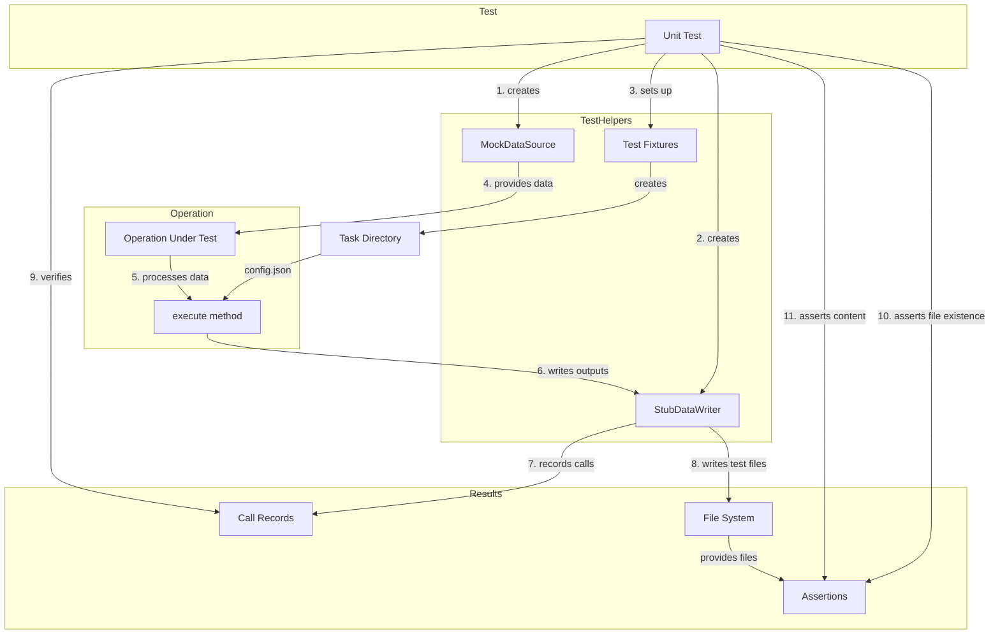

# PAMOLA.CORE Test Helpers Module Documentation

## 1. Purpose and Overview

The `op_test_helpers.py` module provides specialized testing utilities for the PAMOLA.CORE operations framework. It is designed to simplify unit testing of operations by eliminating dependencies on real file I/O, encryption mechanisms, and external resources. This module enables developers to write isolated, reliable, and fast tests for privacy-enhancing operations without setting up complex test environments.

The Test Helpers module is a critical part of the quality assurance strategy for PAMOLA.CORE, enabling comprehensive testing of operations that process sensitive data while maintaining the strict security and privacy principles of the framework.

## 2. Key Features

- **Test Doubles**: Mock implementations of pamola core framework classes (`DataSource`, `DataWriter`) that simulate real behavior without external dependencies
- **Call Recording**: Detailed tracking of method calls, parameters, and results for verification in tests
- **Temporary Storage**: Safe, isolated storage for test artifacts with automatic cleanup
- **Assertion Helpers**: Specialized assertion functions for verifying operation outputs and artifacts
- **Environment Setup**: Utilities for creating standardized test environments with proper directory structures
- **Configuration Management**: Tools for generating and customizing operation configurations for testing
- **Minimal Dependencies**: Implementation that minimizes dependencies on other parts of the framework

## 3. Architecture

### 3.1 Component Architecture

The Test Helpers module consists of several interrelated components that work together to support different aspects of operation testing:

```
┌────────────────────────────────────────────────────────────────────┐
│                      op_test_helpers Module                        │
│                                                                    │
│  ┌─────────────────┐  ┌────────────────────┐  ┌───────────────┐    │
│  │ Test Doubles    │  │ Assertion Helpers  │  │ Test Fixtures │    │
│  │                 │  │                    │  │               │    │
│  │ ◆ MockDataSource│  │ ◆ assert_artifact_ │  │ ◆ create_test_│    │
│  │                 │  │   exists()         │  │   operation_  │    │
│  │ ◆ StubDataWriter│  │                    │  │   env()       │    │
│  │                 │  │ ◆ assert_metrics_  │  │               │    │
│  │ ◆ CallRecord    │  │   content()        │  │               │    │
│  └─────────────────┘  └────────────────────┘  └───────────────┘    │
│                                                                    │
└────────────────────────────────────────────────────────────────────┘
```

### 3.2 Integration Architecture

The Test Helpers module integrates with the PAMOLA.CORE operations framework as a testing layer that intercepts interactions with external systems:

```
┌───────────────────────────────────────────────────────────────────┐
│                         Unit Test                                 │
└─────────────────────────────┬─────────────────────────────────────┘
                              │
                              ▼
┌───────────────────────────────────────────────────────────────────┐
│                      Test Helpers Layer                           │
│                                                                   │
│  ┌─────────────────┐    ┌────────────────┐    ┌───────────────┐   │
│  │  MockDataSource │    │ StubDataWriter │    │ Test Fixtures │   │
│  └────────┬────────┘    └───────┬────────┘    └───────┬───────┘   │
│           │                     │                     │           │
└───────────┼─────────────────────┼─────────────────────┼───────────┘
            │                     │                     │
            ▼                     ▼                     ▼
┌───────────────────────────────────────────────────────────────────┐
│                       Operations Framework                        │
│                                                                   │
│  ┌────────────┐    ┌────────────┐    ┌────────────┐    ┌────────┐ │
│  │ DataSource │    │ DataWriter │    │ Operation  │    │ Result │ │
│  │  Interface │    │  Interface │    │   Base     │    │ Classes│ │
│  └────────────┘    └────────────┘    └────────────┘    └────────┘ │
│                                                                   │
└───────────────────────────────────────────────────────────────────┘
```

### 3.3 Data Flow

The following diagram illustrates how data flows through the Test Helpers components during test execution:



## 4. Pamola Core API Reference

### 4.1 MockDataSource Class

A test double for DataSource that works with in-memory DataFrames.

| Method | Description | Parameters | Returns |
|--------|-------------|------------|---------|
| `__init__()` | Initialize a MockDataSource | `dataframes`: Dict of DataFrames (optional) | None |
| `from_dataframe()` | Factory method for single DataFrame | `df`: DataFrame<br>`name`: Name for the DataFrame | MockDataSource |
| `add_dataframe()` | Add a DataFrame | `name`: DataFrame name<br>`df`: The DataFrame to add | None |
| `get_dataframe()` | Get a DataFrame by name | `name`: DataFrame name<br>`**kwargs`: Additional params (ignored) | Tuple(DataFrame, error_info) |
| `get_schema()` | Get schema information | `name`: DataFrame name | Dict or None |
| `has_dataframe()` | Check if DataFrame exists | `name`: Name to check | bool |

### 4.2 StubDataWriter Class

A test double for DataWriter that writes to a temporary directory and records calls.

| Method | Description | Parameters | Returns |
|--------|-------------|------------|---------|
| `__init__()` | Initialize a StubDataWriter | `task_dir`: Base directory (optional)<br>`logger`: Logger instance (optional) | None |
| `write_dataframe()` | Write a DataFrame | `df`: DataFrame<br>`name`: Base filename<br>`format`: Output format<br>`subdir`: Subdirectory<br>`timestamp_in_name`: Add timestamp<br>`encryption_key`: Encryption key<br>`overwrite`: Overwrite existing<br>`**kwargs`: Additional params | WriterResult |
| `write_json()` | Write a JSON object | `data`: JSON data<br>`name`: Base filename<br>`subdir`: Subdirectory<br>`timestamp_in_name`: Add timestamp<br>`encryption_key`: Encryption key<br>`pretty`: Use indentation<br>`overwrite`: Overwrite existing<br>`**kwargs`: Additional params | WriterResult |
| `write_metrics()` | Write metrics | `metrics`: Metrics data<br>`name`: Base filename<br>`timestamp_in_name`: Add timestamp<br>`encryption_key`: Encryption key<br>`overwrite`: Overwrite existing<br>`**kwargs`: Additional params | WriterResult |
| `write_dictionary()` | Write a dictionary | `data`: Dictionary data<br>`name`: Base filename<br>`timestamp_in_name`: Add timestamp<br>`encryption_key`: Encryption key<br>`overwrite`: Overwrite existing<br>`format`: Output format<br>`**kwargs`: Additional params | WriterResult |
| `get_calls()` | Get recorded calls | `method_name`: Method to filter by | List[CallRecord] |
| `clear_calls()` | Clear recorded calls | None | None |

### 4.3 Assertion Helpers

| Function | Description | Parameters | Returns/Raises |
|----------|-------------|------------|----------------|
| `assert_artifact_exists()` | Check file existence | `task_dir`: Base task directory<br>`subdir`: Subdirectory<br>`filename_pattern`: Regex pattern | Path or AssertionError |
| `assert_metrics_content()` | Verify metrics content | `task_dir`: Base task directory<br>`expected_metrics`: Expected metrics | Dict or AssertionError |

### 4.4 Test Environment Helper

| Function | Description | Parameters | Returns |
|----------|-------------|------------|---------|
| `create_test_operation_env()` | Create test environment | `tmp_path`: Base path<br>`config_overrides`: Config overrides | Tuple(task_dir, config) |

## 5. Usage Examples

### 5.1 Basic Operation Test

```python
import pytest
from pathlib import Path
import pandas as pd
from pamola_core.utils.ops.op_test_helpers import (
    MockDataSource, StubDataWriter, assert_artifact_exists, 
    assert_metrics_content, create_test_operation_env
)
from my_package.operations import MyOperation

def test_my_operation(tmp_path):
    # Create test data
    data = pd.DataFrame({
        'id': range(1, 101),
        'value': [i * 2 for i in range(1, 101)]
    })
    
    # Create mocks and test environment
    data_source = MockDataSource.from_dataframe(data, name="main")
    task_dir, config = create_test_operation_env(
        tmp_path, 
        {'parameters': {'threshold': 0.75}}
    )
    writer = StubDataWriter(task_dir)
    
    # Create and execute operation
    operation = MyOperation(field_name="value", threshold=0.75)
    result = operation.execute(
        data_source=data_source,
        task_dir=task_dir,
        writer=writer
    )
    
    # Verify operation status
    assert result.status.name == "SUCCESS"
    
    # Verify files were created
    output_file = assert_artifact_exists(task_dir, "output", r"value_.*\.csv")
    metrics_file = assert_metrics_content(task_dir, {
        "processed_count": 100,
        "above_threshold": 75
    })
    
    # Verify write calls
    df_calls = writer.get_calls("write_dataframe")
    assert len(df_calls) == 1
    assert df_calls[0].params["format"] == "csv"
```

### 5.2 Testing Complex Operations

```python
def test_complex_operation_with_multiple_outputs(tmp_path):
    # Create test data
    users = pd.DataFrame({
        'user_id': range(1, 11),
        'name': [f"User_{i}" for i in range(1, 11)],
        'age': [20 + i for i in range(1, 11)]
    })
    
    orders = pd.DataFrame({
        'order_id': range(101, 121),
        'user_id': [i % 10 + 1 for i in range(20)],
        'amount': [i * 10 for i in range(1, 21)]
    })
    
    # Create mocks and test environment
    data_source = MockDataSource({
        "users": users,
        "orders": orders
    })
    
    task_dir, config = create_test_operation_env(
        tmp_path,
        {
            "operation_name": "user_order_analyzer",
            "parameters": {
                "min_age": 25,
                "min_orders": 2
            }
        }
    )
    
    writer = StubDataWriter(task_dir)
    
    # Create and execute operation
    from my_package.operations import UserOrderAnalyzer
    operation = UserOrderAnalyzer(min_age=25, min_orders=2)
    result = operation.execute(
        data_source=data_source,
        task_dir=task_dir,
        writer=writer
    )
    
    # Verify result
    assert result.status.name == "SUCCESS"
    
    # Verify all expected files were created
    summary_file = assert_artifact_exists(task_dir, None, r"summary_.*\.json")
    filtered_users = assert_artifact_exists(task_dir, "output", r"filtered_users_.*\.csv")
    order_stats = assert_artifact_exists(task_dir, "output", r"order_stats_.*\.csv")
    
    # Verify metrics
    assert_metrics_content(task_dir, {
        "eligible_users": {"count": 5},
        "total_orders": {"processed": 20}
    })
    
    # Examine call details
    calls = writer.get_calls()
    assert len(calls) >= 3  # At least summary, users and orders outputs
    
    # Verify that no encryption was used (in this example)
    for call in calls:
        assert not call.params.get("has_encryption_key", False)
```

### 5.3 Testing Operation Errors

```python
def test_operation_handles_missing_field_gracefully(tmp_path):
    # Create test data without the required field
    data = pd.DataFrame({
        'id': range(1, 101),
        # 'value' field is missing
    })
    
    # Create test doubles
    data_source = MockDataSource.from_dataframe(data, name="main")
    task_dir, _ = create_test_operation_env(tmp_path)
    writer = StubDataWriter(task_dir)
    
    # Create operation that expects 'value' field
    from my_package.operations import ValueProcessor
    operation = ValueProcessor(field_name="value")
    
    # Execute operation - should handle missing field gracefully
    result = operation.execute(
        data_source=data_source,
        task_dir=task_dir,
        writer=writer
    )
    
    # Verify operation reports error but doesn't crash
    assert result.status.name == "ERROR"
    assert "missing" in result.error_message.lower()
    
    # Verify error metrics were written
    assert_metrics_content(task_dir, {
        "status": "error",
        "error_type": "field_not_found"
    })
    
    # Verify no data outputs were created
    assert len(writer.get_calls("write_dataframe")) == 0
    
    # But error report was created
    assert len(writer.get_calls("write_json")) > 0
```

## 6. Limitations and Best Practices

### 6.1 Current Limitations

1. **Simplified Behavior**: The test doubles implement only the pamola core functionality needed for most tests. Advanced features like chunked processing and Dask support are not fully simulated.

2. **Visual Artifacts**: The StubDataWriter does not fully support creation of visual artifacts like charts and plots; it records the calls but doesn't actually generate the visualizations.

3. **No Network Simulation**: The module does not provide mocks for network operations or distributed processing.

4. **Limited Encryption Simulation**: While encryption parameters are accepted, the actual encryption/decryption is not performed in test doubles.

5. **Filesystem Dependencies**: Some tests still require filesystem access for the temporary directories, which may cause issues in environments with restricted permissions.

### 6.2 Best Practices

#### 6.2.1 Test Organization

1. **Isolated Tests**: Create separate test cases for different aspects of an operation - normal execution, error handling, edge cases.

2. **Focused Assertions**: Test specific behavior rather than implementation details that may change.

3. **Temporary Paths**: Always use pytest's `tmp_path` fixture to ensure proper cleanup.

4. **Setup Helpers**: Create specialized setup helpers for complex operations to reduce code duplication.

#### 6.2.2 Data Source Usage

1. **Minimal Data**: Use the smallest dataset that can still properly test the operation.

2. **Name Consistency**: Use consistent naming patterns for test DataFrames ("main" for single source tests).

3. **Schema Testing**: Test schema validation separately from main functionality.

4. **Multi-Source Tests**: For operations processing multiple inputs, create all required sources before execution.

#### 6.2.3 Data Writer Usage

1. **Call Verification**: Verify both the existence of artifacts and the calls made to create them.

2. **Metadata Checking**: Check metadata like timestamps in write calls to ensure proper configuration.

3. **Clear Between Tests**: Use `clear_calls()` when reusing a writer in multiple tests.

4. **Error Injection**: Test error handling by using filesystem permissions or custom errors.

#### 6.2.4 Assertions

1. **Pattern Matching**: Use specific patterns in `assert_artifact_exists()` to avoid false positives.

2. **Metadata Structure**: Design metrics to have a consistent, testable structure.

3. **Partial Matching**: Remember that `assert_metrics_content()` performs partial matching; include only the fields you need to verify.

4. **Direct File Access**: For detailed content verification, open and parse the files directly.

#### 6.2.5 Configuration

1. **Minimal Overrides**: Override only the configuration parameters needed for the specific test.

2. **Consistent Structure**: Maintain a consistent structure for test configurations.

3. **Configuration Validation**: Test both valid and invalid configurations separately.

4. **Versioning**: Include version information in test configs for forward compatibility.

### 6.3 Anti-patterns to Avoid

1. ❌ **Hardcoded Paths**: Avoid hardcoding paths in tests; use the provided helpers.

2. ❌ **Excessive Mocking**: Don't mock every possible component; use the provided test doubles.

3. ❌ **Complex Test Data**: Avoid using extremely large or complex datasets for basic tests.

4. ❌ **Brittle Assertions**: Don't assert exact file paths or timestamps that may change.

5. ❌ **Real I/O in Unit Tests**: Avoid performing real I/O operations in unit tests; use the test doubles instead.