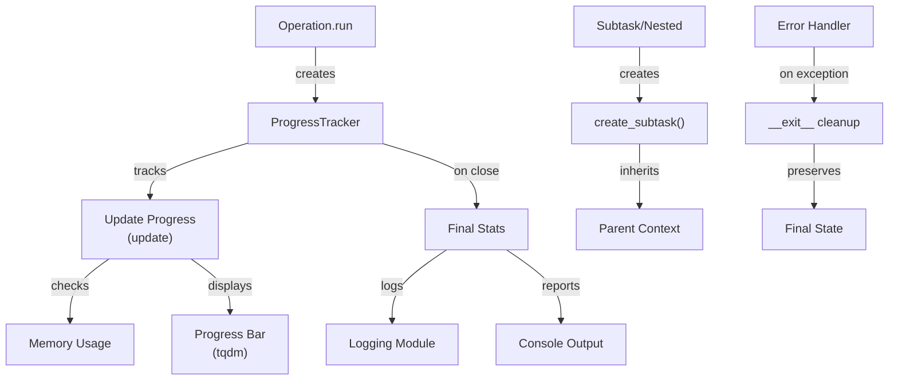

# PAMOLA.CORE Progress Tracking Module Documentation

## 1. Purpose and Overview

The PAMOLA.CORE Progress Tracking module (`progress.py`) provides comprehensive progress tracking and visualization capabilities for large-scale data processing operations. It enables developers to monitor the execution of long-running tasks with real-time progress updates, estimated time remaining (ETA), and memory usage monitoring. The module is designed specifically for privacy-preserving data operations where visibility into processing status is critical.

The Progress module functions as a core utility within PAMOLA.CORE, integrating seamlessly with the logging and I/O subsystems to provide coordinated monitoring of data transformation pipelines. It supports both simple single-stage operations and complex hierarchical multi-stage workflows, making it suitable for everything from basic data loading to intricate multi-step anonymization processes.

## 2. Key Features

- **Real-Time Progress Visualization**: Live progress bars with percentage, iteration count, and ETA
- **Hierarchical Progress Tracking**: Nested progress trackers for complex multi-stage operations
- **Memory Usage Monitoring**: Real-time memory tracking with peak memory reporting
- **Multiple Display Formats**: Support for simple and enhanced progress display modes
- **Error Recovery**: Graceful error handling with context manager cleanup
- **Progress Persistence**: Support for resumable operations with checkpoint tracking
- **Integration with Logging**: Seamless integration with PAMOLA.CORE centralized logging
- **Backward Compatibility**: Consistent API across versions with no breaking changes
- **Thread-Safe Operations**: Safe for use in multi-threaded contexts

## 3. Architecture

### Integration Architecture

The Progress Tracking module serves as a core utility within PAMOLA.CORE operations framework:

```
┌────────────────────────────────────────────────────────┐
│              User-Level Operations                     │
│  (Anonymization, Profiling, Metrics, Transformations)  │
└─────────────────────┬──────────────────────────────────┘
                      │
                      ▼
┌────────────────────────────────────────────────────────┐
│           BaseOperation.run() / execute()               │
│   Manages: progress_tracker parameter                   │
└─────────────────────┬──────────────────────────────────┘
                      │
                      ▼
┌────────────────────────────────────────────────────────┐
│         Progress Tracking Module                       │
│  ┌──────────────────┐  ┌────────────────────────────┐  │
│  │ ProgressBase     │  │ SimpleProgressBar          │  │
│  │ (Base Class)     │  │ (Minimal Progress Display) │  │
│  └──────────────────┘  └────────────────────────────┘  │
│                                                         │
│  ┌──────────────────────────────────────────────────┐  │
│  │ HierarchicalProgressTracker                      │  │
│  │ (Multi-stage operations with nesting support)   │  │
│  └──────────────────────────────────────────────────┘  │
└─────────────────────┬──────────────────────────────────┘
                      │
        ┌─────────────┼─────────────┐
        │             │             │
        ▼             ▼             ▼
   Logging       I/O Operations  Console Output
   (logging.py)  (io.py)         (tqdm)
```

### Component Architecture

The Progress module consists of several key classes:

```
┌─────────────────────────────────────────────────────────┐
│                  ProgressBase                           │
│  (Abstract base class for all progress tracking)        │
│                                                         │
│  Properties: n, total, elapsed, ETA, memory_usage      │
│  Methods: update(), close(), __enter__, __exit__       │
└─────────────────────────────────────────────────────────┘
           ▲                               ▲
           │                               │
    ┌──────┴────────┐          ┌──────────┴────────────┐
    │               │          │                       │
┌───┴───────────┐ ┌─┴────────┐ ┌──┴─────────────────┐  │
│ Simple         │ │ Enhanced  │ │ Hierarchical      │  │
│ ProgressBar    │ │ Progress  │ │ ProgressTracker   │  │
└───────────────┘ │ Bar       │ └───────────────────┘  │
                  └───────────┘                        │
                   (Consolidated in v2.0)              │
```

### Data Flow



## 4. PAMOLA.CORE API Reference

### Core Classes

#### ProgressBase

Abstract base class for all progress tracking implementations.

| Property/Method | Description | Parameters | Returns | Notes |
|---|---|---|---|---|
| `update(n=1)` | Increment progress by n iterations | `n`: Iterations to increment (default: 1) | None | Thread-safe |
| `close()` | Close the progress tracker and cleanup resources | None | None | Called automatically in context manager |
| `__enter__()` | Context manager entry | None | Self | Enables `with` statements |
| `__exit__(exc_type, exc_val, exc_tb)` | Context manager exit with cleanup | Exception info | bool | False to propagate exceptions |
| `n` | Current iteration count (property) | None | int | Proxy for tqdm compatibility |
| `total` | Total iterations expected | None | int | Gettable and settable |
| `elapsed` | Elapsed time in seconds | None | float | Computed at access time |
| `memory_usage` | Current memory usage in MB | None | float | If track_memory=True |

#### SimpleProgressBar

Lightweight progress bar for simple single-stage operations.

```python
SimpleProgressBar(
    total: int,
    description: str = "",
    unit: str = "it",
    disable: bool = False,
    track_memory: bool = False
)
```

**Usage Example:**
```python
from pamola_core.utils.progress import SimpleProgressBar
import time

with SimpleProgressBar(total=100, description="Processing", unit="items") as progress:
    for i in range(100):
        time.sleep(0.01)
        progress.update(1)
```

#### HierarchicalProgressTracker

Advanced progress tracker supporting nested subtasks and hierarchical progress reporting.

```python
HierarchicalProgressTracker(
    total: int,
    description: str = "",
    unit: str = "it",
    track_memory: bool = True,
    disable: bool = False
)
```

**Key Methods:**

| Method | Description | Parameters | Returns |
|---|---|---|---|
| `create_subtask()` | Create a nested progress tracker | `total`, `description`, `unit` | Subtask tracker |
| `update(n=1)` | Update parent progress | `n`: iterations | None |
| `close()` | Close and aggregate all subtasks | None | Dict with final stats |
| `get_stats()` | Get current statistics | None | Dict with timing/memory stats |

**Usage Example:**
```python
from pamola_core.utils.progress import HierarchicalProgressTracker

with HierarchicalProgressTracker(total=3, description="Main Process") as main:
    for stage in range(3):
        sub = main.create_subtask(total=100, description=f"Stage {stage+1}")
        for i in range(100):
            # Do work
            sub.update(1)
        # Subtask automatically updates parent on completion
```

### Factory Functions

#### get_progress_logger()
Get the centralized logger for the progress module.

```python
def get_progress_logger() -> logging.Logger:
    """
    Returns
    -------
    logging.Logger
        Logger instance for progress tracking messages
    """
```

---

## 5. Usage Examples

### Example 1: Simple Progress Tracking

```python
from pamola_core.utils.progress import SimpleProgressBar
import time

def simple_progress_example():
    print("Example 1: Simple Progress Tracking")
    # Create a simple progress bar
    with SimpleProgressBar(total=100, description="Processing records", unit="records") as progress:
        for i in range(100):
            # Simulate work
            time.sleep(0.01)
            # Update progress
            progress.update(1)
    print("Simple progress example completed\n")

simple_progress_example()
```

### Example 2: Hierarchical Progress Tracking

```python
from pamola_core.utils.progress import HierarchicalProgressTracker

def hierarchical_progress_example():
    print("Example 2: Hierarchical Progress Tracking")
    # Create a parent progress tracker
    master = HierarchicalProgressTracker(
        total=3,
        description="Master process",
        unit="stages",
        track_memory=True
    )

    # Process with subtasks
    for stage in range(3):
        # Create subtask
        subtask = master.create_subtask(
            total=100,
            description=f"Stage {stage+1} processing",
            unit="items"
        )

        # Process subtask
        for i in range(100):
            # Simulate work - different stages take different time
            time.sleep(0.005 * (stage + 1))
            subtask.update(1)

        # Subtask will automatically update master when completed
        # No need to call master.update()

    # Close master tracker
    master.close()
    print("Hierarchical progress example completed\n")

hierarchical_progress_example()
```

### Example 3: Memory Tracking

```python
from pamola_core.utils.progress import SimpleProgressBar
import pandas as pd
import numpy as np

def memory_tracking_example():
    print("Example 3: Memory Tracking During DataFrame Processing")

    with SimpleProgressBar(total=100, description="Building DataFrame", track_memory=True) as progress:
        for i in range(100):
            # Simulate DataFrame growth
            if i == 0:
                df = pd.DataFrame({'value': np.random.rand(1000)})
            else:
                df = pd.concat([df, pd.DataFrame({'value': np.random.rand(1000)})], ignore_index=True)
            progress.update(1)

    print(f"Final DataFrame shape: {df.shape}")
    print("Memory tracking example completed\n")

memory_tracking_example()
```

### Example 4: Context Manager Usage

```python
from pamola_core.utils.progress import HierarchicalProgressTracker

def context_manager_example():
    print("Example 4: Context Manager with Error Handling")

    try:
        with HierarchicalProgressTracker(total=5, description="Process stages") as tracker:
            for i in range(5):
                sub = tracker.create_subtask(total=20, description=f"Subtask {i+1}")
                for j in range(20):
                    # Simulate potential errors
                    if i == 2 and j == 10:
                        raise ValueError("Simulated processing error")
                    sub.update(1)
    except ValueError as e:
        print(f"Caught error: {e}")
        print("Context manager cleaned up properly")

context_manager_example()
```

---

## 6. Integration with BaseOperation

The progress tracking module is fully integrated with `BaseOperation` through the `progress_tracker` parameter:

```python
class MyOperation(BaseOperation):
    def execute(self, data_source, task_dir, reporter, progress_tracker=None, **kwargs):
        # Use provided progress tracker or create new one
        if progress_tracker is None:
            progress_tracker = SimpleProgressBar(total=100, description="My Operation")

        # Process data with progress updates
        df = data_source.get_dataframe("main")
        for i, row in df.iterrows():
            # Process row
            progress_tracker.update(1)

        # Return operation result
        return OperationResult(status=OperationStatus.SUCCESS)

# Run operation with progress tracking
operation = MyOperation()
result = operation.run(
    data_source=data_source,
    task_dir=task_dir,
    reporter=reporter,
    progress_tracker=HierarchicalProgressTracker(total=len(df), description="Main operation")
)
```

---

## 7. Best Practices

1. **Always Use Context Managers**: Ensures proper cleanup of resources
   ```python
   with SimpleProgressBar(total=100) as progress:
       # Work here
   ```

2. **Set Realistic Totals**: Accurate totals provide meaningful ETA calculations
   ```python
   with SimpleProgressBar(total=len(dataframe), description="Processing") as progress:
       # Process each row
   ```

3. **Track Memory for Large Operations**: Enable memory tracking for datasets > 100MB
   ```python
   with SimpleProgressBar(total=items, track_memory=True) as progress:
       # Large data processing
   ```

4. **Use Hierarchical Tracking for Multi-Stage Operations**: Better visibility into complex workflows
   ```python
   with HierarchicalProgressTracker(total=stages) as main:
       for stage in range(stages):
           sub = main.create_subtask(total=items_per_stage)
           # Process stage
   ```

5. **Don't Update Too Frequently**: Excessive updates can impact performance
   ```python
   # Good: Update every 100 items
   if i % 100 == 0:
       progress.update(100)

   # Avoid: Update every item if processing is slow
   # progress.update(1)  # Too frequent for slow operations
   ```

---

## 8. Limitations and Constraints

1. **Single-Process Only**: Use `track_memory=False` for multiprocessing scenarios
2. **ETA Accuracy**: ETA requires consistent processing speed; variable workloads produce inaccurate estimates
3. **Display Width**: Very narrow terminals may not display progress bar properly
4. **Memory Tracking Overhead**: Memory tracking adds ~5-10% overhead; disable if not needed

---

## 9. Changelog

**Version 2.1.0 (2025-05-23)**
- Logging integration refactoring
- Removed duplicate configure_logging() calls
- Simplified logger access via get_progress_logger()

**Version 2.0.0 (2025-05-22)**
- Added proxy properties (n, total, elapsed) for tqdm compatibility
- Consolidated progress bar implementations
- Enhanced memory tracking accuracy

**Version 1.3.0 (2025-05-01)**
- Added enhanced parallel processing support

**Version 1.2.0 (2025-04-15)**
- Added hierarchical progress tracking

---

## 10. Related Documentation

- [PAMOLA.CORE I/O Module](./io.md) - Uses progress tracking for file operations
- [Logging Module](./logging.md) - Integrates with centralized logging
- [BaseOperation](./ops/op_base.md) - Progress tracker parameter integration
