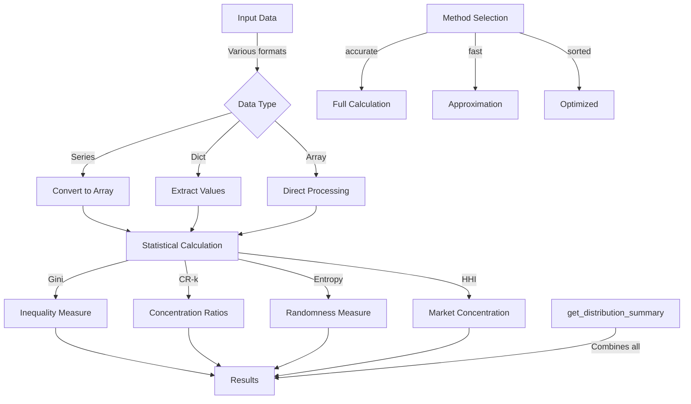

# PAMOLA.CORE Statistical Metrics Module Documentation

## 1. Purpose and Overview

The PAMOLA.CORE Statistical Metrics module (`statistical_metrics.py`) provides essential statistical analysis utilities for measuring distribution inequality, concentration, and randomness within the PAMOLA privacy-preserving data processing framework. It serves as a foundational component for data profiling, anonymization assessment, and quality evaluation operations throughout the system.

The Statistical Metrics module implements industry-standard statistical measures that are crucial for understanding data distributions, identifying privacy risks, and evaluating the effectiveness of anonymization techniques. By providing optimized implementations of these metrics, the module enables consistent and efficient analysis across all PAMOLA.CORE operations.

## 2. Key Features

- **Inequality Measurement**: Gini coefficient calculation with multiple optimization methods
- **Concentration Analysis**: Concentration ratios (CR-k) for distribution assessment
- **Visual Analytics Support**: Lorenz curve computation for inequality visualization
- **Market Concentration**: Herfindahl-Hirschman Index (HHI) for competition analysis
- **Distribution Randomness**: Shannon entropy for measuring uncertainty
- **Performance Optimization**: Multiple calculation methods optimized for different dataset sizes
- **Flexible Input Support**: Handles raw values, frequencies, and various data structures
- **Comprehensive Summary**: Unified distribution analysis with multiple metrics
- **Numerical Stability**: Robust implementations with epsilon handling

## 3. Architecture

### Integration Architecture

The Statistical Metrics module is positioned as a core utility within the PAMOLA.CORE framework, providing statistical analysis capabilities to all operation types:

```
┌────────────────────────────────────────────────────────────────┐
│                      User-Level Scripts                        │
└─────────────────────────────────┬──────────────────────────────┘
                                  │
                                  ▼
┌────────────────────────────────────────────────────────────────┐
│                     Operations Framework                       │
│  ┌─────────────────┐ ┌────────────────┐ ┌───────────────────┐  │
│  │   Profiling     │ │ Anonymization  │ │  Quality Check    │  │
│  │   Operations    │ │  Operations    │ │   Operations      │  │
│  └────────┬────────┘ └───────┬────────┘ └──────────┬────────┘  │
│           │                  │                     │           │
└───────────┼──────────────────┼─────────────────────┼───────────┘
            │                  │                     │
            ▼                  ▼                     ▼
┌───────────────────────────────────────────────────────────────┐
│                     Core Utility Modules                      │
│  ┌─────────────────┐  ┌────────────────┐  ┌────────────────┐  │
│  │Statistical      │  │Field Utils     │  │Data Processing │  │
│  │Metrics          │  │                │  │                │  │
│  └─────┬───────────┘  └────────┬───────┘  └───────┬────────┘  │
│        │                       │                   │          │
│        ▼                       ▼                   ▼          │
│  ┌────────────────────────────────────────────────────────┐   │
│  │              numpy, pandas (dependencies)              │   │
│  └────────────────────────────────────────────────────────┘   │
└───────────────────────────────────────────────────────────────┘
```

### Component Architecture

The Statistical Metrics module consists of specialized metric calculations and a unified summary function:

```
┌─────────────────────────────────────────────────────────────┐
│                  Statistical Metrics Module                 │
│                                                             │
│  ┌─────────────────────┐  ┌────────────────────────────┐    │
│  │ Inequality Metrics  │  │ Concentration Metrics      │    │
│  │                     │  │                            │    │
│  │ ◆ calculate_gini_   │  │ ◆ calculate_concentration_ │    │
│  │   coefficient()     │  │   metrics()                │    │
│  │ ◆ calculate_lorenz_ │  │ ◆ calculate_herfindahl_    │    │
│  │   curve()           │  │   index()                  │    │
│  └─────────────────────┘  └────────────────────────────┘    │
│                                                             │
│  ┌─────────────────────┐  ┌────────────────────────────┐    │
│  │ Distribution Metrics│  │ Summary Functions          │    │
│  │                     │  │                            │    │
│  │ ◆ calculate_shannon_│  │ ◆ get_distribution_        │    │
│  │   entropy()         │  │   summary()                │    │
│  └─────────────────────┘  └────────────────────────────┘    │
│                                                             │
│  ┌─────────────────────────────────────────────────────┐    │
│  │ Internal Helper Functions                            │    │
│  │ ◆ _gini_accurate()  ◆ _gini_fast()  ◆ _gini_sorted()│    │
│  └─────────────────────────────────────────────────────┘    │
└─────────────────────────────────────────────────────────────┘
```

### Data Flow



## 4. Core API Reference

### Inequality Measurement Functions

| Function | Description | Key Parameters | Returns |
|----------|-------------|----------------|---------|
| `calculate_gini_coefficient()` | Calculate Gini coefficient for inequality | `data`: Values or frequencies<br>`is_frequency`: Whether data is frequencies<br>`method`: "accurate", "fast", or "sorted" | `float`: Gini coefficient [0, 1] |
| `calculate_lorenz_curve()` | Generate Lorenz curve for visualization | `data`: Values to analyze<br>`n_points`: Number of curve points | `Tuple[np.ndarray, np.ndarray]`: (x, y) coordinates |

### Concentration Analysis Functions

| Function | Description | Key Parameters | Returns |
|----------|-------------|----------------|---------|
| `calculate_concentration_metrics()` | Calculate CR-k concentration ratios | `data`: Distribution data<br>`top_k`: List of k values<br>`as_percentage`: Return as percent | `Dict[str, float]`: CR metrics |
| `calculate_herfindahl_index()` | Calculate HHI for market concentration | `data`: Market share data<br>`normalized`: Normalize to [0,1] | `float`: HHI value |

### Distribution Analysis Functions

| Function | Description | Key Parameters | Returns |
|----------|-------------|----------------|---------|
| `calculate_shannon_entropy()` | Calculate entropy of distribution | `data`: Categorical data<br>`base`: Log base (2 or e)<br>`normalize`: Normalize by max | `float`: Entropy value |
| `get_distribution_summary()` | Comprehensive distribution analysis | `data`: Input data<br>`top_k`: CR-k values<br>`include_*`: Metric flags | `Dict[str, Any]`: All metrics |

## 5. Usage Examples

### Basic Gini Coefficient Calculation

```python
from pamola_core.utils.statistical_metrics import calculate_gini_coefficient
import numpy as np

# Example 1: Income distribution
incomes = [20000, 30000, 35000, 40000, 45000, 50000, 75000, 150000]
gini = calculate_gini_coefficient(incomes)
print(f"Income Gini coefficient: {gini:.4f}")  # Higher value = more inequality

# Example 2: Perfect equality
equal_dist = [1000, 1000, 1000, 1000, 1000]
gini = calculate_gini_coefficient(equal_dist)
print(f"Equal distribution Gini: {gini:.4f}")  # Should be 0.0

# Example 3: Using frequency data
# 100 people earn $30k, 50 earn $50k, 10 earn $100k
frequencies = [100, 50, 10]
gini = calculate_gini_coefficient(frequencies, is_frequency=True)
print(f"Frequency-based Gini: {gini:.4f}")

# Example 4: Fast method for large datasets
large_data = np.random.pareto(2.0, 100000)  # Pareto distribution
gini_fast = calculate_gini_coefficient(large_data, method="fast")
print(f"Fast Gini for large data: {gini_fast:.4f}")
```

### Concentration Ratio Analysis

```python
from pamola_core.utils.statistical_metrics import calculate_concentration_metrics
import pandas as pd

# Example 1: Market share analysis
market_shares = {
    "Company A": 3500,
    "Company B": 2500,
    "Company C": 2000,
    "Company D": 1000,
    "Company E": 500,
    "Others": 500
}

concentration = calculate_concentration_metrics(
    market_shares, 
    top_k=[1, 3, 5],
    as_percentage=True
)

print("Market Concentration:")
for metric, value in concentration.items():
    print(f"  {metric}: {value:.1f}%")

# Example 2: Category distribution in data
categories = pd.Series(['A', 'A', 'A', 'B', 'B', 'C', 'D', 'E'] * 100)
concentration = calculate_concentration_metrics(categories, top_k=[1, 2, 3])
print(f"\nTop category holds {concentration['cr_1']:.1f}% of data")
```

### Lorenz Curve for Visualization

```python
from pamola_core.utils.statistical_metrics import calculate_lorenz_curve
import matplotlib.pyplot as plt

# Income distribution example
incomes = [15000, 20000, 25000, 30000, 35000, 40000, 50000, 60000, 80000, 200000]

# Calculate Lorenz curve
x, y = calculate_lorenz_curve(incomes, n_points=100)

# Plot the curve
plt.figure(figsize=(8, 6))
plt.plot(x, y, 'b-', linewidth=2, label='Lorenz Curve')
plt.plot([0, 1], [0, 1], 'r--', linewidth=1, label='Perfect Equality')
plt.fill_between(x, y, x, alpha=0.3)  # Area shows inequality

plt.xlabel('Cumulative Population')
plt.ylabel('Cumulative Income')
plt.title('Income Inequality Visualization')
plt.legend()
plt.grid(True, alpha=0.3)
plt.show()

# The area between the curves represents the Gini coefficient
```

### Shannon Entropy Analysis

```python
from pamola_core.utils.statistical_metrics import calculate_shannon_entropy
import pandas as pd

# Example 1: Uniform distribution (high entropy)
uniform_data = ['A', 'B', 'C', 'D'] * 25  # 25 of each category
entropy_uniform = calculate_shannon_entropy(uniform_data, normalize=True)
print(f"Uniform distribution entropy: {entropy_uniform:.4f}")  # Should be ~1.0

# Example 2: Skewed distribution (low entropy)
skewed_data = ['A'] * 90 + ['B'] * 5 + ['C'] * 3 + ['D'] * 2
entropy_skewed = calculate_shannon_entropy(skewed_data, normalize=True)
print(f"Skewed distribution entropy: {entropy_skewed:.4f}")  # Much lower

# Example 3: Using frequency dictionary
freq_dict = {'Category1': 150, 'Category2': 100, 'Category3': 50, 'Category4': 25}
entropy = calculate_shannon_entropy(freq_dict, base=2, normalize=True)
print(f"Dictionary-based entropy: {entropy:.4f}")

# Example 4: For privacy assessment
identifiers = pd.Series(['ID001', 'ID002', 'ID001', 'ID003', 'ID001', 'ID004'])
entropy = calculate_shannon_entropy(identifiers)
print(f"Identifier entropy: {entropy:.4f}")  # Lower = more re-identification risk
```

### Herfindahl-Hirschman Index

```python
from pamola_core.utils.statistical_metrics import calculate_herfindahl_index

# Example 1: Competitive market
competitive_shares = [10, 12, 15, 13, 11, 14, 10, 8, 7]  # Similar market shares
hhi = calculate_herfindahl_index(competitive_shares)
print(f"Competitive market HHI: {hhi:.0f}")  # Lower HHI

# Example 2: Concentrated market
concentrated_shares = {"Leader": 45, "Second": 25, "Third": 15, "Others": 15}
hhi = calculate_herfindahl_index(concentrated_shares)
print(f"Concentrated market HHI: {hhi:.0f}")  # Higher HHI

# Example 3: Normalized HHI
hhi_norm = calculate_herfindahl_index(concentrated_shares, normalized=True)
print(f"Normalized HHI: {hhi_norm:.4f}")  # 0-1 scale

# Market concentration interpretation:
# HHI < 1500: Competitive market
# 1500 <= HHI <= 2500: Moderately concentrated
# HHI > 2500: Highly concentrated
```

### Comprehensive Distribution Analysis

```python
from pamola_core.utils.statistical_metrics import get_distribution_summary
import pandas as pd

# Example: Analyze category distribution in anonymized data
data = pd.Series([
    'GeneralizedAge_20-30', 'GeneralizedAge_20-30', 'GeneralizedAge_30-40',
    'GeneralizedAge_20-30', 'GeneralizedAge_40-50', 'GeneralizedAge_30-40',
    'GeneralizedAge_50+', 'GeneralizedAge_20-30', 'GeneralizedAge_30-40'
] * 100)

# Get comprehensive summary
summary = get_distribution_summary(
    data,
    top_k=[1, 2, 3],
    include_gini=True,
    include_concentration=True,
    include_entropy=True
)

# Display results
print("Distribution Analysis Summary:")
print(f"Total records: {summary['total_count']}")
print(f"Unique categories: {summary['unique_count']}")
print(f"Gini coefficient: {summary['gini']:.4f}")
print(f"Normalized entropy: {summary['entropy']:.4f}")
print(f"Most common: '{summary['mode']}' ({summary['mode_percentage']:.1%})")

print("\nConcentration ratios:")
for metric, value in summary['concentration'].items():
    print(f"  {metric}: {value:.1f}%")
```

### Privacy Risk Assessment Example

```python
from pamola_core.utils.statistical_metrics import (
    calculate_gini_coefficient,
    calculate_concentration_metrics,
    calculate_shannon_entropy
)
import pandas as pd

def assess_privacy_risk(quasi_identifiers_df):
    """
    Assess privacy risk based on statistical metrics of quasi-identifiers.
    """
    # Combine quasi-identifiers into groups
    groups = quasi_identifiers_df.groupby(list(quasi_identifiers_df.columns)).size()
    
    # Calculate metrics
    gini = calculate_gini_coefficient(groups.values, is_frequency=True)
    entropy = calculate_shannon_entropy(groups, normalize=True)
    concentration = calculate_concentration_metrics(groups, top_k=[1, 5, 10])
    
    # Risk assessment
    risk_score = 0.0
    risk_factors = []
    
    # High Gini = uneven distribution = higher risk
    if gini > 0.8:
        risk_score += 0.3
        risk_factors.append(f"High inequality (Gini={gini:.3f})")
    
    # Low entropy = less randomness = higher risk
    if entropy < 0.5:
        risk_score += 0.3
        risk_factors.append(f"Low entropy ({entropy:.3f})")
    
    # High concentration = few unique combinations = higher risk
    if concentration['cr_1'] > 10:
        risk_score += 0.4
        risk_factors.append(f"High concentration (CR-1={concentration['cr_1']:.1f}%)")
    
    return {
        'risk_score': min(risk_score, 1.0),
        'risk_level': 'High' if risk_score > 0.7 else 'Medium' if risk_score > 0.3 else 'Low',
        'risk_factors': risk_factors,
        'metrics': {
            'gini': gini,
            'entropy': entropy,
            'cr_1': concentration['cr_1'],
            'cr_5': concentration['cr_5']
        }
    }

# Example usage
quasi_identifiers = pd.DataFrame({
    'age_range': ['20-30', '30-40', '20-30', '40-50', '20-30'] * 20,
    'zip_code': ['10001', '10001', '10002', '10003', '10001'] * 20,
    'gender': ['M', 'F', 'M', 'F', 'M'] * 20
})

risk_assessment = assess_privacy_risk(quasi_identifiers)
print(f"Privacy Risk Level: {risk_assessment['risk_level']}")
print(f"Risk Score: {risk_assessment['risk_score']:.2f}")
print("Risk Factors:")
for factor in risk_assessment['risk_factors']:
    print(f"  - {factor}")
```

## 6. Limitations and Best Practices

### Current Limitations

1. **Memory Usage**: Large datasets may require significant memory for some calculations
2. **Numerical Precision**: Very large values may experience floating-point precision issues
3. **Performance**: The "accurate" Gini method has O(n log n) complexity
4. **Input Validation**: Limited validation of input data types and ranges

### Best Practices

#### Performance Optimization

1. **Choose Appropriate Methods**:
   ```python
   # For large datasets (>100k records)
   gini = calculate_gini_coefficient(large_data, method="fast")
   
   # For pre-sorted data
   sorted_data = np.sort(data)
   gini = calculate_gini_coefficient(sorted_data, method="sorted")
   ```

2. **Use Frequency Data When Available**:
   ```python
   # Instead of processing raw data
   # BAD: gini = calculate_gini_coefficient(['A'] * 1000 + ['B'] * 500)
   
   # GOOD: Use frequencies directly
   gini = calculate_gini_coefficient([1000, 500], is_frequency=True)
   ```

#### Data Preparation

1. **Handle Missing Values**:
   ```python
   # The module removes NaN automatically, but explicit handling is clearer
   clean_data = data.dropna()
   metrics = get_distribution_summary(clean_data)
   ```

2. **Validate Input Ranges**:
   ```python
   # Ensure non-negative values for Gini
   if (data < 0).any():
       raise ValueError("Gini coefficient requires non-negative values")
   ```

#### Integration Patterns

1. **Profiling Operations**:
   ```python
   def profile_field_distribution(series):
       """Profile a field using statistical metrics."""
       return {
           'distribution': get_distribution_summary(series),
           'risk_indicators': {
               'high_concentration': series.value_counts().iloc[0] / len(series) > 0.5,
               'low_diversity': calculate_shannon_entropy(series, normalize=True) < 0.3
           }
       }
   ```

2. **Anonymization Assessment**:
   ```python
   def assess_anonymization_quality(original, anonymized):
       """Compare distributions before and after anonymization."""
       return {
           'original_gini': calculate_gini_coefficient(original.value_counts(), is_frequency=True),
           'anonymized_gini': calculate_gini_coefficient(anonymized.value_counts(), is_frequency=True),
           'entropy_change': (
               calculate_shannon_entropy(anonymized) - 
               calculate_shannon_entropy(original)
           )
       }
   ```

By following these guidelines and understanding the module's capabilities, developers can effectively use the Statistical Metrics module to analyze data distributions, assess privacy risks, and evaluate anonymization effectiveness within the PAMOLA.CORE framework.

## 7. Version History

- **1.0.0** (2025-01) - Initial implementation with core statistical metrics
  - Gini coefficient with three calculation methods
  - Concentration ratios (CR-k)
  - Lorenz curve computation
  - Herfindahl-Hirschman Index
  - Shannon entropy
  - Comprehensive distribution summary function