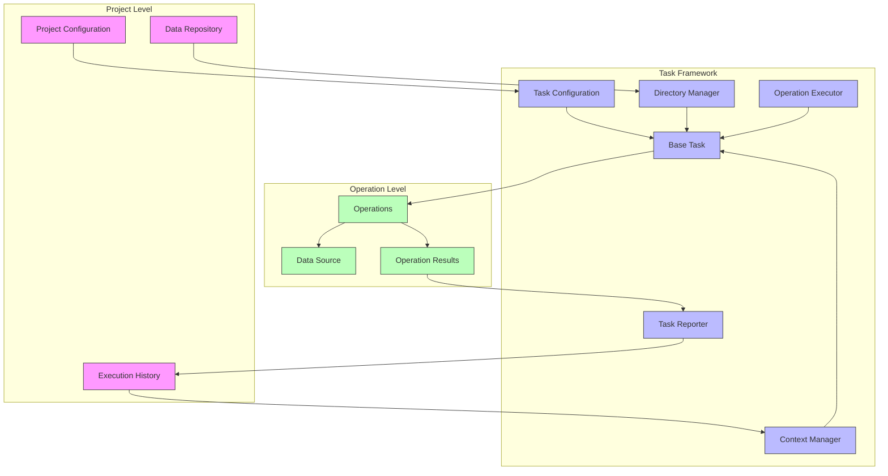

# PAMOLA Core Task Framework Documentation

## 1. Introduction

The PAMOLA Core Task Framework (`pamola_core/utils/tasks/`) serves as a critical bridge between user-level scripts (tasks) and the underlying operation-based architecture of PAMOLA Core (Privacy And Management Of Large Anonymization). It provides a standardized foundation for creating, configuring, and executing privacy-enhancing tasks within the PAMOLA ecosystem.

### 1.1 Position in PAMOLA Architecture

PAMOLA implements a three-tier architecture to separate concerns and provide modularity:

```
┌─────────────────────┐      ┌──────────────────────┐      ┌─────────────────────┐
│      PROJECTS       │      │        TASKS         │      │     OPERATIONS      │
│ (e.g., PAMOLA.CORE, Studio) │ ──▶  │ (User-level scripts) │ ──▶  │  (Core functions)   │
└─────────────────────┘      └──────────────────────┘      └─────────────────────┘
     High-level workflow           Orchestration              Privacy-enhancing
       management                  and reporting                transformations
```

The Task Framework serves as the critical middle layer that:

- Bridges the gap between high-level project workflows and low-level privacy operations
- Provides a consistent, intuitive interface for task developers
- Handles configuration, directory management, and dependency validation
- Manages the execution lifecycle of privacy-enhancing operations

### 1.2 Key Features

The Task Framework offers a comprehensive set of features for streamlined task development and execution:

1. **Standardized Task Lifecycle**: Unified initialization, execution, and finalization phases
2. **Configuration Management**: Multi-level configuration cascade with priority handling
3. **Project Structure Navigation**: Reliable discovery of project root and data repositories
4. **Path Resolution**: Correct handling of both absolute and relative paths with security validation
5. **Operation Orchestration**: Clean interfaces for operation execution with retry capabilities
6. **Execution State Management**: Checkpointing for resumable execution after interruptions
7. **Consistent Reporting**: Standardized format for execution reports and artifact tracking
8. **Error Handling**: Robust error recovery strategies with configurable behaviors
9. **Dependency Management**: Tracking and validation of task dependencies
10. **Progress Tracking**: Visual feedback during task execution
11. **Encryption Support**: Integrated security for sensitive data

## 2. Architecture

### 2.1 Component Architecture

The Task Framework consists of several specialized modules that work together:

```
┌───────────────────────────────────────────────────────────────────────┐
│                      PAMOLA Core Task Framework                       │
│                                                                       │
│  ┌────────────────┐  ┌────────────────┐  ┌────────────────────────┐   │
│  │  TaskConfig    │  │   BaseTask     │  │    TaskReporter        │   │
│  │  Configuration │  │  Main Facade   │  │  Result Collection     │   │
│  │  & Path Mgmt   │  │  & Lifecycle   │  │  & Report Generation   │   │
│  └────────────────┘  └────────────────┘  └────────────────────────┘   │
│          ▲                   ▲                      ▲                 │
│          │                   │                      │                 │
│  ┌───────┴──────┐    ┌───────┴────────┐    ┌────────┴────────┐        │
│  │ DirectoryMgr │    │ OperationExec  │    │ ProgressManager │        │
│  │ Path & Dir   │    │ Operation      │    │ Progress Bars   │        │
│  │ Management   │    │ Execution      │    │ & Logging       │        │
│  └──────────────┘    └────────────────┘    └─────────────────┘        │
│          ▲                   ▲                      ▲                 │
│          │                   │                      │                 │
│  ┌───────┴──────┐    ┌───────┴────────┐    ┌────────┴────────┐        │
│  │ ContextMgr   │    │ DependencyMgr  │    │ ExecutionLog    │        │
│  │ Checkpointing│    │ Task           │    │ History &       │        │
│  │ & Resumption │    │ Dependencies   │    │ Logging         │        │
│  └──────────────┘    └────────────────┘    └─────────────────┘        │
│          ▲                   ▲                      ▲                 │
│          │                   │                      │                 │
│  ┌───────┴──────┐    ┌───────┴────────┐    ┌────────┴────────┐        │
│  │ EncryptionMgr│    │ TaskRegistry   │    │ PathSecurity    │        │
│  │ Secure Key   │    │ Task Class     │    │ Path Validation │        │
│  │ Management   │    │ Registration   │    │ & Security      │        │
│  └──────────────┘    └────────────────┘    └─────────────────┘        │
└───────────────────────────────────────────────────────────────────────┘
```

#### Key Components:

1. **BaseTask (`base_task.py`)**: Pamola Core facade class that orchestrates the task lifecycle and integrates all other components.
2. **TaskConfig (`task_config.py`)**: Manages configuration loading, validation, and path resolution.
3. **TaskReporter (`task_reporting.py`)**: Handles execution reporting and artifact tracking.
4. **DirectoryManager (`directory_manager.py`)**: Manages directory structures and file path resolution.
5. **OperationExecutor (`operation_executor.py`)**: Executes operations with retry capabilities.
6. **ProgressManager (`progress_manager.py`)**: Coordinates progress bars and logging for visual feedback.
7. **ContextManager (`context_manager.py`)**: Handles execution state, checkpointing, and resumption.
8. **DependencyManager (`dependency_manager.py`)**: Validates task dependencies and manages data flow.
9. **ExecutionLog (`execution_log.py`)**: Records execution history and enables dependency tracking.
10. **EncryptionManager (`encryption_manager.py`)**: Handles secure key management and encryption.
11. **TaskRegistry (`task_registry.py`)**: Manages task class registration and discovery.
12. **PathSecurity (`path_security.py`)**: Ensures path safety and prevents security vulnerabilities.
13. **Task Utils (`task_utils.py`)**: Provides utility functions for common task operations.

### 2.2 Integration Architecture

The Task Framework integrates with the rest of PAMOLA Core through a well-defined interface:

```
┌────────────────────────────────────────────────────────────────────┐
│                           PAMOLA CORE                              │
│                                                                    │
│  ┌──────────────────┐                      ┌───────────────────┐   │
│  │                  │                      │                   │   │
│  │   Operations     │◀────Integration─────▶│   Task Framework  │   │
│  │   Framework      │                      │                   │   │
│  │                  │                      │                   │   │
│  └──────────────────┘                      └───────────────────┘   │
│           ▲                                        ▲               │
│           │                                        │               │
│           │                                        │               │
│           ▼                                        ▼               │
│  ┌──────────────────┐                      ┌───────────────────┐   │
│  │                  │                      │                   │   │
│  │   Data I/O       │◀────────────────────▶│   Project Config  │   │
│  │   & Utilities    │                      │   Management      │   │
│  │                  │                      │                   │   │
│  └──────────────────┘                      └───────────────────┘   │
│                                                                    │
└────────────────────────────────────────────────────────────────────┘
             ▲                                        ▲
             │                                        │
             │                                        │
             ▼                                        ▼
┌──────────────────────┐                    ┌───────────────────────┐
│                      │                    │                       │
│  User Task Scripts   │                    │   PAMOLA Studio       │
│  (PAMOLA.CORE)               │                    │   Project Management  │
│                      │                    │                       │
└──────────────────────┘                    └───────────────────────┘
```

## 3. Data Flow

The Task Framework's data flow can be visualized as follows:



### 3.1 Task Execution Flow

The task execution flow consists of four main phases:

```
┌─────────────────────────────────────────────────────────────────────────┐
│                            TASK EXECUTION                               │
│                                                                         │
│  ┌─────────────┐  ┌─────────────┐  ┌─────────────┐  ┌─────────────┐     │
│  │ Initialize  │─▶│ Configure   │─▶│ Execute     │─▶│ Finalize    │     │
│  │ task        │  │ operations  │  │ operations  │  │ & report    │     │
│  └─────────────┘  └─────────────┘  └─────────────┘  └─────────────┘     │
│                                                                         │
└─────────────────────────────────────────────────────────────────────────┘
```

1. **Initialize**: Load configuration, create directories, setup logging, check dependencies
2. **Configure Operations**: Define the specific operations that the task will execute
3. **Execute Operations**: Run the operations in sequence, collecting results
4. **Finalize**: Generate execution report, clean up resources, record execution

## 4. Key Module Documentation

### 4.1 BaseTask (`base_task.py`)

The `BaseTask` class is the central component that task scripts inherit from, providing a standardized task lifecycle.

#### Main Methods:

|Method|Description|Parameters|Returns|
|---|---|---|---|
|`__init__`|Initialize task|`task_id`, `task_type`, `description`, `input_datasets`, `auxiliary_datasets`, `version`|None|
|`initialize`|Set up task environment|`args` (optional command-line args)|`bool` (success)|
|`configure_operations`|Define operations to execute (abstract)|None|None|
|`execute`|Run operations and collect results|None|`bool` (success)|
|`finalize`|Generate report and clean up|`success`|`bool` (success)|
|`run`|Execute complete task lifecycle|`args`|`bool` (success)|
|`add_operation`|Add an operation to execute|`operation_class`, `**kwargs`|`bool` (success)|

#### Example:

```python
class MyTask(BaseTask):
    def __init__(self):
        super().__init__(
            task_id="t_my_task",
            task_type="analysis",
            description="My custom analysis task",
            input_datasets={"customers": "path/to/customers.csv"}
        )

    def configure_operations(self):
        # Add operations to execute
        self.add_operation(
            "ProfileOperation",
            dataset_name="customers",
            output_prefix="profile_results"
        )
        
        self.add_operation(
            "AnonymizeOperation",
            input_dataset="customers",
            method="k-anonymity",
            k=5,
            quasi_identifiers=["age", "zipcode", "gender"]
        )

# Usage
task = MyTask()
success = task.run()
```

### 4.2 TaskConfig (`task_config.py`)

The `TaskConfig` class manages configuration loading and path resolution with a priority cascade:

1. Command-line arguments
2. Task-specific configuration
3. Project-level configuration
4. Built-in defaults
5. Environment variables

#### Key Methods:

|Method|Description|Parameters|Returns|
|---|---|---|---|
|`get_project_root`|Get project root directory|None|`Path`|
|`get_data_repository`|Get data repository path|None|`Path`|
|`get_task_dir`|Get task directory|`task_id` (optional)|`Path`|
|`get_task_output_dir`|Get task output directory|`task_id` (optional)|`Path`|
|`get_task_input_dir`|Get task input directory|`task_id` (optional)|`Path`|
|`get_dependency_output`|Get output from dependency|`dependency_id`, `file_pattern` (optional)|`Path` or `List[Path]`|
|`assert_dependencies_completed`|Check all dependencies|None|`bool`|

#### Helper Functions:

- `load_task_config`: Load task configuration from project configuration
- `find_project_root`: Locate project root directory

### 4.3 TaskReporter (`task_reporting.py`)

The `TaskReporter` class handles operation tracking, artifact registration, and report generation.

#### Key Methods:

|Method|Description|Parameters|Returns|
|---|---|---|---|
|`add_operation`|Record operation execution|`name`, `status`, `details`|None|
|`add_artifact`|Record artifact production|`artifact_type`, `path`, `description`, etc.|None|
|`add_artifact_group`|Group related artifacts|`name`, `description`|`ArtifactGroup`|
|`add_metric`|Add a metric to the report|`name`, `value`|None|
|`add_task_summary`|Add execution summary|`success`, `execution_time`, etc.|None|
|`generate_report`|Generate execution report|None|`Dict[str, Any]`|
|`save_report`|Save report to disk|None|`Path`|

### 4.4 DirectoryManager (`directory_manager.py`)

The `DirectoryManager` handles directory structure creation and path validation.

#### Key Methods:

|Method|Description|Parameters|Returns|
|---|---|---|---|
|`ensure_directories`|Create required directories|None|`Dict[str, Path]`|
|`get_directory`|Get path to specific directory|`dir_type`|`Path`|
|`get_artifact_path`|Generate standardized artifact path|`artifact_name`, `artifact_type`, etc.|`Path`|
|`clean_temp_directory`|Clean temporary files|None|`bool`|
|`import_external_file`|Import file into task structure|`source_path`, `subdir`, `new_name`|`Path`|

### 4.5 ContextManager (`context_manager.py`)

The `TaskContextManager` manages execution state, enabling checkpoint creation and resumable execution.

#### Key Methods:

|Method|Description|Parameters|Returns|
|---|---|---|---|
|`save_execution_state`|Save current execution state|`state`, `checkpoint_name`|`Path`|
|`restore_execution_state`|Restore from checkpoint|`checkpoint_name`|`Dict[str, Any]`|
|`create_automatic_checkpoint`|Create automatic checkpoint|`operation_index`, `metrics`|`str`|
|`can_resume_execution`|Check if execution can be resumed|None|`Tuple[bool, Optional[str]]`|
|`get_checkpoints`|Get available checkpoints|None|`List[Tuple[str, datetime]]`|

### 4.6 OperationExecutor (`operation_executor.py`)

The `TaskOperationExecutor` handles operation execution with retry capabilities.

#### Key Methods:

|Method|Description|Parameters|Returns|
|---|---|---|---|
|`execute_operation`|Execute operation without retry|`operation`, `params`, `progress_tracker`|`OperationResult`|
|`execute_with_retry`|Execute with retry logic|`operation`, `params`, `max_retries`, etc.|`OperationResult`|
|`execute_operations`|Execute multiple operations|`operations`, `common_params`, etc.|`Dict[str, OperationResult]`|
|`execute_operations_parallel`|Execute in parallel|`operations`, `common_params`, `max_workers`|`Dict[str, OperationResult]`|

## 5. Best Practices and Examples

### 5.1 Creating a Custom Task

Creating a custom task involves:

1. Inherit from `BaseTask`
2. Implement `configure_operations` method
3. Optionally override other lifecycle methods

```python
from pamola_core.utils.tasks.base_task import BaseTask

class CustomAnalysisTask(BaseTask):
    def __init__(self):
        super().__init__(
            task_id="t_custom_analysis",
            task_type="analysis",
            description="Custom analysis task for customer data",
            input_datasets={
                "customers": "DATA/raw/customers.csv",
                "transactions": "DATA/raw/transactions.csv"
            }
        )
    
    def configure_operations(self):
        # Add data profiling operation
        self.add_operation(
            "ProfileOperation",
            dataset_name="customers",
            output_prefix="customer_profile"
        )
        
        # Add data correlation operation
        self.add_operation(
            "CorrelationOperation",
            primary_dataset="customers",
            secondary_dataset="transactions",
            join_key="customer_id",
            output_prefix="customer_correlations"
        )
        
        # Add anonymization operation
        self.add_operation(
            "AnonymizeOperation",
            input_dataset="customers",
            method="k-anonymity",
            k=5,
            quasi_identifiers=["age", "zipcode", "gender"],
            sensitive_attributes=["income", "credit_score"]
        )
    
    def initialize(self, args=None):
        # Call parent initialization first
        if not super().initialize(args):
            return False
        
        # Add custom initialization logic
        self.logger.info("Performing custom initialization")
        
        # Example: Additional validation
        if not self.data_source.has_dataset("customers"):
            self.logger.error("Required dataset 'customers' not found")
            return False
        
        return True
    
    def finalize(self, success):
        # Add custom finalization logic before parent finalization
        if success:
            self.logger.info("Task completed successfully, performing custom cleanup")
            
            # Example: Copy results to a specific location
            if hasattr(self, 'anonymized_output') and self.anonymized_output:
                import shutil
                target_dir = self.project_root / "exports"
                target_dir.mkdir(exist_ok=True)
                shutil.copy(self.anonymized_output, target_dir)
        
        # Call parent finalization
        return super().finalize(success)

# Usage
if __name__ == "__main__":
    task = CustomAnalysisTask()
    success = task.run()
    print(f"Task execution {'succeeded' if success else 'failed'}")
```

### 5.2 Directory Structure

The Task Framework follows a standardized directory structure:

```
PROJECT_ROOT (e.g., D:\VK\_DEVEL\PAMOLA.CORE\)
│
├── configs/                           # Configuration files
│   ├── prj_config.json                # Project configuration
│   ├── t_1I.json                      # Task 1 configuration
│   ├── t_1P.json                      # Task 2 configuration
│   └── execution_log.json             # Execution history
│
├── DATA/                              # Data repository
│   ├── raw/                           # Raw input data
│   ├── processed/                     # Processed data by tasks
│   │   ├── t_1I/                      # Task 1 home directory
│   │   │   ├── output/                # Task 1 output files
│   │   │   └── dictionaries/          # Task 1 extracted dictionaries
│   │   └── t_1P/                      # Task 2 home directory
│   │       ├── output/                # Task 2 output files
│   │       └── dictionaries/          # Task 2 extracted dictionaries
│   │
│   └── reports/                       # Task execution reports
│       ├── t_1I_report.json           # Task 1 execution report
│       └── t_1P_report.json           # Task 2 execution report
│
└── logs/                              # Execution logs
    ├── t_1I.log                       # Task 1 log file
    └── t_1P.log                       # Task 2 log file
```

### 5.3 Configuration Format

Task configurations use either JSON or YAML format:

```json
{
  "task_id": "t_custom_analysis",
  "task_type": "analysis",
  "description": "Custom analysis task for customer data",
  "dependencies": ["t_data_ingest"],
  "continue_on_error": true,
  "use_encryption": false,
  "use_vectorization": true,
  "parallel_processes": 4,
  "scope": {
    "fields": ["customer_id", "age", "gender", "zipcode", "income"],
    "datasets": ["customers", "transactions"]
  },
  "custom_parameter": "custom value"
}
```

## 6. Limitations and Considerations

### 6.1 Security Considerations

- **Path Security**: Always validate paths to prevent directory traversal attacks
- **Encryption**: Use `EncryptionManager` for sensitive data and keep keys secure
- **External Access**: Set appropriate values for `allow_external` and `allowed_external_paths`

### 6.2 Performance Considerations

- **Large Datasets**: Use chunked processing or Dask integration for large datasets
- **Parallel Execution**: Use `execute_operations_parallel` for independent operations
- **Memory Management**: Monitor memory usage and implement cleanup in `finalize`

### 6.3 Error Handling

- **Retry Logic**: Configure appropriate retry settings for operations
- **Continue On Error**: Set `continue_on_error` appropriately for your task
- **Error Classification**: Implement specific error types for better recovery

### 6.4 Dependencies

- **Task Dependencies**: Ensure proper dependency declaration in configuration
- **Library Dependencies**: Handle optional dependencies like `cryptography` or `pyage` gracefully

## 7. Future Directions

Based on the software requirements documents, future enhancements for the Task Framework include:

1. **Task Orchestration**: Improved multi-task orchestration with dependency management
2. **Parallel Execution**: Enhanced support for parallel operation execution
3. **Progress Visualization**: Real-time visualization of task progress and immediate results
4. **Distributed Execution**: Support for distributed task execution across multiple nodes
5. **LLM Integration**: Expanded support for Large Language Model integration in tasks
6. **Pipeline Management**: External pipeline management integration through the execution log

## 8. Conclusion

The PAMOLA Core Task Framework provides a standardized, secure, and extensible foundation for creating and executing privacy-enhancing tasks. By following the patterns and practices outlined in this documentation, developers can create robust tasks that integrate seamlessly with the PAMOLA ecosystem, without getting bogged down in boilerplate code or infrastructure concerns.