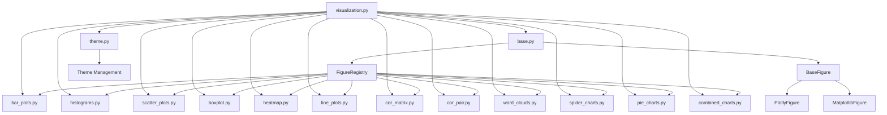

# PAMOLA.CORE Visualization System Documentation

## Overview

The PAMOLA.CORE Visualization System provides a unified interface for creating various types of data visualizations primarily using Plotly. This system is designed to support operations that analyze and profile data within the PAMOLA.CORE (Privacy-Preserving AI Data Processors) project, generating standardized PNG visualizations that help identify patterns, distributions, and relationships within the data.

The visualization system focuses on simplicity and consistency - operations pass in their data, specify an output path, and receive either the path to the saved PNG file or an error message. This streamlined workflow makes it easy to integrate visualizations into profiling and analysis pipelines without dealing with the complexity of visualization libraries directly.

## Pamola Core Philosophy

The visualization system is built around several key principles:

1. **Simplified API**: A clean interface focused on creating and saving PNG visualizations
2. **Consistent Workflow**: Every function accepts data, creates visualizations, saves to PNG, and returns the path
3. **Error Resilience**: Graceful handling of errors with clear error messages
4. **Plotly-First**: Primary focus on Plotly for high-quality visualizations
5. **Minimal Configuration**: Sensible defaults with optional customization when needed
6. **Path-Based Output**: Clear organization of visualization files by providing explicit output paths

This approach ensures that operations can easily generate visualizations without needing to understand the underlying visualization libraries.

## Architecture

The visualization system consists of a main API module (`visualization.py`) and a package of helper modules (`vis_helpers/`) that implement specific visualization types:



The system follows a consistent pattern:

- Operations call functions in the main API
- The API delegates to appropriate helpers for implementation
- Visualizations are saved as PNG files using the pamola core IO module
- The path to the saved file is returned for further use

## Dependencies

The visualization system relies on the following libraries:

### Pamola Core Dependencies

- `plotly`: Primary visualization library for creating visualizations
- `pandas`: For data handling and manipulation
- `numpy`: For numerical operations
- `pathlib` (Path): For handling file paths consistently
- `kaleido`: Required for exporting Plotly figures to PNG format

### Optional Dependencies

- `matplotlib`: Used as a fallback for some visualization types
- `wordcloud` and `PIL`: Required only if using word cloud visualizations

Note that all dependencies are handled internally by the visualization system, so operations using the API don't need to import these libraries directly.

## API Reference

### Basic Visualization Functions

#### `create_bar_plot`

Creates a bar plot visualization and saves it as PNG.

```python
def create_bar_plot(
    data: Union[Dict[str, Any], pd.Series],
    output_path: Union[str, Path],
    title: str,
    orientation: str = "v",
    x_label: Optional[str] = None,
    y_label: Optional[str] = None,
    sort_by: str = "value",
    max_items: int = 15,
    theme: Optional[str] = None,
    **kwargs
) -> str:
```

**Parameters:** See details in existing documentation.

**Example:**

```python
from pamola_core.utils.visualization import create_bar_plot

# Create a bar plot from a dictionary
categories = {"Category A": 42, "Category B": 18, "Category C": 34, "Category D": 55}
result = create_bar_plot(
    data=categories,
    output_path="output/categories.png",
    title="Sample Categories",
    x_label="Category",
    y_label="Count",
    orientation="v"
)
print(f"Visualization saved to: {result}")
```

#### `create_histogram`

Creates a histogram visualization and saves it as PNG.

```python
def create_histogram(
    data: Union[Dict[str, int], pd.Series, np.ndarray, List[float]],
    output_path: Union[str, Path],
    title: str,
    x_label: Optional[str] = None,
    y_label: Optional[str] = "Count",
    bins: int = 20,
    kde: bool = True,
    theme: Optional[str] = None,
    **kwargs
) -> str:
```

**Example:**

```python
from pamola_core.utils.visualization import create_histogram
import numpy as np

# Create a histogram with random data
data = np.random.normal(0, 1, 1000)  # 1000 points from standard normal distribution
result = create_histogram(
    data=data,
    output_path="output/normal_distribution.png",
    title="Normal Distribution",
    x_label="Value",
    y_label="Frequency",
    bins=30,
    kde=True
)
```

#### `create_scatter_plot`

Creates a scatter plot visualization and saves it as PNG.

```python
def create_scatter_plot(
    x_data: Union[List[float], np.ndarray, pd.Series],
    y_data: Union[List[float], np.ndarray, pd.Series],
    output_path: Union[str, Path],
    title: str,
    x_label: Optional[str] = None,
    y_label: Optional[str] = None,
    add_trendline: bool = False,
    correlation: Optional[float] = None,
    method: Optional[str] = None,
    theme: Optional[str] = None,
    **kwargs
) -> str:
```

#### `create_boxplot`

Creates a box plot visualization and saves it as PNG.

```python
def create_boxplot(
    data: Union[Dict[str, List[float]], pd.DataFrame, pd.Series],
    output_path: Union[str, Path],
    title: str,
    x_label: Optional[str] = "Category",
    y_label: Optional[str] = "Value",
    orientation: str = "v",
    show_points: bool = True,
    notched: bool = False,
    theme: Optional[str] = None,
    **kwargs
) -> str:
```

#### `create_heatmap`

Creates a heatmap visualization and saves it as PNG.

```python
def create_heatmap(
    data: Union[Dict[str, Dict[str, float]], pd.DataFrame, np.ndarray],
    output_path: Union[str, Path],
    title: str,
    x_label: Optional[str] = None,
    y_label: Optional[str] = None,
    colorscale: Optional[str] = None,
    annotate: bool = True,
    annotation_format: str = ".2f",
    theme: Optional[str] = None,
    **kwargs
) -> str:
```

#### `create_line_plot`

Creates a line plot visualization and saves it as PNG.

```python
def create_line_plot(
    data: Union[Dict[str, List[float]], pd.DataFrame, pd.Series],
    output_path: Union[str, Path],
    title: str,
    x_data: Optional[Union[List, np.ndarray, pd.Series]] = None,
    x_label: Optional[str] = None,
    y_label: Optional[str] = None,
    add_markers: bool = True,
    add_area: bool = False,
    smooth: bool = False,
    theme: Optional[str] = None,
    **kwargs
) -> str:
```

### New Visualization Types

#### `create_spider_chart`

Creates a spider/radar chart visualization and saves it as PNG.

```python
def create_spider_chart(
    data: Union[Dict[str, Dict[str, float]], pd.DataFrame],
    output_path: Union[str, Path],
    title: str,
    categories: Optional[List[str]] = None,
    normalize_values: bool = True,
    fill_area: bool = True,
    show_gridlines: bool = True,
    angle_start: float = 90,
    show_legend: bool = True,
    theme: Optional[str] = None,
    **kwargs
) -> str:
```

**Parameters:**

- `data`: Data to visualize. If dict, outer keys are series names, inner keys are categories. If DataFrame, columns are categories, index values are series names.
- `output_path`: Path where the PNG file should be saved
- `title`: Title for the plot
- `categories`: List of categories to include (if None, all categories in data will be used)
- `normalize_values`: Whether to normalize values to 0-1 range for each category
- `fill_area`: Whether to fill the area under the radar lines
- `show_gridlines`: Whether to show gridlines on the radar
- `angle_start`: Starting angle for the first axis in degrees (90 = top)
- `show_legend`: Whether to show the legend
- `theme`: Theme name to use for this visualization
- `**kwargs`: Additional arguments to pass to the underlying plotting function

**Returns:**

- Path to the saved PNG file or error message

**Example:**

```python
from pamola_core.utils.visualization import create_spider_chart

# Create a spider chart to compare multiple metrics across different categories
metrics = {
    "Product A": {"Quality": 8, "Price": 6, "Support": 9, "Features": 7},
    "Product B": {"Quality": 9, "Price": 4, "Support": 6, "Features": 9},
    "Product C": {"Quality": 7, "Price": 8, "Support": 7, "Features": 5}
}

result = create_spider_chart(
    data=metrics,
    output_path="output/product_comparison.png",
    title="Product Comparison",
    normalize_values=True,
    fill_area=True
)
print(f"Visualization saved to: {result}")
```

#### `create_pie_chart`

Creates a pie chart visualization and saves it as PNG.

```python
def create_pie_chart(
    data: Union[Dict[str, float], pd.Series, List[float]],
    output_path: Union[str, Path],
    title: str,
    labels: Optional[List[str]] = None,
    hole: float = 0,  # 0 for pie chart, >0 for donut
    show_values: bool = True,
    show_percentages: bool = True,
    sort_values: bool = False,
    pull_largest: bool = False,
    theme: Optional[str] = None,
    **kwargs
) -> str:
```

**Parameters:**

- `data`: Data to visualize. If dict or Series, keys are used as labels. If list, separate labels should be provided.
- `output_path`: Path where the PNG file should be saved
- `title`: Title for the plot
- `labels`: List of labels for pie slices (not needed if data is dict or Series)
- `hole`: Size of the hole for a donut chart (0-1, default 0 for a normal pie)
- `show_values`: Whether to show values on pie slices
- `show_percentages`: Whether to show percentages on pie slices
- `sort_values`: Whether to sort slices by value (descending)
- `pull_largest`: Whether to pull out the largest slice
- `theme`: Theme name to use for this visualization
- `**kwargs`: Additional arguments to pass to the underlying plotting function

**Returns:**

- Path to the saved PNG file or error message

**Example:**

```python
from pamola_core.utils.visualization import create_pie_chart

# Create a pie chart for market share data
market_share = {
    "Company A": 35,
    "Company B": 25,
    "Company C": 20,
    "Company D": 15,
    "Others": 5
}

result = create_pie_chart(
    data=market_share,
    output_path="output/market_share.png",
    title="Market Share Distribution",
    hole=0.3,  # Create a donut chart
    show_percentages=True
)
print(f"Visualization saved to: {result}")
```

#### `create_sunburst_chart`

Creates a sunburst chart visualization for hierarchical data and saves it as PNG.

```python
def create_sunburst_chart(
    data: Union[Dict, pd.DataFrame],
    output_path: Union[str, Path],
    title: str,
    path_column: Optional[str] = None,
    values_column: Optional[str] = None,
    color_column: Optional[str] = None,
    maxdepth: Optional[int] = None,
    theme: Optional[str] = None,
    **kwargs
) -> str:
```

**Parameters:**

- `data`: Data to visualize. If DataFrame, it needs columns for path, values, and optionally colors. If Dict, it should be hierarchical with nested dictionaries.
- `output_path`: Path where the PNG file should be saved
- `title`: Title for the plot
- `path_column`: For DataFrame data, the column containing hierarchical path
- `values_column`: For DataFrame data, the column containing values
- `color_column`: For DataFrame data, the column to use for coloring
- `maxdepth`: Maximum depth to display
- `theme`: Theme name to use for this visualization
- `**kwargs`: Additional arguments to pass to the underlying plotting function

**Returns:**

- Path to the saved PNG file or error message

**Example:**

```python
from pamola_core.utils.visualization import create_sunburst_chart

# Create a sunburst chart for hierarchical data
hierarchy = {
    "North America": {
        "USA": {
            "New York": 120,
            "California": 150,
            "Texas": 100
        },
        "Canada": {
            "Ontario": 80,
            "Quebec": 70
        }
    },
    "Europe": {
        "UK": 110,
        "Germany": 130,
        "France": 100
    },
    "Asia": {
        "China": 200,
        "Japan": 140,
        "India": 160
    }
}

result = create_sunburst_chart(
    data=hierarchy,
    output_path="output/sales_by_region.png",
    title="Sales by Region",
    maxdepth=2  # Limit display to 2 levels
)
print(f"Visualization saved to: {result}")
```

#### `create_combined_chart`

Creates a combined chart with dual Y-axes and saves it as PNG.

```python
def create_combined_chart(
    primary_data: Union[Dict[str, Any], pd.Series, pd.DataFrame],
    secondary_data: Union[Dict[str, Any], pd.Series, pd.DataFrame],
    output_path: Union[str, Path],
    title: str,
    primary_type: str = "bar",  # "bar", "line", "scatter", "area"
    secondary_type: str = "line",  # "line", "scatter", "area", "bar"
    x_data: Optional[Union[List, np.ndarray, pd.Series]] = None,
    x_label: Optional[str] = None,
    primary_y_label: Optional[str] = None,
    secondary_y_label: Optional[str] = None,
    primary_color: Optional[str] = None,
    secondary_color: Optional[str] = None,
    primary_on_right: bool = False,
    vertical_alignment: bool = True,
    theme: Optional[str] = None,
    **kwargs
) -> str:
```

**Parameters:**

- `primary_data`: Data for the primary Y-axis
- `secondary_data`: Data for the secondary Y-axis
- `output_path`: Path where the PNG file should be saved
- `title`: Title for the plot
- `primary_type`: Type of visualization for primary data: "bar", "line", "scatter", "area"
- `secondary_type`: Type of visualization for secondary data: "line", "scatter", "area", "bar"
- `x_data`: Data for the x-axis. If None, indices are used.
- `x_label`: Label for the x-axis
- `primary_y_label`: Label for the primary Y-axis
- `secondary_y_label`: Label for the secondary Y-axis
- `primary_color`: Color for the primary series
- `secondary_color`: Color for the secondary series
- `primary_on_right`: Whether to display primary Y-axis on the right side
- `vertical_alignment`: Whether to align zero values across both axes
- `theme`: Theme name to use for this visualization
- `**kwargs`: Additional arguments to pass to the underlying plotting function

**Returns:**

- Path to the saved PNG file or error message

**Example:**

```python
from pamola_core.utils.visualization import create_combined_chart

# Create a combined chart with sales (bars) and profit margin (line)
months = ["Jan", "Feb", "Mar", "Apr", "May", "Jun"]
sales = [120, 130, 145, 160, 170, 190]
profit_margin = [15.2, 16.8, 16.2, 17.5, 18.1, 19.2]

result = create_combined_chart(
    primary_data=sales,
    secondary_data=profit_margin,
    output_path="output/sales_and_margins.png",
    title="Sales and Profit Margins",
    primary_type="bar",
    secondary_type="line",
    x_data=months,
    x_label="Month",
    primary_y_label="Sales ($K)",
    secondary_y_label="Profit Margin (%)",
    primary_color="royalblue",
    secondary_color="crimson"
)
print(f"Visualization saved to: {result}")
```

## Usage Guidelines for Functional Modules

When integrating visualizations into functional modules, follow these guidelines:

### 1. Choose the Right Visualization Type

Select the appropriate visualization type based on the data you're analyzing:

|Data Type|Visualization Type|
|---|---|
|Categorical distributions|Bar plot, Pie chart|
|Numeric distributions|Histogram, Box plot|
|Time series|Line plot|
|Relationships between variables|Scatter plot, Correlation matrix|
|Multiple metrics comparison|Spider/Radar chart|
|Hierarchical data|Sunburst chart|
|Mixed metrics with different scales|Combined chart|

### 2. Proper Path Management

Use a consistent approach to output path management:

```python
from pathlib import Path

# Create base output directory
output_dir = Path("output/profiling/contacts")
output_dir.mkdir(parents=True, exist_ok=True)

# Generate visualization paths
domain_chart_path = output_dir / "email_domains.png"
completeness_path = output_dir / "completeness.png"
```

### 3. Error Handling

Always check for errors in the returned paths:

```python
result = create_bar_plot(data, output_path, "Title")
if result.startswith("Error"):
    # Handle the error
    logger.error(f"Visualization failed: {result}")
    # Consider providing fallback or alternative
else:
    # Use the successful result
    logger.info(f"Visualization created at: {result}")
    # Include in report, etc.
```

### 4. Basic Integration Pattern

Follow this pattern for integrating visualizations into functional modules:

```python
from pamola_core.utils.visualization import create_bar_plot, create_line_plot

def analyze_user_data(input_file, output_dir):
    """Analyze user data and generate reports with visualizations."""
    # Create output directory
    output_dir = Path(output_dir)
    output_dir.mkdir(parents=True, exist_ok=True)
    
    # Load and prepare data
    df = ...  # Load data
    
    # Generate visualizations
    visualizations = {}
    
    # Create distribution chart
    distribution_data = df['category'].value_counts().to_dict()
    distribution_path = output_dir / "category_distribution.png"
    visualizations['category_distribution'] = create_bar_plot(
        data=distribution_data,
        output_path=distribution_path,
        title="Category Distribution",
        orientation="h",
        sort_by="value"
    )
    
    # Create trend chart
    trend_data = df.groupby('date')['value'].mean()
    trend_path = output_dir / "value_trend.png"
    visualizations['value_trend'] = create_line_plot(
        data=trend_data,
        output_path=trend_path,
        title="Value Trend Over Time",
        x_label="Date",
        y_label="Average Value"
    )
    
    # Return results, including visualization paths
    return {
        'summary': {...},
        'visualizations': visualizations
    }
```

### 5. Performance Best Practices

- For large datasets, consider sampling or aggregating data before visualization
- Use the `max_items` parameter to limit the number of items shown in bar plots
- Set `show_points=False` for line plots with many data points
- Avoid creating many visualizations in tight loops

## Working with K-Anonymity Visualizations

For K-anonymity analysis, the new visualization types are particularly useful:

### Range Distribution Chart (Bar Chart)

```python
from pamola_core.utils.visualization import create_bar_plot

# K ranges distribution for different quasi-identifier combinations
k_ranges = {
    "k=1": {"KA_ar_p": 25, "KA_sar_p": 22, "KA_ed_sar_p": 28, "KA_ed_sar_pme": 30},
    "k=2-4": {"KA_ar_p": 15, "KA_sar_p": 18, "KA_ed_sar_p": 20, "KA_ed_sar_pme": 22},
    "k=5-9": {"KA_ar_p": 12, "KA_sar_p": 14, "KA_ed_sar_p": 15, "KA_ed_sar_pme": 14},
    "k=10-19": {"KA_ar_p": 10, "KA_sar_p": 11, "KA_ed_sar_p": 12, "KA_ed_sar_pme": 10},
    "k=20-49": {"KA_ar_p": 8, "KA_sar_p": 7, "KA_ed_sar_p": 9, "KA_ed_sar_pme": 7},
    "k=50-99": {"KA_ar_p": 5, "KA_sar_p": 4, "KA_ed_sar_p": 6, "KA_ed_sar_pme": 5},
    "k=100+": {"KA_ar_p": 2, "KA_sar_p": 3, "KA_ed_sar_p": 4, "KA_ed_sar_pme": 3}
}

# Convert to appropriate format (DataFrame is easiest for grouped bars)
df = pd.DataFrame(k_ranges)

# Create the visualization
result = create_bar_plot(
    data=df,
    output_path="output/k_range_distribution.png",
    title="K-Anonymity Range Distribution",
    orientation="h",
    y_label="K Range",
    x_label="Percentage of Records"
)
```

### Threshold Visualization (Line Chart)

```python
from pamola_core.utils.visualization import create_line_plot

# K threshold data for different quasi-identifier combinations
thresholds = {
    "k≥2": {"KA_ar_p": 80, "KA_sar_p": 70, "KA_ed_sar_p": 60, "KA_ed_sar_pme": 45},
    "k≥5": {"KA_ar_p": 65, "KA_sar_p": 55, "KA_ed_sar_p": 42, "KA_ed_sar_pme": 32},
    "k≥10": {"KA_ar_p": 52, "KA_sar_p": 42, "KA_ed_sar_p": 30, "KA_ed_sar_pme": 20},
    "k≥20": {"KA_ar_p": 42, "KA_sar_p": 35, "KA_ed_sar_p": 22, "KA_ed_sar_pme": 15}
}

# Convert to DataFrame
df = pd.DataFrame(thresholds)

# Create the visualization
result = create_line_plot(
    data=df.T,  # Transpose for better format
    output_path="output/k_threshold_compliance.png",
    title="Records Meeting K-Anonymity Thresholds",
    x_label="K Threshold",
    y_label="Percentage of Records",
    add_markers=True
)
```

### Multi-Metric Comparison (Spider Chart)

```python
from pamola_core.utils.visualization import create_spider_chart

# Multiple metrics for different quasi-identifier combinations
metrics = {
    "KA_ar_p": {"Unique Records (%)": 20, "Vulnerable Records (k<5) (%)": 35, 
                "Normalized Average K": 0.8, "Entropy": 0.7},
    "KA_sar_p": {"Unique Records (%)": 30, "Vulnerable Records (k<5) (%)": 45, 
                 "Normalized Average K": 0.6, "Entropy": 0.5},
    "KA_ed_sar_p": {"Unique Records (%)": 40, "Vulnerable Records (k<5) (%)": 58, 
                    "Normalized Average K": 0.4, "Entropy": 0.45},
    "KA_ed_sar_pme": {"Unique Records (%)": 50, "Vulnerable Records (k<5) (%)": 68, 
                      "Normalized Average K": 0.3, "Entropy": 0.35}
}

# Create the spider chart
result = create_spider_chart(
    data=metrics,
    output_path="output/ka_metrics_comparison.png",
    title="K-Anonymity Metrics Comparison",
    normalize_values=False,  # Values are already normalized
    fill_area=True
)
```

### Quasi-Identifier Analysis (Combined Chart)

```python
from pamola_core.utils.visualization import create_combined_chart

# Data for unique values and uniqueness percentage
fields = ["education_level", "salary_range", "area_name", "post", "metro_station_name"]
unique_counts = [10, 45, 520, 420, 305]
uniqueness_percent = [0.5, 1.2, 5.5, 4.2, 22.5]

# Create the combined chart
result = create_combined_chart(
    primary_data=dict(zip(fields, unique_counts)),
    secondary_data=dict(zip(fields, uniqueness_percent)),
    output_path="output/quasi_identifier_analysis.png",
    title="Quasi-Identifier Analysis",
    primary_type="bar",
    secondary_type="line",
    x_label="Field",
    primary_y_label="Unique Values Count",
    secondary_y_label="Uniqueness (%)",
    primary_color="steelblue",
    secondary_color="crimson"
)
```

## Conclusion

The extended PAMOLA.CORE visualization system now provides a comprehensive set of visualization tools that cover all common data analysis needs. With the addition of spider charts, pie/donut charts, sunburst charts, and combined charts, the system can handle more complex visualization requirements while maintaining a consistent and simple API.

By following the usage guidelines and best practices outlined in this documentation, functional modules can easily integrate these visualizations into their workflows, resulting in more informative and useful outputs.