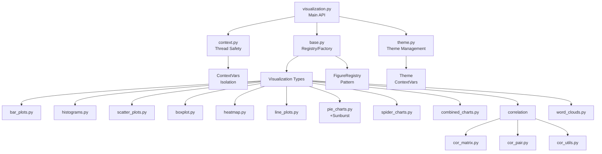

# PAMOLA Visualization System Documentation

**Version: 2.1.0**  
**Last Updated: January 2025**  
**Status: Production Ready**

## Table of Contents

1. [Overview](#overview)
2. [Architecture](#architecture)
3. [Key Features](#key-features)
4. [Installation & Dependencies](#installation--dependencies)
5. [Thread Safety & Concurrency](#thread-safety--concurrency)
6. [API Reference](#api-reference)
7. [Backend Support Matrix](#backend-support-matrix)
8. [Theme Management](#theme-management)
9. [Error Handling & Strict Mode](#error-handling--strict-mode)
10. [Usage Guidelines](#usage-guidelines)
11. [Advanced Features](#advanced-features)
12. [Performance Considerations](#performance-considerations)
13. [Troubleshooting](#troubleshooting)
14. [Examples](#examples)

## Overview

The PAMOLA Visualization System provides a unified, thread-safe interface for creating data visualizations with a focus on privacy-preserving analytics and concurrent execution. The system generates high-quality PNG visualizations suitable for reports, dashboards, and analytical workflows.

### Core Design Principles

- **Thread-Safe by Design**: All operations are isolated using Python's `contextvars`
- **Unified API**: Consistent interface across all visualization types
- **Graceful Error Handling**: Production-ready with comprehensive error management
- **Extensible Architecture**: Easy to add new visualization types
- **Multi-Backend Support**: Plotly (primary) and Matplotlib (secondary)
- **Theme Isolation**: Each visualization can have its own theme without affecting others

## Architecture



### Component Responsibilities

- **visualization.py**: Public API functions
- **context.py**: Thread-safe context management
- **base.py**: Abstract classes and factory pattern
- **theme.py**: Theme definitions and application
- **vis_helpers/**: Individual visualization implementations

## Key Features

### 1. Thread Safety & Context Isolation

All visualization operations are completely thread-safe:

```python
# Safe for concurrent execution
from concurrent.futures import ThreadPoolExecutor
from pamola_core.utils.visualization import create_histogram

def generate_plot(idx):
    return create_histogram(
        data=np.random.normal(0, 1, 1000),
        output_path=f"output/hist_{idx}.png",
        title=f"Histogram {idx}",
        theme="dark" if idx % 2 else "default",
        backend="plotly"  # Each call can use different backend
    )

# Generate 10 plots concurrently with different themes/backends
with ThreadPoolExecutor(max_workers=4) as executor:
    results = list(executor.map(generate_plot, range(10)))
```

### 2. Automatic Resource Management

The system automatically manages figure cleanup to prevent memory leaks:

```python
from pamola_core.utils.vis_helpers.context import visualization_context

# Resources are automatically cleaned up after use
with visualization_context(theme="dark", auto_close=True):
    # Create multiple visualizations
    # All figures are closed when exiting context
```

### 3. Graceful Degradation

Empty or invalid data produces informative placeholder visualizations:

```python
# Empty data doesn't crash - creates placeholder with message
result = create_bar_plot(
    data={},  # Empty data
    output_path="empty_chart.png",
    title="Sales Data"
)
# Returns: Path to PNG with "No data available" message
```

## Installation & Dependencies

### Required Dependencies

```bash
pip install plotly>=5.0.0
pip install pandas>=1.3.0
pip install numpy>=1.20.0
pip install kaleido>=0.2.0  # For PNG export
```

### Optional Dependencies

```bash
pip install matplotlib>=3.4.0  # For matplotlib backend
pip install wordcloud>=1.8.0  # For word clouds
pip install pillow>=8.0.0     # For image processing
```

### Verification

```python
from pamola_core.utils.visualization import create_bar_plot

# Test installation
result = create_bar_plot(
    {"A": 10, "B": 20}, 
    "test.png", 
    "Test Chart"
)
print(f"Success: {result}")
```

## Thread Safety & Concurrency

### How It Works

The visualization system uses Python's `contextvars` to isolate state:

1. **Backend Isolation**: Each visualization call has its own backend setting
2. **Theme Isolation**: Theme changes don't affect other concurrent operations
3. **Resource Isolation**: Figures are tracked per-context for proper cleanup
4. **No Global State**: All settings are context-local

### Safe Usage Patterns

```python
# Pattern 1: Parallel generation with different settings
import asyncio
from pamola_core.utils.visualization import create_line_plot

async def async_plot(idx):
    return create_line_plot(
        data=[1, 2, 3, 4, 5],
        output_path=f"async_{idx}.png",
        title=f"Async Plot {idx}",
        theme="dark" if idx % 2 else "default"
    )

# Safe for async/await
results = await asyncio.gather(*[async_plot(i) for i in range(5)])

# Pattern 2: Thread pool with isolated contexts
from joblib import Parallel, delayed

results = Parallel(n_jobs=4)(
    delayed(create_scatter_plot)(
        x_data=np.random.randn(100),
        y_data=np.random.randn(100),
        output_path=f"scatter_{i}.png",
        title=f"Scatter {i}"
    ) for i in range(10)
)
```

## API Reference

### Common Parameters

All visualization functions share these parameters:

| Parameter | Type | Default | Description |
|-----------|------|---------|-------------|
| `output_path` | `str` or `Path` | Required | Where to save the PNG file |
| `title` | `str` | Required | Chart title |
| `theme` | `str` | `None` | Theme name (uses current if None) |
| `backend` | `str` | `None` | Backend to use (uses current if None) |
| `strict` | `bool` | `False` | Raise exceptions vs. log warnings |
| `**kwargs` | `dict` | `{}` | Backend-specific parameters |

### Visualization Functions

#### `create_bar_plot`

Creates vertical or horizontal bar charts.

```python
def create_bar_plot(
    data: Union[Dict[str, Any], pd.Series],
    output_path: Union[str, Path],
    title: str,
    orientation: str = "v",  # "v" or "h"
    x_label: Optional[str] = None,
    y_label: Optional[str] = None,
    sort_by: str = "value",  # "value" or "key"
    max_items: int = 15,
    show_values: bool = True,
    text: Optional[Union[List[str], pd.Series]] = None,
    colorscale: Optional[str] = None,
    color: Optional[Any] = None,
    figsize: Optional[Any] = None,
    theme: Optional[str] = None,
    backend: Optional[str] = None,
    strict: bool = False,
    **kwargs
) -> str:
```

#### `create_histogram`

Creates distribution visualizations with optional KDE.

```python
def create_histogram(
    data: Union[Dict[str, int], pd.Series, np.ndarray, List[float]],
    output_path: Union[str, Path],
    title: str,
    x_label: Optional[str] = None,
    y_label: Optional[str] = "Count",
    bins: int = 20,
    kde: bool = True,
    theme: Optional[str] = None,
    backend: Optional[str] = None,
    strict: bool = False,
    **kwargs
) -> str:
```

#### `create_scatter_plot`

Creates scatter plots with optional trendlines.

```python
def create_scatter_plot(
    x_data: Union[List[float], np.ndarray, pd.Series],
    y_data: Union[List[float], np.ndarray, pd.Series],
    output_path: Union[str, Path],
    title: str,
    x_label: Optional[str] = None,
    y_label: Optional[str] = None,
    add_trendline: bool = False,
    correlation: Optional[float] = None,
    method: Optional[str] = None,
    hover_text: Optional[List[str]] = None,
    marker_size: Optional[Union[List[float], float]] = None,
    color_scale: Optional[Union[List[str], str]] = None,
    color_values: Optional[List[float]] = None,
    theme: Optional[str] = None,
    backend: Optional[str] = None,
    strict: bool = False,
    **kwargs
) -> str:
```

#### `create_pie_chart`

Creates pie or donut charts.

```python
def create_pie_chart(
    data: Union[Dict[str, float], pd.Series, List[float]],
    output_path: Union[str, Path],
    title: str,
    labels: Optional[List[str]] = None,
    hole: float = 0,  # 0=pie, 0.3=donut
    show_values: bool = True,
    value_format: str = ".1f",
    show_percentages: bool = True,
    sort_values: bool = False,
    pull_largest: bool = False,
    pull_value: float = 0.1,
    clockwise: bool = True,
    start_angle: float = 90,
    textposition: str = "auto",  # "inside", "outside", "auto"
    theme: Optional[str] = None,
    backend: Optional[str] = None,
    strict: bool = False,
    **kwargs
) -> str:
```

#### `create_sunburst_chart`

Creates hierarchical sunburst visualizations.

```python
def create_sunburst_chart(
    data: Union[Dict, pd.DataFrame],
    output_path: Union[str, Path],
    title: str,
    path_column: Optional[str] = None,
    values_column: Optional[str] = None,
    color_column: Optional[str] = None,
    branchvalues: str = "total",  # "total" or "remainder"
    maxdepth: Optional[int] = None,
    sort_siblings: bool = False,
    theme: Optional[str] = None,
    backend: Optional[str] = None,
    strict: bool = False,
    **kwargs
) -> str:
```

## Backend Support Matrix

| Visualization Type | Plotly | Matplotlib | Notes |
|-------------------|--------|------------|-------|
| Bar Chart | ✅ | ✅ | Full support |
| Histogram | ✅ | ✅ | Full support |
| Box Plot | ✅ | ✅ | Full support |
| Heatmap | ✅ | ✅ | Full support |
| Line Plot | ✅ | ❌ | Matplotlib planned |
| Scatter Plot | ✅ | ❌ | Matplotlib planned |
| Pie/Donut Chart | ✅ | ❌ | Plotly only |
| Sunburst Chart | ✅ | ❌ | Plotly only |
| Spider/Radar Chart | ✅ | ❌ | Plotly only |
| Combined Chart | ✅ | ❌ | Plotly only |
| Correlation Matrix | ✅ | ❌ | Plotly only |
| Correlation Pair | ✅ | ❌ | Plotly only |
| Word Cloud | 🔧 | 🔧 | Special backend |

Legend: ✅ Supported | ❌ Not Supported | 🔧 Custom Implementation

## Theme Management

### Built-in Themes

| Theme | Description | Best For |
|-------|-------------|----------|
| `default` | Light background, blue palette | General use |
| `dark` | Dark background, viridis colors | Dashboards |
| `pastel` | Soft colors, light background | Reports |
| `professional` | Conservative colors | Business docs |

### Using Themes

```python
# Method 1: Per-visualization
create_bar_plot(data, "output.png", "Title", theme="dark")

# Method 2: Context manager
from pamola_core.utils.vis_helpers.context import visualization_context

with visualization_context(theme="professional"):
    # All visualizations use professional theme
    create_bar_plot(...)
    create_line_plot(...)
```

### Creating Custom Themes

```python
from pamola_core.utils.vis_helpers.theme import create_custom_theme

create_custom_theme(
    name="corporate",
    config={
        "colors": ["#003366", "#006699", "#0099CC"],
        "colorscale": "Blues",
        "background_color": "#FFFFFF",
        "text_color": "#333333",
        "font_family": "Arial, sans-serif",
        "font_size": 12,
        "title_font_size": 16
    }
)

# Use custom theme
create_bar_plot(data, "output.png", "Title", theme="corporate")
```

## Error Handling & Strict Mode

### Strict Mode Behavior

| Condition | `strict=False` (default) | `strict=True` |
|-----------|-------------------------|---------------|
| Invalid backend | Log warning, use default | Raise `ValueError` |
| Missing theme | Log warning, use default | Raise `ValueError` |
| Invalid data | Return error message | Raise exception |
| File write error | Return error message | Raise `IOError` |

### Best Practices

```python
# Production: Use strict=False for robustness
results = []
for data in datasets:
    result = create_histogram(
        data, f"hist_{i}.png", f"Dataset {i}",
        strict=False  # Continue on errors
    )
    results.append(result)

# Development/Testing: Use strict=True for debugging
try:
    result = create_histogram(
        data, "test.png", "Test",
        strict=True  # Fail fast on errors
    )
except Exception as e:
    print(f"Visualization failed: {e}")
```

## Usage Guidelines

### 1. Choosing Visualization Types

| Data Type | Recommended Visualization |
|-----------|--------------------------|
| Categorical counts | Bar chart, Pie chart |
| Distributions | Histogram, Box plot |
| Relationships | Scatter plot, Line plot |
| Correlations | Correlation matrix/pair |
| Time series | Line plot |
| Hierarchical | Sunburst chart |
| Multi-dimensional comparison | Spider/Radar chart |
| Text frequency | Word cloud |

### 2. Performance Optimization

```python
# For large datasets, sample before visualization
if len(data) > 10000:
    data_sample = data.sample(n=5000)
    create_scatter_plot(
        data_sample['x'], data_sample['y'],
        "sampled_scatter.png", "Large Dataset Sample"
    )

# Use max_items for bar charts
create_bar_plot(
    large_categories,
    "top_categories.png",
    "Top 20 Categories",
    max_items=20  # Show only top 20
)
```

### 3. Batch Processing

```python
from pathlib import Path

def batch_visualize(datasets, output_dir):
    """Generate visualizations for multiple datasets."""
    output_dir = Path(output_dir)
    output_dir.mkdir(exist_ok=True)
    
    results = {}
    for name, data in datasets.items():
        # Generate appropriate visualization based on data type
        if isinstance(data, dict):
            path = create_bar_plot(
                data, 
                output_dir / f"{name}_bar.png",
                f"{name} Distribution"
            )
        elif isinstance(data, pd.DataFrame):
            path = create_heatmap(
                data.corr(),
                output_dir / f"{name}_corr.png",
                f"{name} Correlations"
            )
        results[name] = path
    
    return results
```

## Advanced Features

### 1. Dynamic Backend Selection

```python
def create_visualization_with_fallback(data, output_path, title):
    """Try Plotly first, fall back to Matplotlib if needed."""
    for backend in ["plotly", "matplotlib"]:
        try:
            return create_bar_plot(
                data, output_path, title,
                backend=backend,
                strict=True
            )
        except Exception as e:
            logger.warning(f"{backend} failed: {e}")
    
    return "Error: No backend available"
```

### 2. Custom Context Management

```python
from pamola_core.utils.vis_helpers.context import visualization_context

# Create a custom context with specific settings
@contextmanager
def report_context():
    """Context for generating report visualizations."""
    with visualization_context(
        theme="professional",
        backend="plotly",
        auto_close=True,
        headless=True
    ):
        yield

# Use custom context
with report_context():
    # All visualizations use report settings
    create_bar_plot(...)
    create_line_plot(...)
```

### 3. Extending the System

```python
from pamola_core.utils.vis_helpers.base import PlotlyFigure, FigureRegistry

class PlotlySankeyDiagram(PlotlyFigure):
    """Custom Sankey diagram implementation."""
    
    def create(self, source, target, value, **kwargs):
        import plotly.graph_objects as go
        
        fig = go.Figure(data=[go.Sankey(
            node=dict(label=kwargs.get('labels', [])),
            link=dict(source=source, target=target, value=value)
        )])
        
        fig.update_layout(title=kwargs.get('title', 'Sankey Diagram'))
        return fig

# Register new visualization type
FigureRegistry.register("sankey", "plotly", PlotlySankeyDiagram)
```

## Performance Considerations

### Memory Management

- Figures are automatically closed after saving
- Use context managers for batch operations
- Set `auto_close=True` in visualization context

### Optimization Tips

1. **Limit Data Points**: 
   - Scatter plots: Max 10,000 points
   - Line plots: Max 5,000 points per series
   - Histograms: Use appropriate bin counts

2. **Disable Interactive Features for Large Datasets**:
   ```python
   create_scatter_plot(
       x_data, y_data, "output.png", "Large Dataset",
       hover_text=None,  # Disable hover for performance
       **{"hovermode": False}
   )
   ```

3. **Use Appropriate File Sizes**:
   ```python
   # Smaller files for web
   create_bar_plot(data, "web_chart.png", "Web Chart", 
                   width=600, height=400)
   
   # Larger for print
   create_bar_plot(data, "print_chart.png", "Print Chart",
                   width=1200, height=800)
   ```

## Troubleshooting

### Common Issues

| Issue | Solution |
|-------|----------|
| "No module named 'kaleido'" | Install kaleido: `pip install kaleido` |
| Empty visualization | Check data isn't empty/all zeros |
| Black squares in PNG | Update kaleido: `pip install -U kaleido` |
| Memory leaks | Ensure using context managers |
| Concurrent execution errors | Update to latest version with contextvars |

### Debug Mode

```python
import logging

# Enable debug logging
logging.basicConfig(level=logging.DEBUG)

# Now visualization calls will show detailed logs
create_bar_plot(data, "debug.png", "Debug Test")
```

## Examples

### Example 1: Complete Analysis Pipeline

```python
from pamola_core.utils.visualization import *
import pandas as pd
import numpy as np

def analyze_dataset(df: pd.DataFrame, output_dir: str):
    """Complete visual analysis of a dataset."""
    Path(output_dir).mkdir(exist_ok=True)
    
    # 1. Distribution of numeric columns
    for col in df.select_dtypes(include=[np.number]):
        create_histogram(
            df[col],
            f"{output_dir}/{col}_dist.png",
            f"Distribution of {col}",
            bins=30,
            kde=True
        )
    
    # 2. Category counts
    for col in df.select_dtypes(include=['object']):
        counts = df[col].value_counts().to_dict()
        create_bar_plot(
            counts,
            f"{output_dir}/{col}_counts.png",
            f"Count of {col}",
            orientation="h",
            max_items=20
        )
    
    # 3. Correlation matrix
    numeric_df = df.select_dtypes(include=[np.number])
    if len(numeric_df.columns) > 1:
        create_correlation_matrix(
            numeric_df.corr(),
            f"{output_dir}/correlations.png",
            "Feature Correlations",
            annotate=True
        )
    
    # 4. Time series if date column exists
    if 'date' in df.columns:
        daily_avg = df.groupby('date')['value'].mean()
        create_line_plot(
            daily_avg,
            f"{output_dir}/time_series.png",
            "Daily Average Values",
            x_label="Date",
            y_label="Average Value"
        )
```

### Example 2: K-Anonymity Visualization

```python
def visualize_k_anonymity_results(k_results: dict, output_dir: str):
    """Visualize K-anonymity analysis results."""
    
    # 1. K-value distribution
    create_histogram(
        k_results['k_values'],
        f"{output_dir}/k_distribution.png",
        "K-Anonymity Value Distribution",
        x_label="K Value",
        bins=50,
        kde=False
    )
    
    # 2. Risk levels by quasi-identifier combination
    risk_data = {
        "Low Risk (k≥10)": k_results['low_risk_count'],
        "Medium Risk (5≤k<10)": k_results['medium_risk_count'],
        "High Risk (2≤k<5)": k_results['high_risk_count'],
        "Critical Risk (k=1)": k_results['critical_risk_count']
    }
    
    create_pie_chart(
        risk_data,
        f"{output_dir}/risk_distribution.png",
        "Privacy Risk Distribution",
        hole=0.3,  # Donut chart
        pull_largest=True
    )
    
    # 3. Comparison across QI combinations
    create_spider_chart(
        k_results['qi_metrics'],
        f"{output_dir}/qi_comparison.png",
        "Quasi-Identifier Combination Analysis",
        normalize_values=True
    )
```

### Example 3: Parallel Report Generation

```python
from concurrent.futures import ProcessPoolExecutor
import multiprocessing as mp

def generate_report_section(args):
    """Generate one section of a report."""
    section_name, data, output_dir = args
    
    try:
        # Each process has isolated context
        with visualization_context(theme="professional"):
            if section_name == "overview":
                return create_bar_plot(
                    data, f"{output_dir}/overview.png", 
                    "System Overview"
                )
            elif section_name == "trends":
                return create_line_plot(
                    data, f"{output_dir}/trends.png",
                    "Monthly Trends"
                )
            # ... more sections
    except Exception as e:
        return f"Error in {section_name}: {e}"

# Generate report sections in parallel
sections = [
    ("overview", overview_data, "output/report"),
    ("trends", trend_data, "output/report"),
    ("distribution", dist_data, "output/report"),
]

with ProcessPoolExecutor(max_workers=mp.cpu_count()) as executor:
    results = list(executor.map(generate_report_section, sections))
```

## Version History

- **2.1.0** (Current): Added sunburst charts, improved thread safety documentation
- **2.0.0**: Major refactoring for thread safety using contextvars
- **1.5.0**: Added spider, combined, and correlation visualizations
- **1.0.0**: Initial release with basic chart types

## Support & Contributing

For issues, feature requests, or contributions:
1. Check existing issues in the PAMOLA repository
2. Follow the PAMOLA contribution guidelines
3. Ensure all new visualizations include tests
4. Update documentation for any API changes

---

*This documentation is designed for both human developers and AI assistants. It provides comprehensive information about the PAMOLA Visualization System's capabilities, usage patterns, and best practices.*