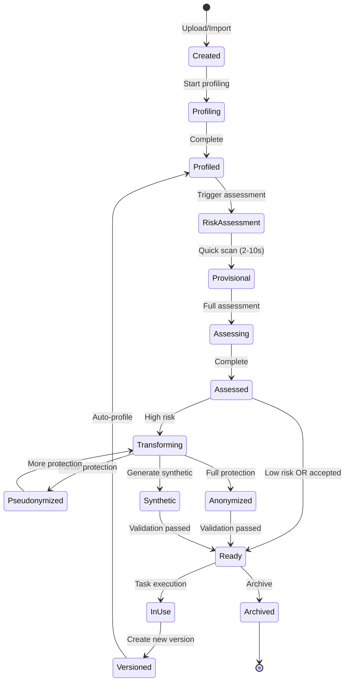

# PAMOLA Dataset Entity Specification v2.0

## Executive Summary

This specification defines the Dataset entity for PAMOLA - a privacy-first data management platform. The Dataset represents both immutable data snapshots and evolving metadata, supporting privacy-preserving transformations through a sophisticated versioning system.

### Key Design Principles

1. **Dual-Layer Architecture**: Separation of logical Dataset (container) from DatasetVersion (immutable snapshots)
2. **Privacy-First**: Every dataset is treated as potentially sensitive with continuous risk assessment
3. **Progressive Assessment**: Two-tier risk evaluation (provisional → assessed) for optimal UX
4. **Governance-Ready**: Built-in compliance tracking for GDPR, HIPAA, CCPA
5. **Pipeline-Integrated**: Seamless integration with PAMOLA's transformation workflows

---

## 1. Core Architecture

### 1.1 Entity Relationship

```
Dataset (Logical Container)
    ├── Metadata (mutable, lightweight)
    ├── Governance (policies, compliance)
    └── DatasetVersions[] (immutable snapshots)
         ├── v1.0.0 (initial upload)
         ├── v1.1.0 (after profiling)
         ├── v2.0.0 (after anonymization)
         └── v2.1.0 (after noise addition)
```

### 1.2 Separation of Concerns

|Entity|Purpose|Mutability|Lifecycle|
|---|---|---|---|
|**Dataset**|Logical container, identity, governance|Mutable metadata|Long-lived|
|**DatasetVersion**|Data snapshot, transformations, metrics|Immutable|Append-only|
|**DatasetMetadata**|Cached computations, assessments|Mutable, versioned|TTL-based|

---

## 2. Dataset Entity (Logical Container)

### 2.1 Identity & Core Attributes

|Attribute|Type|Description|Required|UI Location|
|---|---|---|---|---|
|`dataset_id`|UUID|Permanent unique identifier|Yes|All views (hidden)|
|`name`|string(255)|Human-readable name|Yes|List, Overview|
|`description`|text|Detailed description|No|Overview|
|`created_at`|timestamp|First version creation time|Yes|Overview|
|`created_by`|user_id|Original creator|Yes|Overview|
|`owner`|user_id|Current owner/steward|Yes|Overview, Governance|
|`team`|team_id|Owning team|No|Overview|
|`active_version_id`|UUID|Current working version|Yes|System|
|`recommended_version_id`|UUID|Suggested safe version|No|Overview|
|`archived`|boolean|Soft delete flag|Yes|System|
|`workspace_id`|UUID|Parent workspace|Yes|System|

### 2.2 Classification & Discovery

|Attribute|Type|Description|Required|UI Location|
|---|---|---|---|---|
|`modality`|enum|Data type: `tabular`, `text`, `image`, `audio`, `video`, `document`, `mixed`, `embeddings`|Yes|List, Overview|
|`domain`|enum|Business domain: `healthcare`, `finance`, `retail`, `telecom`, `government`, `other`|Yes|Overview, Filters|
|`language[]`|ISO-639|Content languages (e.g., `en`, `fr`, `de`)|No|Overview, Filters|
|`tags[]`|string[]|Free-form tags for discovery|No|Overview, Search|
|`collections[]`|UUID[]|User-defined collections/folders|No|Navigation|
|`glossary_terms[]`|string[]|Business glossary references|No|Governance|

### 2.3 Governance & Compliance

| Attribute              | Type   | Description                                                                                                   | Required | UI Location       |
| ---------------------- | ------ | ------------------------------------------------------------------------------------------------------------- | -------- | ----------------- |
| `privacy_level`        | enum   | Access classification: `public`, `internal`, `confidential`, `highly_confidential`                            | Yes      | Overview, Privacy |
| `license`              | string | Usage license (e.g., `CC-BY`, `Proprietary`, `Restricted`)                                                    | Yes      | Governance        |
| `legal_basis`          | enum   | GDPR basis: `consent`, `contract`, `legitimate_interest`, `legal_obligation`, `vital_interest`, `public_task` | Yes*     | Governance        |
| `retention_period`     | enum   | Data retention: `30d`, `90d`, `1y`, `3y`, `7y`, `permanent`                                                   | Yes      | Governance        |
| `data_subject_type[]`  | enum[] | Subject categories: `employees`, `customers`, `patients`, `students`, `citizens`                              | Yes*     | Governance        |
| `processing_purpose`   | text   | Why data is processed (GDPR requirement)                                                                      | Yes*     | Governance        |
| `data_origin`          | enum   | Source type: `collected`, `purchased`, `generated`, `derived`                                                 | Yes      | Governance        |
| `consent_reference`    | string | Link to consent documentation                                                                                 | No*      | Governance        |
| `data_collection_date` | date   | When data was originally collected                                                                            | No       | Governance        |

*Required for GDPR compliance

### 2.4 Access Control

|Attribute|Type|Description|Required|UI Location|
|---|---|---|---|---|
|`access_policy`|object|Who can access and why|Yes|Governance|
|└─ `permissions[]`|array|List of permission grants|Yes|Governance|
|└─ `restricted_until`|date|Embargo date if applicable|No|Governance|
|└─ `require_approval`|boolean|Manual approval needed|Yes|Governance|
|`sharing_constraints`|object|External sharing rules|No|Governance|
|└─ `allow_external`|boolean|Can be shared outside org|Yes|Governance|
|└─ `allowed_countries[]`|ISO-3166|Geographic restrictions|No|Governance|
|└─ `prohibited_uses[]`|string[]|Explicitly forbidden uses|No|Governance|

---

## 3. DatasetVersion Entity (Immutable Snapshots)

### 3.1 Version Identity

|Attribute|Type|Description|Required|UI Location|
|---|---|---|---|---|
|`version_id`|UUID|Unique version identifier|Yes|Versions|
|`dataset_id`|UUID|Parent dataset reference|Yes|System|
|`version_number`|semver|Semantic version (e.g., `2.1.0`)|Yes|Overview, Versions|
|`created_at`|timestamp|Version creation time|Yes|Versions|
|`created_by`|user_id|Version creator|Yes|Versions|
|`parent_version_id`|UUID|Previous version reference|No|Lineage|
|`fingerprint`|SHA256|Content hash for integrity|Yes|Technical|
|`immutable`|boolean|Always true for versions|Yes|System|

### 3.2 Storage & Content

|Attribute|Type|Description|Required|UI Location|
|---|---|---|---|---|
|`storage_manifest`|object|Physical storage details|Yes|Technical|
|└─ `format`|enum|`CSV`, `Parquet`, `JSON`, `Arrow`, `Delta`, `Mixed`|Yes|Overview|
|└─ `compression`|enum|`none`, `gzip`, `snappy`, `zstd`|Yes|Technical|
|└─ `partitions[]`|array|List of file parts/chunks|Yes|Technical|
|└─ `total_size_bytes`|long|Total uncompressed size|Yes|Overview|
|└─ `row_count`|long|Number of records|Yes*|Overview|
|└─ `column_count`|integer|Number of fields|Yes*|Overview|
|`schema`|object|Data structure definition|Yes*|Schema|
|└─ `fields[]`|array|Field definitions|Yes*|Schema|
|`sample_uri`|URI|Safe sample for preview|No|Actions|
|`preview_policy`|object|How to safely sample|Yes|System|

*For tabular data

### 3.3 Transformation Lineage

|Attribute|Type|Description|Required|UI Location|
|---|---|---|---|---|
|`change_type`|enum|`initial`, `schema`, `content`, `privacy_methods`, `quality_fix`, `synthesis`|Yes|Lineage|
|`transformation_chain[]`|array|Complete transformation history|Yes|Lineage|
|└─ `task_id`|UUID|Task that created version|Yes|Lineage|
|└─ `pipeline_id`|UUID|Pipeline execution reference|No|Lineage|
|└─ `operations[]`|array|Applied operations with params|Yes|Lineage|
|`diff_summary`|object|Changes from parent version|No|Versions|
|└─ `rows_added`|integer|New records|No|Versions|
|└─ `rows_removed`|integer|Deleted records|No|Versions|
|└─ `fields_changed[]`|array|Modified fields|No|Versions|
|`code_reference`|object|Reproducibility info|No|Technical|
|└─ `git_commit`|string|Code version|No|Technical|
|└─ `container_digest`|string|Docker image hash|No|Technical|
|└─ `notebook_uri`|URI|Jupyter notebook link|No|Technical|

### 3.4 Privacy & Risk Assessment

| Attribute              | Type         | Description                                       | Required | UI Location      |
| ---------------------- | ------------ | ------------------------------------------------- | -------- | ---------------- |
| `privacy_state`        | enum         | `raw`, `pseudonymized`, `anonymized`, `synthetic` | Yes      | List, Overview   |
| `risk_assessment`      | object       | Privacy risk evaluation                           | Yes      | Privacy          |
| └─ `status`            | enum         | `not_assessed`, `provisional`, `assessed`         | Yes      | Privacy          |
| └─ `overall_score`     | float(0-100) | Combined risk percentage                          | Yes      | List, Privacy    |
| └─ `provisional_score` | float(0-100) | Quick estimate (2-10 sec)                         | No       | List             |
| └─ `assessed_at`       | timestamp    | Full assessment time                              | No       | Privacy          |
| └─ `components`        | object       | Detailed risk breakdown                           | No       | Privacy          |
| └─ `methods_applied[]` | array        | Privacy methods with parameters                   | Yes      | Privacy, Lineage |

#### 3.4.1 Provisional Risk Assessment (Fast, <10 seconds)

```python
# Computed on sample + regex detection
provisional_risk = {
    "direct_identifiers_detected": ["email", "phone", "ssn"],
    "quasi_identifiers_detected": ["age", "zip", "gender"],
    "sensitive_patterns_detected": ["credit_card", "medical_terms"],
    "uniqueness_estimate": 0.15,  # % of likely unique records
    "coverage_direct": 0.20,      # % fields with direct IDs
    "coverage_quasi": 0.35,       # % fields with quasi IDs
    "provisional_score": 65,      # Weighted combination
    "confidence": "medium"        # low/medium/high
}
```

#### 3.4.2 Full Risk Assessment (Complete, async)

```python
assessed_risk = {
    "reidentification_risk": 0.15,
    "attribute_disclosure_risk": 0.08,
    "membership_inference_risk": 0.12,
    "k_anonymity": {
        "k": 5,
        "quasi_identifiers": ["age", "zip", "gender"],
        "equivalence_classes": 234,
        "smallest_class": 5,
        "records_at_risk": 45
    },
    "l_diversity": {
        "l": 3,
        "sensitive_attributes": ["diagnosis"],
        "entropy": 2.4
    },
    "t_closeness": {
        "t": 0.2,
        "distance_metric": "EMD"
    },
    "differential_privacy": {
        "epsilon": 1.0,
        "delta": 1e-5,
        "mechanism": "laplace",
        "sensitivity": 1.0,
        "budget_remaining": 0.3
    }
}
```

### 3.5 Data Quality & Profiling

|Attribute|Type|Description|Required|UI Location|
|---|---|---|---|---|
|`profiling_state`|enum|`not_profiled`, `in_progress`, `complete`, `outdated`|Yes|Overview|
|`profiling_results`|object|Comprehensive profiling data|No|Analysis|
|└─ `completeness`|float(0-1)|Non-null ratio|No|Overview|
|└─ `validity`|float(0-1)|Valid values ratio|No|Analysis|
|└─ `consistency`|float(0-1)|Internal consistency|No|Analysis|
|└─ `uniqueness`|float(0-1)|Distinct values ratio|No|Analysis|
|└─ `timeliness`|object|Data freshness metrics|No|Analysis|
|`data_quality_score`|float(0-100)|Overall quality metric|No|Overview|
|`quality_issues[]`|array|Detected problems|No|Analysis|

### 3.6 Field-Level Metadata

|Attribute|Type|Description|Required|UI Location|
|---|---|---|---|---|
|`field_metadata[]`|array|Per-field characteristics|Yes*|Schema|
|└─ `field_name`|string|Column identifier|Yes|Schema|
|└─ `data_type`|enum|`integer`, `float`, `string`, `date`, `boolean`, `binary`|Yes|Schema|
|└─ `semantic_type`|enum|`email`, `phone`, `ssn`, `credit_card`, `address`, `name`, `id`|No|Schema|
|└─ `privacy_category`|enum|`direct_identifier`, `quasi_identifier`, `sensitive`, `non_sensitive`|Yes|Schema, Privacy|
|└─ `nullable`|boolean|Can contain nulls|Yes|Schema|
|└─ `cardinality`|integer|Unique values count|No|Schema|
|└─ `null_ratio`|float|Percentage of nulls|No|Schema|
|└─ `patterns[]`|array|Detected patterns/formats|No|Schema|
|└─ `statistics`|object|Min/max/mean/median/std|No|Analysis|
|└─ `privacy_methods[]`|array|Applied transformations|No|Privacy|

*For tabular data

### 3.7 Utility Metrics

|Attribute|Type|Description|Required|UI Location|
|---|---|---|---|---|
|`utility_assessment`|object|Data usefulness metrics|No|Overview, Analysis|
|└─ `overall_score`|float(0-100)|Combined utility|No|List, Overview|
|└─ `computed_at`|timestamp|Calculation time|No|Analysis|
|└─ `ttl_hours`|integer|Cache duration|No|System|
|└─ `compute_cost`|enum|`low`, `medium`, `high`|No|System|
|`statistical_utility`|object|Statistical preservation|No|Analysis|
|└─ `correlation_preserved`|float(0-1)|Correlation similarity|No|Analysis|
|└─ `distribution_similarity`|float(0-1)|KS-test result|No|Analysis|
|└─ `aggregation_accuracy`|float(0-1)|Query accuracy|No|Analysis|
|`ml_utility`|object|ML performance metrics|No|Analysis|
|└─ `baseline_performance`|float|Original model score|No|Analysis|
|└─ `preserved_performance`|float|After transformation|No|Analysis|
|└─ `degradation`|float|Performance loss|No|Analysis|

### 3.8 Multimodal Support

|Attribute|Type|Description|Required|UI Location|
|---|---|---|---|---|
|`modality_stats`|object|Type-specific statistics|No|Overview|

#### For Images

```json
{
  "image_stats": {
    "count": 10000,
    "format_distribution": {"jpeg": 0.7, "png": 0.3},
    "dimension_stats": {
      "width": {"min": 224, "max": 4096, "mean": 1024},
      "height": {"min": 224, "max": 4096, "mean": 768}
    },
    "color_mode": {"rgb": 0.9, "grayscale": 0.1},
    "has_exif": 0.3,
    "detected_faces": 0.15,
    "nsfw_score": {"safe": 0.95, "questionable": 0.04, "explicit": 0.01}
  }
}
```

#### For Text/Documents

```json
{
  "text_stats": {
    "document_count": 5000,
    "total_tokens": 2500000,
    "avg_document_length": 500,
    "language_distribution": {"en": 0.8, "fr": 0.15, "de": 0.05},
    "detected_pii": {
      "emails": 342,
      "phones": 128,
      "ssn": 0,
      "medical_terms": 1250
    },
    "readability_scores": {...}
  }
}
```

---

## 4. Dataset Metadata (Mutable Cache Layer)

### 4.1 Purpose

Expensive computations (risk assessments, quality metrics, utility scores) are cached with TTL to avoid recomputation.

|Attribute|Type|Description|Required|UI Location|
|---|---|---|---|---|
|`metadata_id`|UUID|Unique identifier|Yes|System|
|`dataset_id`|UUID|Parent dataset|Yes|System|
|`version_id`|UUID|Associated version|Yes|System|
|`metric_type`|enum|`risk`, `quality`, `utility`, `profile`|Yes|System|
|`value`|object|Cached computation result|Yes|Various|
|`computed_at`|timestamp|Calculation time|Yes|Various|
|`expires_at`|timestamp|Cache expiration|Yes|System|
|`compute_cost`|enum|`low`, `medium`, `high`, `very_high`|Yes|System|
|`outdated`|boolean|Needs recomputation|Yes|System|
|`triggered_by`|string|What caused computation|No|Audit|

---

## 5. Operational Attributes

### 5.1 Pipeline Integration

|Attribute|Type|Description|Required|UI Location|
|---|---|---|---|---|
|`dataset_type`|enum|`source`, `intermediate`, `output`, `reference`|Yes|Overview|
|`ephemeral`|boolean|Auto-cleanup eligible|Yes|System|
|`auto_cleanup_after`|duration|When to delete if ephemeral|No|System|
|`materialized`|boolean|Physically stored vs. view|Yes|Technical|
|`compatible_operations[]`|array|Applicable PAMOLA operations|Yes|Actions|
|`required_preprocessing[]`|array|Must-do operations|No|Actions|
|`blocking_issues[]`|array|What prevents usage|No|Status|
|`recommended_actions[]`|array|Suggested next steps|No|Actions|

### 5.2 Processor Compatibility

```json
{
  "processor_compatibility": {
    "pamola.core.anonymization.generalization": {
      "compatible": true,
      "applicable_fields": ["age", "zip_code", "income"],
      "recommended_params": {
        "age_bins": 5,
        "zip_digits": 3
      },
      "estimated_impact": {
        "risk_reduction": 0.45,
        "utility_loss": 0.12,
        "processing_time": "2m"
      }
    },
    "pamola.core.anonymization.differential_privacy": {
      "compatible": true,
      "applicable_fields": ["*"],
      "recommended_params": {
        "epsilon": 1.0,
        "mechanism": "laplace"
      },
      "estimated_impact": {
        "risk_reduction": 0.70,
        "utility_loss": 0.25,
        "processing_time": "5m"
      }
    }
  }
}
```

---

## 6. Usage & Tracking

|Attribute|Type|Description|Required|UI Location|
|---|---|---|---|---|
|`usage_stats`|object|Access and usage metrics|Yes|Usage|
|└─ `view_count`|integer|Number of views|Yes|Usage|
|└─ `download_count`|integer|Number of downloads|Yes|Usage|
|└─ `task_usage_count`|integer|Used in N tasks|Yes|List, Usage|
|└─ `last_accessed`|timestamp|Most recent access|Yes|Usage|
|`active_tasks[]`|array|Currently running tasks|Yes|Usage|
|└─ `task_id`|UUID|Task identifier|Yes|Usage|
|└─ `task_name`|string|Task name|Yes|Usage|
|└─ `started_at`|timestamp|Execution start|Yes|Usage|
|`projects[]`|array|Projects using dataset|Yes|Usage|
|└─ `project_id`|UUID|Project identifier|Yes|Usage|
|└─ `project_name`|string|Project name|Yes|Usage|
|└─ `role`|enum|`source`, `intermediate`, `output`|Yes|Usage|
|`derived_datasets[]`|array|Child datasets|No|Lineage|
|`access_log[]`|array|Audit trail (last 100)|Yes|Audit|

---

## 7. Validation Rules

### 7.1 Export Safety

```javascript
{
  "rule": "export_safety",
  "conditions": [
    {
      "if": "privacy_state == 'raw' && risk_assessment.status == 'assessed' && risk_assessment.overall_score > 30",
      "then": "BLOCK",
      "message": "Cannot export high-risk raw data. Apply privacy methods first."
    },
    {
      "if": "privacy_state == 'raw' && risk_assessment.status == 'provisional' && risk_assessment.provisional_score > 50",
      "then": "WARN + APPROVAL",
      "message": "High provisional risk detected. Owner approval required for export."
    }
  ]
}
```

### 7.2 Pipeline Readiness

```javascript
{
  "rule": "pipeline_ready",
  "conditions": [
    {
      "if": "profiling_state != 'complete'",
      "then": "WARN",
      "message": "Dataset should be profiled before transformation"
    },
    {
      "if": "blocking_issues.length > 0",
      "then": "BLOCK",
      "message": "Resolve blocking issues before processing"
    }
  ]
}
```

### 7.3 Schema Changes

```javascript
{
  "rule": "schema_change_invalidation",
  "trigger": "schema modification",
  "actions": [
    "SET profiling_state = 'outdated'",
    "SET risk_assessment.status = 'provisional'",
    "NOTIFY dependent_tasks"
  ]
}
```

### 7.4 Privacy Budget

```javascript
{
  "rule": "dp_budget_enforcement",
  "conditions": [
    {
      "if": "differential_privacy.budget_remaining <= 0",
      "then": "BLOCK",
      "message": "Differential privacy budget exhausted"
    }
  ]
}
```

---

## 8. State Machine



---

## 9. UI Display Mapping

### 9.1 List View (Card Display)

```
┌─────────────────────────────────────────────────────────────────┐
│ [📊] customer_transactions.csv              [👁️] [✏️] [📥] [🗑️] │
│                                                                 │
│ Format: CSV • 45 cols × 50,000 rows • 12.5 MB                  │
│ Modified: 2 hours ago • Used in: 3 tasks                       │
│                                                                 │
│ Privacy: 🟢 Anonymized  Risk: [██░░░] 28%  Utility: 87%        │
└─────────────────────────────────────────────────────────────────┘
```

**Displayed Attributes:**

- `name`, `format`, `row_count`, `column_count`, `size_bytes`
- `modified_at` (from latest version)
- `privacy_state` (badge + color)
- `risk_assessment.overall_score` (bar + percentage)
- `utility_assessment.overall_score` (percentage)
- `usage_stats.task_usage_count`

### 9.2 Overview Tab

**Sections:**

1. **Identity**: Name, description, owner, team, created, modified
2. **Classification**: Modality, domain, language, tags
3. **Quick Stats**: Format, size, rows, columns, versions
4. **Privacy Summary**: State, risk (provisional/assessed), compliance badges
5. **Quick Actions**: Based on state and permissions

### 9.3 Schema Tab

**For Tabular Data:**

- Field table with: name, type, privacy_category, nullable, cardinality, null_ratio
- Bulk operations: Set privacy categories, mark sensitive
- Import/Export schema (JSON)

**For Unstructured Data:**

- Feature dictionary
- Detected entities
- Media properties

### 9.4 Privacy Tab

**Sections:**

1. **Access Control**: Privacy level, who can access
2. **Governance**: Legal basis, retention, purpose, subject types
3. **Risk Assessment**: Provisional vs. assessed, breakdown, timeline
4. **Methods Applied**: List with parameters and impact
5. **Recommendations**: Next steps to reduce risk

### 9.5 Lineage Tab

**Displays:**

- Version tree/timeline
- Parent → child relationships
- Transformation chain
- Methods applied at each step
- Link to tasks/pipelines

### 9.6 Usage Tab

**Shows:**

- Projects and tasks using dataset
- Access statistics and trends
- Recent access log
- Active operations

---

## 10. Actions & Operations

### 10.1 Context-Sensitive Actions

|State|Primary Action|Secondary Actions|
|---|---|---|
|`raw` + `not_profiled`|Start Profiling|Upload Schema, Delete|
|`raw` + `profiled`|Assess Privacy Risk|Start Anonymization, Export Sample|
|`raw` + `high_risk`|Start Anonymization Project|Apply Quick Fixes, Request Approval|
|`anonymized` + `ready`|Use in Pipeline|Export, Create Version|
|`any` + `outdated`|Re-assess|Update Metadata|

### 10.2 Action Permissions

```python
def can_perform_action(user, dataset, action):
    return (
        has_permission(user, dataset, action) and
        meets_state_requirements(dataset, action) and
        passes_validation_rules(dataset, action)
    )
```

---

## 11. API Endpoints

### 11.1 Core Dataset Operations

```yaml
# Dataset CRUD
GET    /api/v1/datasets                 # List with filters
POST   /api/v1/datasets                 # Create new dataset
GET    /api/v1/datasets/{id}            # Get dataset details
PATCH  /api/v1/datasets/{id}            # Update metadata
DELETE /api/v1/datasets/{id}            # Archive dataset

# Versions
GET    /api/v1/datasets/{id}/versions   # List versions
POST   /api/v1/datasets/{id}/versions   # Create new version
GET    /api/v1/datasets/{id}/versions/{vid} # Get version details

# Operations
POST   /api/v1/datasets/{id}/profile    # Start profiling
POST   /api/v1/datasets/{id}/assess     # Assess privacy risk
POST   /api/v1/datasets/{id}/preview    # Get safe sample
GET    /api/v1/datasets/{id}/schema     # Get schema
PATCH  /api/v1/datasets/{id}/schema     # Update schema

# Governance
GET    /api/v1/datasets/{id}/privacy    # Privacy report
PATCH  /api/v1/datasets/{id}/governance # Update governance
POST   /api/v1/datasets/{id}/export-passport # Generate data card
```

### 11.2 Query Parameters

```http
GET /api/v1/datasets?
    modality=tabular&
    privacy_state=anonymized&
    risk_score_max=30&
    has_assessment=true&
    owner=user123&
    tags=customer,pii&
    sort=-modified_at&
    page=1&
    limit=50
```

---

## 12. Performance Considerations

### 12.1 Caching Strategy

|Metric|Compute Time|TTL|Invalidation Trigger|
|---|---|---|---|
|Provisional Risk|2-10 sec|24h|Schema change|
|Full Risk Assessment|1-10 min|7d|Version change|
|Data Quality Score|30 sec - 5 min|24h|Content change|
|Utility Metrics|5-30 min|7d|Transformation|
|Profiling Results|1-60 min|∞|Never (immutable)|

### 12.2 Async Operations

All expensive operations run asynchronously:

- Profiling
- Risk assessment (full)
- Utility calculation
- Quality assessment
- Synthetic generation

### 12.3 Storage Optimization

- Metadata stored in fast KV store (Redis)
- Lineage in graph database (Neo4j)
- Metrics in time-series DB (InfluxDB)
- Content in object storage (S3/MinIO)

---

## 13. Security Considerations

### 13.1 Access Control

```python
# Fine-grained permissions
permissions = {
    "view": ["owner", "team", "read_access"],
    "edit": ["owner", "team.admin"],
    "delete": ["owner"],
    "export_raw": ["owner", "compliance_officer"],
    "approve_export": ["data_protection_officer"]
}
```

### 13.2 Audit Requirements

Every operation logged with:

- Who (user_id, role)
- What (action, parameters)
- When (timestamp)
- Why (justification for sensitive operations)
- Result (success/failure, changes)

### 13.3 Encryption

- Data at rest: AES-256
- Data in transit: TLS 1.3
- Sensitive metadata: Field-level encryption
- Export approval: Digital signatures

---

## 14. Migration Path

### 14.1 From v1 (Simple Model) to v2 (This Spec)

```sql
-- Migration script concept
ALTER TABLE datasets ADD COLUMN privacy_level VARCHAR(20);
ALTER TABLE datasets ADD COLUMN legal_basis VARCHAR(50);

CREATE TABLE dataset_versions (
    version_id UUID PRIMARY KEY,
    dataset_id UUID REFERENCES datasets(id),
    version_number VARCHAR(20),
    fingerprint VARCHAR(64),
    -- ... other fields
);

-- Migrate existing data to versions
INSERT INTO dataset_versions 
SELECT generate_uuid(), id, '1.0.0', fingerprint, ...
FROM datasets;
```

---

## 15. Future Extensions (Post-MVP)

### Phase 2 (v1.1)

- Advanced multimodal support (image, audio, video)
- Labeling integration (annotation schemas, IAA metrics)
- Advanced cataloging (collections, recommendations)

### Phase 3 (v2.0)

- Federated Learning support (contracts, budgets)
- Streaming data support
- Real-time risk monitoring
- AI-powered privacy recommendations

### Phase 4 (v3.0)

- Homomorphic encryption integration
- Secure multi-party computation
- Blockchain audit trail
- Cross-cloud federation

---

## Appendix A: Risk Score Calculation

### Provisional Risk (Fast, <10 seconds)

```python
def calculate_provisional_risk(dataset_sample):
    # Pattern detection on 10% sample
    direct_coverage = count_fields_with_pattern(DIRECT_ID_PATTERNS) / total_fields
    quasi_coverage = count_fields_with_pattern(QUASI_ID_PATTERNS) / total_fields
    uniqueness = estimate_unique_records(sample) / sample_size
    
    # Weighted formula (tunable)
    risk = (
        0.50 * sigmoid(direct_coverage, midpoint=0.2) +
        0.30 * sigmoid(quasi_coverage, midpoint=0.4) +
        0.20 * sigmoid(uniqueness, midpoint=0.1)
    ) * 100
    
    return {
        "score": risk,
        "confidence": get_confidence_level(sample_size),
        "components": {
            "direct_coverage": direct_coverage,
            "quasi_coverage": quasi_coverage,
            "uniqueness": uniqueness
        }
    }
```

### Full Risk Assessment (Complete, async)

```python
def calculate_full_risk(dataset):
    # Complete scan with formal privacy models
    k_anon = calculate_k_anonymity(dataset)
    l_div = calculate_l_diversity(dataset)
    
    # Attack simulations
    reidentification_risk = simulate_linkage_attack(dataset)
    attribute_risk = simulate_attribute_inference(dataset)
    membership_risk = simulate_membership_inference(dataset)
    
    # Weighted combination
    risk = (
        0.40 * (1 / k_anon.k if k_anon.k > 0 else 1.0) +
        0.30 * attribute_risk +
        0.20 * membership_risk +
        0.10 * (1 - l_div.entropy / max_entropy)
    ) * 100
    
    return {
        "score": risk,
        "status": "assessed",
        "k_anonymity": k_anon,
        "l_diversity": l_div,
        "attack_risks": {
            "reidentification": reidentification_risk,
            "attribute_disclosure": attribute_risk,
            "membership_inference": membership_risk
        }
    }
```

---

## Appendix B: Privacy State Determination

```python
def determine_privacy_state(dataset_version):
    """
    Automatically determine privacy state based on methods applied
    """
    methods = dataset_version.methods_applied
    
    if not methods:
        return "raw"
    
    if has_synthetic_generation(methods):
        return "synthetic"
    
    if has_strong_anonymization(methods):
        # k-anonymity >= 5, l-diversity >= 3, or DP with ε < 1
        return "anonymized"
    
    if has_pseudonymization(methods):
        # Hashing, tokenization, partial masking
        return "pseudonymized"
    
    return "raw"
```

---

## Appendix C: Compliance Check Matrix

| Regulation  | Required Fields                                                      | Validation Rules                         |
| ----------- | -------------------------------------------------------------------- | ---------------------------------------- |
| **GDPR**    | legal_basis, retention_period, processing_purpose, data_subject_type | Must have consent for sensitive data     |
| **HIPAA**   | data_subject_type=patients, encryption_at_rest                       | PHI must be anonymized or have BAA       |
| **CCPA**    | data_origin, consent_reference                                       | California residents need opt-out option |
| **PCI-DSS** | Contains credit cards                                                | Must be tokenized or encrypted           |

---

## Summary

This specification provides a comprehensive, production-ready definition of the Dataset entity for PAMOLA. Key improvements from v1:

1. **Proper versioning** with Dataset/DatasetVersion separation
2. **Two-tier risk assessment** for better UX
3. **Clear governance model** with compliance tracking
4. **Separation of privacy state and access level**
5. **Cache layer** for expensive computations
6. **Multimodal support** foundation
7. **Complete validation framework**
8. **API-first design** with clear endpoints

The model balances **immediate usability** (provisional assessments, smart defaults) with **enterprise requirements** (full audit trail, compliance, governance) while maintaining **PAMOLA's privacy-first philosophy**.
