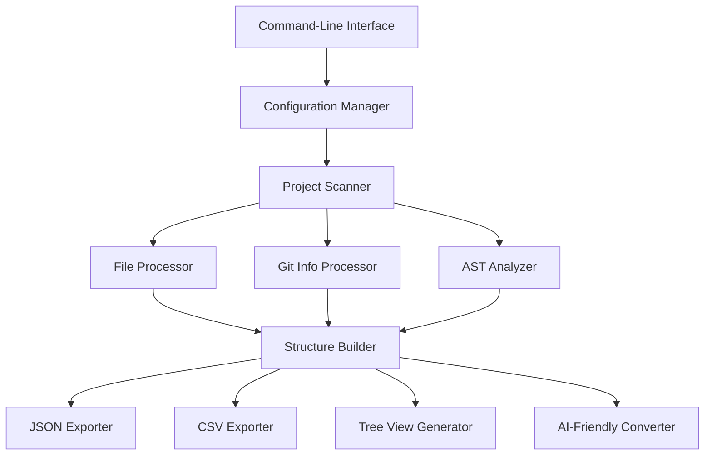
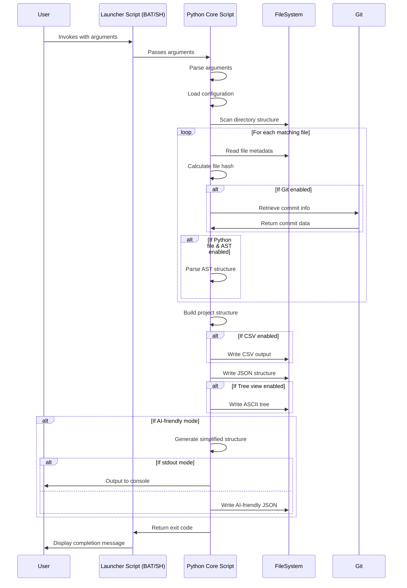
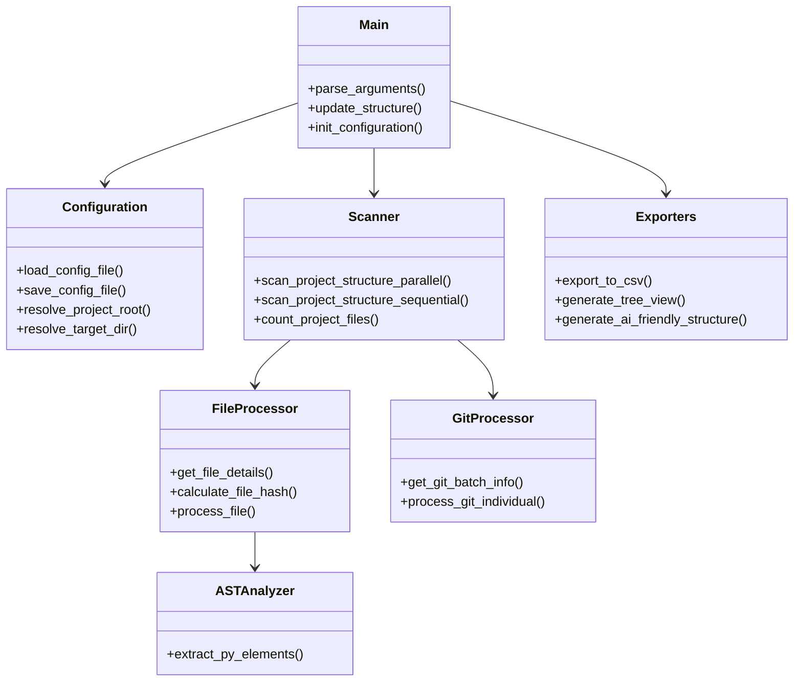

# Project Structure Analyzer

## 1. Purpose

The Project Structure Analyzer is a comprehensive tool designed to scan, analyze, and document the structure of software projects. It provides developers, architects, and documentation specialists with detailed insights into project organization, file metadata, code components, and Git history. This tool is particularly valuable for:

- Getting up to speed on unfamiliar codebases
- Generating documentation for complex projects
- Preparing input for AI-based code analysis
- Tracking project evolution and structure changes
- Sharing project architecture information with team members
- Creating standardized code structure reports

The analyzer can output in multiple formats (JSON, CSV, tree view) and can be fine-tuned to focus on specific aspects of the project, making it adaptable to various development workflows and documentation needs.

## 2. Key Features

The Project Structure Analyzer offers a rich set of features:

### Pamola Core Capabilities
- **Comprehensive Structure Analysis**: Scans and maps the entire project directory structure
- **Detailed Metadata Collection**: Gathers file size, line count, hash, modification dates
- **Git Integration**: Retrieves commit history, authors, and messages
- **Python AST Analysis**: Extracts functions, classes, and imports from Python files
- **Multiple Output Formats**: Generates JSON, CSV, and ASCII tree visualization
- **Target Directory Specification**: Allows focusing on specific project subdirectories
- **Cross-Platform Compatibility**: Works on Windows, Linux, macOS, and WSL

### Performance Features
- **Parallel Processing**: Uses multi-processing/threading for improved performance
- **Git Commit Caching**: Optimizes Git operations by caching results
- **Batch Processing**: Efficiently handles Git operations in batches
- **Configurable Performance Settings**: Allows fine-tuning of batch sizes and worker counts

### AI-Friendly Features
- **Simplified Output Mode**: Generates AI-consumable project structure data
- **Configurable Content Inclusion**: Selectively includes imports, classes, functions
- **File Count Limiting**: Controls the volume of output for large projects
- **Path Simplification**: Makes paths more readable and manageable
- **Direct Stdout Output**: Supports piping to other tools or AI systems

### Configuration and Usability
- **External Configuration Files**: Supports persistent configuration settings
- **Multiple Configuration Locations**: Flexible configuration hierarchy
- **Auto-Detection of Project Root**: Intelligently identifies project boundaries
- **Progress Visualization**: Provides feedback during long-running operations
- **Verbosity Levels**: Adjustable output detail for different use cases

## 3. Architecture

The Project Structure Analyzer follows a modular architecture with clearly defined components and data flow.

### Component Overview



### Data Flow



### Module Structure



## 4. Command-Line Arguments and Output

### Key Command-Line Arguments

| Argument | Short | Description |
|----------|-------|-------------|
| `--root` | `-r` | Path to project root |
| `--target` | `-t` | Target directory to analyze (relative to root) |
| `--output` | `-o` | Output directory for reports |
| `--config` | `-c` | Path to configuration file |
| `--simple` | `-s` | Simple mode - structure only |
| `--no-ast` | | Disable AST analysis for Python files |
| `--no-git` | | Disable Git integration |
| `--no-csv` | | Disable CSV export |
| `--parallel` | `-p` | Enable parallel processing |
| `--workers` | `-w` | Number of worker processes/threads |
| `--tree` | | Generate a tree-style visualization |
| `--ai-friendly` | `-ai` | Generate AI-friendly output |
| `--stdout` | | Output directly to stdout |
| `--save-config` | | Save current configuration to file |

### AI-Friendly Specific Options

| Argument | Description |
|----------|-------------|
| `--ai-no-imports` | Exclude imports from AI-friendly output |
| `--ai-no-classes` | Exclude class definitions from AI-friendly output |
| `--ai-no-functions` | Exclude function definitions from AI-friendly output |
| `--ai-max-files` | Maximum number of files to include in AI-friendly output |
| `--ai-include-stats` | Include file stats in AI-friendly output |

### Output Files

The analyzer generates several output files in the specified output directory (default: `logs/`):

| File | Description |
|------|-------------|
| `structure.json` | Complete project structure with all metadata |
| `structure.csv` | Flattened file listing with metadata in CSV format |
| `structure_ai.json` | Simplified structure optimized for AI consumption |
| `structure_tree.txt` | ASCII tree visualization of the project structure |

### JSON Structure Format

The main structure.json output follows this format:

```json
{
  "name": "ProjectName",
  "author": "",
  "description": "",
  "copyright": "",
  "meta": {
    "generation_timestamp": "2025-04-10T12:34:56",
    "total_files_scanned": 150,
    "project_root_path": "/path/to/project",
    "git_repo": true,
    "current_branch": "main",
    "latest_commit": {
      "hash": "a1b2c3...",
      "author": "Developer Name",
      "date": "2025-04-09T10:30:00",
      "message": "Latest commit message"
    }
  },
  "structure": {
    "src": {
      "main.py": {
        "description": "",
        "details": {
          "size_bytes": 1024,
          "line_count": 50,
          "last_modified": "2025-04-08T15:20:30",
          "file_hash": "d4e5f6...",
          "git_info": {
            "date": "2025-04-07T09:15:00",
            "author": "Developer Name",
            "commit_hash": "b2c3d4...",
            "message": "Commit message for this file"
          },
          "functions": ["main", "process_data"],
          "classes": ["DataProcessor"],
          "imports": ["os", "sys", "json"]
        }
      }
    }
  }
}
```

### AI-Friendly Format

The AI-friendly output is a simplified version designed for easier consumption by AI systems:

```json
{
  "name": "ProjectName",
  "description": "",
  "meta": {
    "generation_timestamp": "2025-04-10T12:34:56",
    "total_files_scanned": 150
  },
  "structure": {
    "src/main.py": {
      "functions": ["main", "process_data"],
      "classes": ["DataProcessor"],
      "imports": ["os", "sys", "json"]
    }
  }
}
```

## 5. Usage Examples

### Basic Project Analysis

Analyze the entire project with default settings:

```bash
# Windows
structure.bat

# Unix/Linux/macOS
./structure.sh
```

### Analyze Specific Subdirectory

Focus the analysis on a particular part of the project:

```bash
# Windows
structure.bat --target src/components

# Unix/Linux/macOS
./structure.sh --target src/components
```

### Generate Tree Visualization

Create an ASCII tree view of the project structure:

```bash
# Windows
structure.bat --tree

# Unix/Linux/macOS
./structure.sh --tree
```

### AI-Friendly Output for LLM Analysis

Generate a simplified structure suitable for AI consumption:

```bash
# Windows
structure.bat --ai-friendly

# Unix/Linux/macOS
./structure.sh --ai-friendly
```

### Performance Optimization for Large Projects

Optimize performance for analyzing large codebases:

```bash
# Windows
structure.bat --parallel --workers 8 --batch-size 100

# Unix/Linux/macOS
./structure.sh --parallel --workers 8 --batch-size 100
```

### Simple Structure Only

Get just the structure without detailed metadata:

```bash
# Windows
structure.bat --simple

# Unix/Linux/macOS
./structure.sh --simple
```

### Custom Configuration File

Use a custom configuration:

```bash
# Windows
structure.bat --config my_config.json

# Unix/Linux/macOS
./structure.sh --config my_config.json
```

### Pipeline to AI Tool

Pipe the output directly to another tool or AI system:

```bash
# Windows
structure.bat --ai-friendly --stdout | ai-tool

# Unix/Linux/macOS
./structure.sh --ai-friendly --stdout | ai-tool
```

## 6. Deployment in a New Project

To integrate the Project Structure Analyzer into a new project, follow these steps:

### Basic Deployment

1. **Create Script Directories:**
   ```bash
   mkdir -p scripts/tools
   ```

2. **Copy Core Files:**
   - Place `project_structure.py` in the `scripts/tools/` directory
   - Place `structure.bat` and `structure.sh` in the project root

3. **Set Execution Permissions** (Unix/Linux/macOS):
   ```bash
   chmod +x structure.sh
   chmod +x scripts/tools/project_structure.py
   ```

4. **Create Output Directory:**
   ```bash
   mkdir -p logs
   ```

### Configuration Setup

1. **Create Configuration Directory:**
   ```bash
   mkdir -p configs
   ```

2. **Generate Default Configuration:**
   ```bash
   # Windows
   structure.bat --save-config
   
   # Unix/Linux/macOS
   ./structure.sh --save-config
   ```

3. **Customize Configuration:**
   Edit the generated `configs/structure_config.json` file to adjust settings for your project.

### Integration with Development Workflow

#### Git Integration

1. **Add to project .gitignore:**
   ```
   # Project Structure Analyzer outputs
   /logs/structure*.json
   /logs/structure*.csv
   /logs/structure_tree.txt
   ```

2. **Commit the tools and configuration:**
   ```bash
   git add scripts/tools/project_structure.py
   git add structure.bat structure.sh
   git add configs/structure_config.json
   git commit -m "Add Project Structure Analyzer"
   ```

#### CI/CD Integration

To include structure analysis in your CI/CD pipeline:

**GitHub Actions Example:**
```yaml
jobs:
  analyze-structure:
    runs-on: ubuntu-latest
    steps:
      - uses: actions/checkout@v3
        with:
          fetch-depth: 0  # For Git history
          
      - name: Set up Python
        uses: actions/setup-python@v4
        with:
          python-version: '3.10'
          
      - name: Run structure analyzer
        run: |
          chmod +x ./structure.sh
          ./structure.sh --ai-friendly
          
      - name: Upload structure report
        uses: actions/upload-artifact@v3
        with:
          name: project-structure
          path: logs/structure_ai.json
```

#### Documentation Integration

To include the project structure in your documentation:

1. **Generate initial structure:**
   ```bash
   ./structure.sh --tree
   ```

2. **Add to documentation:**
   ```bash
   # Generate README section
   echo "## Project Structure" >> README.md
   echo "\`\`\`" >> README.md
   cat logs/structure_tree.txt >> README.md
   echo "\`\`\`" >> README.md
   ```

### Optional Dependencies

For full functionality, install optional Python dependencies:

```bash
pip install gitpython tqdm
```

These packages enhance Git integration and provide progress visualization but are not required for pamola core functionality.

### Troubleshooting Deployment

- If Git integration fails, check that the project is a valid Git repository with `git status`
- If parallel processing causes issues, try disabling it with `--no-parallel`
- For permission issues on Unix systems, ensure all scripts have execute permissions
- If configuration loading fails, verify the path to the configuration file