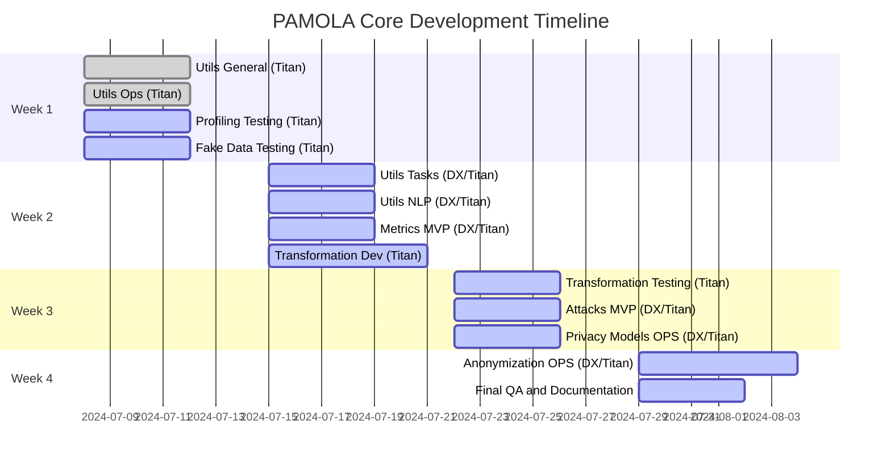

# PAMOLA.CORE PACKAGES

**Partial SRS for Completion Tasks (DigitalXpert & Titan Responsibility)**  
_Date: 2025-04-28_

# 1. INTRODUCTION

## 1.1 Pamola Studio and Pamola Core Overview

PAMOLA (Privacy And Management Of Large Anonymization) is a comprehensive platform designed to address modern privacy challenges through advanced Privacy-Enhancing Technologies (PETs).  
It empowers organizations to transform sensitive data for secure analysis, sharing, and processing, while ensuring compliance with global data protection regulations.

PAMOLA Core serves as the foundational library and computational engine for the broader PAMOLA ecosystem.  
While PAMOLA Studio provides an enterprise-grade web interface, project orchestration, and management of datasets, artifacts, and AI/LM models involved in privacy operations, PAMOLA Core delivers essential privacy-preserving operations.  
It is designed to be used both within PAMOLA Studio and independently as an open-source library by developers, data scientists, and researchers.

## 1.2 Pamola Core Specifics

PAMOLA Core is the component responsible for data-processing operations, supporting pamola core functionalities such as:

- Data preparation
    
- Transformation
    
- Privacy enhancement
    

while PAMOLA Studio focuses on:

- User interaction
    
- Dataset management
    
- Artifact management
    
- Model orchestration over an extended Data Hub architecture
    

PAMOLA Core is being developed as a modular, scalable library for processing tabular data with support for:

- Data profiling and analysis
    
- Anonymization techniques (generalization, masking, suppression)
    
- Synthetic data generation
    
- Privacy and utility metrics calculation
    
- Attack simulations on synthetic/anonymized data
    
- Core utilities for I/O management, operations orchestration, and encryption
    

The library is implemented in Python, designed with:

- Support for large datasets (Dask-based chunking where necessary)
    
- Secure computation (encryption of intermediate artifacts and task results)
    

It follows a modular architecture where each component can be used independently or combined into configurable privacy-preserving workflows, allowing flexible deployment across enterprise, research, and development environments.

## 1.3 PAMOLA Core Architecture

```
pamola_core
├── utils
│   ├── io.py                 # File operations, encryption, large files
│   ├── logging.py            # Configurable logging
│   ├── progress.py           # Progress tracking and chunk processing
│   ├── visualization.py      # Plotting and visualization utilities
│   └── ops
│       ├── op_base.py        # Base classes for operations
│       ├── op_registry.py    # Operation registration
│       ├── op_result.py      # Operation results and artifacts
│       ├── op_data_source.py # Data source abstraction
│       └── op_cache.py       # Operation result caching
├── profiling/                # Data profiling analyzers (fields, groups, identity)
├── anonymization/            # Anonymization techniques (masking, generalization, noise)
├── privacy_models/           # Privacy models (k-anonymity, l-diversity, etc.)
├── metrics
│   ├── base.py               # Base metric classes
│   ├── fidelity/             # Fidelity metrics (KS, KL, distance, correlation)
│   ├── utility/              # Utility metrics (regression, classification, clustering)
│   ├── privacy/              # Privacy risk metrics (identity, neighbor-based, information loss)
│   ├── calculators/          # Pamola Pamola Core calculation modules
│   ├── operations/           # Metric operation wrappers
│   └── commons/              # Shared utilities for metrics
├── attacks
│   ├── fellegi_sunter.py     # Probabilistic record linkage attack
│   ├── cvpl_attack.py        # Cluster Vector Privacy Leakage (CVPL) attack
│   └── membership_inference.py # Membership inference attack
├── fake_data/                # Synthetic data generation operations
├── transformation/           # Dataset transformation (splitting, cleaning, merging)
└── llm/                      # Optional LLM-based utilities for text processing (under development)

```

## 1.4 Development Approach and Responsibilities

PAMOLA Core development proceeds along two parallel tracks:

- **PAMOLA.CORE (Helper Hub Repository)**: A testing and prototyping project where initial versions of packages and modules are implemented and validated.
    
- **PAMOLA.CORE**: The production-grade library, where stable and validated functionality is integrated for broader deployment.
    

## 1.5 Developmental Responsibilities

- **DigitalXpert**:
    
    - Design and implementation of pamola core privacy functionality (privacy models, metrics, attack simulations)
        
    - Initial module prototyping, testing, and validation in PAMOLA.CORE
        
- **Titan**:
    
    - Adaptation, integration, and finalization of modules into PAMOLA Core
        
    - Focus on operational framework, I/O subsystems, encryption handling, and integration with PAMOLA Studio front-end systems
        

### 1.6 Development Methodology

The project leverages an AI-assisted workflow across all stages:

- Module-level Specification Design (clear and structured requirements)
    
- Automated and AI-supported Module Code Generation
    
- Test Case Development and Coverage Analysis
    
- Code Standardization, Compliance, and Quality Assurance
    
- Structure-aware Implementation aligned with modular architecture principles
    
- User-oriented Documentation Generation in MkDocs style for clean, accessible developer and user guides


# 2. IMPLEMENTATION APPROACH

## 2.1 Common Implementation Guidelines

### 2.1.1 General Principles

1. **Versioning and Compatibility**
    
    - Support for Python 3.8+
        
    - Compatibility with Pandas 1.0.0+ and NumPy 1.18.0+
        
    - Clear versioning practices and deprecation notices for breaking changes
        
2. **Performance Considerations**
    
    - Use vectorized operations via Pandas/NumPy wherever possible
        
    - Memory-efficient processing of large datasets (>1M rows)
        
    - Progress reporting for operations exceeding 5 seconds of execution time
        
    - Optional support for Dask to enable distributed processing
        
3. **Security Implementation**
    
    - Encryption of sensitive intermediate artifacts
        
    - Use of secure random number generation mechanisms
        
    - Strict parameter validation to prevent injection attacks
        
    - Proper in-memory management of sensitive data
        

---

### 2.1.2 Key Implementation Considerations

1. **Architectural Alignment**
    
    - All modules must follow an operation-based architecture
        
    - Operations must utilize DataSource abstractions and store results in `task_dir`
        
    - Each operation must generate appropriate metrics and artifacts
        
2. **Documentation Priority**
    
    - The PAMOLA.CORE `/docs/en/` directory serves as the authoritative source for tested implementations
        
    - PAMOLA documentation defines architectural intent and principles
        
    - In case of discrepancies, priority is given to the tested PAMOLA.CORE implementation
        
3. **Performance Requirements**
    
    - Ability to handle large datasets (1.5M+ rows)
        
    - Memory-efficient chunked processing
        
    - Progress monitoring for long-running operations
        
4. **Security Considerations**
    
    - Prefer encryption of intermediate outputs
        
    - Use a master key to derive per-task encryption keys
        
    - Proper handling of sensitive data throughout the memory lifecycle
        

---

## 2.2 Architectural Principles

### 2.2.1 Modular Design

All modules must adhere to a clean API-driven design with:

- A main module acting as the entry point
    
- Associated helper modules (`commons`, `helpers`) to handle sub-tasks
    

**Key modularity rules:**

- Each module must be self-contained with a well-defined public interface
    
- Maximum nesting depth: 3–4 levels for maintainability
    
- Maximum file size: approximately 700 lines per module (flexible if needed)
    
- Clear separation of concerns between distinct functional areas
    
- Sub-packages should be logically organized (e.g., `processors/`, `analyzers/`, `commons/`)
    

---

### 2.2.2 Operation-Based Framework

The library follows a **Project → Tasks → Operations** paradigm:

- **Projects** manage multiple **Tasks**, which organize execution artifacts and data.
    
- **Tasks** are user-level scripts (external to `pamola_core/`) that invoke **Operations** by passing input datasets, parameters, and configuration paths (such as `task_dir`).
    
- **Operations** are specialized modules grouped by functionality (e.g., `profiling/analyzers/numeric.py`), optionally assisted by helper modules (e.g., `profiling/commons/numeric_utils.py`).
    

#### 2.2.2.1 Operational Requirements

- All operations inherit from base operation classes (`op_base`, `op_cache`, `op_data_source`, `op_registry`, `op_result`) located in `pamola_core/utils/ops/`.
    
- Each operation must implement the `execute()` method, which is invoked through the `run()` wrapper.
    
- Input/output must be handled via `DataSource` abstraction.
    
- Intermediate and final artifacts must be saved under `task_dir`.
    
- Operations must return a structured `OperationResult` including status, metrics, and artifact references.
    

#### 2.2.2.2 Data Handling in Operations

- Operations can receive datasets either:
    
    - As file paths (to be loaded internally), or
        
    - As DataFrames (from prior operations).
        
- Operations may generate:
    
    - **Metrics** (e.g., profiling statistics, process performance indicators) in JSON and optionally visual plots (PNG format).
        
    - **Extracted subsets or dictionaries** (e.g., filtered data, mappings) saved under `task_dir/dictionaries/`.
        
    - **Output data** (e.g., modified datasets) saved under `task_dir/output/`, optionally encrypted with task-specific keys.
        

---

### 2.2.3 Standardized I/O and Visualization

All file operations, visualizations, encryption, and data processing must use standardized utility modules:

- **File Operations**: `pamola_core/utils/io.py`
    
- **Visualization Utilities**: `pamola_core/utils/visualization.py`
    
- **Supported formats**: CSV, JSON, Parquet, PNG
    
- **Chunked Processing**: Via Dask when enabled (controlled by `use_dask` flags)
    
- **Progress Monitoring**: Through `pamola_core/utils/progress.py`
    
- **Encryption Support**: Via a dedicated `crypto.py` (planned) supporting AES-GCM or ChaCha20 encryption, with per-task keys encrypted by a master key stored securely in the environment or configuration files.
    

---

### 2.2.4 Documentation Standards

Documentation must accompany code development from the start:

- Comprehensive **docstrings** (in English) for all public classes, methods, and functions
    
- **Type hints** for all parameters and return values
    
- **Module-level descriptions** explaining:
    
    - Purpose
        
    - Key features
        
    - Usage examples
        
- **Inline comments** for complex or non-obvious logic
    

Upon module finalization, generate Markdown documentation files:

- Organized outside `pamola_core/` under `docs/en/`
    
- Reflecting the source package structure
    
- Example: `docs/en/pamola_core/fake_data/operations/operation_name.md`
    

---

### 2.2.5 Error Handling

- Use specialized exception classes to categorize different error types
    
- Ensure consistent validation and error reporting across modules
    
- Implement graceful degradation when optional components are unavailable (e.g., Dask not installed)
    

---

### 2.2.6 Testing Requirements

- Unit tests for all modules targeting >85% coverage
    
- Integration tests for cross-module functionality validation
    
- Performance tests for operational scalability on large datasets
    
- Real-world validation on at least 2–3 realistic datasets
    

# 3. DEVELOPMENT SEQUENCE AND STATUS

## 3.1 Development Sequence

### 3.1.1 Foundation Development

- Implementation of pamola core I/O module with encryption and Parquet support
    
- Logging setup with task-specific directory outputs
    
- Establishment of the operation-based execution framework
    
- Creation of unit testing infrastructure for pamola core modules
    

### 3.1.2 Core Functionality

- Adaptation of the profiling module from PAMOLA.CORE with modular analyzers
    
- Initial development of the transformation module (splitting, merging, cleaning)
    
- Adaptation and extension of the fake data generation module
    
- First implementation of fidelity, utility, and privacy metrics
    

### 3.1.3 Integration

- Integration of privacy models with the operations framework
    
- Development of attack simulation modules (Fellegi-Sunter, CVPL, MIA)
    
- Cross-module validation and consistency testing
    
- Memory optimization and scalability validation
    

### 3.1.4 Finalization

- Completion of modular and user-facing documentation
    
- End-to-end testing of Project → Task → Operation pipelines
    
- Benchmarking on large datasets
    
- Release packaging and compliance validation
    

---

## 3.2 Current Implementation Status

The table below reflects the updated list of modules, responsibilities, and progress based on current project tracking:

|Component|Module|Task Description|Responsible|Status / Progress|
|:--|:--|:--|:--|:--|
|`pamola_core/io.py`|Input/Output|PAMOLA header, Dask, encryption, Parquet support, I/O utilities|Titan|Developed, needs adaptation (~70%)|
|`pamola_core/logging.py`|Logging|Output logs to `{task_dir}/logs`, dynamic setup per task|Titan|Developed, needs adaptation (~80%)|
|`pamola_core/utils/ops/`|Core Operations|Operation base classes, registry, result tracking|Titan|Developed, needs adaptation (~90%)|
|`pamola_core/utils/progress.py`|Progress Tracker|Progress reporting for long-running operations|Titan|Developed, needs adaptation (~90%)|
|`pamola_core/utils/visualization.py`|Visualization|Plot generation for metrics and operations|Titan|Developed, needs adaptation (~90%)|
|`pamola_core/utils/tasks/`|Task Basics|Form basic structure for manual creation of tasks/user scripts|DigitalXpert|Planned (~10%)|
|`pamola_core/anonymization/`|Anonymization|Generalization, masking, suppression methods|DigitalXpert|Developed, needs refactoring (~70%)|
|`pamola_core/fake_data/`|Fake Data Generator|Fully synthetic data generation logic|Titan|Developed, needs adaptation (~90%)|
|`pamola_core/metrics/`|Metrics Framework|Fidelity, utility, privacy metrics, orchestration|DigitalXpert|Needs realignment (~10%)|
|`pamola_core/attacks/`|Privacy Attacks|MIA, CVPL, probabilistic linkage attacks|DigitalXpert|Planned (Oversimplified in Titan)|
|`pamola_core/privacy_models/`|Privacy Models|Implementation of privacy guarantees (k-anonymity, DP)|DigitalXpert/Titan|Need conversion to OP framework (~70%)|
|`pamola_core/profiling/`|Profiling|Field-level statistical analysis and risk evaluation|Titan|Developed, needs adaptation (~90%)|
|`pamola_core/transformation/`|Data Transformation|Field-based splitting, joins, aggregations, conditional modification|Titan|Planned (0%)|
|`pamola_core/llm/`|LLM/NLP Utilities|Optional long-text normalization and replacement|DigitalXpert|Optional / Drafted|

---

> **Note:**  
> All modules must comply with the operation-based architecture and support standardized parameter intake, artifact storage, and metric output under the `task_dir` hierarchy.


---

# 4. MODULE-SPECIFIC REQUIREMENTS

## 4.1 `pamola_core/utils` Package

### 4.1.1 General Utilities (Titan)

**Purpose:**  
Provide standardized foundational services for I/O, logging, visualization, and operation progress monitoring across PAMOLA Core.

**Modules:**

- `pamola_core/io.py`
    
- `pamola_core/logging.py`
    
- `pamola_core/progress.py`
    
- `pamola_core/visualization.py`
    

**Implementation Requirements:**

- Integrate all modules into PAMOLA Core.
    
- Review and enhance `io.py` to support:
    
    - File encryption for sensitive outputs (AES-GCM/ChaCha20)
        
    - Chunked processing with `use_dask` flag for large datasets
        
    - Consistent path resolution relative to `{task_dir}`
        
- Update `logging.py` to ensure:
    
    - Logs are saved in `{task_dir}/logs`
        
    - Task- and module-specific context tagging
        
- Generate or update unit tests (preferably AI-assisted).
    
- Generate or update API documentation.
    

**Testing Criteria:**

- Validate encryption and decryption correctness.
    
- Validate Dask handling for datasets larger than 1M rows.
    
- Confirm proper task directory usage for logging and outputs.
    

---

### 4.1.2 Operation Framework Utilities (Titan)

**Purpose:**  
Provide the base operation classes, execution lifecycle management, and result handling framework that standardizes operations across PAMOLA Core.

**Modules:**

- `pamola_core/utils/ops/op_base.py`
    
- `pamola_core/utils/ops/op_cache.py`
    
- `pamola_core/utils/ops/op_data_source.py`
    
- `pamola_core/utils/ops/op_registry.py`
    
- `pamola_core/utils/ops/op_result.py`
    

**Implementation Requirements:**

- Integrate the fully developed `ops/` package into PAMOLA Core.
    
- Conduct comprehensive testing of:
    
    - Operation lifecycle (initialization → execution → result collection)
        
    - Parameter validation
        
    - Artifact storage and result generation
        
- Standardize error handling and progress reporting across all operations.
    
- Update API documentation if necessary.
    

**Testing Criteria:**

- Validate inheritance and polymorphism between base classes.
    
- Verify correct operation registration and discovery through the registry.
    

---

### 4.1.3 Task Support Utilities (DigitalXpert → Transfer to Titan)

**Purpose:**  
Provide basic classes and abstractions to facilitate the creation of manual user scripts (tasks) that orchestrate operations externally.

**Modules:**

- `pamola_core/utils/tasks/base_task.py`
    
- `pamola_core/utils/tasks/task_config.py`
    
- `pamola_core/utils/tasks/task_registry.py`
    
- `pamola_core/utils/tasks/task_reporting.py`
    

**Implementation Requirements:**

- Complete the current development (~20%) in PAMOLA.CORE.
    
- Test and validate task modules inside the PAMOLA.CORE environment.
    
- Transfer the finalized task framework to Titan for integration.
    
- Align the task support utilities structure and interfaces with the `ops/` framework standards.
    

**Testing Criteria:**

- Unit tests for task creation, configuration loading, execution, and error management.
    
- Validation of dataset orchestration across multiple operations (ensuring correct passing of intermediate results).
    
- Update or generate API documentation before or immediately upon transfer.
    

---

## 4.1.4 NLP Utilities (DigitalXpert → Titan for Integration)

**Purpose:**  
Provide text processing utilities to support anonymization and synthetic data generation tasks involving text fields.

**Modules:**

- `pamola_core/utils/nlp/base.py`
    
- `pamola_core/utils/nlp/cache.py`
    
- `pamola_core/utils/nlp/category_matching.py`
    
- `pamola_core/utils/nlp/clustering.py`
    
- `pamola_core/utils/nlp/compatibility.py`
    
- `pamola_core/utils/nlp/entity_extraction.py`
    
- `pamola_core/utils/nlp/language.py`
    
- `pamola_core/utils/nlp/model_manager.py`
    
- `pamola_core/utils/nlp/stopwords.py`
    
- `pamola_core/utils/nlp/tokenization.py`
    
- `pamola_core/utils/nlp/tokenization_ext.py`
    
- `pamola_core/utils/nlp/tokenization_helpers.py`
    

**Implementation Requirements:**

- Finalize remaining adjustments (currently ~90% ready).
    
- Integrate the NLP utilities into PAMOLA Core (Titan).
    
- Ensure compatibility with the modular operation-based architecture.
    
- Generate or update unit tests.
    
- Finalize API documentation.
    

**Testing Criteria:**

- Unit tests for text field anonymization, replacement, and token matching.
    
- Validation of integration into broader workflows.
    
- Documentation review for public interfaces.
    

---

## 4.2 `pamola_core/profiling` Package (Titan)

**Purpose:**  
Analyze datasets to identify key characteristics, data types, sensitive fields, and quasi-identifiers for subsequent privacy operations.

**Modules:**

- `pamola_core/profiling/analyzers/anonymity.py`
    
- `pamola_core/profiling/analyzers/attribute.py`
    
- `pamola_core/profiling/analyzers/categorical.py`
    
- `pamola_core/profiling/analyzers/correlation.py`
    
- `pamola_core/profiling/analyzers/currency.py`
    
- `pamola_core/profiling/analyzers/date.py`
    
- `pamola_core/profiling/analyzers/email.py`
    
- `pamola_core/profiling/analyzers/group.py`
    
- `pamola_core/profiling/analyzers/identity.py`
    
- `pamola_core/profiling/analyzers/longtext.py`
    
- `pamola_core/profiling/analyzers/mvf.py`
    
- `pamola_core/profiling/analyzers/numeric.py`
    
- `pamola_core/profiling/analyzers/phone.py`
    
- `pamola_core/profiling/analyzers/text.py`
    

**Implementation Requirements:**

- Test and validate profiling modules within PAMOLA Core.
    
- Integrate profiling analyzers following the operation-based architecture.
    
- Ensure generation of field-level metrics and correlation analysis.
    
- Finalize and update modular documentation.
    

**Testing Criteria:**

- Validation on datasets with known field characteristics.
    
- Accuracy of quasi-identifier detection.
    
- Performance testing with datasets exceeding 1M rows.
    
- Validation of visualization outputs for profiling reports.
    

---

## 4.3 `pamola_core/fake_data` Package (Titan)

**Purpose:**  
Generate realistic synthetic data across multiple field types while preserving essential statistical properties and enabling consistent anonymization.

**Modules:**

- `pamola_core/fake_data/operations/email_op.py`
    
- `pamola_core/fake_data/operations/name_op.py`
    
- `pamola_core/fake_data/operations/organization_op.py`
    
- `pamola_core/fake_data/operations/phone_op.py`
    

**Implementation Requirements:**

- Test and validate fake data generation modules within PAMOLA Core.
    
- Integrate fake data operations following the operation-based architecture.
    
- Ensure support for dictionary-based and seed-controlled generation.
    
- Finalize and update modular documentation.
    

**Testing Criteria:**

- Validation of statistical properties and data realism.
    
- Consistency across related fields (e.g., names and emails).
    
- Verification of deterministic generation via seed control.
    
- Performance testing with large datasets.
    

---

## 4.4 `pamola_core/metrics` Package (DigitalXpert → Titan)

**Purpose:**  
Provide essential privacy, utility, and statistical similarity metrics to evaluate the quality and confidentiality of anonymized and synthetic datasets.

**Modules:**

- `pamola_core/metrics/base.py`
    
- `pamola_core/metrics/fidelity/distance.py`
    
- `pamola_core/metrics/fidelity/distribution.py`
    
- `pamola_core/metrics/utility/regression.py`
    
- `pamola_core/metrics/utility/classification.py`
    
- `pamola_core/metrics/privacy/distance.py`
    
- `pamola_core/metrics/privacy/identity.py`
    
- `pamola_core/metrics/operations/fidelity_ops.py`
    
- `pamola_core/metrics/operations/utility_ops.py`
    
- `pamola_core/metrics/operations/privacy_ops.py`
    

**Implementation Requirements:**

- Initially implemented by DigitalXpert inside the PAMOLA.CORE project.
    
- Cover pamola core MVP metrics:
    
    - KS-Test, KL Divergence (fidelity)
        
    - R² and AUROC (utility)
        
    - Distance to Closest Record (DCR) and Identity Disclosure Risk (privacy)
        
- Implement minimal composite indexes for quality/security trade-off assessment.
    
- Create visualization functions for selected key metrics.
    
- Generate structured JSON reports with metric results.
    
- Upon completion, transfer to Titan for final adaptation, modular testing, and documentation update.
    

**Testing Criteria:**

- Validation against control datasets with established metrics.
    
- Accuracy checks for statistical and privacy evaluations.
    
- Visualization correctness for fidelity and utility comparisons.
    
- Performance testing on large datasets (>1M records).
    

---

## 4.5 `pamola_core/transformation` Package (Titan)

**Purpose:**  
Provide operations for comprehensive dataset transformation, cleaning, preparation, and restructuring to enable effective anonymization, profiling, and synthetic generation workflows.

**Implementation Ownership:**  
Developed, tested, and documented directly by Titan inside PAMOLA Core.

**Key Functionalities:**

- **Vertical Splitting by Fields:** Split datasets into subsets by columns, duplicating a specified ID field into each subset.
    
- **Vertical Splitting by Values:** Split datasets based on ID field values (e.g., group partitioning).
    
- **Cleaning by Format Violations:**
    
    - Nullify numerical fields outside bounds.
        
    - Nullify categorical fields violating whitelist/blacklist.
        
    - Handle date violations similarly.
        
- **Missing Value Handling:**
    
    - Replace missing or invalid entries using mean, median, or mode.
        
- **Grouping and Aggregation:**
    
    - Group records and aggregate statistics (count, sum, mean).
        
- **Dataset Merging:**
    
    - Merge datasets by key field.
        
    - Support one-to-one and many-to-one joins (left-joins).
        
- **Field Removal:**
    
    - Remove one or more specified columns.
        
- **Field Addition and Conditional Modification:**
    
    - Add fields via lookups.
        
    - Create fields based on conditions.
        

**Core Planned Operations:**

- `SplitFieldsOperation`
    
- `SplitByIDValuesOperation`
    
- `CleanInvalidValuesOperation`
    
- `ImputeMissingValuesOperation`
    
- `AggregateRecordsOperation`
    
- `MergeDatasetsOperation`
    
- `RemoveFieldsOperation`
    
- `AddOrModifyFieldsOperation`
    

**Implementation Requirements:**

- Follow operation framework (inherit `BaseOperation`, use `DataSource` abstraction).
    
- Receive parameters from task configuration.
    
- Save transformed outputs to `{task_dir}/output`.
    
- Save metrics and results to `{task_dir}` (JSON and optional PNGs).
    
- Ensure modular unit testing and update full documentation.
    

**Testing Criteria:**

- Validation of dataset integrity post-transformation.
    
- Performance tests for datasets >1M rows.
    
- Correct handling of corner cases (missing fields, duplicates).
    
- Compatibility with subsequent anonymization and profiling steps.
    

---

## 4.6 `pamola_core/attacks` Package (DigitalXpert → Titan)

**Purpose:**  
Simulate and evaluate different types of privacy attacks to measure the robustness of anonymization and synthetic data generation techniques.

**Implementation Ownership:**  
Initially developed by DigitalXpert inside PAMOLA.CORE, then transferred to Titan for integration, unit testing, and documentation updates within PAMOLA Core.

**Key Functionalities:**

- **Membership Inference Attack (MIA):** Assess if specific records were used during training.
    
- **Cluster Vector Privacy Leakage (CVPL):** Detect cluster-level leakage and attribute recovery.
    
- **Linkage Attack Simulation:** Link synthetic records back to original records using quasi-identifiers.
    
- **Attack Metrics:** Calculate attack success rates and associated risks.
    
- **Visualization:** Provide clear graphs showing vulnerabilities and attack success distributions.
    

**Core Planned Components:**

- `mia.py`: Membership Inference Attack implementation.
    
- `cvpl.py`: Cluster Vector Privacy Leakage simulation.
    
- `linkage.py`: Quasi-identifier linkage attack.
    
- `probabalistic.py`: Fellegi-Sunter probabilistic linkage attack.
    

**Implementation Requirements:**

- Implement attack simulations as operations under the operation framework.
    
- Support input of synthetic and real datasets for evaluation.
    
- Generate structured reports with metrics and risk assessments.
    
- Produce optional visualization artifacts (e.g., success probability distributions).
    
- Save all outputs into `{task_dir}`.
    

**Testing Criteria:**

- Validation of attacks on controlled datasets with known vulnerabilities.
    
- Performance assessment on datasets with more than 1M records.
    
- Accuracy validation of attack success metrics.
    
- Visualization quality and integration with the metric reporting framework.
    

---

## 4.7 `pamola_core/privacy_models` Package (DigitalXpert → Titan)

**Purpose:**  
Implement formal privacy models to enforce anonymization guarantees and integrate them into the PAMOLA Core operation framework.

**Implementation Ownership:**  
Developed initially by DigitalXpert inside PAMOLA.CORE, then transferred to Titan for integration, adaptation to the operation framework, unit testing, and documentation updates.

**Key Functionalities:**

- **k-Anonymity Enforcement:** Ensure each record is indistinguishable among k records.
    
- **l-Diversity Implementation:** Enhance diversity of sensitive attribute values.
    
- **t-Closeness Enforcement:** Reduce distribution distance of sensitive attributes.
    
- **Differential Privacy Mechanisms:** Add noise to data or queries to guarantee probabilistic privacy.
    

**Core Components:**

- `k_anonymity.py`: Implementation of k-anonymity.
    
- `l_diversity.py`: Implementation of l-diversity.
    
- `t_closeness.py`: Implementation of t-closeness (optional).
    
- `differential_privacy.py`: Implementation of differential privacy mechanisms (optional).
    

**Implementation Requirements:**

- Adapt all privacy models to the operation framework with `BaseOperation` inheritance.
    
- Ensure configurable parameters for each model (e.g., k value, l value, t threshold, ε for differential privacy).
    
- Develop validation functions to verify privacy guarantees.
    
- Save privacy reports and anonymized datasets under `{task_dir}`.
    
- Generate structured output metrics and JSON-based application summaries.
    

**Testing Criteria:**

- Validation of privacy guarantees on benchmark datasets.
    
- Performance testing on datasets exceeding 1M rows.
    
- Compatibility testing with different dataset types (numeric, categorical, mixed).
    
- Documentation and example updates for each privacy model.
    

---

## 4.8 `pamola_core/anonymization` Package (DigitalXpert → Titan)

**Purpose:**  
Provide a comprehensive set of anonymization operations to support data protection workflows across generalization, masking, noise addition, pseudonymization, and suppression.

**Implementation Ownership:**  
Developed initially by DigitalXpert inside PAMOLA.CORE with full alignment to the OPS operation framework, then transferred to Titan for integration, unit testing, and documentation updates inside PAMOLA Core.

**Key Functionalities:**

- **Generalization:**
    
    - Categorical field generalization (`categorical.py`)
        
    - Datetime generalization (`datetime.py`)
        
    - Numeric range generalization (`numeric.py`)
        
- **Masking:**
    
    - Full field masking (`full_masking.py`)
        
    - Partial field masking (prefix/suffix preservation) (`partial_masking.py`)
        
- **Noise Addition:**
    
    - Gaussian noise injection (`gaussian.py`)
        
    - Laplace noise application (`laplace.py`)
        
    - Uniform noise perturbation (`uniform.py`)
        
- **Pseudonymization:**
    
    - Hash-based pseudonymization (`hashing.py`)
        
    - Replacement from pseudonym dictionaries (`replacement.py`)
        
    - Tokenization of sensitive values (`tokenization.py`)
        
- **Suppression:**
    
    - Attribute-level suppression (`attribute_suppression.py`)
        
    - Record-level suppression (`record_suppression.py`)
        
    - Cell-level selective suppression (`cell_suppression.py`)
        

**Core Components:**

- `pamola_core/anonymization/generalization/`
    
- `pamola_core/anonymization/masking/`
    
- `pamola_core/anonymization/noise_addition/`
    
- `pamola_core/anonymization/pseudonymization/`
    
- `pamola_core/anonymization/suppression/`
    

**Implementation Requirements:**

- Refactor modules to implement as standardized operations (`BaseOperation` and `DataSource` based).
    
- Ensure parameterized control for anonymization strength (e.g., noise variance, number of visible characters, suppression thresholds).
    
- Each operation must:
    
    - Accept task-configured parameters.
        
    - Save transformed outputs into `{task_dir}/output`.
        
    - Record anonymization metrics into `{task_dir}/metrics`.
        
- Provide practical examples in documentation for each operation.
    

**Testing Criteria:**

- Unit tests for each anonymization operation (generalization, masking, noise addition, pseudonymization, suppression).
    
- Validation of correctness and expected output formats.
    
- Performance testing with large datasets.
    
- Full documentation review and update for public interfaces.
    

---

# 5. IMPLEMENTATION SCHEDULE

## 5.1 Overview

This section outlines the realistic four-week development and integration schedule for the PAMOLA Core modules, based on parallel execution by DigitalXpert and Titan teams, leveraging AI-assisted development (VIBE coding) to maximize efficiency. Simpler packages are prioritized earlier, while more complex components (metrics, privacy attacks, anonymization) are phased in later stages. Testing, documentation, and final integration steps are built into the plan.

## 5.2 Implementation Table

|Package / Component|Developer (DX)|Developer (Titan)|Target Week|Status (initial)|
|---|---|---|---|---|
|pamola_core/utils (General Utilities)|Finalized|Adapt, Test, Document|Week 1|~90%|
|pamola_core/utils/ops/|Finalized|Adapt, Test, Document|Week 1|~90%|
|pamola_core/utils/tasks/|Develop Final 80%|Integrate, Test, Document|Week 2|~20%|
|pamola_core/utils/nlp/|Finalize (~90%)|Integrate, Test, Document|Week 2|~90%|
|pamola_core/profiling/|-|Test, Integrate, Document|Week 1|~90%|
|pamola_core/fake_data/|-|Test, Integrate, Document|Week 1|~90%|
|pamola_core/metrics/ (MVP subset)|Develop (PAMOLA.CORE)|Integrate, Test, Document|Week 2|~10%|
|pamola_core/transformation/|-|Develop, Test, Document|Week 2-3|0%|
|pamola_core/attacks/ (MVP subset)|Develop (PAMOLA.CORE)|Integrate, Test, Document|Week 3|~10%|
|pamola_core/privacy_models/|Adapt to OPS|Integrate, Test, Document|Week 3|~70%|
|pamola_core/anonymization/ (OPS-ready)|Adapt to OPS|Integrate, Test, Document|Week 4|~70%|

## 5.3 Gantt Diagram (Simplified)



## 5.4 Notes

- Early validation of profiling and fake data modules will ensure smooth ramp-up.
    
- Parallel work streams between DigitalXpert and Titan minimize risks.
    
- AI-powered development is assumed to enhance code generation, unit testing, and documentation efficiency.
    
- Metrics and attacks components are limited to MVP scope initially for manageable workload.
    
- The project remains modular and adaptable depending on intermediate results.