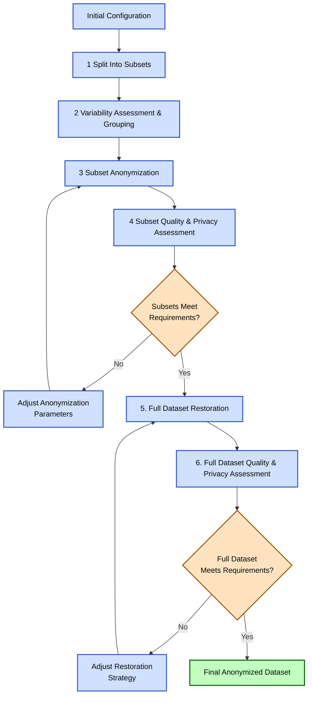
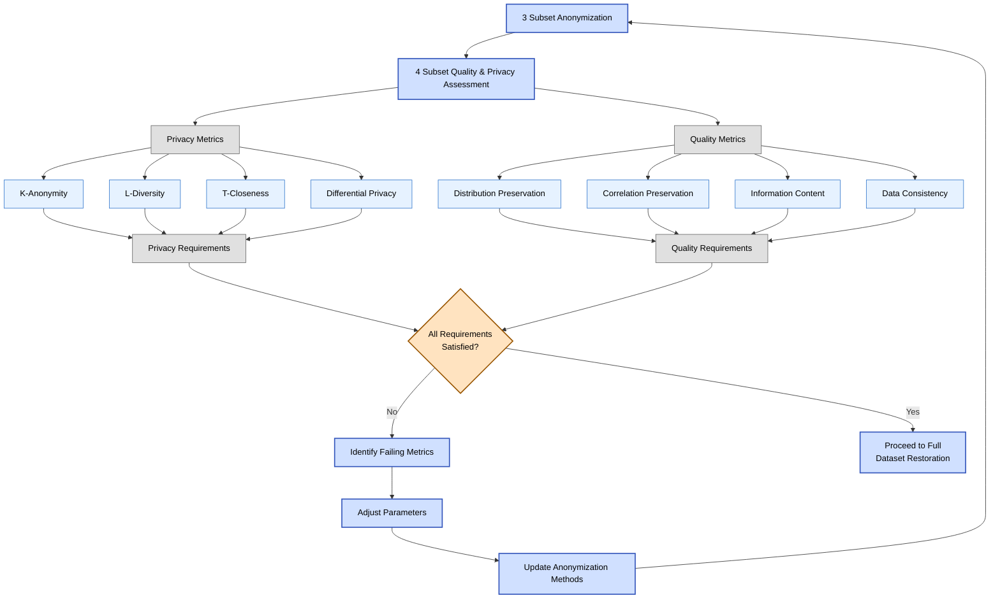
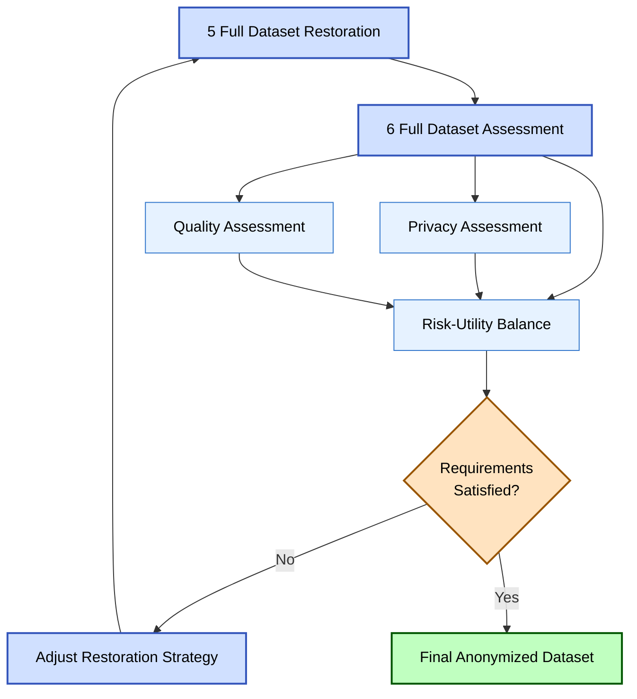

# Спецификация стратегии анонимизации набора данных резюме

## 1. Общее введение

Данная спецификация описывает комплексную стратегию анонимизации наборов данных резюме, содержащих чувствительную персональную информацию. Цель стратегии — создать анонимизированный набор данных, который сохраняет аналитическую ценность исходных данных при минимизации риска повторной идентификации физических лиц.

Стратегия основана на декомпозиции набора данных на логические поднаборы, которые подвергаются независимой анонимизации с последующим восстановлением полной структуры набора. Процесс учитывает разнообразие типов полей в наборе данных резюме (идентификаторы, контактная информация, образование, опыт работы, навыки) и применяет соответствующие методы анонимизации к каждому типу.

Предлагаемый подход отличается итеративностью, позволяющей оценивать и корректировать уровень анонимизации и качество данных на каждом этапе, и модульностью, обеспечивающей гибкость и масштабируемость процесса.

## 2. Особенности набора данных

Набор данных резюме имеет следующие характеристики:

1. **Размер и структура**: Выборка из 10 000 записей с основным идентификатором resume_id и множеством атрибутов, разделенных по логическим категориям.

2. **Дублирование данных**: Записи с одинаковым resume_id могут повторяться, причем некоторые поля имеют одинаковые значения в пределах одной группы resume_id, а другие могут различаться.

3. **Разнообразие типов полей**:
   - Прямые идентификаторы (ФИО, контактные данные)
   - Квази-идентификаторы (возраст, пол, местоположение)
   - Длинные текстовые поля (описания опыта работы, образования)
   - Категориальные поля (должности, навыки)
   - Списочные поля (многозначные атрибуты)

4. **Пропущенные значения**: Многие поля содержат пустые значения.

5. **Неоднородность данных**: Поля имеют различный характер и при нормализации могли бы быть разбиты на отдельные таблицы.

Набор можно разделить на следующие логические поднаборы:

- **IDENT**: Прямые идентификаторы (резюме_id, имя, фамилия и т.д.)
- **DETAILS**: Детали профиля (пол, дата рождения, предпочтения и т.д.)
- **CONTACTS**: Контактные данные (email, телефоны, адреса)
- **ATTESTATION**: Аттестаты и сертификаты
- **PRIMARY_EDU**: Основное образование
- **ADDITIONAL_EDU**: Дополнительное образование
- **ELEMENTARY_EDU**: Начальное образование
- **EXPERIENCE**: Опыт работы
- **SPECS**: Специализация и навыки

## 3. Основные понятия и определения

### 3.1 Ключевые понятия анонимизации данных

**Анонимизация данных** - процесс обработки персональных данных таким образом, чтобы они не могли быть связаны с конкретным физическим лицом без использования дополнительной информации.

**Прямые идентификаторы** - атрибуты, которые непосредственно указывают на определенное физическое лицо (ФИО, паспортные данные, контактная информация).

**Квази-идентификаторы** - атрибуты, которые сами по себе не идентифицируют человека, но в комбинации могут позволить идентифицировать конкретное лицо (возраст, пол, местоположение).

**K-анонимность** - свойство набора данных, при котором каждая комбинация значений квази-идентификаторов встречается не менее чем в k записях.

**L-разнообразие** - расширение k-анонимности, требующее, чтобы для каждой группы записей с одинаковыми квази-идентификаторами существовало по крайней мере l различных значений чувствительных атрибутов.

**Дифференциальная приватность** - формальное определение приватности, гарантирующее, что включение или исключение записи из набора данных не влияет существенно на результаты анализа.

**Вариативность данных** - мера разнообразия значений атрибутов в группе записей с одинаковым идентификатором.

**Сигнатура MinHash** - компактное представление набора элементов, используемое для эффективного расчета сходства между наборами.

### 3.2 Специфические понятия стратегии

**Поднабор (subset)** - логически связанная группа полей исходного набора данных, обрабатываемая как единое целое.

**Индекс вариативности** - нормализованная мера, показывающая степень изменчивости значений полей внутри группы записей с одинаковым идентификатором.

**Согласованность персоны** - свойство анонимизированных данных, при котором значения разных полей, относящихся к одному человеку, логически и семантически согласованы между собой.

**Хеширование с солью поднабора** - метод создания различных хешированных идентификаторов для одной и той же записи в разных поднаборах путем добавления уникальной "соли" перед хешированием.

**Карта соответствия идентификаторов** - защищенное хранилище, содержащее соответствие между исходными и хешированными идентификаторами для каждого поднабора.

## 4. Примеры данных (в искаженном виде)

Для иллюстрации структуры и типов данных приведем примеры полей с искаженными значениями:

```
resume_id: 145872
first_name: А***
last_name: П***
gender: М
birth_day: 198*-**-**
education_level: Высшее
salary: 1****0
area_name: Москва
email: a****@*****.ru
cell_phone: +7 (9**) ***-**-**
primary_education_names: Московский государственный университет им****
primary_education_faculties: Факультет вычислительной математики и кибернетики
primary_education_end_dates: 2005-06-15
experience_organizations: ООО "Т******", ПАО "С*******"
experience_posts: Старший разработчик, Технический директор
experience_descriptions: "Руководил командой из 10 разработчиков. Реализовал проект по автоматизации бизнес-процессов финансового департамента, что привело к сокращению времени обработки документов на 40%. Внедрил методологию Agile..."
key_skill_names: Python, SQL, JavaScript, Project Management
```

## 5. Спецификация структуры набора и стратегии анонимизации

### 5.1 Структура набора данных

Исходный набор данных представлен как плоская таблица со следующей структурой (subset - поднабор):

| Поле                                  | Тип данных   | Подмножество       | Тип чувствительности  | Стратегия защиты |
|---------------------------------------|--------------|--------------------|-----------------------|------------------|
| resume_id                             | Integer      | (все)              | Идентификатор         | Хеширование с солью |
| first_name, last_name, middle_name    | String       | IDENT              | Прямой идентификатор  | Псевдонимизация/маскирование |
| gender, birth_day                     | String       | DETAILS            | Квази-идентификатор   | Обобщение, шум |
| education_level, salary               | String/Int   | DETAILS            | Квази-идентификатор   | Категоризация, шум |
| area_name, metro_station_name         | String       | DETAILS            | Квази-идентификатор   | Обобщение, синтетические данные |
| email, home_phone, work_phone, cell_phone | String   | CONTACTS           | Прямой идентификатор  | Псевдонимизация/маскирование |
| *_education_names, *_education_organizations | String | *_EDU             | Квази-идентификатор   | Обобщение, синтетические данные |
| *_education_end_dates                 | String       | *_EDU              | Квази-идентификатор   | Обобщение, шум |
| experience_organizations, experience_posts | String  | EXPERIENCE         | Квази-идентификатор   | Обобщение, синтетические данные |
| experience_descriptions               | String       | EXPERIENCE         | Свободный текст       | LLM-обработка, синтетические данные |
| key_skill_names                       | String       | SPECS              | Категориальное        | Обобщение, фильтрация |

### 5.2 Стратегия анонимизации

Общая стратегия анонимизации состоит из следующих ключевых компонентов:

1. **Разделение на поднаборы**: Исходный набор разбивается на логические поднаборы (вертикальная декомпозиция) для независимой обработки.

2. **Безопасная трансформация идентификаторов**: Resume_id хешируется с уникальной солью для каждого поднабора, что предотвращает атаки связывания между поднаборами.

3. **Группировка записей**: Внутри каждого поднабора записи с одинаковым resume_id группируются с учетом их вариативности.

4. **Анонимизация поднаборов**: Каждый поднабор анонимизируется с использованием методов, наиболее подходящих для типов полей, которые он содержит.

5. **Оценка качества и уровня анонимизации**: Для каждого поднабора и для восстановленного набора проводится оценка уровня анонимизации и потери информации.

6. **Восстановление полного набора**: Анонимизированные поднаборы объединяются с учетом исходной структуры и оцененных уровней вариативности.

7. **Итеративное улучшение**: При необходимости процесс повторяется для достижения требуемого баланса между приватностью и полезностью данных.

## 5. Детальное описание стратегии с улучшениями

### 5.1 Разделение на поднаборы (вертикальная декомпозиция)

**Базовый подход**: Разделение исходного набора на поднаборы по категориям полей.

**Улучшения**:
- **Анализ перекрестных корреляций**: Выявление и фиксация корреляций между полями из разных поднаборов.
- **Создание перекрестного поднабора**: Создание дополнительного поднабора, содержащего коррелированные поля из разных поднаборов для последующего анализа и защиты от атак связывания.
- **Карта корреляций полей**: Создание и поддержание карты корреляций между полями из разных поднаборов.

```pseudocode
function SplitIntoSubsets(original_dataset, subset_configuration):
    subsets = {}
    
    // 1. Base splitting by categories
    for each subset in subset_configuration:
        subset_fields = subset.fields + ["resume_id"]
        subsets[subset.name] = SelectFields(original_dataset, subset_fields)
    
    // 2. Cross-correlation analysis
    correlation_matrix = CalculateCorrelations(original_dataset, method="cramer_v_for_categorical")
    
    // 3. Identify significant cross-correlations
    significant_correlations = []
    for each field_pair (field1, field2) in correlation_matrix:
        if CorrelationCoefficient(field1, field2) > correlation_threshold:
            subset1 = DetermineSubset(field1)
            subset2 = DetermineSubset(field2)
            if subset1 != subset2:
                significant_correlations.add((field1, field2))
    
    // 4. Create cross-correlation subset
    if length(significant_correlations) > 0:
        cross_subset_fields = UniqueFields(significant_correlations) + ["resume_id"]
        subsets["CROSS_CORRELATION"] = SelectFields(original_dataset, cross_subset_fields)
    
    // 5. Create correlation map
    CorrelationMap = {
        "matrix": correlation_matrix,
        "significant_correlations": significant_correlations,
        "subsets": {
            subset.name: subset.fields for subset in subset_configuration
        }
    }
    WriteMetadata("correlation_map", CorrelationMap)
    
    return subsets
```

### 5.2 Безопасная трансформация идентификаторов

**Базовый подход**: Использование resume_id как ключа для объединения поднаборов.

**Улучшения**:
- **Хеширование с солью**: Для каждого поднабора создается уникальный хешированный ID на основе исходного resume_id с применением соли, специфичной для поднабора.
- **Управление ключами**: Создание и безопасное хранение карты соответствия между исходными и хешированными ID.

```pseudocode
function TransformIdentifiers(subsets, configuration):
    results = {}
    correspondence_map = {}
    
    for each subset_name, subset in subsets:
        // Generate unique salt for the subset
        subset_salt = configuration.salts[subset_name] or GenerateSalt()
        
        // Create a new dataset with hashed IDs
        new_subset = []
        local_map = {}
        
        for each record in subset:
            resume_id = record["resume_id"]
            
            // Hash ID with salt
            hashed_id = SHA256(resume_id + subset_salt)
            
            // Save correspondence
            local_map[hashed_id] = resume_id
            
            // Create new record with hashed ID
            new_record = copy(record)
            new_record["anon_resume_id"] = hashed_id
            delete new_record["resume_id"]
            
            new_subset.add(new_record)
        
        results[subset_name] = new_subset
        correspondence_map[subset_name] = {
            "salt": Encrypt(subset_salt),
            "map": local_map
        }
    
    // Securely store correspondence map
    SecureStore("id_correspondence_map", correspondence_map)
    
    return results
```

### 5.3 Оценка вариативности и группировка записей

**Базовый подход**: Группировка записей по resume_id с учетом весов полей.

**Улучшения**:
- **Динамические веса**: Веса полей определяются на основе их чувствительности и контекста.
- **Сигнатуры MinHash для текстовых полей**: Использование сигнатур MinHash для определения сходства текстовых полей.
- **Кластеризация текстовых данных**: Группировка похожих текстов вместо требования их полного совпадения.

#### 5.3.1 Сигнатуры MinHash

MinHash — это метод для эффективного расчета сходства между множествами. В контексте анализа текстов, MinHash используется для определения сходства между документами на основе общих n-грамм (последовательностей n слов или символов).

Принцип работы MinHash:
1. Разбиение текста на n-граммы (шинглы)
2. Хеширование каждого шингла с помощью нескольких хеш-функций
3. Для каждой хеш-функции сохранение минимального хеш-значения
4. Результирующий набор минимальных хеш-значений образует сигнатуру

Сходство между двумя текстами оценивается как доля совпадающих минимальных хеш-значений.

```pseudocode
function CalculateMinHash(text, num_hash_functions=100, shingle_length=3):
    // 1. Split text into shingles
    words = Tokenize(text)
    shingles = []
    
    for i = 0 to length(words) - shingle_length:
        shingle = words[i:i+shingle_length]
        shingles.add(Join(shingle, " "))
    
    // 2. Create hash functions
    hash_functions = []
    for i = 0 to num_hash_functions-1:
        hash_functions.add(CreateHashFunction(i))
    
    // 3. Calculate minimum hash values
    signature = [Infinity] * num_hash_functions
    
    for each shingle in shingles:
        for i = 0 to num_hash_functions-1:
            hash_value = hash_functions[i](shingle)
            signature[i] = min(signature[i], hash_value)
    
    return signature

function MinHashSimilarity(signature1, signature2):
    // Estimate similarity as fraction of matching elements
    matches = SumOfMatches(signature1, signature2)
    return matches / length(signature1)
```

#### 5.3.2 Алгоритм вычисления вариативности

```pseudocode
function CalculateVariability(subset, configuration):
    // Load weights from configuration
    weights = configuration.weights
    
    // Group records by hashed resume_id
    groups = GroupBy(subset, "anon_resume_id")
    
    group_variability = {}
    max_variability = 0
    
    for each group in groups:
        anon_resume_id = group.identifier
        change_sum = 0
        max_possible_sum = 0
        
        // For each field in the subset
        for each field in subset.fields:
            if field != "anon_resume_id":
                // Determine field type and weight
                field_type = DetermineFieldType(field)
                base_weight = weights[field_type]
                contextual_weight = EvaluateContextualWeight(field, group, base_weight)
                
                // Evaluate variability depending on field type
                if field_type == "text_field":
                    // For text fields use MinHash
                    signatures = []
                    
                    for each record in group:
                        if record[field] is not empty:
                            signatures.add(CalculateMinHash(record[field]))
                    
                    // Average pairwise similarity
                    if length(signatures) > 1:
                        sum_of_similarities = 0
                        pair_count = 0
                        
                        for i = 0 to length(signatures)-1:
                            for j = i+1 to length(signatures)-1:
                                similarity = MinHashSimilarity(signatures[i], signatures[j])
                                sum_of_similarities += similarity
                                pair_count += 1
                        
                        average_similarity = sum_of_similarities / pair_count
                        field_variability = 1 - average_similarity
                        
                        change_sum += field_variability * contextual_weight
                        max_possible_sum += contextual_weight
                    
                else if field_type == "list_field":
                    // For list fields use Jaccard coefficient
                    unique_lists = UniqueValues(group[field])
                    
                    if length(unique_lists) > 1:
                        // Average Jaccard coefficient
                        sum_of_jaccards = 0
                        pair_count = 0
                        
                        for i = 0 to length(unique_lists)-1:
                            for j = i+1 to length(unique_lists)-1:
                                list1 = SplitList(unique_lists[i])
                                list2 = SplitList(unique_lists[j])
                                jaccard = JaccardCoefficient(list1, list2)
                                sum_of_jaccards += jaccard
                                pair_count += 1
                        
                        average_similarity = sum_of_jaccards / pair_count
                        field_variability = 1 - average_similarity
                        
                        change_sum += field_variability * contextual_weight
                        max_possible_sum += contextual_weight
                    
                else:
                    // For other field types count unique values
                    unique_values = UniqueValues(group[field])
                    num_changes = CountUniqueValues(unique_values) - 1
                    
                    if num_changes > 0:
                        change_sum += num_changes * contextual_weight
                    
                    max_possible_num_changes = group.size - 1
                    max_possible_sum += max_possible_num_changes * contextual_weight
        
        // Calculate variability index for the group
        if max_possible_sum > 0:
            group_variability[anon_resume_id] = change_sum / max_possible_sum
            max_variability = max(max_variability, group_variability[anon_resume_id])
        else:
            group_variability[anon_resume_id] = 0
    
    // Normalize variability
    for each anon_resume_id in group_variability:
        if max_variability > 0:
            group_variability[anon_resume_id] = group_variability[anon_resume_id] / max_variability
    
    // Average variability for the subset
    average_variability = Average(group_variability.values)
    
    return {
        "group_variability": group_variability,
        "average_variability": average_variability
    }
```

#### 5.3.3 Алгоритм группировки записей

```pseudocode
function GroupRecords(subset, group_variability, configuration):
    // Determine subset type
    subset_type = DetermineSubsetType(subset)
    
    // Group records by hashed resume_id
    groups = GroupBy(subset, "anon_resume_id")
    
    grouped_dataset = []
    
    for each group in groups:
        anon_resume_id = group.identifier
        variability = group_variability[anon_resume_id]
        
        if subset_type == "short":  // IDENT, DETAILS, CONTACTS
            // Sort records for determinism
            sorted_records = SortRecords(group, configuration.sort_criteria)
            
            // Create one record with the last non-null values
            new_record = {"anon_resume_id": anon_resume_id}
            
            for each field in subset.fields:
                if field != "anon_resume_id":
                    last_non_null = LastNonNullValue(sorted_records[field])
                    new_record[field] = last_non_null
            
            grouped_dataset.add(new_record)
            
        else:  // Long subsets with text fields
            // Determine text fields for this subset
            text_fields = GetTextFields(subset)
            
            // If no text fields or low variability, apply normal grouping
            if length(text_fields) == 0 or variability < configuration.variability_threshold:
                // Normal grouping with last non-null values
                new_record = {"anon_resume_id": anon_resume_id}
                
                for each field in subset.fields:
                    if field != "anon_resume_id":
                        last_non_null = LastNonNullValue(group[field])
                        new_record[field] = last_non_null
                
                grouped_dataset.add(new_record)
            else:
                // Cluster text fields using MinHash
                clusters = {}
                
                for each record in group:
                    fingerprint = ""
                    
                    for each field in text_fields:
                        if field in record and record[field] is not empty:
                            signature = CalculateMinHash(record[field])
                            fingerprint += Serialize(signature)
                    
                    if fingerprint not in clusters:
                        clusters[fingerprint] = []
                    
                    clusters[fingerprint].add(record)
                
                // Create one record for each cluster
                for each fingerprint, cluster in clusters:
                    new_record = {"anon_resume_id": anon_resume_id}
                    
                    for each field in subset.fields:
                        if field != "anon_resume_id":
                            last_non_null = LastNonNullValue(cluster[field])
                            new_record[field] = last_non_null
                    
                    grouped_dataset.add(new_record)
    
    return grouped_dataset
```

### 5.4 Анонимизация поднаборов

**Базовый подход**: Применение различных методов анонимизации к разным типам полей.

**Улучшения**:
- **Контекстно-зависимая анонимизация**: Выбор метода анонимизации с учетом контекста данных.
- **Формальные метрики приватности**: Использование k-анонимности, l-разнообразия и дифференциальной приватности.
- **Синтетические данные для редких значений**: Генерация синтетических данных для сохранения распределения при анонимизации редких значений.

```pseudocode
function AnonymizeSubset(subset, configuration):
    anonymized_dataset = []
    privacy_metrics = {}
    
    // Determine subset type and anonymization strategies for its fields
    subset_type = DetermineSubsetType(subset)
    strategies = configuration.anonymization_strategies[subset_type]
    
    // For quasi-identifiers determine sets for k-anonymity
    quasi_identifiers = QuasiIdentifiers(subset)
    
    if length(quasi_identifiers) > 0:
        // Calculate k-anonymity before anonymization
        k_before = EvaluateKAnonymity(subset, quasi_identifiers)
        privacy_metrics["k_anonymity_before"] = k_before
    
    // Anonymize each record
    for each record in subset:
        anon_record = {"anon_resume_id": record["anon_resume_id"]}
        
        for each field in subset.fields:
            if field != "anon_resume_id":
                field_type = DetermineFieldType(field)
                anonymization_method = strategies[field].method or strategies[field_type].method
                
                if anonymization_method == "generalization":
                    // Generalize categorical values
                    generalization_hierarchy = strategies[field].hierarchy
                    generalization_level = strategies[field].level
                    anon_record[field] = Generalize(record[field], generalization_hierarchy, generalization_level)
                
                else if anonymization_method == "noise":
                    // Add noise to numerical values
                    noise_scale = strategies[field].scale
                    anon_record[field] = AddNoise(record[field], noise_scale)
                
                else if anonymization_method == "masking":
                    // Mask identifiers
                    masking_pattern = strategies[field].pattern
                    anon_record[field] = Mask(record[field], masking_pattern)
                
                else if anonymization_method == "pseudonymization":
                    // Replace values with pseudonyms
                    pseudonym_dictionary = strategies[field].dictionary
                    anon_record[field] = Pseudonymize(record[field], pseudonym_dictionary)
                
                else if anonymization_method == "llm_processing":
                    // Process long texts using LLM
                    llm_prompt = strategies[field].prompt
                    anon_record[field] = ProcessWithLLM(record[field], llm_prompt)
                
                else if anonymization_method == "synthetic_data":
                    // Generate synthetic data
                    generation_model = strategies[field].model
                    anon_record[field] = GenerateSynthetic(record[field], generation_model)
                
                else:
                    // By default leave unchanged
                    anon_record[field] = record[field]
        
        anonymized_dataset.add(anon_record)
    
    // Evaluate privacy metrics after anonymization
    if length(quasi_identifiers) > 0:
        // K-anonymity
        k_after = EvaluateKAnonymity(anonymized_dataset, quasi_identifiers)
        privacy_metrics["k_anonymity_after"] = k_after
        
        // L-diversity
        sensitive_attributes = SensitiveAttributes(subset)
        if length(sensitive_attributes) > 0:
            l_diversity = EvaluateLDiversity(anonymized_dataset, quasi_identifiers, sensitive_attributes)
            privacy_metrics["l_diversity"] = l_diversity
    
    // If differential noise was used, evaluate ε-DP
    if "differential_privacy" in configuration.methods:
        epsilon = EvaluateEpsilonDP(subset, anonymized_dataset)
        privacy_metrics["epsilon_dp"] = epsilon
    
    return {
        "anonymized_dataset": anonymized_dataset,
        "privacy_metrics": privacy_metrics
    }
```

### 5.5 Восстановление полного набора данных

**Базовый подход**: Объединение анонимизированных поднаборов с учетом вариативности.

**Улучшения**:
- **Проверка согласованности персон**: Валидация согласованности данных между поднаборами.
- **Детерминированный выбор значений**: Использование фиксированного зерна для воспроизводимости.
- **Восстановление распределений**: Сохранение статистических свойств исходных данных.

```pseudocode
function RestoreDataset(original_dataset, anonymized_subsets, id_correspondence_maps, group_variability, configuration):
    restored_dataset = []
    
    // Deterministic generator with fixed seed
    generator = InitializeGenerator(configuration.seed)
    
    // Group original dataset by resume_id
    original_groups = GroupBy(original_dataset, "resume_id")
    
    for each original_group in original_groups:
        resume_id = original_group.identifier
        original_records = original_group.records
        
        // For each original record create an anonymized version
        for each original_record in original_records:
            anon_record = {"resume_id": resume_id}
            
            // Create dictionary of values from all anonymized subsets
            subset_values = {}
            
            for each subset_name, subset in anonymized_subsets:
                // Get hashed ID for this subset
                hashed_id = GetHashedID(resume_id, id_correspondence_maps[subset_name])
                
                // Find corresponding records in anonymized subset
                anon_records_in_subset = FindRecordsByID(subset, "anon_resume_id", hashed_id)
                
                if length(anon_records_in_subset) > 0:
                    subset_values[subset_name] = anon_records_in_subset
            
            // Fill fields with anonymized values
            for each field in original_record:
                if field != "resume_id":
                    subset_name = DetermineSubset(field)
                    
                    if subset_name in subset_values:
                        anon_records = subset_values[subset_name]
                        
                        if length(anon_records) > 0:
                            // Determine field variability
                            variability = group_variability[subset_name][resume_id] or 0
                            threshold = configuration.variability_thresholds[DetermineFieldType(field)]
                            
                            if variability > threshold and length(anon_records) > 1:
                                // High variability: choose value preserving distribution
                                index = DeterministicChoice(generator, resume_id, field, length(anon_records))
                                anon_record[field] = anon_records[index][field]
                            else:
                                // Low variability: take representative value
                                anon_record[field] = anon_records[0][field]
                        else:
                            anon_record[field] = ""
                    else:
                        anon_record[field] = ""
            
            // Check persona consistency
            if configuration.check_consistency:
                inconsistencies = CheckPersonaConsistency(anon_record, configuration.consistency_rules)
                
                if length(inconsistencies) > 0:
                    anon_record = FixInconsistencies(anon_record, inconsistencies, configuration.fixing_rules)
            
            restored_dataset.add(anon_record)
    
    return restored_dataset
```

### 5.6 Проверка согласованности персон

**Проблема согласованности персон**: При независимой анонимизации разных поднаборов данных могут возникать несогласованности между значениями различных полей, относящихся к одному и тому же человеку. Например, может получиться, что возраст и дата окончания учебного заведения противоречат друг другу, или указанная страна проживания и телефонный код относятся к разным странам.

**Подход к решению**: 
1. Определение набора правил согласованности для проверки логических и семантических связей между полями.
2. Проверка анонимизированных записей на соответствие этим правилам.
3. Выявление и исправление несогласованностей с помощью предопределенных стратегий.

**Типы правил согласованности**:
- **Соответствие полей**: Проверка соответствия между значениями связанных полей (например, страна и телефонный код)
- **Взаимоисключение**: Проверка, что из определенного набора полей заполнено только одно (например, если указан домашний телефон, мобильный должен быть пустым)
- **Требуется хотя бы одно**: Проверка, что хотя бы одно поле из определенного набора заполнено (например, должен быть указан хотя бы один контактный телефон)
- **Временная согласованность**: Проверка логической последовательности дат (например, дата окончания учебы не может быть раньше даты рождения + 18 лет)
- **Семантическая согласованность**: Проверка соответствия между текстовыми полями (например, описание опыта работы должно соответствовать указанной должности)

```pseudocode
function CheckPersonaConsistency(record, consistency_rules):
    inconsistencies = []
    
    for each rule in consistency_rules:
        rule_type = rule.type
        
        if rule_type == "field_correspondence":
            field1 = rule.field1
            field2 = rule.field2
            correspondence_function = rule.function
            
            if field1 in record and field2 in record:
                if not correspondence_function(record[field1], record[field2]):
                    inconsistencies.add({
                        "type": "field_correspondence",
                        "field1": field1,
                        "value1": record[field1],
                        "field2": field2,
                        "value2": record[field2],
                        "rule": rule
                    })
        
        else if rule_type == "mutual_exclusion":
            fields = rule.fields
            
            non_empty_fields = []
            for each field in fields:
                if field in record and record[field] is not empty:
                    non_empty_fields.add(field)
            
            if length(non_empty_fields) > 1:
                inconsistencies.add({
                    "type": "mutual_exclusion",
                    "fields": non_empty_fields,
                    "rule": rule
                })
        
        else if rule_type == "at_least_one_required":
            fields = rule.fields
            
            all_empty = true
            for each field in fields:
                if field in record and record[field] is not empty:
                    all_empty = false
                    break
            
            if all_empty:
                inconsistencies.add({
                    "type": "at_least_one_required",
                    "fields": fields,
                    "rule": rule
                })
        
        else if rule_type == "temporal_consistency":
            date_field1 = rule.date_field1
            date_field2 = rule.date_field2
            min_difference = rule.min_difference
            max_difference = rule.max_difference
            
            if date_field1 in record and date_field2 in record:
                date1 = ParseDate(record[date_field1])
                date2 = ParseDate(record[date_field2])
                
                difference = DateDifference(date1, date2)
                
                if difference < min_difference or difference > max_difference:
                    inconsistencies.add({
                        "type": "temporal_consistency",
                        "date_field1": date_field1,
                        "date1": record[date_field1],
                        "date_field2": date_field2,
                        "date2": record[date_field2],
                        "difference": difference,
                        "min_difference": min_difference,
                        "max_difference": max_difference,
                        "rule": rule
                    })
    
    return inconsistencies

function FixInconsistencies(record, inconsistencies, fixing_rules):
    fixed_record = copy(record)
    
    for each inconsistency in inconsistencies:
        inconsistency_type = inconsistency.type
        rule = inconsistency.rule
        
        if inconsistency_type == "field_correspondence":
            field1 = inconsistency.field1
            field2 = inconsistency.field2
            
            fixing_method = fixing_rules[inconsistency_type][rule.id]
            
            if fixing_method == "adjust_field2_to_field1":
                transformation_function = fixing_rules[inconsistency_type][rule.id].function
                fixed_record[field2] = transformation_function(fixed_record[field1])
            
            else if fixing_method == "adjust_field1_to_field2":
                transformation_function = fixing_rules[inconsistency_type][rule.id].function
                fixed_record[field1] = transformation_function(fixed_record[field2])
            
            else if fixing_method == "use_default_values":
                fixed_record[field1] = fixing_rules[inconsistency_type][rule.id].default_value1
                fixed_record[field2] = fixing_rules[inconsistency_type][rule.id].default_value2
        
        else if inconsistency_type == "mutual_exclusion":
            fields = inconsistency.fields
            
            fixing_method = fixing_rules[inconsistency_type][rule.id]
            
            if fixing_method == "keep_priority":
                priorities = fixing_rules[inconsistency_type][rule.id].priorities
                
                priority_field = SortByPriority(fields, priorities)[0]
                
                for each field in fields:
                    if field != priority_field:
                        fixed_record[field] = ""
            
            else if fixing_method == "merge":
                merge_function = fixing_rules[inconsistency_type][rule.id].function
                
                values = []
                for each field in fields:
                    values.add(fixed_record[field])
                
                merged_value = merge_function(values)
                
                for each field in fields:
                    fixed_record[field] = ""
                
                target_field = fixing_rules[inconsistency_type][rule.id].target_field
                fixed_record[target_field] = merged_value
        
        else if inconsistency_type == "at_least_one_required":
            fields = inconsistency.fields
            
            fixing_method = fixing_rules[inconsistency_type][rule.id]
            
            if fixing_method == "use_default_values":
                default_values = fixing_rules[inconsistency_type][rule.id].default_values
                
                field_to_fill = fixing_rules[inconsistency_type][rule.id].target_field
                fixed_record[field_to_fill] = default_values[field_to_fill]
        
        else if inconsistency_type == "temporal_consistency":
            date_field1 = inconsistency.date_field1
            date_field2 = inconsistency.date_field2
            
            fixing_method = fixing_rules[inconsistency_type][rule.id]
            
            if fixing_method == "adjust_date2":
                date1 = ParseDate(fixed_record[date_field1])
                min_difference = inconsistency.min_difference
                
                new_date2 = AdjustDate(date1, min_difference)
                fixed_record[date_field2] = FormatDate(new_date2)
            
            else if fixing_method == "adjust_date1":
                date2 = ParseDate(fixed_record[date_field2])
                max_difference = inconsistency.max_difference
                
                new_date1 = AdjustDate(date2, -max_difference)
                fixed_record[date_field1] = FormatDate(new_date1)
    
    return fixed_record
```

## 6. Стратегия оценки приватности и качества

### 6.1 Двухуровневый подход к оценке

Оценка приватности и качества данных проводится на двух уровнях:

1. **Уровень поднаборов**:
   - Оценка метрик приватности для каждого поднабора (k-анонимность, l-разнообразие, дифференциальная приватность)
   - Оценка качества данных для каждого поднабора (сохранение распределений, корреляций, целостности данных)

2. **Уровень полного набора**:
   - Оценка метрик приватности для восстановленного набора
   - Симуляция атак связывания между поднаборами
   - Оценка сохранения аналитической ценности полного набора

### 6.2 Итеративный процесс оценки и корректировки

**Укрупненная схема всего процесса** - показывает основные этапы анонимизации с четким обозначением двух циклов улучшения качества и приватности.




**Детальная схема обработки поднаборов данных** - демонстрирует процесс оценки и улучшения отдельных поднаборов с детализацией метрик приватности и качества.




**Высокоуровневый обзор обработки полного набора данных** - показывает общую структуру процесса с тремя основными компонентами: оценка приватности, оценка качества и баланс риска-полезности.




**Детальная схема оценки приватности** - демонстрирует подробную структуру оценки приватности с пятью ключевыми областями:

- Риск раскрытия идентичности (k-анонимность)
- Риск раскрытия атрибутов (l-разнообразие, t-близость)
- Моделирование продвинутых атак (атаки связывания, выявление членства)
- Статистический контроль раскрытия информации (дифференциальная приватность)
- Межсегментная приватность (анализ связей между поднаборами)

```mermaid
flowchart TB
    I[6 Full Dataset Assessment] --> PM[Privacy Assessment]
    
    %% Privacy metrics with detailed components
    PM --> P1[Identity Disclosure Risk]
    P1 --> P1a[K-Anonymity Evaluation]
    P1 --> P1b[Uniqueness Analysis]
    P1 --> P1c[Identification Risk Score]
    
    PM --> P2[Attribute Disclosure Risk]
    P2 --> P2a[L-Diversity Evaluation]
    P2 --> P2b[T-Closeness Calculation]
    P2 --> P2c[Sensitive Attribute Protection]
    
    PM --> P3[Advanced Attack Models]
    P3 --> P3a[Linkage Attack Simulation]
    P3 --> P3b[Membership Inference Testing]
    P3 --> P3c[Intersection Attack Detection]
    
    PM --> P4[Statistical Disclosure Controls]
    P4 --> P4a[Differential Privacy Guarantee]
    P4 --> P4b[Privacy Budget Management]
    P4 --> P4c[Noise Calibration Assessment]
    
    PM --> P5[Cross-Subset Privacy]
    P5 --> P5a[ID-Correlation Analysis]
    P5 --> P5b[Cross-Subset Linkage Test]
    P5 --> P5c[Subset Salt Validation]
    
    P1 & P2 & P3 & P4 & P5 --> PR[Overall Privacy Score]
    
    PR --> RS[Risk-Utility Balance]
    
    %% Clear styling
    classDef processNode fill:#d0e0ff,stroke:#3355bb,stroke-width:2px,color:black;
    classDef assessmentNode fill:#e6f2ff,stroke:#3377cc,stroke-width:1px,color:black;
    classDef subMetricNode fill:#f0f8ff,stroke:#99bbee,stroke-width:1px,color:black;
    classDef resultNode fill:#ffe6e6,stroke:#cc5555,stroke-width:1px,color:black;
    
    class I processNode;
    class PM,P1,P2,P3,P4,P5 assessmentNode;
    class P1a,P1b,P1c,P2a,P2b,P2c,P3a,P3b,P3c,P4a,P4b,P4c,P5a,P5b,P5c subMetricNode;
    class PR,RS resultNode;
```




**Детальная схема оценки качества** - показывает пять ключевых аспектов качества анонимизированных данных:

- Статистическая точность (сохранение распределений и корреляций)
- Семантическая целостность (сохранение смысла текстовых данных)
- Структурная согласованность (валидация схемы данных)
- Межполевая согласованность (согласованность персон)
- Аналитическая полезность (производительность моделей на анонимизированных данных)

```mermaid
flowchart TB
    I[6 Full Dataset Assessment] --> QM[Quality Assessment]
    
    %% Quality metrics with detailed components
    QM --> Q1[Statistical Fidelity]
    Q1 --> Q1a[Distribution Preservation]
    Q1 --> Q1b[Correlation Preservation]
    Q1 --> Q1c[Outlier Behavior]
    
    QM --> Q2[Semantic Integrity]
    Q2 --> Q2a[Text Similarity Metrics]
    Q2 --> Q2b[Domain Knowledge Retention]
    Q2 --> Q2c[Key Topic Preservation]
    
    QM --> Q3[Structural Coherence]
    Q3 --> Q3a[Schema Validation]
    Q3 --> Q3b[Field Format Consistency]
    Q3 --> Q3c[Relational Integrity]
    
    QM --> Q4[Cross-field Consistency]
    Q4 --> Q4a[Persona Coherence]
    Q4 --> Q4b[Business Rule Validation]
    Q4 --> Q4c[Temporal Logic Checks]
    
    QM --> Q5[Analytical Utility]
    Q5 --> Q5a[ML Model Performance]
    Q5 --> Q5b[Query Accuracy]
    Q5 --> Q5c[Aggregation Reliability]
    
    Q1 & Q2 & Q3 & Q4 & Q5 --> QR[Overall Quality Score]
    
    QR --> RS[Risk-Utility Balance]
    
    %% Clear styling
    classDef processNode fill:#d0e0ff,stroke:#3355bb,stroke-width:2px,color:black;
    classDef assessmentNode fill:#d0ffe0,stroke:#33bb55,stroke-width:1px,color:black;
    classDef subMetricNode fill:#f0fff0,stroke:#99ee99,stroke-width:1px,color:black;
    classDef resultNode fill:#ffe6e6,stroke:#cc5555,stroke-width:1px,color:black;
    
    class I processNode;
    class QM,Q1,Q2,Q3,Q4,Q5 assessmentNode;
    class Q1a,Q1b,Q1c,Q2a,Q2b,Q2c,Q3a,Q3b,Q3c,Q4a,Q4b,Q4c,Q5a,Q5b,Q5c subMetricNode;
    class QR,RS resultNode;
```




### 6.3 Метрики приватности

1. **K-анонимность**: Оценка минимального размера группы записей с одинаковыми значениями квази-идентификаторов.
   
2. **L-разнообразие**: Оценка разнообразия чувствительных атрибутов в пределах каждой группы с одинаковыми квази-идентификаторами.

3. **T-близость**: Оценка сходства распределения чувствительных атрибутов в группе с их распределением во всем наборе.

4. **Дифференциальная приватность**: Оценка вероятности различения двух наборов данных, отличающихся одной записью.

5. **Риск раскрытия информации**: Оценка вероятности успешного связывания анонимизированных данных с исходными.

6. **Показатель Membership Inference Attack (MIA)**: Оценка возможности определения принадлежности конкретной записи к исходному набору данных.

### 6.4 Метрики качества данных

1. **Сохранение распределений**:
   - Для категориальных данных: Kullback-Leibler Divergence (KLD), Jensen-Shannon Divergence (JSD)
   - Для числовых данных: среднеквадратичная ошибка (RMSE), коэффициент детерминации (R²)

2. **Сохранение корреляций**:
   - Для числовых данных: разница в коэффициентах корреляции Пирсона
   - Для категориальных данных: разница в коэффициентах корреляции Крамера (Cramer's V)

3. **Сохранение информации в текстовых полях**:
   - Косинусное сходство между исходными и анонимизированными текстами
   - Сохранение ключевых n-грамм и тематической структуры

4. **Показатели целостности данных**:
   - Согласованность между связанными полями
   - Соответствие бизнес-правилам и ограничениям

## 7. Применяемые метрики и рекомендации по группам полей

### 7.1 Прямые идентификаторы (IDENT, CONTACTS)

**Метрики приватности**:
- Оценка полноты маскирования или псевдонимизации
- Оценка риска повторной идентификации через внешние источники

**Метрики качества**:
- Сохранение формата и структуры данных
- Согласованность между связанными идентификаторами (например, телефон и код страны)

**Рекомендации**:
- Использовать псевдонимизацию для имен с сохранением пола и национального стиля
- Применять маскирование к контактным данным с сохранением формата
- Обеспечить отсутствие обратного отображения к исходным данным

### 7.2 Категориальные данные (DETAILS, частично EXPERIENCE и SPECS)

**Метрики приватности**:
- K-анонимность для комбинаций квази-идентификаторов
- L-разнообразие для чувствительных категориальных атрибутов

**Метрики качества**:
- Jensen-Shannon Divergence для оценки сходства распределений
- Сохранение частот категорий в пределах заданного порога (например, ±5%)

**Рекомендации**:
- Использовать иерархическое обобщение для категориальных данных
- Применять локальное подавление редких категорий
- Для редких категорий использовать синтетические данные, сохраняющие глобальное распределение

### 7.3 Числовые данные (зарплата, возраст и т.д.)

**Метрики приватности**:
- Дифференциальная приватность (ε-DP)
- Оценка информативности доверительных интервалов

**Метрики качества**:
- RMSE между исходными и анонимизированными значениями
- Сохранение статистических моментов (среднее, дисперсия, асимметрия, эксцесс)
- Сохранение корреляций с другими числовыми атрибутами

**Рекомендации**:
- Использовать методы шумоподавления, адаптированные к распределению данных
- Применять бинирование (дискретизацию) для числовых значений
- Для числовых атрибутов с сильной корреляцией использовать совместные методы анонимизации

### 7.4 Текстовые данные (EXPERIENCE, EDUCATION)

**Метрики приватности**:
- Оценка удаления персональных идентификаторов из текста
- Анализ риска выявления уникальных фраз или паттернов

**Метрики качества**:
- Косинусное сходство векторных представлений текстов
- Сохранение ключевых тем и доменных терминов
- Согласованность между обработанными текстами и связанными полями

**Рекомендации**:
- Использовать LLM для обработки текстов с инструкцией по сохранению доменной информации
- Применять методы анализа именованных сущностей для выявления и обработки потенциальных идентификаторов
- Использовать текстовые эмбеддинги для проверки сохранения семантики

### 7.5 Списочные данные (навыки, специализации, языки)

**Метрики приватности**:
- Оценка уникальности комбинаций элементов списка
- Частота редких элементов

**Метрики качества**:
- Jaccard similarity между исходными и анонимизированными списками
- Сохранение статистики встречаемости элементов
- Согласованность между списками и связанными полями

**Рекомендации**:
- Обобщать или удалять редкие элементы списков
- Использовать таксономические иерархии для обобщения специализированных терминов
- Обеспечивать согласованность между списками навыков и описаниями опыта работы

## 8. Дополнительные расширения и улучшения

### 8.1 Семантическая связность анонимизированных данных

Для обеспечения согласованности между различными полями анонимизированного набора предлагается внедрить «Генератор согласованных персон», который будет создавать семантически связные комбинации значений для разных полей. Это позволит избежать нереалистичных и противоречивых данных (например, менеджер с опытом работы в несуществующей компании).

### 8.2 Динамическая оценка риска

Внедрение системы динамической оценки риска, которая будет учитывать:
- Изменение внешних источников данных и возможность связывания с ними
- Накопление анонимизированных данных со временем и возможность атак на основе агрегации
- Появление новых методов деанонимизации

### 8.3 Система управления метаданными анонимизации

Создание системы для хранения и управления метаданными процесса анонимизации:
- Версионирование алгоритмов и параметров анонимизации
- Отслеживание происхождения анонимизированных значений
- Аудит процесса анонимизации для соответствия нормативным требованиям

### 8.4 Федеративное обучение моделей анонимизации

Использование методов федеративного обучения для создания моделей анонимизации, которые могут обучаться на распределенных данных без необходимости их централизации, что повышает безопасность и приватность исходных данных.

### 8.5 Интерактивная система запросов с дифференциальной приватностью

Разработка интерактивной системы запросов, которая будет обеспечивать доступ к данным с гарантиями дифференциальной приватности:
- Динамическое управление бюджетом приватности
- Адаптивное добавление шума в зависимости от типа запроса
- Мониторинг и ограничение запросов для предотвращения атак

## 9. Заключение

Предложенная стратегия анонимизации набора данных резюме представляет собой комплексный и гибкий подход, учитывающий особенности различных типов данных и обеспечивающий баланс между приватностью и аналитической ценностью. Ключевые улучшения включают:

1. **Безопасное хеширование идентификаторов** для предотвращения атак связывания между поднаборами
2. **Использование сигнатур MinHash** для эффективной группировки и анализа сходства текстовых данных
3. **Проверку согласованности персон** для обеспечения реалистичности анонимизированных данных
4. **Анализ перекрестных корреляций** для выявления и защиты связанных полей из разных поднаборов
5. **Двухуровневую оценку приватности и качества** с итеративным процессом корректировки параметров анонимизации

Внедрение этой стратегии позволит создавать анонимизированные наборы данных резюме, которые сохраняют аналитическую ценность исходных данных при минимизации риска повторной идентификации физических лиц.