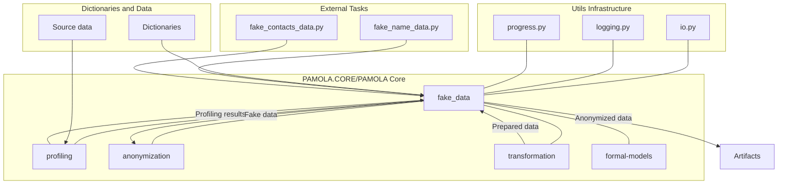

# 1. INTRODUCTION (Revised Version)

## 1.1. Purpose and General Requirements _(High Priority)_

### 1.1.1 Definition and Goal

**Fake data** — plausible data designed to replace real identifying information while preserving formal structure and statistical properties.

**Purpose of the `fake_data` package**:

- Generate and replace identifying and sensitive data in PAMOLA.CORE and PAMOLA/core projects
- Create realistic fake data while maintaining structure and statistical properties
- Support functions for original data restoration and replacement auditing

**Difference from standard solutions:** The package is necessary when:

- "1-to-1" data correspondence is required (deterministic replacements)
- Preserving one-dimensional statistics (e.g., name frequency distribution)
- Accounting for national specifics and specialized reference data (metro stations, regional codes)

**Note**: Fake data differs from synthetic data, which involves more complex statistical implementation with multidimensional distributions.

### 1.1.2 Core Approaches

**Data Generation Strategies:**

1. Using the standard faker.py package for simple cases
2. Using specialized dictionaries for specific data
3. Applying built-in algorithms for special cases (patronymics, phone numbers)

### 1.1.3 Package Objectives _(High Priority)_

**Key Tasks:**

- Generate plausible fake data based on dictionaries
- Replace sensitive information while preserving structural relationships
- Ensure data consistency and integrity
- Support language specifics (Russian, English, Vietnamese)
- Integrate with profiling systems to generate data with appropriate distributions

**"Operations" Paradigm:**

- Core functions are grouped by packages (profiling, transformation, anonymization, fake_data, etc.)
- External scripts call operation functions, providing:
    - Source data
    - Task directory
    - Output directory
    - Auxiliary sources
    - Generation parameters
- Operations return:
    - References to saved artifacts
    - Generation and replacement metrics
    - Time and status information

### 1.1.4 Package Directory Structure _(High Priority)_

```
pamola_core/fake_data/
├── commons/                         # Common components
│   ├── base.py                      # Base classes
│   ├── validators.py                # Data validation
│   └── utils.py                     # Utilities
├── generators/                      # Data generators
│   ├── names.py                     # Name generation
│   ├── contacts.py                  # Email, phone generation
│   └── ids.py                       # Identifier generation
├── mappers/                         # Mapping components
│   ├── one_to_one.py                # One-to-one mapping
│   └── transitivity_handler.py      # Transitive replacement handling
├── operations/                      # Package operations
│   ├── name_operations.py           # Name operations
│   └── contact_operations.py        # Contact operations
├── dictionaries/                    # Dictionaries
├── mapping_store.py                 # Mapping storage
├── operations.py                    # Main operations
└── dictionary_compiler.py           # Dictionary compilation
```

## 1.2. Architectural Position _(High Priority)_

The `fake_data` package integrates with other system components:



### 1.2.1 Interaction with Other Components

**Integration with the profiling module:**

- Receiving analysis results to form realistic distributions
- Using identified patterns to generate structurally similar data
- Obtaining dictionaries of real values for creating replacements

**Integration with the anonymization module:**

- Providing anonymization methods through replacement with fake data
- Ensuring mapping preservation for subsequent restoration
- Supporting various anonymization strategies for different field types

**Using the basic infrastructure:**

- `io.py`: for reading/writing data and dictionaries
- `progress.py`: for tracking progress of long operations
- `logging.py`: for unified logging
- `op_base.py`: for operation implementation

## 1.3. Usage Context _(High Priority)_

### 1.3.1. Personal Data Anonymization

**Main application of the package** is to protect personal data in resumes by replacing identifying information with fake but plausible data. This allows:

- Ensuring compliance with personal data protection regulations
- Protecting job seekers' confidentiality
- Preserving the possibility of data analytics without the risk of information leakage

### 1.3.2. Creating Test Data Sets

**Usage for test data generation:**

- Simulating real data sets while preserving statistical properties
- Safely testing algorithms and systems
- Demonstrating system operation without disclosing real data

### 1.3.3. Deanonymization Risk Assessment _(Medium Priority)_

**Application for anonymization effectiveness evaluation:**

- Modeling attacks on anonymized data
- Determining the optimal balance between data utility and protection level

### 1.3.4. Integration into Data Processing Pipeline _(High Priority)_

**Place in the data processing pipeline:**

1. Data profiling — analyzing structure and distributions
2. Preprocessing — cleaning and normalization
3. Fake data generation — creating realistic replacements
4. Data replacement — applying generated values while preserving mappings
5. Result validation — checking anonymization quality
6. Protected data export — saving in the required format

## 1.4. Key Principles _(High Priority)_

### 1.4.1. Realistic Replacements Based on Dictionaries and Statistics

**Dictionary-based generation:**

- Correspondence to statistical distributions of real data
- Preservation of linguistic features
- Structural consistency of related data
- Compliance with format constraints
- Consideration of national and regional specifics

**Dictionary format:**

- CSV/JSON with fields: id, value, gender (optional), region (optional), weight (optional)
- Support for various data types: names, patronymics, email domains, operator codes

### 1.4.2. Ensuring Data Consistency _(High Priority)_

**Consistency requirements:**

- Gender consistency: names and surnames correspond to gender
- Regional consistency: addresses, phone numbers, names are geographically consistent
- Age consistency: age, date of birth, work experience are non-contradictory
- Format consistency: adherence to formal constraints for each type

**Implementation mechanisms:**

- Centralized attribute management for related fields
- Using common contextual parameters
- Validation of generated data for consistency

### 1.4.3. Supporting 1-to-1 Mapping _(High Priority)_

**Ensuring deterministic replacements:**

- Preserving logical connections between records
- Ensuring reversibility of transformations
- Supporting consistency of replacements across different calls

**Replacement transitivity:**

- Supporting replacement chains (A→B→C)
- Marking transitive mappings
- Checking for cycles and resolving conflicts

### 1.4.4. Multi-language Support _(High Priority)_

**Priority language support:**

- Russian language and Russian data specifics (first iteration)
- English language - US and Canadian variants (second iteration)
- Vietnamese language and Vietnamese data specifics (second iteration)

**Multi-language support requirements:**

- Separate dictionaries of names and surnames for each language
- Rules for generating derivative data (patronymics for Russian language)
- Format specifics for addresses, phone numbers, and identifiers

### 1.4.5. Capability to Generate Fully Synthetic Data _(Medium Priority)_

**Requirements:**

- Generation from scratch based on specified parameters
- Combining different data types into consistent profiles
- Mass generation of arbitrary number of records

### 1.4.6. Vectorization and Scalability _(High Priority)_

**Performance requirements:**

- Using pandas and numpy for vectorized operations
- Supporting batch processing of up to a million records
- Memory optimization when generating large amounts of values

### 1.4.7. Clear Logging and Audit Formats _(High Priority)_

**Audit requirements:**

- Logging in CSV and JSONL formats
- Mandatory fields: timestamp, operation, data type, original hash, fake hash, mapping reference
- Ensuring the ability to audit and restore

### 1.4.8. Empty Value and NULL Support _(High Priority)_

**Requirements:**

- Configurable strategy for empty values
- Accounting for NULL values when forming statistics
- Ability to preserve or fill in missing values

### 1.4.9. Dictionary Compiler and Validation _(Medium Priority)_

**Requirements for the dictionary_compiler.py tool:**

- Checking structure and completeness of dictionary data
- Compiling dictionaries into an optimized format
- Supplementing existing dictionaries with new data
- Validation considering language specifics