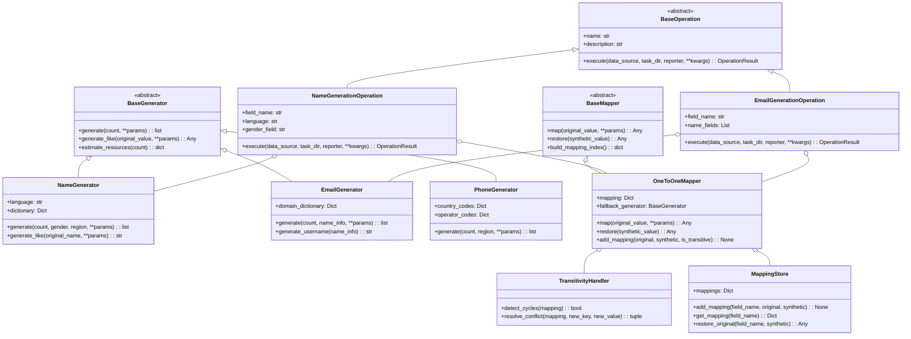
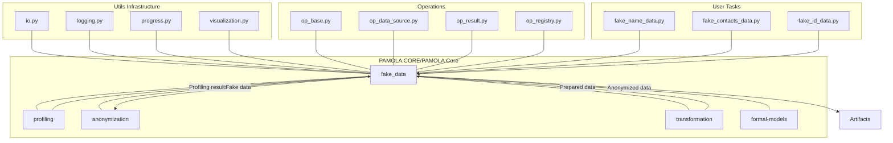
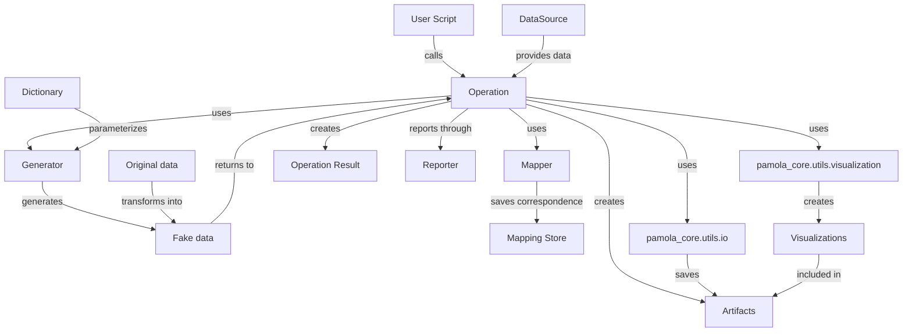
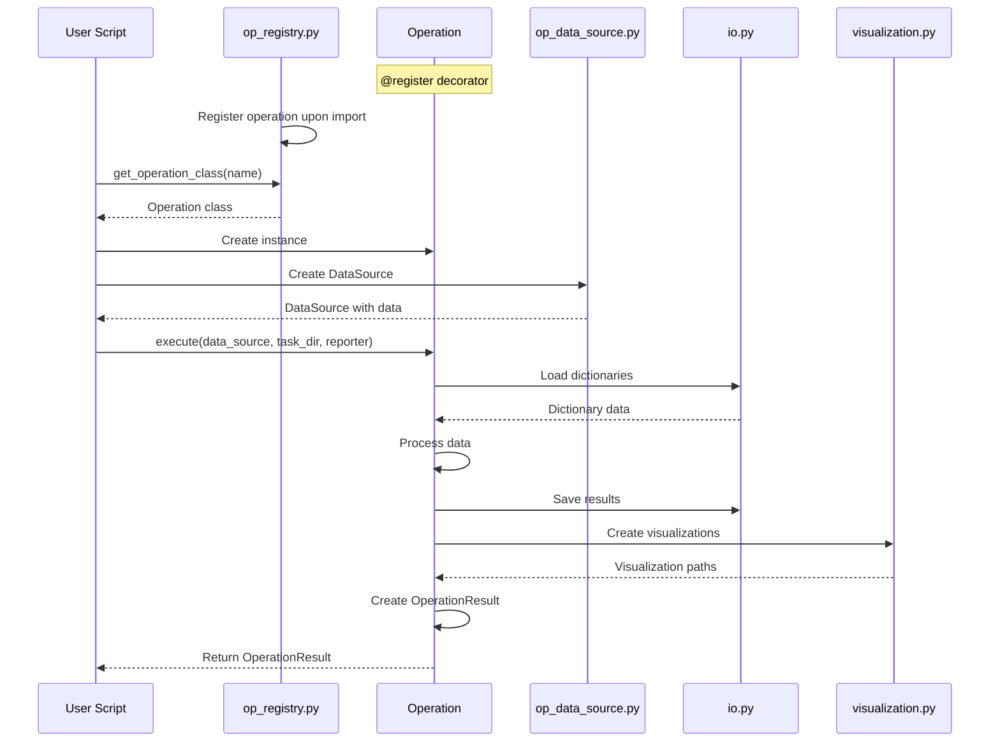

# 2. PACKAGE ARCHITECTURE (Enhanced Version)

## 2.1. General Package Structure _(High Priority)_

The `fake_data` package implements a modular architecture ensuring clear separation of responsibilities, extensibility, and maintainability. It's important to note that the package itself **does not contain any data files (CSV, JSON)** - all dictionaries and configuration files are stored externally and provided to the package by user scripts. Dictionaries are typically located in external directories (e.g., `data/dictionaries/`), while the `fake_data` package only contains code modules.

**Key Modules and Subpackages:**

|Module/Subpackage|Purpose|Key Components|Responsibilities|
|---|---|---|---|
|**commons/**|Common utilities and base components|`base.py`, `validators.py`, `utils.py`|Provides abstract base classes, validation functions, and utility helpers used throughout the package|
|**generators/**|Data generation components|`names.py`, `contacts.py`, `ids.py`|Contains specialized generators for different data types that create realistic fake values while preserving statistical properties|
|**mappers/**|Mapping management|`one_to_one.py`, `transitivity_handler.py`|Handles the correspondence between original and synthetic values, ensuring deterministic replacements and resolving conflicts|
|**operations/**|Data processing operations|`name_operations.py`, `contact_operations.py`|Implements PAMOLA.CORE-compatible operations for processing different data types, integrating generators and mappers|
|**mapping_store.py**|Mapping repository|Storage and retrieval mechanisms|Manages persistent storage of mappings, supporting bidirectional lookups and transitivity marking|
|**operations.py**|Core operation definitions|Base operations, registry integration|Provides foundation for all operations and integration with the operations infrastructure|
|**dictionary_compiler.py**|Dictionary management utility|Validation, compilation, optimization|Provides tools for checking, compiling, and optimizing external dictionaries before use|

## 2.2. UML Class Diagram _(High Priority)_



## 2.3. Module Responsibilities _(High Priority)_

### 2.3.1. `commons` Module

**Purpose:** Common components used throughout the package

**Requirements:**

- **base.py**: Must define base abstract classes with common interfaces
- **validators.py**: Must provide validation for various data types (names, phones, email)
- **utils.py**: Must provide helper functions for working with strings, dates, formats

### 2.3.2. `generators` Module

**Purpose:** Generators for various types of fake data

**Requirements:**

- **names.py**: Must generate first names, last names, and patronymics considering gender, language, and region
- **contacts.py**: Must create realistic email addresses and phone numbers
- **ids.py**: Must generate various types of identification numbers

**Interfaces:**

- Each generator must implement the `BaseGenerator` interface
- Methods must support parameters for region, gender, and language

### 2.3.3. `mappers` Module

**Purpose:** Mapping between original and fake data

**Requirements:**

- **one_to_one.py**: Must implement "one-to-one" mapping with support for replacement stability
- **transitivity_handler.py**: Must manage transitive replacements and resolve cyclic dependencies

**Interfaces:**

- Each mapper must implement the `BaseMapper` interface
- Must have methods for adding, retrieving, and restoring mappings

### 2.3.4. `operations` Module

**Purpose:** Data processing operations implementing the PAMOLA.CORE operations interface

**Requirements:**

- **name_operations.py**: Must implement operations for generating and replacing first names, last names, patronymics
- **contact_operations.py**: Must provide operations for working with contact data
- **id_operations.py**: Must contain operations for working with identification data

**Interfaces:**

- Each operation must inherit from `BaseOperation`
- Must implement `execute()` methods with support for batch processing

### 2.3.5. Pamola Core Files

**Requirements:**

- **mapping_store.py**: Must manage the mapping repository, ensure saving and loading
- **operations.py**: Must provide basic operations and integration with PAMOLA.CORE infrastructure
- **dictionary_compiler.py**: Must provide compilation, verification, and optimization of dictionaries

## 2.4. Key Interfaces and Abstractions _(High Priority)_

### 2.4.1. Abstract Class `BaseGenerator`

**Interface Requirements:**

- Method `generate(count, **params)` for generating a specified number of values
- Method `generate_like(original_value, **params)` for generating a value similar to the original
- Method `analyze_value(value)` for analyzing the structure of the original value
- Method `estimate_resources(count)` for estimating resources needed for generation

**Critical Generation Parameters:**

- `gender`: gender ('M'/'F')
- `region`: region/country
- `language`: language
- `seed`: initial value for the random number generator

### 2.4.2. Abstract Class `BaseMapper`

**Interface Requirements:**

- Method `map(original_value, **params)` for mapping original value to fake value
- Method `restore(synthetic_value)` for restoring original value from fake value
- Method `add_mapping(original, synthetic, is_transitive)` for adding a new mapping
- Method `check_conflicts(original, synthetic)` for checking conflicts when adding a mapping

**Critical Mapping Parameters:**

- `force_new`: force creation of a new value
- `context`: contextual information for consistency
- `preserve_format`: preserve original format

### 2.4.3. Class `FieldOperation`

**Interface Requirements:**

- Method `execute(data_source, task_dir, reporter, **kwargs)` for performing the operation
- Method `process_batch(batch)` for processing a single batch of data
- Methods `preprocess_data(df)` and `postprocess_data(df)` for preparing and finalizing data
- Method `handle_null_values(df)` for handling NULL values

**Critical Operation Parameters:**

- `field_name`: name of the field being processed
- `batch_size`: batch size for processing
- `null_strategy`: strategy for handling NULL values

### 2.4.4. Class `MappingStore`

**Interface Requirements:**

- Method `add_mapping(field_name, original, synthetic, is_transitive)` for adding a mapping
- Method `get_mapping(field_name)` for retrieving mappings for a field
- Method `restore_original(field_name, synthetic)` for restoring the original value
- Methods `save(path)` and `load(path)` for saving and loading mappings

**Storage Structure:**

- Direct mappings `{field_name: {original: synthetic}}`
- Reverse mappings `{field_name: {synthetic: original}}`
- Transitivity markers `{field_name: {original: is_transitive}}`

## 2.5. Architectural Position _(High Priority)_

The `fake_data` package is part of the pamola core of PAMOLA.CORE and PAMOLA/core projects and integrates with other functional packages:



### 2.5.1. Interaction with Other Components _(High Priority)_

**Integration requirements with the `profiling` module:**

- Receiving data analysis results for creating realistic distributions
- Using identified patterns to generate structurally similar data
- Obtaining dictionaries of real values for creating realistic replacements

**Integration requirements with the `anonymization` module:**

- Providing anonymization methods through replacement with fake data
- Ensuring mapping preservation for subsequent restoration
- Supporting various anonymization strategies for different field types

**Requirements for interaction with the basic infrastructure:**

- Using `io.py` for reading/writing data through a standardized interface
- Using `progress.py` for tracking execution progress
- Using `logging.py` for unified logging
- Using `op_base.py` for implementing operations through base classes

### 2.5.2. Integration with pamola_core.utils.io _(High Priority)_

The `fake_data` package must fully rely on the `pamola_core.utils.io` module for all data reading and writing operations, including:

**For dictionaries and configurations:**

- Reading dictionaries using `read_full_csv` or `read_json` depending on the format
- Working with CSV (UTF-16) and JSON (UTF-8) formats in accordance with the formats supported by `io.py`
- Supporting staged reading of large dictionaries using `read_csv_in_chunks`
- Validating dictionary structure after reading

**For operation results:**

- Saving data using `write_dataframe_to_csv` or `save_dataframe`
- Saving mappings in JSON format using `write_json`
- Using `ensure_directory` to create directories instead of direct calls to `os.makedirs`
- Supporting incremental addition of records to logs via `append_to_json_array`

**For working with the file system:**

- Using `get_timestamped_filename` to create unique file names
- Getting file information via `get_file_stats`
- Working with file lists via `list_directory_contents`

### 2.5.3. Integration with pamola_core.utils.visualization _(High Priority)_

The `fake_data` package should use `pamola_core.utils.visualization` to create visualizations of the quality and characteristics of fake data:

**Types of required visualizations:**

- Histograms of value distributions for numeric data via `create_histogram`
- Charts of categorical data distributions (e.g., email domains) via `create_bar_plot`
- Comparative visualizations of original and fake data distributions via `plot_value_distribution`
- Visualization of text characteristics via `plot_text_length_distribution`

**Integration requirements:**

- All visualizations must be created through the `visualization.py` module API
- Visualization results must be saved as operation artifacts
- For large datasets, samples or aggregated representations should be used
- Visualizations must have informative titles and axis labels

### 2.5.4. Integration with op_registry.py _(High Priority)_

The `fake_data` package must properly integrate with the operation registration system via `op_registry.py`:

**Operation registration requirements:**

- All operations must be registered in the PAMOLA.CORE system operation registry
- Using the `@register` decorator for automatic registration of operation classes
- Registration should occur upon module import (in `__init__.py` or directly in modules)
- Categorization of operations in the registry by data types (names, contacts, identifiers, etc.)

**Operation metadata requirements:**

- Correct specification of documentation in class docstrings for automatic generation of descriptions
- Structuring constructor parameters for display in UI and documentation
- Specification of operation category for grouping in interfaces

**Example of operation registration usage:**

- The operations module must contain the import of the `register` decorator from `pamola_core.utils.ops.op_registry`
- Operation classes must be decorated with category specification (e.g., `@register(category='fake_data')`)
- The `__init__.py` module of the operations package must ensure registration of all operations

### 2.5.5. Integration with op_result.py and Result Formation _(High Priority)_

All fake data generation operations must correctly form and return `OperationResult` objects defined in `op_result.py`:

**Operation results structure:**

- Each operation must return an instance of `OperationResult`
- Operation status must correspond to one of the defined `OperationStatus` states (SUCCESS, WARNING, ERROR, SKIPPED)
- Operation artifacts (resulting files) must be registered via `add_artifact` with specification of type and description
- Operation metrics must include the number of processed records, execution time, and quality statistics

**Types of artifacts that should be included in results:**

- Output dataset with fake values (CSV, JSON)
- Mapping files for correspondence between original and fake values (JSON)
- Data distribution visualizations (PNG)
- Operation logs in JSONL format
- Fake data quality metrics (JSON)

**Error handling and operation statuses:**

- Operation must return SUCCESS status on complete successful execution
- Operation must return WARNING status on partial success (e.g., with minor errors)
- Operation must return ERROR status on critical errors preventing execution
- Operation must return SKIPPED status if it is skipped due to lack of necessary data or parameters

### 2.5.6. Interaction with External Scripts _(High Priority)_

The package must provide a standardized interface for external scripts:

**Example of operation usage (interface):**

```python
# Example of using the fake name generation operation
from pamola_core.fake_data.operations import NameGenerationOperation
from pamola_core.utils.ops.op_data_source import DataSource
from pamola_core.utils.task_reporting import Reporter

# Create and configure the operation
operation = NameGenerationOperation(
    field_name="first_name",
    target_gender="M",
    language="ru",
    min_frequency=2
)

# Execute the operation
result = operation.execute(
    data_source=data_source,
    task_dir=Path("data/processed/fake_names"),
    reporter=Reporter()
)

# Get results
if result.status == OperationStatus.SUCCESS:
    # Access artifacts and metrics
    output_file = next((a.path for a in result.artifacts if a.artifact_type == "csv"), None)
    processed_count = result.metrics.get("processed_count", 0)
```

## 2.6. Data Flows and Component Interactions _(High Priority)_

### 2.6.1. Typical Data Processing Flow



**Processing sequence:**

1. **Operation initialization** - creation with specified parameters
2. **Preparation** - getting data via DataSource, initializing generators and mappers
3. **Dictionary loading** - reading dictionaries using pamola_core.utils.io
4. **Generation and mapping** - for each original value, generator and mapper are called
5. **Saving results** - writing modified data via pamola_core.utils.io
6. **Visualization** - creating visualizations via pamola_core.utils.visualization
7. **Result formation** - creating OperationResult with artifacts and metrics
8. **Reporting** - registering artifacts and returning operation result

### 2.6.2. Operation Registration and Execution Process



## 2.7. Configuration and Extensibility _(Medium Priority)_

### 2.7.1. Extension Mechanisms

**Extensibility requirements:**

1. **Adding new generators**:
    
    - Creating classes inheriting from `BaseGenerator`
    - Implementing required interface methods
2. **Adding new mappers**:
    
    - Creating classes inheriting from `BaseMapper`
    - Implementing required interface methods
3. **Adding new operations**:
    
    - Inheriting from `FieldOperation` or `BaseOperation`
    - Registration via `@register` decorator

### 2.7.2. Generator Configuration

**Configurability requirements:**

1. **Dictionary configuration**:
    
    - Specifying paths to dictionaries for loading
    - Configuring dictionary priorities and weights
2. **Generation parameters**:
    
    - Configuring language, region, format
    - Configuration of dependent field generation
3. **Error handling**:
    
    - Configuration of actions when generation is impossible
    - Strategies for edge cases

### 2.7.3. Logging Configuration

**Logging requirements:**

1. **Levels**:
    
    - Detailed for debugging
    - Informational for monitoring
    - Errors only for production
2. **Formats**:
    
    - Text for human reading
    - JSON for machine processing
    - CSV for analysis
3. **Target destinations**:
    
    - Console for interactive monitoring
    - Files for storage
    - External logging systems

## 2.8. Security Measures _(Medium Priority)_

### 2.8.1. Protecting Confidential Data

**Security requirements:**

1. **Mappings**:
    
    - Storage encryption option
    - File access control
    - Hashing of sensitive data
2. **Storage**:
    
    - Ability to encrypt output files
    - Separation into public and confidential artifacts
    - Cleaning temporary files
3. **Audit**:
    
    - Logging data operations
    - Tracking access to mappings
    - Recording replacement history

## 2.9. Implementation Recommendations _(High Priority)_

### 2.9.1. Modularity

**Key principles:**

- Divide functionality into logically related components
- Minimize connections between modules
- Ensure testability of each component separately
- Use factories and dependency injection to simplify testing
- Follow the single responsibility principle for classes

### 2.9.2. Performance

**Key principles:**

- Use vectorized pandas/numpy operations
- Implement efficient dictionary caching
- Optimize operations with large data volumes
- Use batch processing for memory efficiency
- Apply profiling to identify bottlenecks

### 2.9.3. Resilience

**Key principles:**

- Ensure proper error handling
- Implement input data validation
- Support recovery after failures
- Save intermediate results during long operations
- Ensure idempotency of operations where possible

### 2.9.4. Documentation

**Key principles:**

- Provide detailed docstrings for all classes and methods (all in English)
- Support automatic documentation generation
- Include usage examples for all public interfaces
- Document expected inputs and outputs
- Maintain documentation currency when code changes

## 2.10. Output Result and Artifact Formats _(High Priority)_

### 2.10.1. OperationResult Structure

**Operation result requirements:**

- Using the `OperationResult` class from `op_result.py` for all operations
- Structuring the result with fields:
    - `status`: Execution status from `OperationStatus` (SUCCESS, WARNING, ERROR, SKIPPED)
    - `artifacts`: List of created artifacts with types and descriptions
    - `metrics`: Operation execution metrics (count, time, performance)
    - `error_message`: Error message (if status == ERROR)
    - `execution_time`: Operation execution time in seconds

**Artifact types:**

- `csv`: Output data in CSV format
- `json`: Mappings and metadata in JSON format
- `jsonl`: Operation logs in JSONL format
- `png`: Distribution and metric visualizations
- `html`: Interactive reports (if necessary)

### 2.10.2. Reporter Integration

**Reporting requirements:**

- Using the `reporter` object to register key operation stages
- Adding information about created artifacts via `reporter.add_artifact()`
- Tracking execution progress using `reporter.update_progress()`
- Structuring details in a format compatible with the reporter

### 2.10.3. Result Visualization

**Visualization requirements:**

- Creating a standard set of visualizations for each data type
- Using `visualization.py` to generate all visual representations
- Saving visualizations in PNG format for inclusion in reports
- Providing informative captions and labels on all charts
- Standardized formats for visualization file names