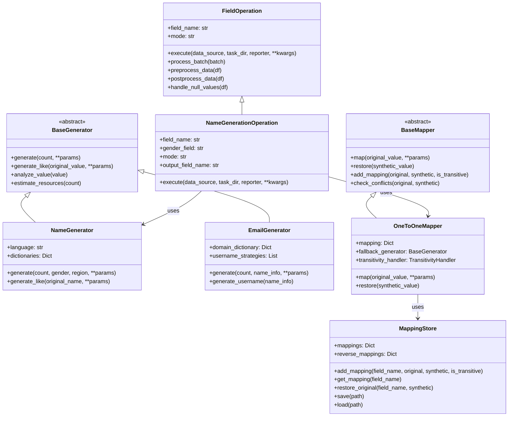
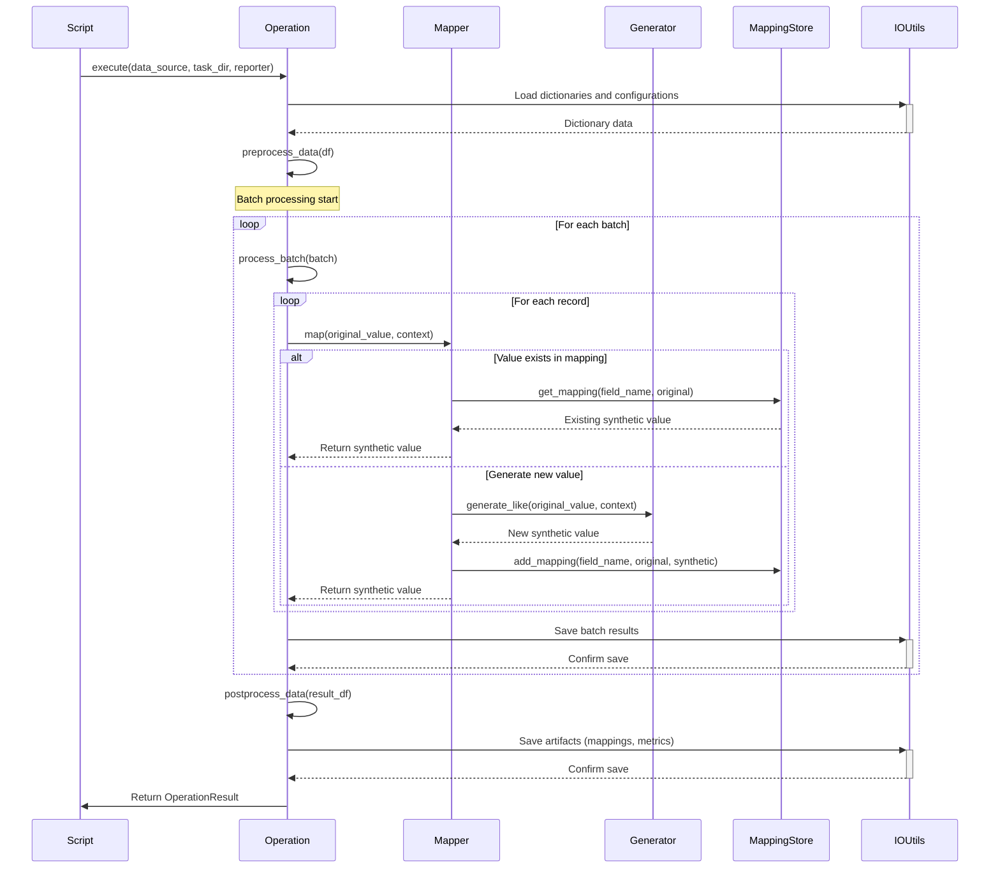

# 6. IMPLEMENTATION DETAILS (Enhanced Version)

## 6.1. Base Classes and Interfaces

### 6.1.1. Key Abstract Classes

**BaseGenerator** _(High Priority)_

- Defines a unified interface for all generators
- Key methods: `generate(count, **params)`, `generate_like(original_value, **params)`, `analyze_value(value)`, `estimate_resources(count)`
- Must support parameterization including gender, region, language, seed
- Contains mechanisms for parameter validation, data structure analysis, and performance estimation
- Should implement error handling for invalid inputs and resource constraints

**BaseMapper** _(High Priority)_

- Defines the interface for data mapping components
- Key methods: `map(original_value, **params)`, `restore(synthetic_value)`, `add_mapping(original, synthetic, is_transitive)`, `check_conflicts(original, synthetic)`
- Responsible for ensuring deterministic and consistent mappings
- Must handle cases where synthetic values already exist as originals
- Should provide extensible conflict resolution mechanisms

**FieldOperation** _(High Priority)_

- Base class for data field operations integrating with PAMOLA.CORE infrastructure
- Core methods: `execute(data_source, task_dir, reporter, **kwargs)`, `process_batch(batch)`, `preprocess_data(df)`, `postprocess_data(df)`, `handle_null_values(df)`
- Provides batch processing, progress reporting, and NULL value handling
- Must support both replacement and enrichment modes (adding new fields)
- Should handle data validation and transformation

**MappingStore** _(High Priority)_

- Repository for mappings between original and fake data
- Core functionality: bidirectional mapping, serialization/deserialization, transitivity support
- Key methods: `add_mapping(field_name, original, synthetic, is_transitive)`, `get_mapping(field_name)`, `restore_original(field_name, synthetic)`, `save(path)`, `load(path)`
- Must maintain mapping integrity across multiple operations
- Should support incremental updates and backward compatibility

### 6.1.2. Class Diagram

## 6.2. Critical Components for the First Iteration
### 6.2.1. Generators _(High Priority)_

**NameGenerator**

- Generation of first and last names considering gender and region
- Required for Russian language (primarily)
- Uses name dictionaries

**EmailGenerator**

- Generation of email addresses based on name or pattern
- Support for various login formation strategies
- Use of domain dictionaries

**PhoneGenerator**

- Generation of phone numbers considering regional formats
- Support for formats for Russia (primarily)
- Use of operator code dictionaries

### 6.2.2. Mappers _(High Priority)_

**OneToOneMapper**

- Main implementation of "one-to-one" mapper
- Ensuring deterministic replacements
- Basic transitivity support

**TransitivityHandler** _(Medium Priority)_

- Processing transitive replacements and conflicts
- Resolving cyclic dependencies
- Complex resolution logic may be deferred to subsequent versions

### 6.2.3. Operations _(High Priority)_

**NameGenerationOperation**

- Replacement of first and last names
- Integration with name generator and mapper
- Support for gender specifics

**EmailGenerationOperation**

- Replacement of email addresses
- Integration with email generator and mapper
- Ability to preserve part of the original (domain)

**PhoneGenerationOperation**

- Replacement of phone numbers
- Integration with phone generator and mapper
- Preservation of regional specifics

## 6.3. Data Flows and Interactions

### 6.3.1. Typical Workflow _(High Priority)_

1. User script creates an operation and configures parameters
2. Operation receives data through DataSource
3. For each record:
    - Mapping is performed through OneToOneMapper
    - If no existing mapping, generator is used
    - Result is saved in mapping
4. Processed data and mappings are saved as artifacts
5. Metrics and visualizations are generated for result analysis

### 6.3.2. Sequence Diagram for Typical Operation

## 6.4. Advanced Implementation Requirements

### 6.4.1     Dictionary-based Generation

- Efficient dictionary loading and indexing mechanisms
- Weighting and sampling algorithms for realistic distribution
- Handling of missing or incomplete dictionary data
- Cross-dictionary consistency enforcement (e.g., names matching regions)
- Support for dictionary updates without breaking existing mappings

### 6.4.2     Statistical Preservation

- Algorithms for preserving one-dimensional statistical distributions
- Methods for maintaining correlations between fields
- Techniques for preserving data patterns and relationships
- Distribution analysis and validation tools
- Statistical comparison between original and synthetic datasets

### 6.4.3     Multilingual Support Implementation

- Character set handling for different languages
- Transliteration rules between writing systems
- Language-specific validation rules
- Region-specific formatting conventions
- Mechanisms for adding support for new languages

### 1.1.4     Performance Optimization Techniques

- Vectorized operations for batch processing
- Memory-efficient data structures for large dictionaries
- Caching strategies for frequently used values
- Parallel processing for independent operations
- Progress monitoring and performance analytics

## 6.5     Framework Level Requirements

### 6.5.1     Error Handling and Validation Framework

- Comprehensive exception hierarchy for specific error types
- Validation framework for input and output data
- Error recovery mechanisms for partial failures
- Detailed error logging with context information
- User-friendly error messages and diagnostics

### 6.5.2     Integration with PAMOLA.CORE Infrastructure

- Compliance with PAMOLA operation registry and lifecycle
- Standardized artifact generation and management
- Integration with metadata and task systems
- Reporter integration for progress and status updates
- Support for PAMOLA.CORE's IO utilities and data sources

### 6.5.3     Configuration System

- Configuration file format and schema
- Environment variable integration
- Runtime configuration adjustments
- Operation-specific configuration profiles
- Validation and normalization of configuration parameters

### 6.5.4     Mapping Persistence and Management

- Efficient serialization formats for mappings
- Versioning system for mapping files
- Incremental updates to existing mappings
- Mapping migration tools between versions
- Security features for sensitive mapping data

### 6.5.5     Audit and Logging Implementation

- Structured logging architecture for different log levels
- Comprehensive audit trail generation
- Hash-based identification for privacy
- Log rotation and archiving mechanisms
- Query and analysis tools for audit logs

### 6.5.6     Security Implementation

- Hashing algorithms for sensitive data
- Encryption for mapping storage
- Access control mechanisms for operations
- Secure temporary file handling
- Data minimization techniques

### 6.5.7     Quality Assurance Framework

- Extensive unit and integration test suite
- Property-based testing for generators
- Performance benchmarking tools
- Validation metrics for generated data
- Regression testing for backward compatibility

### 6.5.8     Extensibility Mechanisms

- Plugin architecture for custom generators
- Extension points for new data types
- Hooks for pre/post-processing
- Custom validator registration
- Integration of APIs for external systems

### 6.5.9     Deployment and Packaging

- Package structure and dependency management
- Installation procedures
- Documentation and examples
- Release management process
- Compatibility testing with different environments

