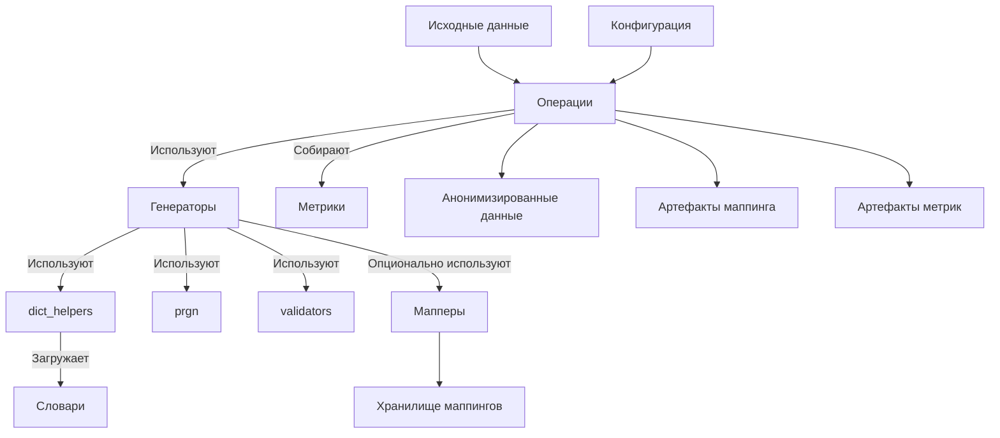

# Комплексная спецификация пакета pamola_core.fake_data

## 1. Общая структура пакета

```
pamola_core/fake_data/
├── __init__.py
├── operations.py              # Базовые классы операций
├── constants.py               # Общие константы
├── commons/                   # Общие утилиты
│   ├── __init__.py
│   ├── base.py                # Базовые абстрактные классы
│   ├── dict_helpers.py        # Работа со словарями 
│   ├── prgn.py                # Псевдо-случайная генерация
│   ├── metrics.py             # Сбор и анализ метрик
│   ├── validators.py          # Валидаторы разных типов данных
│   ├── string_utils.py        # Утилиты для работы со строками
│   ├── language_utils.py      # Языковые утилиты и транслитерация
│   ├── contact_utils.py       # Утилиты для контактных данных
│   └── geo_utils.py           # Географические утилиты
├── mapping_store.py           # Хранилище маппингов
├── generators/                # Генераторы разных типов данных
│   ├── __init__.py
│   ├── base_generator.py      # Базовый класс генератора
│   ├── names.py               # Генератор имен
│   ├── email.py               # Генератор email
│   ├── phone.py               # Генератор телефонов
│   ├── address.py             # Генератор адресов
│   └── organization.py        # Генератор организаций
├── mappers/                   # Класcы маппинга
│   ├── __init__.py
│   ├── one_to_one.py          # Маппинг один-к-одному
│   └── transitivity_handler.py # Обработчик транзитивностей
└── dictionaries/              # Встроенные словари
    ├── __init__.py
    ├── names.py               # Словари имен
    ├── domains.py             # Словари email-доменов
    ├── phones.py              # Словари телефонных кодов
    ├── addresses.py           # Словари адресных компонентов
    └── organizations.py       # Словари организаций
```

## 2. Ключевые компоненты и их взаимодействие

### 2.1. Основные потоки данных



### 2.2. Взаимодействие компонентов

1. **Операции** обрабатывают исходные данные, используя генераторы для создания синтетических значений.
2. **Генераторы** создают правдоподобные данные с помощью словарей и PRGN.
3. **Мапперы** обеспечивают сохранение соответствия между оригинальными и синтетическими значениями.
4. **Словари** предоставляют реальные данные для генерации правдоподобных значений.
5. **Метрики** анализируют качество генерации и соответствие статистическим характеристикам.

## 3. Детализация компонентов

### 3.1. Операции (operations.py)

```python
class BaseOperation:
    """Базовый класс для всех операций пакета."""
    
    name: str = "base_operation"
    description: str = "Base operation for fake data generation"
    
    def execute(self, data_source: Any, task_dir: Path, reporter: Any, **kwargs) -> OperationResult:
        """Выполняет операцию и возвращает результат."""
        pass

class FieldOperation(BaseOperation):
    """Операция для обработки конкретного поля данных."""
    
    def __init__(self, field_name: str, mode: str = "REPLACE", 
                 output_field_name: Optional[str] = None,
                 batch_size: int = 10000, null_strategy: str = "PRESERVE"):
        pass
    
    def process_batch(self, batch: pd.DataFrame) -> pd.DataFrame:
        """Обрабатывает пакет данных."""
        pass

class GeneratorOperation(FieldOperation):
    """Операция, использующая генератор для создания синтетических данных."""
    
    def __init__(self, field_name: str, 
                 generator: 'BaseGenerator',
                 mode: str = "REPLACE",
                 output_field_name: Optional[str] = None,
                 null_strategy: str = "PRESERVE",
                 collect_metrics: bool = True,
                 **kwargs):
        pass
    
    def process_batch(self, batch: pd.DataFrame) -> pd.DataFrame:
        """Обрабатывает пакет данных, используя генератор."""
        pass
    
    def collect_metrics(self, original_df: pd.DataFrame, processed_df: pd.DataFrame) -> Dict[str, Any]:
        """Собирает метрики качества генерации."""
        pass
```

### 3.2. Базовый генератор (generators/base_generator.py)

```python
class BaseGenerator(ABC):
    """Абстрактный базовый класс для всех генераторов."""
    
    @abstractmethod
    def generate(self, count: int, **params) -> List[Any]:
        """Генерирует заданное количество значений."""
        pass
    
    @abstractmethod
    def generate_like(self, original_value: Any, **params) -> Any:
        """Генерирует значение, похожее на оригинальное."""
        pass
    
    @abstractmethod
    def transform(self, values: List[Any], **params) -> List[Any]:
        """Преобразует список значений в синтетические."""
        pass
    
    @abstractmethod
    def validate(self, value: Any) -> bool:
        """Проверяет соответствие значения ожидаемому формату."""
        pass
```

### 3.3. Метрики (commons/metrics.py)

```python
class MetricsCollector:
    """Базовый класс для сбора метрик."""
    
    def collect_basic_stats(self, df: pd.DataFrame, column: str) -> Dict[str, Any]:
        """Собирает базовые статистические метрики для колонки."""
        pass
    
    def compare_distributions(self, orig_df: pd.DataFrame, fake_df: pd.DataFrame, 
                              column: str) -> Dict[str, float]:
        """Сравнивает распределения в оригинальной и синтетической колонках."""
        pass

class NameMetricsCollector(MetricsCollector):
    """Сборщик метрик для имен."""
    
    def collect_gender_metrics(self, orig_df: pd.DataFrame, fake_df: pd.DataFrame, 
                               name_column: str, gender_column: Optional[str] = None) -> Dict[str, Any]:
        """Собирает метрики по гендерному распределению."""
        pass
    
    def collect_linguistic_metrics(self, orig_df: pd.DataFrame, fake_df: pd.DataFrame, 
                                  name_column: str) -> Dict[str, Any]:
        """Собирает лингвистические метрики."""
        pass
```

### 3.4. Валидаторы (commons/validators.py)

```python
def validate_name(name: str, language: str = "ru") -> Dict[str, Any]:
    """Валидирует имя."""
    pass

def validate_email(email: str) -> Dict[str, Any]:
    """Валидирует email-адрес."""
    pass

def validate_phone(phone: str, region: str = "RU") -> Dict[str, Any]:
    """Валидирует телефонный номер."""
    pass

def validate_address(address: str, region: str = "RU") -> Dict[str, Any]:
    """Валидирует адрес."""
    pass

def validate_organization(org: str) -> Dict[str, Any]:
    """Валидирует название организации."""
    pass
```

## 4. Разработка в разных чатах: Необходимые файлы и документы

Для разработки различных частей системы в отдельных чатах, необходимо обеспечить доступ к ключевым документам, определяющим архитектуру и интерфейсы.

### 4.1. Базовые документы, необходимые для всех чатов

1. **structure.json** - Общая структура проекта
2. **fake-data-infrastructure.md** - Обзор инфраструктуры пакета
3. **fake_data.md** - Общая документация по пакету
4. **operations.py** - Текущий код базовых операций

### 4.2. Документы для разработки генераторов

1. **prgn.md** - Документация по подсистеме псевдо-случайной генерации
2. **dictionaries.md** - Документация по работе со словарями
3. **validators.py** - Код валидаторов
4. **utils.py** - Код утилит
5. **base_generator.py** (если уже существует) - Базовый класс генераторов

### 4.3. Документы для разработки операций

1. **mapping_store.md** - Документация по хранилищу маппингов
2. **names.md** - Спецификация генератора имен (как пример)

### 4.4. Документы для разработки валидаторов и утилит

1. **validators.py** - Текущий код валидаторов
2. **utils.py** - Текущий код утилит
3. **dictionaries.md** - Документация по работе со словарями

## 5. Детальная спецификация модулей

### 5.1. Операции (operations.py)

#### Назначение

Предоставляет базовые классы для операций, интегрирующихся с инфраструктурой PAMOLA.CORE для обработки данных.

#### Ключевые функциональности

- Интеграция с инфраструктурой PAMOLA.CORE (загрузка и сохранение данных)
- Пакетная обработка больших наборов данных
- Сбор метрик и генерация отчетов
- Поддержка режимов REPLACE и ENRICH
- Управление обработкой NULL-значений
- Интеграция с системой прогресса

#### Интерфейс и API

```python
# Интерфейс BaseOperation
def execute(data_source, task_dir, reporter, **kwargs) -> OperationResult

# Интерфейс FieldOperation
def process_batch(batch) -> pd.DataFrame
def preprocess_data(df) -> pd.DataFrame
def postprocess_data(df) -> pd.DataFrame
def handle_null_values(df) -> pd.DataFrame

# Интерфейс GeneratorOperation
def process_value(value, **params) -> Any
def collect_metrics(original_df, processed_df) -> Dict[str, Any]
```

#### Зависимости

- pamola_core.utils.ops.op_base
- pamola_core.utils.ops.op_result
- pamola_core.utils.ops.op_registry
- pamola_core.utils.io
- pamola_core.utils.progress
- pamola_core.fake_data.generators.base_generator
- pamola_core.fake_data.commons.metrics

### 5.2. Генераторы (generators/)

#### Назначение

Предоставляют функциональность для генерации различных типов синтетических данных.

#### Ключевые функциональности

- Генерация синтетических данных (имена, email, телефоны, адреса, организации)
- Поддержка разных языков и регионов
- Поддержка детерминистической генерации
- Валидация сгенерированных данных

#### Интерфейс и API

```python
# Интерфейс BaseGenerator
def generate(count, **params) -> List[Any]
def generate_like(original_value, **params) -> Any
def transform(values, **params) -> List[Any]
def validate(value) -> bool

# Интерфейс специфичных генераторов (например, NameGenerator)
def generate_first_name(gender=None, language=None) -> str
def generate_last_name(gender=None, language=None) -> str
def generate_full_name(gender=None, language=None, format=None) -> str
```

#### Зависимости

- pamola_core.fake_data.commons.dict_helpers
- pamola_core.fake_data.commons.prgn
- pamola_core.fake_data.commons.validators
- pamola_core.fake_data.dictionaries
- pamola_core.fake_data.mappers (опционально)

### 5.3. Метрики (commons/metrics.py)

#### Назначение

Предоставляет функциональность для сбора и анализа метрик качества генерации.

#### Ключевые функциональности

- Сбор статистических метрик для оригинальных и синтетических данных
- Сравнение распределений
- Расчет метрик сохранения статистических свойств
- Анализ лингвистических особенностей (для имен)
- Анализ форматного соответствия

#### Интерфейс и API

```python
# Интерфейс MetricsCollector
def collect_basic_stats(df, column) -> Dict[str, Any]
def compare_distributions(orig_df, fake_df, column) -> Dict[str, float]
def collect_format_metrics(orig_df, fake_df, column) -> Dict[str, Any]
def collect_performance_metrics(start_time, end_time, processed_records) -> Dict[str, Any]

# Интерфейс NameMetricsCollector
def collect_gender_metrics(orig_df, fake_df, name_column, gender_column) -> Dict[str, Any]
def collect_linguistic_metrics(orig_df, fake_df, name_column) -> Dict[str, Any]
```

#### Зависимости

- pandas
- numpy
- pamola_core.fake_data.commons.validators

### 5.4. Валидаторы (commons/validators.py)

#### Назначение

Предоставляет функциональность для валидации различных типов данных.

#### Ключевые функциональности

- Валидация имен
- Валидация email-адресов
- Валидация телефонных номеров
- Валидация адресов
- Валидация названий организаций
- Региональная параметризация валидаторов

#### Интерфейс и API

```python
def validate_name(name, language) -> Dict[str, Any]
def validate_email(email) -> Dict[str, Any]
def validate_phone(phone, region) -> Dict[str, Any]
def validate_address(address, region) -> Dict[str, Any]
def validate_organization(org) -> Dict[str, Any]
def validate_format(value, format_pattern) -> Dict[str, Any]
```

#### Зависимости

- re
- pamola_core.fake_data.commons.language_utils

### 5.5. Специализированные утилиты (commons/)

#### Назначение

Предоставляют общие функции для обработки различных типов данных.

#### Ключевые функциональности

- Нормализация строк
- Хеширование значений
- Определение языка
- Определение пола по имени
- Транслитерация
- Форматирование телефонных номеров
- Создание имен пользователей

#### Интерфейс и API

```python
# Общие утилиты (commons/string_utils.py)
def normalize_string(value, keep_case, remove_punctuation) -> str
def hash_value(value, salt, algorithm) -> str
def generate_deterministic_value(seed_value, length, chars) -> str

# Языковые утилиты (commons/language_utils.py)
def detect_language(text) -> str
def detect_gender_from_name(name, language, name_gender_dict) -> Optional[str]
def transliterate(text, source_lang, target_lang) -> str

# Контактные утилиты (commons/contact_utils.py)
def format_phone_number(digits, region, formatting) -> str
def create_username_from_name(first_name, last_name, style, min_length, max_length, exclude_list) -> str
```

#### Зависимости

- hashlib
- random
- unicodedata
- re
- langdetect (опционально)
- transliterate (опционально)

## 6. Критические интерфейсы и контракты

Для обеспечения согласованности разработки в разных контекстах, необходимо строго соблюдать следующие интерфейсы:

### 6.1. Интерфейс BaseGenerator

```python
class BaseGenerator(ABC):
    @abstractmethod
    def generate(self, count: int, **params) -> List[Any]:
        """Генерирует заданное количество значений."""
        pass
    
    @abstractmethod
    def generate_like(self, original_value: Any, **params) -> Any:
        """Генерирует значение, похожее на оригинальное."""
        pass
    
    @abstractmethod
    def transform(self, values: List[Any], **params) -> List[Any]:
        """Преобразует список значений в синтетические."""
        pass
    
    @abstractmethod
    def validate(self, value: Any) -> bool:
        """Проверяет соответствие значения ожидаемому формату."""
        pass
```

### 6.2. Интерфейс метрик

```python
def collect_basic_stats(df: pd.DataFrame, column: str) -> Dict[str, Any]:
    """
    Собирает базовые статистические метрики для колонки.
    
    Returns:
    --------
    Dict с ключами:
    - total_records: int
    - unique_values: int
    - null_count: int
    - value_counts: Dict[str, int]
    - length_stats: Dict[str, float] (min, max, mean, median)
    """
    pass

def compare_distributions(orig_df: pd.DataFrame, fake_df: pd.DataFrame, 
                          column: str) -> Dict[str, float]:
    """
    Сравнивает распределения в оригинальной и синтетической колонках.
    
    Returns:
    --------
    Dict с ключами:
    - distribution_similarity_score: float
    - uniqueness_preservation: float
    - format_compliance: float
    """
    pass
```

### 6.3. Формат метрик качества

```python
{
    "original_data": {
        "total_records": int,
        "unique_values": int,
        "value_distribution": Dict[str, float],
        "length_stats": {
            "min": int,
            "max": int,
            "mean": float,
            "median": float
        }
    },
    "generated_data": {
        "total_records": int,
        "unique_values": int,
        "value_distribution": Dict[str, float],
        "length_stats": {
            "min": int,
            "max": int,
            "mean": float,
            "median": float
        }
    },
    "quality_metrics": {
        "distribution_similarity_score": float,
        "uniqueness_preservation": float,
        "format_compliance": float,
        "type_specific_metrics": Dict[str, Any]
    },
    "transformation_metrics": {
        "null_values_replaced": int,
        "total_replacements": int,
        "replacement_strategy": str,
        "mapping_collisions": int,
        "reversibility_rate": float
    },
    "performance": {
        "generation_time": float,
        "records_per_second": int,
        "memory_usage_mb": float,
        "dictionary_load_time": float
    },
    "dictionary_metrics": {
        "total_dictionary_entries": int,
        "language_variants": List[str],
        "last_update": str
    }
}
```

## 7. Советы по разработке в отдельных чатах

1. **Начинайте с базовых интерфейсов**: Перед разработкой конкретного модуля, убедитесь, что базовые интерфейсы согласованы между всеми чатами.
    
2. **Используйте одинаковые контракты**: Соблюдайте единые соглашения по именованию, форматам возвращаемых значений и структуре данных.
    
3. **Проверяйте совместимость**: Периодически сверяйте интерфейсы разрабатываемых модулей на совместимость с остальной системой.
    
4. **Изолируйте изменения**: Старайтесь вносить изменения так, чтобы они не затрагивали другие модули.
    
5. **Документируйте интерфейсы**: Подробно документируйте интерфейсы и контракты между модулями.
    
6. **Используйте типизацию**: Строго типизируйте интерфейсы для облегчения интеграции.
    
7. **Разрабатывайте тесты**: Создавайте модульные тесты, проверяющие соответствие интерфейсам.

## ОТВЕТЫ НА ВОПРОСЫ

Ниже уточнения по архитектуре и функционалу операций и генераторов 

### I Операции (operations.py)


1) Интеграция с генераторами: Как наилучшим образом интегрировать обновленные генераторы и механизмы PRGN/маппинга с базовой структурой операций?
Начнем с того как выглядит типовая операция с точки зрения получения данных. Операция получает на вход  от задачи (пользовательского скрипта за пределами пакета pamola core) необходимые данные:
	- **источник данных** (ссылку на файл - в этом случае операция сама читает данные и ей нужны параметры - разделитель, кодировка, текстовый квалификатор; dataframe - если операция получает данные уже из  ранее сделанных операций или задач/пользовательский скрипт уже прочитали данные), а также имя набора данных -  если он будет сохраняться;
	- **{task_dir}** - ссылку на директорию задачи (пользовательского скрипта), куда выводится результат в случае его сохранения.
	- **поля**: во первых, если производится замена исходного поля, то поле с именем, во-вторых, вспомогательные поля - такие как указание пола. (как правило пол для генерации имен, для генерации e-mail - поле фамилия и имя пользователя, для адреса - регион) и т.п. Эти дополнительные данные уникальны для операции)
	- **флаги для управления режимом генерации**: надо ли вставлять данные в исходный dataframe или добавлять отдельным столбцом (в этом случае по умолчанию используется префикс _ и исходное наименование столбца с именем), во-вторых, надо ли сохранять  карту замен, использовать случайную генерацию или использовать псевдо-рандомную функци. - PRF, национальность (en,ru, vn), указания для регистра и последовательности имен (FirstName-MiddleName-LastName; LastName-Firstname, ...), использование пропущенных значений как самостоятельных значений, необходимость использвать режим 1-to-1 (все имена John заменяются на Bill стандартно, аналогично фамилии, при этом может указываться общая политика обработки транзитивности/коллизий), используемый префикс для столбца, если данные обогащаются
	- **ссылки на словарь данных для генерации**: набор путей к словарям для генерации имен, фамилий, отчеств и полных имен. Словари могут отсутствовать. В этом случае используется встроенный словарь или он ищется 
	- **ключи** для шифрования или использования PRF 
Таким образом  выбор режима  действия операции выбирается пользователем на этапе вызова скрипта.  При этом пользователь выбирает и саму операцию - генерация имен, генерация электронных адресов, генерация организаций, генерация телефонов и т.п.
Операция определенного типа напрямую связана с  одним или несколькими генераторами, задачи которого вернуть данные, которые операция вставляет в целевое поле.
Генераторы могут быть для одного поля:
   	- случайный выбор на основании словаря с параметром (внутреннего или внешнего). Генератор получает флаг принудительно использовать внутренний (встроенный словарь) для выбора значений или вынужден это сделать, если словарь не передан или не находится в стандартном месте. Если при этом задан флаг сохранения карты замен, то карта сохраняется в {task_dir}\maps\{operation_name}.json (надо учесть, что задача может иметь много операций). Если задан флаг и ключ шифрования, то такой вывод шифруется  для защиты промежуточных данных. При включенном флаге кроме сохранения возможности восстановления карта используется для гарантий, что одинаковые данные отражаются в одинаковые данные.
	- выбор на основании тех же словарей через PRNG - в этом случае  установлен соответствующий флаг использовать детерминированную генерацию. Операция получает от задачи и передает в генератор контекст (соль) и ключ для формирования псевдо случайного числа по одному из также установленному алгоритму, после чего диапазон значения словаря отражается  на значение  генератора, что приводит к постоянному  выбору одних значений на другое. В этом случае всегда одни данные будут отражаться в другие данные одинаковым образом.

	- Пустые значения могут по флагу обрабатываться как самостоятельные значения или игнорироваться - то есть генерация в данной строке не осуществляется.

Для конкретных операций ниже приводятся специфические данные:

#### ИМЕНА, ФАМИЛИЯ, ОТЧЕСТВА (name.py)
	-- Описание: Замена или образование дополнительной колонки с префиксом (_NAME, ...) с фейковыми данными.  Носит значение альтернативного хэшированию способа.
	-- Параметры (операция получает от задачи и передает в генератор или использует сама):
		--- Исходный набор в виде ссылки  на файл или data frame. Наследуется от pamola_core/utils/ops/op_data_source.py
                --- Целевое поле (TARGET_FLD- например full_name, user_name). Определяет исходные данные, может (опционально) использоваться для определения поля (не приоритет), а также для поддержания целостности замен. John всегда меняет на Bob.
		--- Национальность: {en;ru;vn}. Влияет на выбор словаря по национальности (для внешнего файла один из первых префиксов (ru_... .txt)
                --- Пол (f/m). Поле в исходном наборе (sex/gener), определяющее пол. Если не задано может определяться генератором по целевому полю автоматическим алгоритмом (специальный флаг) Влияет на выбор словаря (встроенного или внешнего). для внешнего словаря используется в качестве префикса (например, ru_f_... .txt)
                --- FORMAT: в каком виде генрировтаь имя LastName_FirstName, FirstName_MiddleName_LastName (касается как исходного поля (TARGET_FLD), так и вывода. Парсинг исходного поля также осуществляется генератором, куда его пердает операция.
		--- GENDER_FROM_NAME: если true использовать правило для определения пола. если  false и не задано поле (см выше), то любой пол или вычисляемый по соотношению - см . ниже.
                --- F_M_RATION: данные о процентах между мужчинами и женщинами, только если нет поля с полом выше и GENDER_FROM_NAME = false. Задается при исходных настройках генератора 
                --- use_faker: если true использовать внешнюю библиотеку faker
		--- Mapping/PRGN (только если faker = false). использование случайного значения из словаря (встроенного или внешнего) или детерминированная генерация (также на основе словарей внутренних или внешних, но с использование PRF). Карта замен выглядит как поле ID, OLD_VALUE, NEW VALUE
                --- ID_FIELD (только если сохранить карту)
		--- key, context_salt (параметры для псевдо рандомизации или шифрования карты замен).
		--- DATA_ENRICHMENT: если false - замена значения в исходном поле TARGET_FLD, если true - создание дополнительной колонки COLUMN_PREFIX + TARGE_FLD
                --- COLUMN_PREFIX: по умолчанию "_"
		--- TASK_FOLDER: директория задачи, куда операция записывает все метрики по своему ходу, а также  выходные данные (в поддиректорию output), если задано параметром сохранить промежуточные данные (при необходимости данные шифруются). Иначе возвращается dataframe
                --- SAVE_DATA: если true - данные сохраняются. 
                --- DICTIONARIES: список ссылок на внешние словари). если пользователь переопределяет словари. Может отсутствовать, все словари содержат только одно поле, в текстовом виде, кодировку UTF-8,без текстового квлаификатора
	-- Использование генератора: операция читает исходные данные, настраивает генератор, идет  строка за строкой, при необходимости извлекает пол или вычисляет его, передает данные для генерации. если необходимо обеспечить 1-to-1 (только mapping режима), то также его выполняет операция. Генератор читает нужный словарь , включая внешние (ищет их по умолчанию в {DATA}\external_dictionaries\fake\.. (наприемр, DATA/external_dictionaries/fake/en_last_names.txt). Здесь {DATA} - ссылка на репозиторий данных, только на уровне корня проекта. Пользователь может задать свои словари, используя ту же нотацию с их национальностью и полом.

#### ЭЛЕКТРОННЫЕ АДРЕСА (email.py)
- E-MAIL АДРЕСА (email.py)
	-- Описание: Замена или образование дополнительной колонки с префиксом (EMAIL, ...) с фейковыми e-mail адресами. Представляет собой альтернативный способ анонимизации данных.
	-- Параметры (операция получает от задачи и передает в генератор или использует сама):
		--- Исходный набор в виде ссылки на файл или data frame. Наследуется от pamola_core/utils/ops/op_data_source.py
		--- Целевое поле (TARGET_FLD - например, email, contact_email). Определяет исходные данные, используется для проверки корректности и извлечения домена (если применимо), а также для поддержания целостности замен (опционально, для mapping режима).
		--- Список доменов (DOMAINS): Список строк с допустимыми доменными именами. Может быть как встроенным списком, так и ссылкой на внешний файл (одна строка - один домен). Если не задан, используется дефолтный список распространенных доменов.
		--- Формат адреса (FORMAT): Определяет структуру генерируемого e-mail адреса. Возможные значения:
			---- name_surname: Имя.Фамилия@домен
			---- surname_name: Фамилия.Имя@домен
			---- nickname: Случайный никнейм из словаря + случайный разделитель + случайное число (опционально) @домен
			---- existing_domain: Использовать домен из исходного поля TARGET_FLD (при наличии и корректности), генерируя случайную локальную часть.
		--- Словарь никнеймов (NICKNAMES_DICT): Ссылка на внешний файл со списком никнеймов (одна строка - один никнейм). Используется только если FORMAT = nickname.
		--- Процент по форматам (FORMAT_RATIO): Словарь, определяющий вероятность генерации адресов в каждом формате (сумма значений должна быть равна 1). Например: {'name_surname': 0.4, 'nickname': 0.6}. Если не задан, используется равномерное распределение (если применимо несколько форматов).
		--- Проверять исходный e-mail (VALIDATE_SOURCE): Если true, выполняется проверка корректности формата исходного значения в TARGET_FLD. Некорректные значения обрабатываются в соответствии с параметром HANDLE_INVALID_EMAIL.
		--- Обработка некорректного e-mail (HANDLE_INVALID_EMAIL): Определяет, что делать с некорректными или пустыми значениями в TARGET_FLD при VALIDATE_SOURCE = true. Возможные значения:
			---- generate_new: Генерировать новый случайный e-mail.
			---- keep_empty: Оставлять поле пустым.
			---- generate_with_default_domain: Генерировать новый e-mail с доменом по умолчанию (если задан).
		--- Сохранить карту замен (MAPPING/PRGN): Если задано, сохраняет карту соответствий между исходными и фейковыми e-mail адресами для обеспечения 1-to-1 замены (только для режима mapping). Карта замен выглядит как поле ID, OLD_VALUE, NEW_VALUE.
		--- Поле ID (ID_FIELD) (только если сохранить карту).
		--- Ключ, контекстная соль (key, context_salt): Параметры для псевдо рандомизации или шифрования карты замен.
		--- Обогащение данных (DATA_ENRICHMENT): Если false - замена значения в исходном поле TARGET_FLD, если true - создание дополнительной колонки COLUMN_PREFIX + TARGET_FLD.
		--- Префикс колонки (COLUMN_PREFIX): По умолчанию "".
		--- Папка задачи (TASK_FOLDER): Директория задачи, куда операция записывает все метрики и выходные данные (в поддиректорию output), если SAVE_DATA = true.
		--- Сохранить данные (SAVE_DATA): Если true - данные сохраняются. Иначе возвращается dataframe.
		--- Словари (DICTIONARIES): Список ссылок на внешние словари (для имен и никнеймов, если используются). Пользовательские словари должны содержать одно текстовое поле в кодировке UTF-8 без текстового квалификатора.

	-- Использование генератора: Операция читает исходные данные, настраивает генератор на основе параметров. Для каждой строки:
		1. Проверяет исходное значение в TARGET_FLD, если `VALIDATE_SOURCE = true`.
		2. Если исходное значение некорректно или пустое и настроена соответствующая обработка, выполняет ее.
		3. Определяет формат генерируемого e-mail адреса на основе параметра `FORMAT` или `FORMAT_RATIO`.
		4. В зависимости от выбранного формата:
		- `name_surname` / `surname_name`: Извлекает имя и фамилию из (предположительно) соседних полей (логика определения этих полей может быть реализована в операции или передаваться как контекст), форматирует и добавляет случайный домен из списка `DOMAINS`.
		- `nickname`: Берет случайный никнейм из словаря `NICKNAMES_DICT`, добавляет случайный разделитель (например, точку, подчеркивание, тире) и случайное число (опционально), затем добавляет случайный домен из `DOMAINS`.
		- `existing_domain`: Извлекает доменную часть из исходного e-mail (если он корректен), генерирует случайную локальную часть и объединяет их.
	5. Если включен режим mapping, сохраняет соответствие между исходным и сгенерированным e-mail адресом.
	6. Записывает сгенерированный e-mail в целевое поле или новую колонку.
                

#### НОМЕРА ТЕЛЕФОНОВ (phone.py)
-- Описание: Замена или образование дополнительной колонки с префиксом (PHONE, ...) с фейковыми номерами телефонов. Представляет собой альтернативный способ анонимизации данных.
-- Параметры (операция получает от задачи и передает в генератор или использует сама):
--- Исходный набор в виде ссылки на файл или data frame. Наследуется от pamola_core/utils/ops/op_data_source.py
--- Целевое поле (TARGET_FLD - например, phone_number, contact_phone). Определяет исходные данные, используется для проверки корректности и извлечения кода страны (если применимо), а также для поддержания целостности замен (опционально, для режима mapping).
--- Коды стран (COUNTRY_CODES): Список или словарь кодов стран.
---- Список: Строки с кодами стран (например, ['+1', '+44', '+7']). Генератор будет случайным образом выбирать код из списка.
---- Словарь: Ключи - коды стран, значения - веса (вероятности) их использования (например, {' +1': 0.6, '+44': 0.3, '+7': 0.1}). Сумма весов должна быть равна 1.
--- Словарь кодов операторов (OPERATOR_CODES_DICT): Ссылка на внешний файл со списком кодов операторов для каждой страны. Формат файла: каждая строка начинается с кода страны, за которым через разделитель (например, запятую, табуляцию) следуют коды операторов. Пример:
+1,201,917,646 +44,74,77,78 +7,903,916,926
Если для определенной страны нет кодов в словаре, используются случайные последовательности цифр.
--- Формат номера (FORMAT): Строка, определяющая формат генерируемого номера. Может включать плейсхолдеры (например, # для цифры). Пример: +CC (AAA) BBB-BB-BB, где CC - код страны, AAA - код оператора, BBB-BB-BB - случайные цифры. Если не задан, используется формат по умолчанию: +CC DDDDDDDDDD, где CC - код страны, D - случайная цифра.
--- Проверять исходный номер (VALIDATE_SOURCE): Если true, выполняется проверка корректности формата исходного значения в TARGET_FLD (определяется простым наличием цифр и знака '+', более сложная валидация не предполагается). Некорректные значения обрабатываются в соответствии с параметром HANDLE_INVALID_PHONE.
--- Обработка некорректного номера (HANDLE_INVALID_PHONE): Определяет, что делать с некорректными или пустыми значениями в TARGET_FLD при VALIDATE_SOURCE = true. Возможные значения:
---- generate_new: Генерировать новый случайный номер.
---- keep_empty: Оставлять поле пустым.
---- generate_with_default_country: Генерировать новый номер с кодом страны по умолчанию (если задан в COUNTRY_CODES как единственный элемент или если задан вес 1).
--- Сохранить карту замен (MAPPING/PRGN): Если задано, сохраняет карту соответствий между исходными и фейковыми номерами телефонов для обеспечения 1-to-1 замены (только для режима mapping). Карта замен выглядит как поле ID, OLD_VALUE, NEW_VALUE.
--- Поле ID (ID_FIELD) (только если сохранить карту).
--- Ключ, контекстная соль (key, context_salt): Параметры для псевдо рандомизации или шифрования карты замен.
--- Обогащение данных (DATA_ENRICHMENT): Если false - замена значения в исходном поле TARGET_FLD, если true - создание дополнительной колонки COLUMN_PREFIX + TARGET_FLD.
--- Префикс колонки (COLUMN_PREFIX): По умолчанию "".
--- Папка задачи (TASK_FOLDER): Директория задачи, куда операция записывает все метрики и выходные данные (в поддиректорию output), если SAVE_DATA = true.
--- Сохранить данные (SAVE_DATA): Если true - данные сохраняются. Иначе возвращается dataframe.
--- Словари (DICTIONARIES): Список ссылок на внешние словари (может быть пустым или содержать ссылку на OPERATOR_CODES_DICT).

-- Использование генератора: Операция читает исходные данные, настраивает генератор на основе параметров. Для каждой строки:
	1. Проверяет исходное значение в TARGET_FLD, если `VALIDATE_SOURCE = true`.
	2. Если исходное значение некорректно или пустое и настроена соответствующая обработка, выполняет ее.
	3. Выбирает код страны случайным образом из `COUNTRY_CODES` (с учетом весов, если они заданы в словаре).
	4. На основе выбранного кода страны, генератор пытается найти соответствующие коды операторов в словаре `OPERATOR_CODES_DICT`.
	5. Если коды операторов найдены для данной страны, выбирает случайный код оператора. Если нет, генерирует случайный набор цифр соответствующей длины (логика определения длины может быть в параметре `FORMAT` или по умолчанию).
	6. Генерирует оставшуюся часть номера телефона, заполняя плейсхолдеры в параметре `FORMAT` случайными цифрами или генерируя случайное количество цифр в соответствии с форматом по умолчанию.
	7. Если включен режим mapping, сохраняет соответствие между исходным и сгенерированным номером телефона.
	8. Записывает сгенерированный номер телефона в целевое поле или новую колонку.

-- Генератор: Получает настройки от операции, читает (при необходимости) внешний словарь кодов операторов (`OPERATOR_CODES_DICT`), генерирует фейковые номера телефонов в соответствии с заданными параметрами и возвращает результат операции. Поиск внешнего словаря осуществляется по аналогии с предыдущими протоколами (в `{DATA}\external_dictionaries\fake\phone\...`). Пользовательские словари указываются в параметре `DICTIONARIES`.

#### ОРГАНИЗАЦИИ
- НАЗВАНИЯ ОРГАНИЗАЦИЙ (organization.py)
-- Описание: Замена или образование дополнительной колонки с префиксом (ORGANIZATION, ...) с фейковыми названиями организаций. Представляет собой альтернативный способ анонимизации данных.
-- Параметры (операция получает от задачи и передает в генератор или использует сама):
--- Исходный набор в виде ссылки на файл или data frame. Наследуется от pamola_core/utils/ops/op_data_source.py
--- Целевое поле (TARGET_FLD - например, company_name, organization_name). Определяет исходные данные и может использоваться для поддержания целостности замен (опционально, для режима mapping).
--- Тип организации (ORGANIZATION_TYPE): Определяет категорию генерируемых организаций. Возможные значения (могут быть расширены):
---- general: Общий список названий организаций.
---- educational: Учебные заведения (школы, университеты, колледжи).
---- manufacturing: Производственные компании (заводы, фабрики).
---- government: Государственные учреждения (министерства, департаменты).
---- industry: Организации по отраслям (например, it, finance, healthcare). Значение используется как ключ для поиска соответствующего словаря, если DICTIONARIES не переопределен.
--- Словари названий (DICTIONARIES): Словарь, где ключи - типы организаций (совпадающие с ORGANIZATION_TYPE или пользовательские), а значения - ссылки на внешние файлы со списками названий (одна строка - одно название). Например:
python { 'general': 'path/to/general_organizations.txt', 'educational': 'path/to/educational_institutions.txt', 'manufacturing': 'path/to/manufacturing_companies.txt', 'government': 'path/to/government_agencies.txt', 'it': 'path/to/it_companies.txt', 'finance': 'path/to/financial_organizations.txt' }
Если этот параметр не задан, генератор будет искать словари по умолчанию в {DATA}\external_dictionaries\fake\organizations\ с именами, соответствующими ORGANIZATION_TYPE (например, educational.txt).
--- Дополнители (SUFFIXES/PREFIXES): Словари с дополнительными элементами, которые могут быть добавлены к названиям организаций.
---- SUFFIXES: Словарь, где ключи - типы организаций (или general), а значения - ссылки на файлы со списками суффиксов (например, "ООО", "Inc.", "Ltd.").
---- PREFIXES: Аналогично SUFFIXES, но для префиксов (например, "Корпорация", "Компания", "Федеральное государственное учреждение").
Формат файлов - одна строка - один суффикс/префикс. Дополнители применяются случайным образом с определенной вероятностью (см. ADD_SUFFIX_PROBABILITY и ADD_PREFIX_PROBABILITY).
--- Вероятность добавления суффикса (ADD_SUFFIX_PROBABILITY): Вероятность (от 0.0 до 1.0) добавления случайного суффикса к сгенерированному названию. По умолчанию 0.3.
--- Вероятность добавления префикса (ADD_PREFIX_PROBABILITY): Вероятность (от 0.0 до 1.0) добавления случайного префикса к сгенерированному названию. По умолчанию 0.2.
--- Сохранить карту замен (MAPPING/PRGN): Если задано, сохраняет карту соответствий между исходными и фейковыми названиями организаций для обеспечения 1-to-1 замены (только для режима mapping). Карта замен выглядит как поле ID, OLD_VALUE, NEW_VALUE.
--- Поле ID (ID_FIELD) (только если сохранить карту).
--- Ключ, контекстная соль (key, context_salt): Параметры для псевдо рандомизации или шифрования карты замен.
--- Обогащение данных (DATA_ENRICHMENT): Если false - замена значения в исходном поле TARGET_FLD, если true - создание дополнительной колонки COLUMN_PREFIX + TARGET_FLD.
--- Префикс колонки (COLUMN_PREFIX): По умолчанию "".
--- Папка задачи (TASK_FOLDER): Директория задачи, куда операция записывает все метрики и выходные данные (в поддиректорию output), если SAVE_DATA = true.
--- Сохранить данные (SAVE_DATA): Если true - данные сохраняются. Иначе возвращается dataframe.

-- Использование генератора: Операция читает исходные данные, настраивает генератор на основе параметров. Для каждой строки:
	1. Определяет тип организации (`ORGANIZATION_TYPE`).
	2. Находит соответствующий словарь названий организаций на основе `ORGANIZATION_TYPE` и параметра `DICTIONARIES` (или использует путь по умолчанию).
	3. Случайным образом выбирает название организации из найденного словаря.
	4. С вероятностью `ADD_PREFIX_PROBABILITY` выбирает случайный префикс из соответствующего словаря в `PREFIXES` (если он существует для данного `ORGANIZATION_TYPE` или для `general`) и добавляет его к названию.
	5. С вероятностью `ADD_SUFFIX_PROBABILITY` выбирает случайный суффикс из соответствующего словаря в `SUFFIXES` (если он существует для данного `ORGANIZATION_TYPE` или для `general`) и добавляет его к названию.
	6. Если включен режим mapping, сохраняет соответствие между исходным и сгенерированным названием организации.
	7. Записывает сгенерированное название организации в целевое поле или новую колонку.

-- Генератор: Получает настройки от операции, читает (при необходимости) внешние словари для основных внешние словари названий организаций, префиксов и суффиксов, генерирует фейковые названия, и, например, в `{DATA}\external_dictionaries\fake\organization_prefixes\` и `{DATA}\external_dictionaries\fake\organization_suffixes\` для дополнительных элементов). Пользовательские словари указываются в параметрах `DICTIONARIES`, `SUFFIXES`, и `PREFIXES`.


 #### АДРЕСА (address.py)
 
-- Описание: Замена или образование дополнительной колонки с префиксом (ADDRESS, ...) с фейковыми адресами. Представляет собой альтернативный способ анонимизации данных.
-- Параметры (операция получает от задачи и передает в генератор или использует сама):
--- Исходный набор в виде ссылки на файл или data frame. Наследуется от pamola_core/utils/ops/op_data_source.py
--- Целевое поле (TARGET_FLD - например, address, shipping_address). Определяет исходные данные и может использоваться для поддержания целостности замен (опционально, для режима mapping).
--- Регион (REGION): Код или название региона (например, 'US-CA', 'RU-MOS', 'CA-ON'). Используется для выбора соответствующих словарей городов и улиц.
--- Формат адреса (FORMAT): Строка, определяющая структуру генерируемого адреса. Может включать плейсхолдеры:
---- {city}: Название города.
---- {street_type}: Тип улицы (например, улица, проспект, бульвар).
---- {street_name}: Название улицы.
---- {house_number}: Номер дома.
---- {apartment_number}: Номер квартиры (опционально).
---- {postal_code}: Почтовый индекс (опционально).
Пример: {street_type} {street_name}, д. {house_number}, кв. {apartment_number}, {city}, {postal_code}. Если не задан, используется формат по умолчанию: {street_type} {street_name}, д. {house_number}, {city}.
--- Словари (DICTIONARIES): Словарь, где ключи - коды регионов (совпадающие с REGION), а значения - словари со ссылками на файлы:
python { 'US-CA': { 'cities': 'path/to/us_ca_cities.txt', 'street_types': 'path/to/us_ca_street_types.txt', 'street_names': 'path/to/us_ca_street_names.txt', 'postal_codes': 'path/to/us_ca_postal_codes.txt' # Опционально }, 'RU-MOS': { 'cities': 'path/to/ru_mos_cities.txt', 'street_types': 'path/to/ru_mos_street_types.txt', 'street_names': 'path/to/ru_mos_street_names.txt' }, 'CA-ON': { 'cities': 'path/to/ca_on_cities.txt', 'street_types': 'path/to/ca_on_street_types.txt', 'street_names': 'path/to/ca_on_street_names.txt', 'postal_codes': 'path/to/ca_on_postal_codes.txt' # Опционально } }
Если этот параметр не задан, генератор будет искать словари по умолчанию в {DATA}\external_dictionaries\fake\addresses\ с именами, сформированными на основе REGION:
---- [REGION]_cities.txt
---- [REGION]_street_types.txt
---- [REGION]_street_names.txt
---- [REGION]_postal_codes.txt (опционально)
--- Использовать почтовый индекс (USE_POSTAL_CODE): Булево значение. Если true и для указанного региона есть словарь почтовых индексов, случайный почтовый индекс будет добавлен в адрес (если {postal_code} есть в FORMAT). По умолчанию false.
--- Генерировать номер квартиры (GENERATE_APARTMENT): Булево значение. Если true и {apartment_number} есть в FORMAT, будет сгенерирован случайный номер квартиры. По умолчанию false.
--- Формат номера дома (HOUSE_NUMBER_FORMAT): Строка, определяющая формат номера дома. Может включать плейсхолдер # для цифры. Пример: ##, #-#. По умолчанию ###.
--- Диапазон номеров квартир (APARTMENT_RANGE): Кортеж из двух целых чисел, определяющий диапазон случайных номеров квартир (например, (1, 200)). Используется, если GENERATE_APARTMENT = true. По умолчанию (1, 100).
--- Сохранить карту замен (MAPPING/PRGN): Если задано, сохраняет карту соответствий между исходными и фейковыми адресами для обеспечения 1-to-1 замены (только для режима mapping). Карта замен выглядит как поле ID, OLD_VALUE, NEW_VALUE.
--- Поле ID (ID_FIELD) (только если сохранить карту).
--- Ключ, контекстная соль (key, context_salt): Параметры для псевдо рандомизации или шифрования карты замен.
--- Обогащение данных (DATA_ENRICHMENT): Если false - замена значения в исходном поле TARGET_FLD, если true - создание дополнительной колонки COLUMN_PREFIX + TARGET_FLD.
--- Префикс колонки (COLUMN_PREFIX): По умолчанию "".
--- Папка задачи (TASK_FOLDER): Директория задачи, куда операция записывает все метрики и выходные данные (в поддиректорию output), если SAVE_DATA = true.
--- Сохранить данные (SAVE_DATA): Если true - данные сохраняются. Иначе возвращается dataframe.

-- Использование генератора: Операция читает исходные данные, настраивает генератор на основе параметров. Для каждой строки:
	1. Определяет регион (`REGION`).
	2. Находит соответствующие словари (городов, типов улиц, названий улиц, почтовых индексов) на основе `REGION` и параметра `DICTIONARIES` (или использует пути по умолчанию).
	3. Случайным образом выбирает город, тип улицы и название улицы из соответствующих словарей.
	4. Генерирует номер дома в соответствии с `HOUSE_NUMBER_FORMAT`.
	5. Если `GENERATE_APARTMENT = true` и `{apartment_number}` есть в `FORMAT`, генерирует случайный номер квартиры в диапазоне `APARTMENT_RANGE`.
	6. Если `USE_POSTAL_CODE = true`, словарь почтовых индексов существует для региона, и `{postal_code}` есть в `FORMAT`, выбирает случайный почтовый индекс.
	7. Форматирует адресную строку в соответствии с параметром `FORMAT`, подставляя выбранные и сгенерированные значения.
	8. Если включен режим mapping, сохраняет соответствие между исходным и сгенерированным адресом.
	9. Записывает сгенерированный адрес в целевое поле или новую колонку.

-- Генератор: Получает настройки от операции, читает (при необходимости) внешние слов

Операция должна автоматически сохранять маппинги в директорию задачи при завершении.

Для MVP оптимальной будет интеграция через инверсию зависимостей. В GeneratorOperation нужно предусмотреть:

Параметр generator (базовый класс BaseGenerator)
Опциональные параметры для передачи конфигурации генератору
Передачу контекста операции (id, режим работы) в генератор

Управление маппингами
Организация сохранения и восстановления маппингов в рамках операций:
Для MVP пользователь :

Использовать MappingStore когда нужна прозрачность и аудит трансформаций
Использовать PRGN для массовых данных и когда память критична
В GeneratorOperation добавить параметры:

consistency_mechanism ("mapping" или "prgn")
mapping_store_path (для сохранения/загрузки маппингов)
seed (для PRGN)


2) Управление маппингами: Как организовать сохранение и восстановление маппингов в рамках операций? Необходимо решить, когда использовать MappingStore, а когда PRGN.

Это устанавливает пользователь. По умолчанию PRGN. Восстановление маппинга, даже если это задано в виде сохранения - не в задачах ооперации, достаточно сохранение ID (или порядка записей перенумерованных в том же порядке), пользователь может

3) Обработка пакетных данных: Как оптимизировать обработку больших наборов данных в пакетном режиме?

В MVP фокусироваться на:

Использовании генераторов вместо списков там, где возможно
Адаптивном размере пакета (зависящем от доступной памяти)
Минимизации копирования данных между пакетами
Оптимизации только критических путей (загрузка словарей, поиск замен)


4) Метрики и артефакты: Как расширить текущие метрики и артефакты операций для включения статистики качества анонимизации и сохранения статистических свойств?

Для MVP включить базовые метрики:

Статистическое распределение оригинальных и синтетических данных
Коэффициент сохранения уникальности
Валидность форматирования (% корректных значений)
Производительность (время, скорость обработки)

Расширение метрик и артефактов:

Сохранять метрики в JSON в директории artifacts задачи.
Общие параметры операций

5) Общие параметры операций: Нужно определить общий набор параметров для всех операций генерации фейковых данных.

Набор параметров для всех операций генерации: изложены выше

Для MVP стандартизировать: (обработай параметры выше)

field_name - обрабатываемое поле
mode - "REPLACE" или "ENRICH"
output_field_name - имя выходного поля (для ENRICH)
null_strategy - обработка NULL значений
batch_size - размер пакета
generator_params - словарь параметров для генератора
consistency_mechanism - "mapping" или "prgn"

-------------
### II Утилиты (utils.py)

6) Оптимизация загрузки словарей: Как улучшить механизмы кэширования и загрузки словарей для более эффективной работы?

Для MVP реализовать:

Двухуровневый кэш (в памяти и на диске)
Ленивую загрузку словарей (только при необходимости)
Автоматическое определение формата словаря
Встроенные словари как резервный вариант


7) Обработка многоязычности: Как организовать корректную обработку разных языков и региональных особенностей?

В MVP предусмотреть:

Параметр language для всех функций, работающих с текстом
Определение языка по образцу текста или явно пользователем
Базовую поддержку основных языков (en, ru)
Загрузку языко-зависимых словарей по шаблону имени


8) Управление совместимостью: Обеспечить совместимость с существующими утилитами ядра (pamola_core.utils).
В MVP:

Использовать pamola_core.utils.io для всех файловых операций
Интегрировать pamola_core.utils.logging для логирования
Внедрить pamola_core.utils.progress для отслеживания прогресса
Применять pamola_core.utils.visualization для генерации отчетов


9) Расширение функций обнаружения паттернов: Как улучшить функции для обнаружения гендера, языка и других характеристик текста?

Расширение функций обнаружения паттернов
Улучшение функций для обнаружения характеристик текста:
Для MVP фокусироваться на:

Использовать вспомогательное поле для пола или языка/страны. 
Базовом определении гендера по имени (по окончаниям и словарю), а также по полю
Определении языка по наличию характерных символов. Это реализовано Для определения языка использовать pamola_core/utils/nlp/language.py
Сохранении этой логики в специализированных модулях


10)Унификация работы с PRF/PRGN: Как интегрировать функции детерминистической генерации с другими утилитами?

В MVP:

Создать единый интерфейс для PRGN
Инкапсулировать детали детерминистической генерации
Обеспечить возможность задания seed на разных уровнях (операция, генератор)


-----------------

### III Дополнительные архитектурные вопросы

11) Разделение ответственности: Четко определить, какая функциональность должна находиться в operations.py, а какая в специализированных модулях генераторов.

Для MVP:

operations.py: интеграция с PAMOLA.CORE, пакетная обработка, сбор и сохранение метрик, обработка данных
generators/: логика генерации конкретных типов данных
commons/: утилиты, механизмы согласованности, валидаторы
dictionaries/: предоставление словарей и правил замены


12) Обработка ошибок: Разработать единую стратегию обработки ошибок при различных сценариях (отсутствие словарей, неправильные параметры, ошибки выполнения).

В MVP:

Некритические ошибки (словари): логирование и продолжение с резервами
Критические ошибки (параметры): информативное сообщение и прерывание
Использование OperationResult для передачи статуса и ошибок
Отслеживание и отображение прогресса даже при ошибках

13) Расширяемость: Обеспечить простое добавление новых типов фейковых данных (адреса, телефоны, email) без изменения базовой архитектуры.


Базовый класс BaseGenerator с четким интерфейсом
Регистрацию генераторов в системе
Параметризацию операций для работы с любым генератором
Документирование процесса создания новых генераторов


14) Настройка логирования: Оптимизировать детальность и структуру логирования для отладки и аудита.


Использовать pamola_core.utils.logging
Стандартизировать уровни логирования для разных событий
Включать контекст в сообщения (id операции, поле, пакет)
Ограничить объем логов при массовой обработке


15) Конфигурация по умолчанию: Определить разумные значения по умолчанию для всех параметров.


Оптимальный размер пакета: 10000-10000 записей
Стратегия для NULL: "PRESERVE" (сохранять NULL)
Режим по умолчанию: "ENRICH" (а не "REPLACE")
Язык по умолчанию: en (возможно пробовтаь определять автоматически)
Механизм согласованности: "prgn" (как более экономичный)