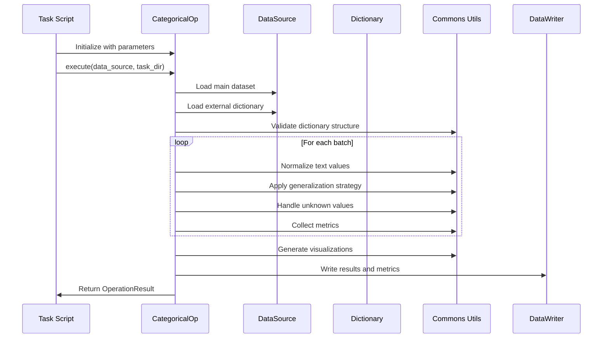

# PAMOLA.CORE Categorical Generalization Operation Software Requirements Specification

**Document Version:** 1.0.0  
**Last Updated:** January 2025  
**Status:** Draft  
**Module:** `pamola_core.anonymization.generalization.categorical_op.py`  
**Parent SRS:** ANONYMIZATION SPEC.md v3.0.0

## Table of Contents

1. [Introduction](#1-introduction)
2. [Problem Statement](#2-problem-statement)
3. [Scope and Objectives](#3-scope-and-objectives)
4. [System Architecture](#4-system-architecture)
5. [Functional Requirements](#5-functional-requirements)
6. [External Dictionary Specifications](#6-external-dictionary-specifications)
7. [Performance Requirements](#7-performance-requirements)
8. [Integration Requirements](#8-integration-requirements)
9. [Testing Requirements](#9-testing-requirements)
10. [Limitations and Future Work](#10-limitations-and-future-work)

## 1. Introduction

### 1.1 Purpose

This Software Requirements Specification (SRS) defines the requirements for the Categorical Generalization Operation within the PAMOLA.CORE anonymization package. This operation implements privacy-preserving transformations for categorical and textual fields through hierarchical generalization, frequency-based grouping, and external dictionary mappings.

### 1.2 References

- PAMOLA.CORE Anonymization Package SRS v3.0.0
- PAMOLA.CORE Operations Framework Documentation v2.0.0
- Privacy-Preserving Data Publishing Standards (PPDP-2024)
- k-Anonymity and l-Diversity Implementation Guidelines

### 1.3 Document Conventions

- **REQ-CATGEN-XXX**: Categorical generalization specific requirements
- **REQ-TXTPROC-XXX**: Text processing utility requirements
- **REQ-DICT-XXX**: External dictionary requirements
- Priority levels: MUST (MVP), SHOULD (Important), MAY (Enhancement)

## 2. Problem Statement

### 2.1 Background

Categorical data presents unique challenges in privacy-preserving transformations:

1. **High Cardinality**: Text fields often contain thousands of unique values (cities, professions, products)
2. **Semantic Relationships**: Values have hierarchical relationships (city→region→country)
3. **Identification Risk**: Rare categories can uniquely identify individuals
4. **Utility Preservation**: Over-generalization destroys analytical value
5. **Cultural Sensitivity**: Geographic and professional hierarchies vary by region

### 2.2 Current Limitations

Existing solutions typically:
- Require manual hierarchy definition for each dataset
- Cannot handle values outside predefined categories
- Lack support for multi-level hierarchies
- Provide no standardized metrics for categorical generalization

### 2.3 Solution Approach

This operation provides:
- Flexible hierarchy support through external dictionaries
- Multiple generalization strategies (hierarchical, frequency-based, hybrid)
- Robust handling of unknown values
- Standardized metrics for information loss and privacy gain
- Integration with the PAMOLA.CORE framework

## 3. Scope and Objectives

### 3.1 In Scope

- **Hierarchical generalization** using external dictionaries (JSON/CSV)
- **Frequency-based grouping** of rare categories
- **Multi-level generalization** (up to 5 levels)
- **Unknown value handling** with configurable strategies
- **Batch processing** for large datasets
- **Progress tracking** and metrics collection
- **Visualization** of generalization effects

### 3.2 Out of Scope (MVP)

- Machine learning-based category inference
- Real-time dictionary updates
- Cross-field categorical dependencies
- Semantic similarity matching (beyond basic fuzzy matching)
- Multi-language category normalization

### 3.3 Success Criteria

- Process 1M records with 10K unique categories in <60 seconds
- Support hierarchies with up to 100K entries
- Achieve 95%+ category coverage with well-designed dictionaries
- Maintain full compatibility with PAMOLA.CORE operations framework

## 4. System Architecture

### 4.1 Component Integration

```
┌─────────────────────────────────────────────────────────────────┐
│                  PAMOLA.CORE Framework                          │
├─────────────────────────────────────────────────────────────────┤
│ Operations Layer                                                │
│ ┌─────────────────┐ ┌──────────────┐ ┌───────────────────────┐ │
│ │ BaseOperation   │ │ DataSource   │ │ OperationResult       │ │
│ └─────────────────┘ └──────────────┘ └───────────────────────┘ │
├─────────────────────────────────────────────────────────────────┤
│ Anonymization Layer                                             │
│ ┌─────────────────────┐ ┌────────────────────────────────────┐ │
│ │AnonymizationOperation│ │ CategoricalGeneralizationOperation│ │
│ └─────────────────────┘ └────────────────────────────────────┘ │
├─────────────────────────────────────────────────────────────────┤
│ Commons Layer                                                   │
│ ┌──────────────────┐ ┌──────────────────┐ ┌─────────────────┐ │
│ │text_processing   │ │category_utils    │ │validation_utils │ │
│ │_utils.py         │ │.py               │ │.py              │ │
│ └──────────────────┘ └──────────────────┘ └─────────────────┘ │
└─────────────────────────────────────────────────────────────────┘
```

### 4.2 Data Flow



## 5. Functional Requirements

### 5.1 Core Operation Requirements

**REQ-CATGEN-001 [MUST]** The operation SHALL inherit from `AnonymizationOperation` and implement all required methods:
- `process_batch()` - Main transformation logic
- `_get_cache_parameters()` - Cache key generation
- `_collect_specific_metrics()` - Operation-specific metrics

**REQ-CATGEN-002 [MUST]** Constructor interface SHALL include:

```python
def __init__(self,
    field_name: str,
    strategy: str = "hierarchy",  # "hierarchy", "merge_low_freq", "frequency_based"
    mode: str = "REPLACE",
    output_field_name: Optional[str] = None,
    
    # Dictionary parameters
    external_dictionary_path: Optional[str] = None,
    dictionary_format: str = "auto",  # "auto", "json", "csv"
    hierarchy_level: int = 1,
    
    # Frequency-based parameters
    merge_low_freq: bool = False,
    min_group_size: int = 10,
    freq_threshold: float = 0.01,
    max_categories: int = 1000,
    
    # Unknown handling
    allow_unknown: bool = True,
    unknown_value: str = "OTHER",
    group_rare_as: str = "OTHER",  # "OTHER", "CATEGORY_N", "RARE_N"
    
    # Text processing
    text_normalization: str = "basic",  # "none", "basic", "advanced"
    case_sensitive: bool = False,
    fuzzy_matching: bool = False,
    similarity_threshold: float = 0.85,
    
    # Standard parameters
    null_strategy: str = "PRESERVE",
    batch_size: int = 10000,
    adaptive_batch_size: bool = True,
    use_cache: bool = True,
    use_encryption: bool = False,
    encryption_key: Optional[Union[str, Path]] = None,
    
    # Conditional processing
    condition_field: Optional[str] = None,
    condition_values: Optional[List] = None,
    condition_operator: str = "in",
    
    # Risk-based processing
    ka_risk_field: Optional[str] = None,
    risk_threshold: float = 5.0,
    vulnerable_record_strategy: str = "generalize",
    
    # Output options
    output_format: str = "csv",
    quasi_identifiers: Optional[List[str]] = None,
    
    # Error handling
    continue_on_error: bool = False,
    error_batch_handling: str = "log",  # "skip", "fail", "log"
    
    **kwargs):
```

### 5.2 Generalization Strategies

**REQ-CATGEN-003 [MUST]** Support three primary strategies:

#### 5.2.1 Hierarchy Strategy

```python
# Uses external dictionary for value→category mapping
# Supports multi-level hierarchies
# Example: "Toronto" → "Ontario" → "Canada"
```

**Requirements:**
- Support 1-5 hierarchy levels
- Handle partial hierarchies (not all values have all levels)
- Configurable fallback for missing levels

#### 5.2.2 Merge Low Frequency Strategy

```python
# Groups rare categories based on frequency
# Configurable thresholds and group naming
```

**Requirements:**
- Calculate frequencies across entire dataset
- Support both count and percentage thresholds
- Generate meaningful group names

#### 5.2.3 Frequency-Based Strategy

```python
# Creates new categories based on frequency distribution
# Top-K preservation with "OTHER" for rest
```

**Requirements:**
- Preserve top K most frequent categories
- Group remaining into configurable buckets
- Support dynamic K based on distribution

### 5.3 Text Processing Requirements

**REQ-TXTPROC-001 [MUST]** Implement text normalization in `commons/text_processing_utils.py`:

```python
def normalize_text(text: str, 
                  level: str = "basic",
                  preserve_case: bool = False) -> str:
    """
    Levels:
    - "none": No normalization
    - "basic": trim, lowercase, normalize whitespace
    - "advanced": remove special chars, normalize unicode
    - "aggressive": alphanumeric only, transliteration
    """

def clean_category_name(name: str,
                       max_length: int = 50,
                       invalid_chars: str = r'[<>:"/\\|?*]') -> str:
    """Clean category names for safe file/field naming."""

def find_closest_category(value: str,
                         categories: List[str],
                         threshold: float = 0.8,
                         method: str = "levenshtein") -> Optional[str]:
    """Find best matching category using string similarity."""
```

**REQ-TXTPROC-002 [SHOULD]** Support composite value handling:

```python
def split_composite_value(value: str,
                         separators: List[str] = ["|", "/", ","]) -> List[str]:
    """Split values like 'IT|Finance' into components."""

def merge_composite_categories(categories: List[str],
                             strategy: str = "first",  # "first", "all", "most_specific"
                             separator: str = "|") -> str:
    """Merge multiple category assignments."""
```

### 5.4 Category-Specific Utilities

**REQ-TXTPROC-003 [MUST]** Implement category analysis in `commons/category_utils.py`:

```python
def analyze_category_distribution(series: pd.Series,
                                 top_n: int = 20) -> Dict[str, Any]:
    """
    Returns:
    - frequency_counts: Dict[str, int]
    - percentages: Dict[str, float]
    - entropy: float
    - gini_coefficient: float
    - top_n_coverage: float
    """

def identify_rare_categories(series: pd.Series,
                           count_threshold: int = 10,
                           percent_threshold: float = 0.01) -> Set[str]:
    """Identify categories below thresholds."""

def group_rare_categories(series: pd.Series,
                         grouping_strategy: str,
                         threshold: float) -> Tuple[pd.Series, Dict[str, str]]:
    """
    Strategies:
    - "single_other": All rare → "OTHER"
    - "numbered": "CATEGORY_001", "CATEGORY_002", etc.
    - "semantic": Group by similarity (requires embeddings)
    """
```

### 5.5 Validation Requirements

**REQ-CATGEN-004 [MUST]** Validate external dictionaries:

```python
def validate_hierarchy_dictionary(dict_data: Union[Dict, pd.DataFrame],
                                format_type: str) -> ValidationResult:
    """
    Checks:
    - Structure consistency
    - No circular references
    - All levels properly defined
    - Encoding compatibility (UTF-8)
    - Size constraints (<100MB, <1M entries)
    """

def validate_dictionary_coverage(data_values: pd.Series,
                               dictionary: Dict) -> Dict[str, Any]:
    """
    Returns:
    - coverage_percent: float
    - missing_values: List[str] (top 100)
    - missing_frequency: Dict[str, int]
    - ambiguous_mappings: List[str]
    """
```

### 5.6 Metrics Collection

**REQ-CATGEN-005 [MUST]** Collect comprehensive metrics:

```python
# Basic metrics (via metric_utils)
- records_processed: int
- execution_time: float
- unique_values_before: int
- unique_values_after: int
- information_loss: float  # 1 - (unique_after / unique_before)

# Generalization metrics
- hierarchy_levels_used: Dict[int, int]
- incomplete_hierarchies: int
- dictionary_coverage: float
- unknown_count: int
- fuzzy_matches: int

# Distribution metrics
- entropy_before: float
- entropy_after: float
- top_10_concentration_before: float
- top_10_concentration_after: float

# Grouping metrics (if applicable)
- groups_created: int
- avg_group_size: float
- max_group_size: int
- singleton_groups: int
```

### 5.7 Visualization Requirements

**REQ-CATGEN-006 [MUST]** Generate visualizations:

1. **Distribution Comparison** (Bar Chart)
   - Top 20 categories before/after
   - Show frequency and percentage

2. **Hierarchy Sunburst** (if hierarchical)
   - Visual representation of category tree
   - Size by frequency

3. **Transition Matrix** (Heatmap)
   - Shows value→category mappings
   - Limited to top 50 for readability

4. **Grouping Summary** (Table)
   - Group names, sizes, examples

## 6. External Dictionary Specifications

### 6.1 Dictionary Formats

**REQ-DICT-001 [MUST]** Support JSON and CSV formats:

#### 6.1.1 JSON Format Specifications

**Single-level hierarchy:**
```json
{
  "value": "category",
  "Toronto": "Ontario",
  "Montreal": "Quebec",
  "Vancouver": "British Columbia"
}
```

**Multi-level hierarchy:**
```json
{
  "Toronto": {
    "level_1": "Greater Toronto Area",
    "level_2": "Ontario", 
    "level_3": "Canada",
    "level_4": "North America",
    "metadata": {
      "population": 2731571,
      "timezone": "EST"
    }
  }
}
```

**With aliases and tags:**
```json
{
  "Software Engineer": {
    "hierarchy": ["Engineering", "Technology", "STEM"],
    "aliases": ["Developer", "Programmer", "SW Engineer"],
    "tags": ["coding", "software", "IT", "technical"],
    "industry_code": "5112"
  }
}
```

#### 6.1.2 CSV Format Specifications

**Basic hierarchy:**
```csv
value,level_1,level_2,level_3
Toronto,Greater Toronto Area,Ontario,Canada
Montreal,Montreal Region,Quebec,Canada
```

**Extended with metadata:**
```csv
value,level_1,level_2,level_3,aliases,tags,metadata
"Software Engineer",Engineering,Technology,STEM,"Developer;Programmer","coding;software","{""salary_range"":""high""}"
```

### 6.2 Dictionary Examples

**REQ-DICT-002 [MUST]** Provide reference dictionaries in `DATA/external_dictionaries/categorization/`:

#### 6.2.1 Geographic Hierarchies

**cities_north_america.json:**
```json
{
  "format_version": "1.0",
  "hierarchy_type": "geographic",
  "levels": ["city", "metro_area", "state_province", "country", "continent"],
  "data": {
    "New York": {
      "metro_area": "New York Metropolitan Area",
      "state_province": "New York",
      "country": "United States",
      "continent": "North America",
      "metadata": {
        "population": 8336817,
        "lat": 40.7128,
        "lon": -74.0060,
        "timezone": "EST"
      }
    },
    "Toronto": {
      "metro_area": "Greater Toronto Area",
      "state_province": "Ontario",
      "country": "Canada",
      "continent": "North America",
      "metadata": {
        "population": 2731571,
        "lat": 43.6532,
        "lon": -79.3832,
        "timezone": "EST"
      }
    }
  }
}
```

#### 6.2.2 Professional Hierarchies

**professions_it_extended.json:**
```json
{
  "format_version": "1.0",
  "hierarchy_type": "professional",
  "levels": ["role", "specialization", "department", "industry"],
  "data": {
    "Senior Software Engineer": {
      "specialization": "Software Development",
      "department": "Engineering",
      "industry": "Technology",
      "aliases": ["Sr. Developer", "Senior Dev", "Lead Developer"],
      "tags": ["programming", "senior", "technical", "leadership"],
      "skills": ["Java", "Python", "Cloud", "Architecture"]
    },
    "Data Scientist": {
      "specialization": "Data Analysis",
      "department": "Analytics",
      "industry": "Technology",
      "aliases": ["ML Engineer", "Data Analyst"],
      "tags": ["analytics", "machine learning", "statistics"],
      "skills": ["Python", "R", "SQL", "Machine Learning"]
    }
  }
}
```

#### 6.2.3 Product Taxonomies

**products_ecommerce.csv:**
```csv
product_name,subcategory,category,department,brand,price_tier,tags
"iPhone 14 Pro",Smartphones,Mobile Devices,Electronics,Apple,Premium,"phone;ios;flagship"
"Samsung Galaxy S23",Smartphones,Mobile Devices,Electronics,Samsung,Premium,"phone;android;flagship"
"Google Pixel 7a",Smartphones,Mobile Devices,Electronics,Google,Mid-range,"phone;android;budget"
"iPad Air",Tablets,Mobile Devices,Electronics,Apple,Premium,"tablet;ios;portable"
"MacBook Pro 16",Laptops,Computers,Electronics,Apple,Premium,"laptop;macos;professional"
"Dell XPS 13",Laptops,Computers,Electronics,Dell,Premium,"laptop;windows;ultrabook"
```

### 6.3 Dictionary Validation Rules

**REQ-DICT-003 [MUST]** Enforce validation rules:

1. **Size Limits:**
   - Maximum file size: 100MB
   - Maximum entries: 1M
   - Maximum hierarchy depth: 5

2. **Content Rules:**
   - All values must be UTF-8 encoded
   - No null keys or values
   - No circular references
   - Consistent hierarchy depth per branch

3. **Performance Rules:**
   - Must load into memory in <5 seconds
   - Lookup performance: O(1) average case
   - Memory usage: <3x file size

## 7. Performance Requirements

### 7.1 Processing Performance

**REQ-CATGEN-007 [MUST]** Meet performance targets:

| Dataset Size | Unique Categories | Target Time | Memory Limit |
|-------------|------------------|-------------|--------------|
| 100K records | 1K categories | <5 seconds | 1GB |
| 1M records | 10K categories | <60 seconds | 4GB |
| 10M records | 100K categories | <10 minutes | 16GB |

### 7.2 Optimization Strategies

**REQ-CATGEN-008 [SHOULD]** Implement optimizations:

1. **Dictionary Caching:**
   ```python
   # Cache loaded dictionaries in memory
   # LRU cache for fuzzy matching results
   # Pre-compute category frequencies
   ```

2. **Batch Processing:**
   ```python
   # Adaptive batch sizing based on memory
   # Parallel processing for independent batches
   # Vectorized string operations where possible
   ```

3. **Memory Management:**
   ```python
   # String interning for repeated categories
   # Categorical dtype for reduced memory
   # Incremental metric calculation
   ```

## 8. Integration Requirements

### 8.1 Framework Integration

**REQ-CATGEN-009 [MUST]** Use framework services exclusively:

```python
# File I/O
DataWriter for all outputs
DataSource for all inputs (including dictionaries)

# Progress Tracking
HierarchicalProgressTracker with phases:
- Dictionary loading (10%)
- Validation (10%)
- Processing (60%)
- Metrics (10%)
- Output (10%)

# Field Utilities
generate_output_field_name()
apply_condition_operator()
create_field_mask()
```

### 8.2 Privacy Metrics Integration

**REQ-CATGEN-010 [SHOULD]** Calculate privacy metrics when quasi-identifiers available:

```python
# From privacy_metric_utils
- calculate_min_group_size()
- calculate_vulnerable_records_ratio()
- calculate_simple_disclosure_risk()
- get_group_size_distribution()
```

### 8.3 Error Handling

**REQ-CATGEN-011 [MUST]** Implement comprehensive error handling:

```python
# Dictionary loading errors
try:
    dictionary = self._load_dictionary(path)
except FileNotFoundError:
    self.logger.error(f"Dictionary not found: {path}")
    # Use fallback strategy
except json.JSONDecodeError as e:
    self.logger.error(f"Invalid JSON in dictionary: {e}")
    # Report specific line/column

# Processing errors
try:
    result = self._apply_hierarchy(value, dictionary)
except KeyError:
    if self.allow_unknown:
        result = self.unknown_value
    else:
        raise ValueError(f"Value '{value}' not in dictionary")
```

## 9. Testing Requirements

### 9.1 Unit Tests

**REQ-CATGEN-012 [MUST]** Achieve >90% code coverage:

```python
# Test categories
- Strategy tests (hierarchy, frequency, merge)
- Dictionary format tests (JSON, CSV, invalid)
- Edge case tests (empty, null, special chars)
- Performance tests (large dictionaries)
- Integration tests (with commons utilities)
```

### 9.2 Test Datasets

**REQ-CATGEN-013 [MUST]** Provide test data:

```
tests/test_data/categorical/
├── small_cities.csv (100 records)
├── medium_professions.json (10K records)
├── large_products.csv (100K records)
├── dictionaries/
│   ├── valid_hierarchy.json
│   ├── invalid_circular.json
│   ├── partial_coverage.csv
│   └── performance_test_1M.json
```

### 9.3 Benchmark Tests

**REQ-CATGEN-014 [SHOULD]** Include performance benchmarks:

```python
def test_performance_large_dictionary():
    """Test with 100K dictionary entries and 1M records."""
    
def test_memory_usage_streaming():
    """Verify memory stays under limit with streaming."""
    
def test_fuzzy_matching_performance():
    """Benchmark fuzzy matching speed."""
```

## 10. Limitations and Future Work

### 10.1 MVP Limitations

1. **No ML-based inference** - Only rule-based matching
2. **Single-field only** - No cross-field dependencies
3. **Static dictionaries** - No runtime updates
4. **Limited fuzzy matching** - Basic string similarity only
5. **English-focused** - Limited multilingual support

### 10.2 Future Enhancements

1. **Version 2.0:**
   - Semantic similarity using embeddings
   - Dynamic dictionary learning
   - Multi-field hierarchies

2. **Version 3.0:**
   - Real-time dictionary updates
   - Distributed processing support
   - Advanced NLP integration

### 10.3 Known Constraints

1. **Dictionary size:** Limited by available memory
2. **Hierarchy depth:** Maximum 5 levels
3. **Category count:** Performance degrades >100K unique
4. **Text length:** Values >1000 chars may be truncated

## Appendix A: Configuration Examples

### A.1 Simple City Generalization

```python
operation = CategoricalGeneralizationOperation(
    field_name="city",
    strategy="hierarchy",
    external_dictionary_path="cities_north_america.json",
    hierarchy_level=2,  # City → State/Province
    allow_unknown=True,
    unknown_value="OTHER_REGION"
)
```

### A.2 Professional Categories with Fuzzy Matching

```python
operation = CategoricalGeneralizationOperation(
    field_name="job_title",
    strategy="hierarchy",
    external_dictionary_path="professions_it_extended.json",
    hierarchy_level=1,  # Role → Specialization
    text_normalization="advanced",
    fuzzy_matching=True,
    similarity_threshold=0.85,
    allow_unknown=True,
    unknown_value="OTHER_PROFESSIONAL"
)
```

### A.3 Frequency-Based Product Grouping

```python
operation = CategoricalGeneralizationOperation(
    field_name="product_name",
    strategy="frequency_based",
    max_categories=50,  # Keep top 50
    group_rare_as="CATEGORY_N",
    text_normalization="basic",
    min_group_size=100
)
```

## Appendix B: Metrics Output Example

```json
{
  "operation": "categorical_generalization",
  "field": "city",
  "timestamp": "2025-01-15T10:30:00Z",
  "execution_time": 12.5,
  "records_processed": 1000000,
  "basic_metrics": {
    "unique_values_before": 8453,
    "unique_values_after": 52,
    "information_loss": 0.9938,
    "null_count": 1250,
    "unknown_count": 3421
  },
  "hierarchy_metrics": {
    "dictionary_coverage": 0.9854,
    "hierarchy_levels_used": {
      "1": 950000,
      "2": 45000,
      "fallback": 5000
    },
    "fuzzy_matches": 2150
  },
  "distribution_metrics": {
    "entropy_before": 7.234,
    "entropy_after": 3.456,
    "top_10_concentration_before": 0.123,
    "top_10_concentration_after": 0.678
  },
  "privacy_metrics": {
    "min_group_size": 15,
    "vulnerable_records_ratio": 0.0023,
    "disclosure_risk_reduction": 0.9876
  }
}
```

---

**Document Control:**
- Author: PAMOLA Core Team
- Review: Architecture Board
- Approval: Pending
- Next Review: Q2 2025