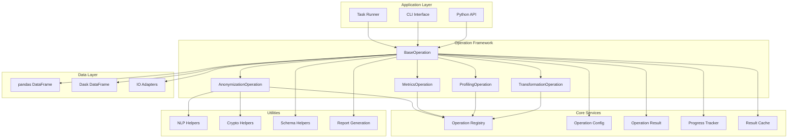
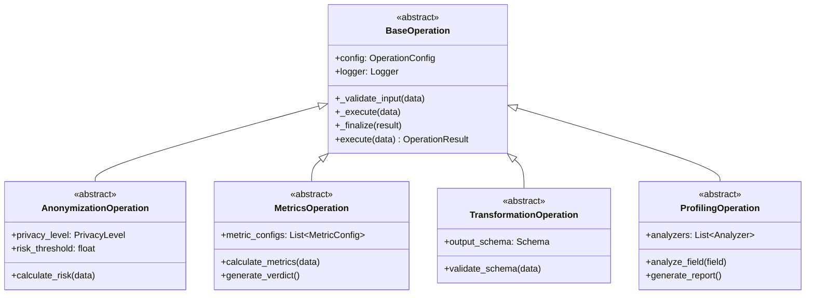
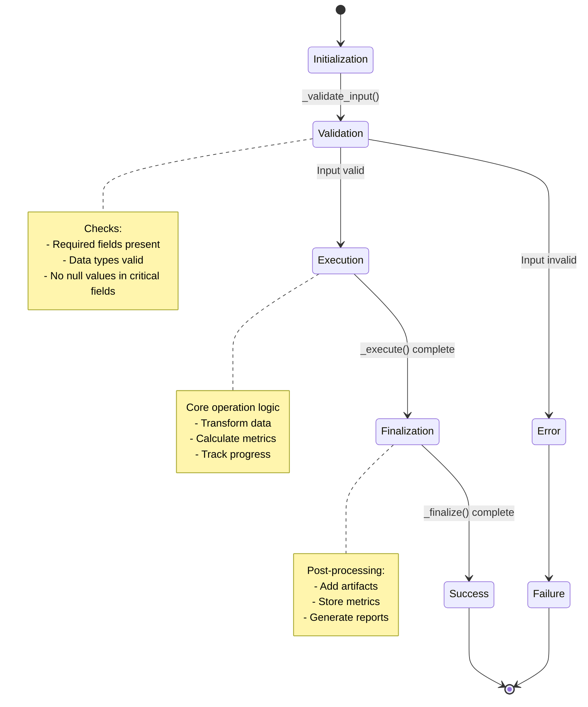
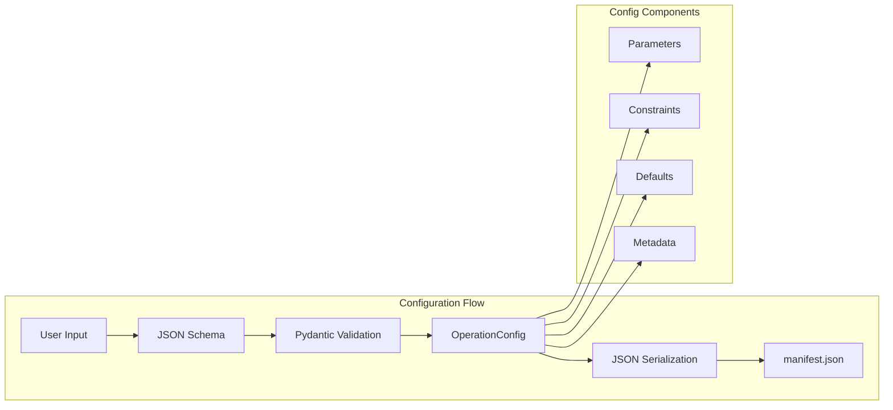

# PAMOLA.CORE System Architecture

**Version:** 0.1.0
**Last Updated:** 2026-03-12

## Overview

PAMOLA.CORE is built on an **Operation-Based Framework** where all privacy-preserving data processing tasks inherit from base classes and follow a standardized lifecycle. The architecture emphasizes modularity, extensibility, and reproducibility.

## Core Architecture Pattern

### High-Level Architecture



## Operation Framework

### Base Operation Architecture



### Operation Lifecycle



### Configuration Management



## Module Architecture

### Anonymization Module

```mermaid
flowchart TB
    subgraph Anonymization_Operations[Anonymization Operations]
        MaskingOp[Masking Operations]
        SuppressionOp[Suppression Operations]
        GeneralizationOp[Generalization Operations]
        NoiseOp[Noise Operations]
        PseudoOp[Pseudonymization Operations]
    end

    subgraph MaskingGroup[Masking]
        FullMask[Full Masking]
        PartialMask[Partial Masking]
        PatternMask[Pattern-Based Masking]
    end

    subgraph SuppressionGroup[Suppression]
        CellSuppress[Cell Suppression]
        AttrSuppress[Attribute Suppression]
        RecordSuppress[Record Suppression]
    end

    subgraph GeneralizationGroup[Generalization]
        CatGen[Categorical Generalization]
        NumGen[Numeric Generalization]
        DateTimeGen[DateTime Generalization]
    end

    subgraph NoiseGroup[Noise]
        UniformNum[Uniform Numeric Noise]
        UniformTemp[Uniform Temporal Noise]
        DistNoise[Distribution-Based Noise]
    end

    subgraph PseudonymizationGroup[Pseudonymization]
        HashBased[Hash-Based (Irreversible)]
        Mapping[Mapping-Based (Reversible)]
    end

    MaskingOp --> FullMask
    MaskingOp --> PartialMask
    MaskingOp --> PatternMask
    SuppressionOp --> CellSuppress
    SuppressionOp --> AttrSuppress
    SuppressionOp --> RecordSuppress
    GeneralizationOp --> CatGen
    GeneralizationOp --> NumGen
    GeneralizationOp --> DateTimeGen
    NoiseOp --> UniformNum
    NoiseOp --> UniformTemp
    NoiseOp --> DistNoise
    PseudoOp --> HashBased
    PseudoOp --> Mapping
```

### Metrics Module

```mermaid
flowchart TB
    subgraph Metrics_Categories[Metrics Categories]
        Privacy[Privacy Metrics]
        Utility[Utility Metrics]
        Fidelity[Fidelity Metrics]
        Quality[Quality Metrics]
    end

    subgraph Privacy_Metrics[Privacy Metrics]
        DCR[Distance to Closest Record]
        NNDR[Nearest Neighbor Distance Ratio]
        Uniqueness[Uniqueness Metrics]
        KAnon[K-Anonymity]
        LDiversity[L-Diversity]
        Disclosure[Disclosure Risk]
    end

    subgraph Utility_Metrics[Utility Metrics]
        ClassUtil[Classification Utility]
        RegrUtil[Regression Utility]
        InfoLoss[Information Loss]
        F1[F1 Score]
        R2[R² Score]
    end

    subgraph Fidelity_Metrics[Fidelity Metrics]
        StatFid[Statistical Fidelity]
        KS[Kolmogorov-Smirnov]
        KL[Kullback-Leibler]
        Wasserstein[Wasserstein Distance]
    end

    subgraph Quality_Metrics[Quality Metrics]
        QKS[KS Test]
        QKL[KL Divergence]
        Pearson[Pearson Correlation]
    end

    Privacy --> DCR
    Privacy --> NNDR
    Privacy --> Uniqueness
    Privacy --> KAnon
    Privacy --> LDiversity
    Privacy --> Disclosure

    Utility --> ClassUtil
    Utility --> RegrUtil
    Utility --> InfoLoss
    Utility --> F1
    Utility --> R2

    Fidelity --> StatFid
    Fidelity --> KS
    Fidelity --> KL
    Fidelity --> Wasserstein

    Quality --> QKS
    Quality --> QKL
    Quality --> Pearson
```



## Related Architecture Documents

- [architecture-data-flows.md](./architecture-data-flows.md) - Data processing, task execution, and component interactions
- [architecture-security.md](./architecture-security.md) - Security, performance, and deployment architecture

## References

- [project-overview-pdr.md](./project-overview-pdr.md) - Product requirements
- [codebase-summary.md](./codebase-summary.md) - Codebase overview
- [code-standards.md](./code-standards.md) - Development guidelines
